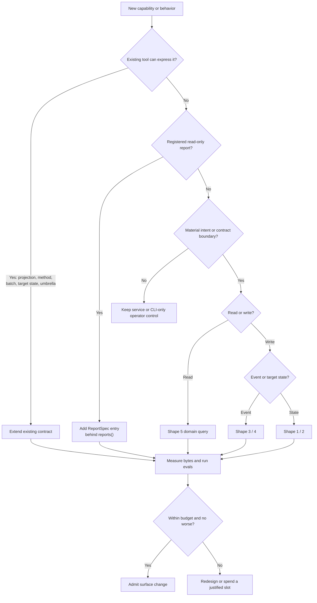

# Surface Design: Tools, Commands, and APIs

Cross-surface pattern for MoneyBin's three agent/user surfaces — MCP tools, CLI commands, and (future) REST endpoints. Invoke whenever adding, renaming, or restructuring an entry on any of those surfaces.

Companion to `.claude/rules/design-principles.md` (durable-path selection) and the surface-specific specs in `docs/specs/moneybin-mcp.md` and `docs/specs/moneybin-cli.md`. Per-item application of this rule lives in `private/plans/2026-05-16-mcp-surface-consolidation-decisions.md`.

## Primary principle: capability first, then natural shape

Begin with the stable capability ID and user intent, not an existing CLI
command, service method, or CRUD verb. First try to cover the capability with an
existing projection, method, batch input, declarative target state, report
entry, or complete workflow umbrella. Add an MCP tool only when a material
intent or contract boundary remains.

Tool count is both an outcome and a constrained public-surface budget. Every
operation still has a natural shape, but compatible shapes should share one
coherent contract when that reduces serialized metadata and does not degrade
evaluation results. One tool the agent picks confidently beats two it must
disambiguate; two crisp tools beat one ambiguous union.

## The five operation shapes

### Shape 1 — Idempotent set

Two sub-forms determined by the cardinality of the call's input.

**1a. Collection state-set.**

- **Test:** the input fully expresses a closed collection's state.
- **Form:** `<entity>_set(scope, full_state)` — typically a list or map.
- **Delete handling:** by omission. NO paired `_delete` tool.
- **Examples:**
  - `investments_lots_select(disposal_txn_id=..., selections=[...])` — the full
    specific-identification lot selection for one disposal.
  - `transactions_categorize_rules_set(rules=[...])` — confirmed rule definition
    state as one auditable batch.
  - `import_labels_set(import_id=..., labels=[...])`.

**1b. Entity upsert / partial update.**

- **Test:** the input names one entity (by id or natural key) and creates-or-updates it.
- **Form:** `<entity>_set(id, fields)` or `<entity>_set(natural_key, fields)`.
- **Delete handling:** prefer an explicit target state such as
  `state="absent"` when create/update/remove share intent, authorization,
  sensitivity, audit, and recovery contracts. The tool advertises maximum
  static risk and confirms only the destructive validated branch. Use a paired
  `_delete` when those contracts materially differ.
- **Examples:**
  - `accounts_set(account_id=..., ...)` — partial update of one account's settings.
  - `investments_securities_set(security_id=..., ...)` — create or update one
    securities-catalog entry.

**Distinguishing 1a vs 1b at design time:**

> "If a second call with different inputs leaves the first call's effect intact, you have 1b. If a second call replaces it, you have 1a."

### Shape 2 — Lifecycle-with-id

- **Test:** the entity has its own identity referenced after creation; create, update, and delete are distinct operations the caller composes.
- **Form:** `<entity>_create` / `<entity>_set(id, fields)` (partial update) /
  `<entity>_delete(id)` only when strict-create, update, and removal are
  materially different intents or contracts. Otherwise use one typed
  target-state mutation.
- **Examples:**
  - `transactions_create(...)` — a durable manual transaction event.
  - The current registry has no generic lifecycle trio: removal and recovery
    retain their material contracts in `import_revert` and `gsheet_disconnect`.

Shape 2 uses `_set(id, fields)` for partial update — the same verb as 1b. The operational difference: shape 2 has a strict `_create` that errors on existing entity; shape 1b's `_set` upserts directly.

Compatible lifecycle operations may share one coarse workflow umbrella as
discriminated request variants when authorization, sensitivity, audit,
recovery, and output contracts remain aligned. The stable entity identity and
imperative semantics still survive inside that umbrella. Never replace an
identity-bearing thread with a collection `_set` merely to reduce tool count:
omission must not silently delete sibling entities or recreate them under new
IDs. `transactions_annotate` follows this rule with `note_add`, `note_edit`,
and `note_delete` variants inside one registered tool.

### Shape 3 — Discrete-verb

- **Test:** the operation is an event, not a state change. Has timing and side effects. Reversibility lives in an audit log, not in a paired "undo" tool.
- **Form:** `<entity>_<verb>(...)`. The verb names what happens, not the entity's resulting state.
- **Examples:**
  - `import_files(paths=[...], refresh=..., force=...)` — batch import event.
  - `sync_pull(institution=...)` — pull from a connector; the tool refreshes
    automatically after changed raw state.
  - `refresh_run()` — execute the refresh pipeline.

Batch tools with per-item error handling (`transactions_create`,
`transactions_categorize_run`) are shape 3 — each call is one batch event;
per-item failures do not abort the batch. Global annotation changes such as a
tag rename belong in `transactions_annotate`, not a new one-verb tool.

### Shape 4 — Agent-reasoning-choice

- **Test:** alternative strategies have STRUCTURALLY DIFFERENT inputs OR structurally different outputs. The agent picks because their data and need require a specific one.
- **Form:** separate tools per strategy.
- **NOT shape 4** when strategies share inputs and outputs and differ only in quality-of-service (latency, determinism, cost, privacy contract enforced by middleware). Those collapse into one tool with a methods parameter.

**Sharpening note (verify against actual code).** "Different strategies for the same goal" is suspicious framing — check whether the strategies *really* have the same I/O. If one takes `(filter_params)` and returns `[redacted_rows]` while another takes `[explicit_categorizations]` and returns `applied_count`, those are not strategies of one operation — they are different operations that happen to live in the same domain. The engine-driven cascade *does* collapse — `transactions_categorize_run(methods=["rules","merchants"])` is the polymorphic tool that handles both engines under one shape. When in doubt, read the function signatures before classifying.

Shape 4 is narrower than it first appears. Many "different strategies" cases are really one operation with a parameter — but many others are entirely different operations that just share a domain prefix.

### Shape 5 — Read-projection

- **Test:** returns data in a specific shape — one entity, collection, summary/aggregate, cross-entity, time-series.
- **Form:** one domain query with a typed `view`/projection when related reads
  share intent, authorization, sensitivity, pagination, and an intelligible
  tagged output. Keep a separate tool when the result or trust contract is
  materially different.
- **Reports:** analytical and cross-entity projections register as `ReportSpec`
  entries behind `reports(report_id=..., parameters=...)`; adding a report
  never adds an MCP tool.
- **Verb conventions:**
  - **Collection / summary / aggregate / time-series:** noun-oriented coarse
    reads. `reports`, `accounts`, `accounts_balances`, `transactions`,
    `reviews`.
  - **Single entity by id:** use the owning coarse read with an explicit stable
    selector rather than minting a dedicated identity.
  - **Status snapshot of a recent operation:** use its domain read or
    `system_status`; do not add a status-only identity reflexively.

## Decision flowchart

## Verb vocabulary

Coherence requires that when a verb appears, it means the same thing everywhere. The verbs in active use:

| Verb | Meaning | Example |
|---|---|---|
| `_set` | Idempotent state assertion (1a collection-set OR 1b entity upsert / partial update) | `accounts_set`, `taxonomy_set`, `investments_securities_set` |
| `_create` | Strict create — errors if entity exists | `transactions_create` |
| `_delete` | Remove one entity by id or natural key when that boundary is admitted | No bare `_delete` identity is in the current registry |
| `_run` | Execute a discrete batch/pipeline operation | `refresh_run`, `transactions_categorize_run` |
| `_commit` | Finalize externally-decided proposals (terminal step of propose→review→commit workflows) | `transactions_categorize_commit` |
| `_confirm` | Accept or override an interactively-presented proposal (terminal step of a propose→review→confirm workflow) | `import_confirm` |
| `_refresh` | Rebuild derived state from raw inputs (refresh domain) | `refresh_run` (umbrella) |
| `_pull` | Fetch new data from an established external connection (already-authenticated) | `sync_pull`, `gsheet_pull` |
| `_link` | Establish an authenticated session with a **mediated third-party provider** (Plaid-style OAuth → server-held tokens → server-mediated API access) | `sync_link` |
| `_connect` | Establish a binding to **user-controlled storage** (direct OAuth or URL identification → client speaks the provider's API directly, no server mediation) | `gsheet_connect` |
| `_get` | Not admitted as a separate identity; use a coarse read with a stable reference | `accounts(...)`, `transactions(...)` |
| `_status` | Retained when operation or lifecycle status is a material contract | `system_status`, `import_status`, `sync_status` |
| `_history` | Not admitted as a separate identity; use a view selector, filter, audit read, or report entry | `system_audit`, `reports(...)` |
| `_summary` | Not admitted as a separate identity; use a coarse read or registered report | `accounts_balances`, `reports(...)` |

Plus domain-specific discrete verbs (`_revert`, `_disconnect`, `_decide`,
`_annotate`) — use these when the verb carries domain meaning the generic verbs
would erase.

**`_confirm` vs `_commit`.** These verbs are not interchangeable.
- `_commit` — the human (or LLM agent acting as the human) has already made a decision in an external workflow (e.g., annotated a batch offline); the tool finalizes those *externally-decided* results. Example: `transactions_categorize_commit` accepts a pre-reviewed batch.
- `_confirm` — the *system* has proposed something and waits for the caller to ratify or override; the tool is the terminal step of a propose→review→confirm loop driven by the tool's own detection engine. Example: `import_confirm` ratifies a mapping the engine detected.

Use `_confirm` when the proposal originates from the system. Use `_commit` when the decision originates from the caller.

**Canonical confirm pairing (`import_files` + `import_confirm`).** The propose→review→confirm pattern uses a **gated establish** tool plus a `_confirm` terminal tool:
1. The establish tool (`import_files`) runs detection and returns a `confirmation_required` envelope (with `proposed_mapping`, `samples`, `flagged`, and `actions[]` hints) when it encounters an unknown layout instead of importing.
2. The caller inspects the proposal (optionally via `import_preview`) and calls the `_confirm` tool (`import_confirm`) with `accept=True` or a partial `mapping={...}` override to ratify and execute.

This is the canonical shape for any new system-proposed-then-ratified flow: the entry tool gates and returns the proposal; a `_confirm` tool takes the ratification. Do not introduce `_apply`, `_execute`, or action-polymorphism in this pattern.

**`_link` vs `_connect`.** `_link` = mediated provider (a third-party aggregator stands between MoneyBin and the institution; server holds ephemeral tokens; the client never speaks the institution's API directly; the `sync-*` family). `_connect` = user-controlled storage (direct OAuth or URL binding; the client speaks the provider's API directly; tokens live in the local `SecretStore`; the `connect-*` family). Never interchangeable — the verb predicts the trust model.

**Verbs to avoid:**

- `_apply` — use `_run` / `_refresh` (refresh domain) or `transactions_categorize_run(methods=["rules"])` (strategy execution). Do not reintroduce.
- `_toggle` — too narrow (binary flip). Use `_set` with a typed field, such as
  `privacy_consent_set(...)` or `taxonomy_set(...)`.
- `_update` — synonym of `_set` in this codebase; use `_set`.
- `_list` suffix on read tools — drop it (noun-only).
- broad `manage_*` with unrelated action polymorphism — reject by default (see Polymorphism below).
- `_connect` for mediated financial providers — use `_link` (see verb table). Do not reintroduce.

**Pluralization:** match the owned domain noun. The current registry keeps
collection state under `transactions_categorize_rules_set`; do not create a
singular alias merely because one target appears in a batch.

## Polymorphism

Method-parameter polymorphism (`tool(method=...)`) is **acceptable** when all four hold:

1. Methods share inputs (same parameter shape).
2. Methods share outputs (same response envelope).
3. Differences are quality-of-service: latency, determinism, cost, privacy contract enforced by middleware (not by the agent).
4. The cascade has a natural default behavior.

**Acceptable example (hypothetical):** `tool(methods=["rules","ml"], transactions=None)` where both methods take the same input shape (a transaction set) and produce the same output shape (applied categorizations) — differing only in QoS (rules deterministic and fast; ML probabilistic and bulk). A method that returns a structurally different output (e.g. redacted rows for human review) fails criterion 2 and belongs in a separate tool, not in this `methods=` list — see the Shape 4 sharpening note above.

Polymorphism is **rejected** when:

- Strategies differ in input shape (then they're shape 4).
- Strategies differ in output shape (then they're shape 4).
- The choice is a routing decision the agent makes based on input data (then it's not really a choice — collapse around the routing logic, not the surface).

**Broad `manage_X(action="...")` polymorphism is rejected by default.** It
usually dispatches structurally different operations through one argument,
moving complexity from the tool list to the input schema. A coarse operation
is acceptable only when its branches share intent, authorization, sensitivity,
input/output family, audit, and recovery contracts; it must reduce serialized
metadata and pass selection, argument, workflow, safety, and client-schema
evaluations.

The `reports` tool is a deliberate bounded exception, not a generic action
gateway. Every member is registered, read-only, parameter-validated,
privacy-classified, provenance-bearing, and returns the same catalog/result
union. It cannot execute arbitrary tools or accept SQL.

## Reference resolution

Coarse operations make reference handling more important. Resolve entity
references through one shared service contract: explicit stable ID, then exact
alias/name, then unambiguous normalized match. Otherwise return structured
`not_found` or `ambiguous` data with candidate IDs. Never silently choose the
first fuzzy match for a write.

## Audience layering

MoneyBin's surface mixes three audiences:

| Audience | Examples | Positioning |
|---|---|---|
| **User-intent** | `reports`, `accounts`, `transactions` | Surfaced prominently in the `instructions` field, in user-facing tools' `actions[]` hints, and in docs |
| **Mid-CRUD** | `transactions_annotate`, `taxonomy_set`, `privacy_consent_set` | Surfaced as the agent's hands — referenced by user-intent tools' `actions[]` and in workflow examples |
| **Operator territory** | `sql_query`, `sql_schema`, `system_audit` | Visible but deprioritized: description prose calls out the operator audience; not promoted in `instructions` enumeration; reached via specific `actions[]` hints when relevant |

**Per `docs/specs/mcp-tool-surface-scaling.md`:** MoneyBin exposes one bounded
standard registry. Generic clients receive it in full. Capable hosts can
optionally defer schemas from that same registry, but availability, names,
annotations, allowlists, approvals, and audit identity do not change. Audience
positioning uses the FastMCP `instructions` field, distinct description
openings, prefix-grouped names, and `actions[]` hints—not packs, profiles, or
reconnect modes.

**Test:** if a tool's primary caller is a human operator (or a power-user agent explicitly inspecting internals), the tool's description should say so, it should NOT be cited in user-facing tools' `actions[]` hints, and it should NOT appear in the `instructions` field's top-level enumeration. If the primary caller is an agent helping a user with their finances, the opposite — surface it prominently across those three levers.

**Umbrella pattern:** when granular pipeline stages produce the same observable
outcome with the same audit and recovery contract, MCP exposes the complete
workflow umbrella while the CLI may retain surgical operator controls.
`refresh_run` covers match, transform, categorize, and identity stages; CLI
stage commands remain useful for testing and debugging without consuming MCP
slots.

## Surface implications

### MCP

The five shapes and verb vocabulary above are MCP-native. One bounded standard
registry is capability-complete for generic clients; capable hosts can
optionally defer schema injection from the same registry. Audience positioning
happens through the `instructions` field, description prose, `actions[]` hints,
and backing-spec maturity.

### CLI

The CLI has subgroup nesting MCP does not (`moneybin transactions ...` versus
the flat `transactions_annotate` workflow tool). That changes one thing:
**discoverability is cheaper in CLI** because subgroups give `--help` navigation
without context-window cost. Audience layering is less load-bearing —
operator-only commands already live in operator-territory subgroups (`moneybin
db init`, `moneybin profile *`).

Everything else transfers directly:

- Operation shapes — same five.
- Verb vocabulary — same table, expressed as subcommands (`<group> set`, `<group> create`, `<group> delete`, `<group> run`).
- Capability symmetry — CLI and MCP map to the same capability IDs, service
  operations, and observable outcomes. Granular CLI commands need not map 1:1
  to MCP tools.

### REST API (future, M3D+)

The taxonomy maps cleanly to HTTP verbs:

| Shape | REST form |
|---|---|
| 1a Collection state-set | `PUT /<resource>` with collection body |
| 1b Entity upsert | `PUT /<resource>/<id>` with fields |
| 2 Lifecycle-with-id | `POST /<resource>` (create) / `PATCH /<resource>/<id>` (update) / `DELETE /<resource>/<id>` |
| 3 Discrete-verb | `POST /<resource>/<verb>` action endpoint |
| 4 Agent-reasoning-choice | Separate sub-paths per strategy |
| 5 Read-projection | `GET /<resource>` (collection) / `GET /<resource>/<id>` (single) / `GET /<resource>/<projection>` (summary, history) |

Audience layering uses separate base paths: `/api/v1/...` for user-intent + mid-CRUD; `/api/v1/admin/...` for infrastructure.

## Coherence and pre-launch posture

The coherence rule applies (per `design-principles.md`): if a tool's name or form contradicts the taxonomy, refactor rather than introduce a parallel pattern.

Defended exceptions are legitimate but must be **documented in the tool's MCP description** with a one-line "why" — the agent never reads this file. Example: `accounts_balance_assert` is shape 1b but keeps the name because "assertion" carries domain meaning beyond a generic upsert; the description should say so.

## Anti-patterns

- Broad `manage_X(action="...")` polymorphism that mixes intents or contracts.
- `_set` semantics where the tool actually performs a discrete event.
- `_apply` for refresh-domain operations — use `_refresh` / `_run`.
- Method-parameter polymorphism when methods have structurally different I/O.
- `_get` / `_list` suffix on collection or summary reads — drop them (noun-only).
- Singular aliases for an admitted batch or target-state contract.
- Duplicate tools where one coarse read, selector, or registered report already
  covers the outcome.
- Operator-territory tools promoted in `instructions` or user-intent
  `actions[]` hints when an umbrella already covers the user outcome.
- New entity-mutation tools when `<entity>_set` already covers the field.
- `_many` / `_batch` suffix variants — the canonical mutation tool accepts a list/scope from the start.

## Applying this rule

Future MCP capabilities remain unnamed until admission. Describe a proposed
capability by stable ID and intent; assign its public tool name only after the
bounded-registry record passes.

When adding or modifying a tool / command / endpoint:

1. Name the capability ID and user intent.
2. Try an existing projection, method, batch, target state, report entry, or
   workflow umbrella.
3. If a separate tool remains, identify the material intent, safety,
   authorization, sensitivity, confirmation, output, audit, or recovery
   boundary.
4. Identify the operation shape and apply the verb vocabulary.
5. Place it in the correct audience layer.
6. Verify CLI capability parity through the shared service outcome; do not
   require method equality.
7. Measure the serialized metadata delta and run the required selection,
   argument, workflow, safety, and schema-compatibility evaluations.
8. If proposing a defended exception, document the why in the tool description
   and tool-admission record.
9. Do not advertise `outputSchema` reflexively. Name the consuming client,
   prove why structured content is insufficient, measure the byte/context
   delta, and provide compatibility plus persisted benefit evidence.

## Registry budget

The operating contract is one 47-tool standard registry. Generic clients
receive it in full; capable hosts may optionally defer schemas from that same
registry without reconnect, packs, or profiles. Reports never consume tool
slots. The deterministic comparison passed, but promotion remains unready
until context-budget and host-native-deferral evidence is observed.

- Target 30–40 standard tools across core and installed extensions.
- Above 40 requires a carrying-weight review of every tool.
- 50 is a hard maximum unless ADR-016 is superseded.
- Advertised deprecated aliases: zero. A hidden compatibility alias must have a
  bounded removal release.
- New reports consume report-registry entries, not tool slots.
- A consolidation must reduce actual `tools/list` metadata bytes and perform no
  worse in persisted evaluations. Count reduction alone is insufficient.

Per-tool triage of the existing surface against this rule:
`private/plans/2026-05-16-mcp-surface-consolidation-decisions.md`.
