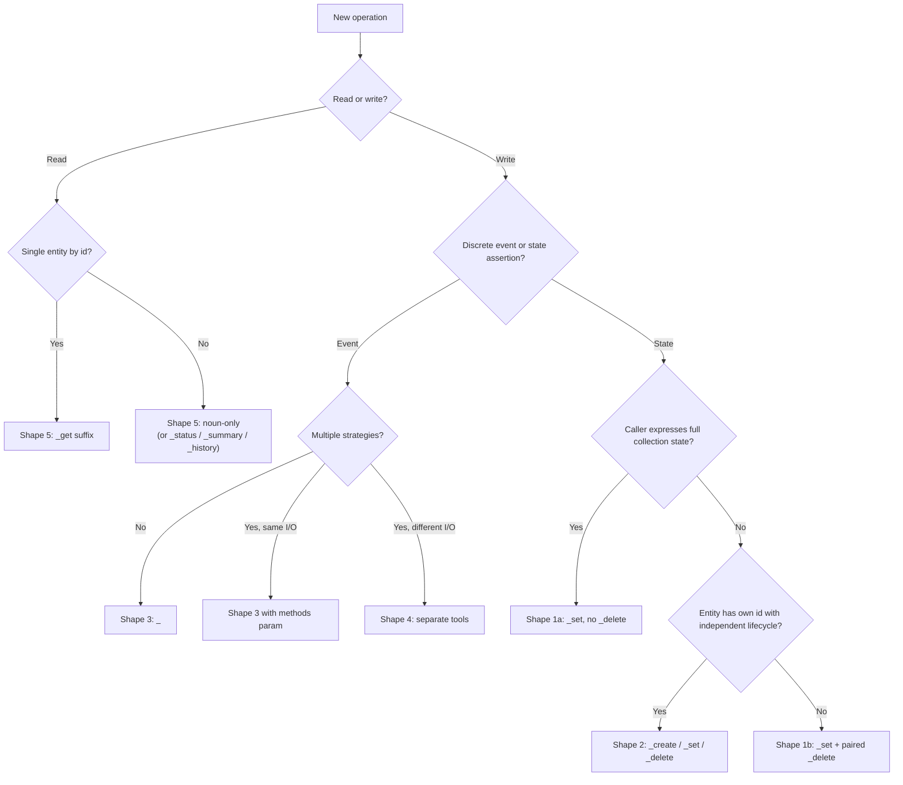

# Surface Design: Tools, Commands, and APIs

Cross-surface pattern for MoneyBin's three agent/user surfaces — MCP tools, CLI commands, and (future) REST endpoints. Invoke whenever adding, renaming, or restructuring an entry on any of those surfaces.

Companion to `.claude/rules/design-principles.md` (durable-path selection) and the surface-specific specs in `docs/specs/moneybin-mcp.md` and `docs/specs/moneybin-cli.md`. Per-item application of this rule lives in `private/plans/2026-05-16-mcp-surface-consolidation-decisions.md`.

## Primary principle: match the operation's natural shape

Tool count is an outcome, not a target. Every operation has a natural shape — a way it maps to user/agent intent. The taxonomy below names the five shapes MoneyBin uses; identify the shape and the surface form follows.

When two shapes seem to fit equally, prefer the one with the smaller surface footprint AND the better agent-ergonomics. One tool the agent picks confidently beats two tools the agent disambiguates between.

## The five operation shapes

### Shape 1 — Idempotent set

Two sub-forms determined by the cardinality of the call's input.

**1a. Collection state-set.**

- **Test:** the input fully expresses a closed collection's state.
- **Form:** `<entity>_set(scope, full_state)` — typically a list or map.
- **Delete handling:** by omission. NO paired `_delete` tool.
- **Examples:**
  - `transactions_tags_set(transaction_id, tags=[...])` — all tags on one transaction.
  - `transactions_splits_set(transaction_id, splits=[...])`.
  - `import_labels_set(import_id, labels=[...])`.

**1b. Entity upsert / partial update.**

- **Test:** the input names one entity (by id or natural key) and creates-or-updates it.
- **Form:** `<entity>_set(id, fields)` or `<entity>_set(natural_key, fields)`.
- **Delete handling:** REQUIRES paired `_delete` — there's nothing to omit from.
- **Examples:**
  - `budget_set(category, monthly_amount, start_month)` — upsert one (category, period) entry.
  - `accounts_set(account_id, ...)` — partial update of one account's settings.

**Distinguishing 1a vs 1b at design time:**

> "If a second call with different inputs leaves the first call's effect intact, you have 1b. If a second call replaces it, you have 1a."

### Shape 2 — Lifecycle-with-id

- **Test:** the entity has its own identity referenced after creation; create, update, and delete are distinct operations the caller composes.
- **Form:** `<entity>_create` / `<entity>_set(id, fields)` (partial update) / `<entity>_delete(id)`.
- **Examples:**
  - `transactions_notes_add` / `_edit` / `_delete` — each note has `note_id`.
  - `categories_create` / `categories_set` / `categories_delete`.

Shape 2 uses `_set(id, fields)` for partial update — the same verb as 1b. The operational difference: shape 2 has a strict `_create` that errors on existing entity; shape 1b's `_set` upserts directly.

### Shape 3 — Discrete-verb

- **Test:** the operation is an event, not a state change. Has timing and side effects. Reversibility lives in an audit log, not in a paired "undo" tool.
- **Form:** `<entity>_<verb>(...)`. The verb names what happens, not the entity's resulting state.
- **Examples:**
  - `import_files(paths, refresh, force)` — batch import event.
  - `sync_pull(institution, force, refresh)` — pull from a connector.
  - `transactions_tags_rename(old_tag, new_tag)` — global rename event (mutates N rows).
  - `refresh_run()` — execute the refresh pipeline.

Batch tools with per-item error handling (`transactions_create`, `merchants_create`, `transactions_categorize_run`) are shape 3 — each call is one batch event; per-item failures don't abort the batch.

### Shape 4 — Agent-reasoning-choice

- **Test:** alternative strategies have STRUCTURALLY DIFFERENT inputs OR structurally different outputs. The agent picks because their data and need require a specific one.
- **Form:** separate tools per strategy.
- **NOT shape 4** when strategies share inputs and outputs and differ only in quality-of-service (latency, determinism, cost, privacy contract enforced by middleware). Those collapse into one tool with a methods parameter.

**Sharpening note (verify against actual code).** "Different strategies for the same goal" is suspicious framing — check whether the strategies *really* have the same I/O. If one takes `(filter_params)` and returns `[redacted_rows]` while another takes `[explicit_categorizations]` and returns `applied_count`, those are not strategies of one operation — they are different operations that happen to live in the same domain. Categorize was initially framed as a methods-collapse case in the 2026-05-16 brainstorm; verifying against `transactions_categorize_apply` / `_assist` showed they fail this test (different inputs, different outputs, different read/write semantics). When in doubt, read the function signatures before classifying.

Shape 4 is narrower than it first appears. Many "different strategies" cases are really one operation with a parameter — but many others are entirely different operations that just share a domain prefix.

### Shape 5 — Read-projection

- **Test:** returns data in a specific shape — one entity, collection, summary/aggregate, cross-entity, time-series.
- **Form:** one tool per projection shape. Collapse only when two projections have genuinely identical shape AND consumers; most reads stay distinct.
- **Verb conventions:**
  - **Collection / summary / aggregate / time-series:** noun-only. `reports_networth`, `accounts_summary`, `transactions_review`, `accounts_balance_history`.
  - **Single entity by id:** `_get` suffix. `transactions_get`, `accounts_get`.
  - **Status snapshot of a recent operation:** `_status` suffix. `transform_status`, `transactions_categorize_status`.

## Decision flowchart

## Verb vocabulary

Coherence requires that when a verb appears, it means the same thing everywhere. The verbs in active use:

| Verb | Meaning | Example |
|---|---|---|
| `_set` | Idempotent state assertion (1a collection-set OR 1b entity upsert / partial update) | `budget_set`, `tags_set`, `accounts_set` |
| `_create` | Strict create — errors if entity exists | `categories_create`, `transactions_create` |
| `_delete` | Remove one entity by id or natural key | `budget_delete`, `categories_delete` |
| `_run` | Execute a discrete batch/pipeline operation | `categorize_run`, `refresh_run` |
| `_refresh` | Rebuild derived state from raw inputs (refresh domain) | `refresh_run` (umbrella) |
| `_get` | Fetch one entity by id | `transactions_get`, `accounts_get` |
| `_status` | Status snapshot of a recent operation | `transform_status`, `transactions_categorize_status` |
| `_history` | Time-series projection | `accounts_balance_history` |
| `_summary` | Cross-entity aggregate snapshot | `accounts_summary` |

Plus domain-specific discrete verbs (`_rename`, `_archive`, `_revert`, `_pull`, `_connect`) — use these when the verb carries domain meaning the generic verbs would erase.

**Verbs to avoid:**

- `_apply` — was overloaded between refresh-domain ("apply transforms") and strategy-execution ("apply rules"). Both senses now route to `_run`. Currently zero callers after consolidation; OK to leave unused.
- `_toggle` — too narrow (binary flip). Use `_set` with a typed field: `categories_set(category_id, is_active=...)` instead of `categories_toggle`.
- `_update` — synonym of `_set` in this codebase. The rename pass picked `_set` (`accounts_settings_update` → `accounts_set`); follow that precedent.
- `_list` suffix on read tools — drop it (noun-only). `transactions_recurring_list` is the canonical example to remove.
- `manage_*` with action-polymorphism — rejected absolutely (see Polymorphism below).

**Pluralization:** match the noun. Collection writes use plural even when operating on one element (`_rules_create`, `_rules_delete`). Singular `_rule_delete` is wrong even when deleting one rule.

## Polymorphism

Method-parameter polymorphism (`tool(method=...)`) is **acceptable** when all four hold:

1. Methods share inputs (same parameter shape).
2. Methods share outputs (same response envelope).
3. Differences are quality-of-service: latency, determinism, cost, privacy contract enforced by middleware (not by the agent).
4. The cascade has a natural default behavior.

**Acceptable example:** `transactions_categorize_run(methods=["rules","ml","assist"], transactions=None)`. Methods differ in QoS only; the cascade has a meaningful default.

Polymorphism is **rejected** when:

- Strategies differ in input shape (then they're shape 4).
- Strategies differ in output shape (then they're shape 4).
- The choice is a routing decision the agent makes based on input data (then it's not really a choice — collapse around the routing logic, not the surface).

**`manage_X(action="...")` polymorphism is rejected absolutely.** It dispatches structurally different operations through a polymorphic argument — moving complexity from the tool list (visible at selection time) to the input schema (visible only after the tool is selected). Pure relocation, no reduction.

## Audience layering

MoneyBin's surface mixes three audiences:

| Audience | Examples | Default treatment |
|---|---|---|
| **User-intent** | `reports_spending`, `accounts_summary`, `transactions_search` | Always-visible |
| **Mid-CRUD** | `transactions_tags_set`, `budget_set`, `categories_set` | Always-visible |
| **Infrastructure** | `transform_apply`, `sql_query`, `system_doctor`, `system_audit_list` | Discover-gated via `moneybin_discover('admin')` |

The agent attention budget is set by always-visible surface size (see `mcp-server.md` "Progressive disclosure"). Discover-gating infrastructure doesn't remove capability — it removes attention cost from the default working set.

**Test:** if a tool's primary caller is a human operator (or a power-user agent explicitly inspecting internals), it belongs behind discover. If the primary caller is an agent helping a user with their finances, it stays always-visible.

**Umbrella pattern:** when re-layering removes a tool from the default surface, a higher-level tool often fills the slot. `transform_apply` moves behind discover; `refresh_run` becomes the always-visible umbrella over the refresh pipeline (match + transform + categorize) that the discover-gated tools compose.

## Surface implications

### MCP

The five shapes and verb vocabulary above are MCP-native. Audience layering uses `moneybin_discover('admin')` for infrastructure; user-intent and mid-CRUD stay always-visible. Progressive disclosure (`mcp-server.md` §"Progressive disclosure") is the long-term mechanism once client support stabilizes.

### CLI

The CLI has subgroup nesting MCP doesn't (`moneybin transactions tags set` vs flat `transactions_tags_set`). That changes one thing: **discoverability is cheaper in CLI** because subgroups give `--help` navigation without context-window cost. Audience layering is less load-bearing — operator-only commands already live in operator-territory subgroups (`moneybin db init`, `moneybin profile *`).

Everything else transfers directly:

- Operation shapes — same five.
- Verb vocabulary — same table, expressed as subcommands (`<group> set`, `<group> create`, `<group> delete`, `<group> run`).
- CLI symmetry — every MCP tool has a CLI command via the same service layer (`mcp-server.md` line 28). The same shape choice surfaces in both.

### REST API (future, M3D+)

The taxonomy maps cleanly to HTTP verbs:

| Shape | REST form |
|---|---|
| 1a Collection state-set | `PUT /<resource>` with collection body |
| 1b Entity upsert | `PUT /<resource>/<id>` with fields |
| 2 Lifecycle-with-id | `POST /<resource>` (create) / `PATCH /<resource>/<id>` (update) / `DELETE /<resource>/<id>` |
| 3 Discrete-verb | `POST /<resource>/<verb>` action endpoint |
| 4 Agent-reasoning-choice | Separate sub-paths per strategy |
| 5 Read-projection | `GET /<resource>` (collection) / `GET /<resource>/<id>` (single) / `GET /<resource>/<projection>` (summary, history) |

Audience layering uses separate base paths: `/api/v1/...` for user-intent + mid-CRUD; `/api/v1/admin/...` for infrastructure.

## Coherence and pre-launch posture

Pre-launch (per `design-principles.md`), iterate the surface aggressively to find the right shape. The coherence rule applies: if a tool's name or form contradicts the taxonomy, refactor rather than introduce a parallel pattern.

Defended exceptions are legitimate but must be **documented in the tool's MCP description** with a one-line "why" — the agent never reads this file. Example: `accounts_balance_assert` is shape 1b but keeps the name because "assertion" carries domain meaning beyond a generic upsert; the description should say so.

## Anti-patterns

- `manage_X(action="...")` polymorphism — rejected absolutely.
- `_set` semantics where the tool actually performs a discrete event.
- `_apply` for refresh-domain operations — use `_refresh` / `_run`.
- Method-parameter polymorphism when methods have structurally different I/O.
- `_get` / `_list` suffix on collection or summary reads — drop them (noun-only).
- Pluralization drift (`_rule_delete` vs `_rules_create`).
- Duplicate tools where one is strictly richer (`transactions_recurring_list` vs `reports_recurring`).
- Infrastructure tools always-visible alongside user-intent tools.
- New entity-mutation tools when `<entity>_set` already covers the field.

## Applying this rule

When adding or modifying a tool / command / endpoint:

1. Identify the operation shape using the flowchart.
2. Apply the verb vocabulary for that shape.
3. Place it in the correct audience layer; discover-gate if infrastructure.
4. Verify CLI and (future) REST symmetry inherits the shape.
5. If proposing a defended exception, document the "why" inline in the tool description.

Per-tool triage of the existing surface against this rule:
`private/plans/2026-05-16-mcp-surface-consolidation-decisions.md`.
