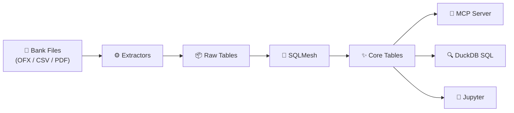

<!-- markdownlint-disable MD033 MD041 -->
<div align="center">
  
  <p><strong>Open-source, local-first personal financial analysis platform.</strong></p>
</div>
<!-- markdownlint-enable MD033 MD041 -->

## What is MoneyBin?

MoneyBin gives you complete ownership of your financial data. Import bank statements and tax documents, transform them into a clean analytical model, then interact with your data two ways:

- **MCP Server** -- Ask your AI assistant about your finances. 25 tools across 11 domains let Claude, Cursor, or any MCP-compatible assistant query your accounts, transactions, spending, taxes, and more.
- **Data Toolkit** -- Query your DuckDB database directly with SQL, build SQLMesh transformation models, or explore data in Jupyter notebooks.

All data stays on your machine. Nothing is sent to any external service.

## How It Works



Import your financial data from local files, transform it with SQLMesh into a clean analytical model, then interact through AI assistants or hands-on data tools.

## 🚀 Quick Start

### 1. Install

```bash
git clone https://github.com/yourusername/moneybin.git
cd moneybin
make setup
```

Requires Python 3.11+ and [uv](https://docs.astral.sh/uv/).

### 2. Import Your Data

```bash
# Import OFX/QFX files from your bank
moneybin extract ofx path/to/downloads/*.qfx

# Extract W-2 tax forms from PDF
moneybin extract w2 path/to/w2.pdf

# Run SQLMesh to build the core analytical model
moneybin transform apply
```

### 3. Connect Your AI Assistant

Add MoneyBin to your MCP configuration:

```json
{
  "mcpServers": {
    "moneybin": {
      "command": "uv",
      "args": ["run", "--directory", "/path/to/moneybin", "moneybin", "mcp", "serve"]
    }
  }
}
```

> Works with Claude Desktop (`.claude/claude_desktop_config.json`), Cursor (`.cursor/mcp.json`), and any MCP-compatible client.

Then ask things like:

- "What are my account balances?"
- "Show my spending by category for the last 3 months"
- "Find all recurring subscriptions and their annual cost"
- "How much did I pay in taxes last year?"

## 🤖 MCP Server

25 read-only tools across 11 financial domains:

| Namespace | Tools | Description |
|-----------|-------|-------------|
| `schema.*` | 2 | Database discovery -- list tables, describe columns |
| `accounts.*` | 4 | Account listing, balances, activity, balance history |
| `transactions.*` | 3 | Search, recurring charges, large outliers |
| `spending.*` | 4 | By category, monthly summary, period comparison, top merchants |
| `cashflow.*` | 2 | Net cash flow, income sources |
| `tax.*` | 2 | W-2 summary, comprehensive tax summary |
| `overview.*` | 2 | Net worth, data freshness |
| `investments.*` | 2 | Holdings and performance |
| `liabilities.*` | 1 | Debt summary |
| `institutions.*` | 1 | Connected financial institutions |
| `sql.*` | 1 | Execute arbitrary read-only SQL |

Plus **8 resources** (schema info, account summaries, recent transactions) and **9 prompt templates** for guided financial workflows.

### Prompt Templates

Pre-built conversation starters that guide your AI assistant through multi-step financial workflows:

| Prompt | Description |
|--------|-------------|
| [`import_data`](docs/reference/prompts/import-data.md) | Import financial data files (OFX, PDF) |
| [`categorize_transactions`](docs/reference/prompts/categorize-transactions.md) | Assign categories to transactions |
| [`setup_budget`](docs/reference/prompts/setup-budget.md) | Create monthly budgets from spending patterns |
| [`monthly_review`](docs/reference/prompts/monthly-review.md) | Comprehensive monthly financial review |
| [`analyze_spending`](docs/reference/prompts/analyze-spending.md) | Analyze spending patterns and top categories |
| [`find_anomalies`](docs/reference/prompts/find-anomalies.md) | Detect unusual or suspicious transactions |
| [`account_overview`](docs/reference/prompts/account-overview.md) | Overview of all accounts and balances |
| [`transaction_search`](docs/reference/prompts/transaction-search.md) | Find transactions matching a description |
| [`tax_preparation`](docs/reference/prompts/tax-preparation.md) | Gather tax-related information for filing |

Full prompt docs: [`docs/reference/prompts/`](docs/reference/prompts/README.md) | Tool spec: [`docs/specs/archived/mcp-read-tools.md`](docs/specs/archived/mcp-read-tools.md)

## 🛠️ Data Toolkit

### DuckDB

```bash
moneybin db shell                    # Interactive SQL shell
moneybin db query "SELECT ..."       # One-off queries
moneybin db ui                       # Web UI for exploration
```

### SQLMesh

```bash
moneybin transform apply             # Run all transformations
moneybin transform test              # Data quality audits
sqlmesh ui                           # Web UI for docs and lineage
```

### Jupyter

```bash
make jupyter                         # Launch notebook server
```

## 📊 Data Sources

| Source | Format | Status | Command |
|--------|--------|--------|---------|
| Bank statements | OFX/QFX | **Supported** | `moneybin extract ofx <file>` |
| W-2 tax forms | PDF | **Supported** | `moneybin extract w2 <file>` |
| Bank transactions | CSV | Planned | -- |
| Bank transactions | Plaid API | Planned | -- |
| 1099 forms | PDF | Planned | -- |
| Investment statements | PDF/CSV | Planned | -- |

See [`docs/reference/data-sources.md`](docs/reference/data-sources.md) for the full roadmap.

## 🔒 Privacy

MoneyBin is **local-first by design**. All data stays on your machine in a DuckDB database. The MCP server opens DuckDB in read-only mode, with configurable result limits and optional table allowlists. Each user profile is fully isolated with its own database.

Future tiers (encrypted sync, managed hosting) are on the roadmap. See [`docs/specs/privacy-security-roadmap.md`](docs/specs/privacy-security-roadmap.md) for details.

## CLI Reference

| Command | Description |
|---------|-------------|
| `moneybin extract ofx <file>` | Import OFX/QFX bank files |
| `moneybin extract w2 <file>` | Extract W-2 from PDF |
| `moneybin transform apply` | Run SQLMesh transformations |
| `moneybin transform test` | Run data quality audits |
| `moneybin db shell` | Interactive SQL shell |
| `moneybin db ui` | Web UI for data exploration |
| `moneybin db query "SQL"` | Run a SQL query |
| `moneybin mcp serve` | Start MCP server (stdio) |
| `moneybin mcp serve --transport sse` | Start with SSE transport |
| `moneybin --profile=NAME ...` | Use a specific profile |

## Project Structure

```text
moneybin/
├── src/moneybin/
│   ├── mcp/                # MCP server (primary interface)
│   │   ├── server.py       # FastMCP server + DuckDB lifecycle
│   │   ├── tools.py        # Tool implementations
│   │   ├── resources.py    # Resource endpoints
│   │   ├── prompts.py      # Prompt templates
│   │   └── privacy.py      # Security controls
│   ├── cli/                # Command line interface
│   ├── extractors/         # File parsers (OFX, PDF, CSV)
│   ├── loaders/            # DuckDB data loaders
│   ├── connectors/         # External API integrations
│   └── utils/              # Shared utilities
├── sqlmesh/                # SQLMesh project
│   └── models/             # Transformation models (prep + core)
├── data/{profile}/         # Profile-isolated data storage
├── tests/                  # Test suite
└── docs/                   # Documentation
```

## Development

```bash
make setup              # Set up development environment
make check              # Format + lint + type-check
make test               # All tests
make test-unit          # Unit tests only
make test-cov           # With coverage report
```

See `.claude/rules/` for coding standards and conventions.

## Documentation

- [`docs/README.md`](docs/README.md) -- Documentation index
- [`docs/reference/system-overview.md`](docs/reference/system-overview.md) -- System architecture
- [`docs/decisions/`](docs/decisions/) -- Architecture Decision Records
- [`docs/reference/data-model.md`](docs/reference/data-model.md) -- Data model and ER diagram
- [`docs/reference/prompts/`](docs/reference/prompts/README.md) -- MCP prompt templates
- [`docs/specs/archived/mcp-read-tools.md`](docs/specs/archived/mcp-read-tools.md) -- MCP server tools
- [`docs/specs/privacy-security-roadmap.md`](docs/specs/privacy-security-roadmap.md) -- Privacy & security roadmap

## License

[To be determined]
