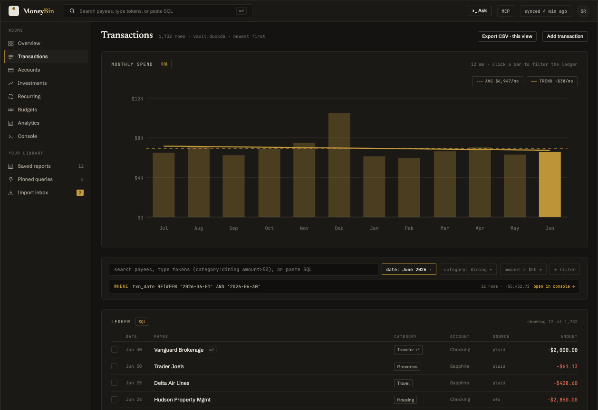

<!-- Last reviewed: 2026-07-13 -->
<!-- markdownlint-disable MD033 MD041 -->
<div align="center">
  <picture>
    <source media="(prefers-color-scheme: dark)" srcset="docs/assets/moneybin-logo-on-dark.svg">
    
  </picture>

  **Your finances, understood by AI.**

  A local-first financial data platform: one encrypted database, open interfaces,<br>
  and answers you can trace back to their source.

  [Try the demo](#try-it) · [What works today](docs/features.md) · [Architecture](docs/architecture.md)

  [](https://github.com/bsaffel/moneybin/actions/workflows/ci.yml)
  [](LICENSE)
  [](https://www.python.org)
</div>
<!-- markdownlint-enable MD033 MD041 -->

MoneyBin imports financial data into an encrypted [DuckDB](https://duckdb.org)
database on your machine. You can work with the same canonical data through the
CLI, SQL, or an AI assistant over
[MCP](https://modelcontextprotocol.io)—without handing ownership of the database
to another financial app.

<!-- markdownlint-disable MD033 -->
<p align="center">
  
</p>
<!-- markdownlint-enable MD033 -->

> **Design preview with synthetic data.** The browser interface is in
> development. The encrypted database, import pipeline, CLI, SQL access,
> reports, and MCP server are available today.

## Why MoneyBin

### Own the database

Each profile is one AES-256-GCM-encrypted DuckDB file under `~/.moneybin/`. No
vendor account is required for local use, and the database remains useful
outside any single UI or AI model.

### Ask or query

Use natural language through an MCP-compatible assistant, structured CLI
commands, or SQL. All three surfaces operate on the same modeled data instead
of maintaining separate answers.

### Inspect the evidence

Imports are deduplicated and recorded as reversible batches. Reports and tools
can return provenance and SQL, so a convenient answer does not have to be a
black box.

## Try it

MoneyBin is currently installed from source. macOS is the primary target, Linux
is supported, and Windows is not yet tested. You need Python 3.12+,
[uv](https://docs.astral.sh/uv/), and Git. MoneyBin runs on demand—there is no
daemon, container, or open network port for local use.

```bash
git clone https://github.com/bsaffel/moneybin.git
cd moneybin
make setup
moneybin demo
```

`moneybin demo` creates an isolated profile with synthetic data, runs the full
pipeline, checks the resulting database, and prints a first answer. It never
touches a real profile.

From there, try the same data through different interfaces:

```bash
moneybin reports networth
moneybin sql query "SELECT * FROM reports.net_worth LIMIT 10"
moneybin mcp install --client claude-desktop
```

See the [data import guide](docs/guides/data-import.md) for CSV, OFX/QFX/QBO,
Excel, Parquet, PDF, Plaid, and Google Sheets sources, or the
[MCP guide](docs/guides/mcp-server.md) for supported AI clients and tool
behavior.

## Current state

MoneyBin is pre-v1 and in daily use by its author. Today it includes encrypted
multi-profile storage, deterministic imports, cross-source deduplication,
transfer detection, categorization, Plaid sync for cash, credit-card, and
investment accounts, investment lots and gains, curated reports, ad-hoc SQL,
reversible edits, integrity checks, a CLI, and an MCP server.

It does not yet have a published package or Homebrew install, polished first-run
onboarding, the browser interface shown above, or the planned hosted service.
Plaid's link, sync, and reconcile round trip is built and author-tested against
a production account, but still needs non-author validation. The exact
capability boundary lives in [What Works Today](docs/features.md); future work
lives in the [roadmap](docs/roadmap.md).

## Documentation

- [What Works Today](docs/features.md) — shipped capabilities and their limits
- [Guides](docs/guides/) — imports, CLI, MCP, SQL, security, and operations
- [Architecture](docs/architecture.md) — data flow, guarantees, and extension boundaries
- [Roadmap](docs/roadmap.md) — current priorities without speculative dates

For a critical comparison with other tools, see
[Where MoneyBin Fits](docs/comparison.md) and [Who It Is For](docs/audience.md).

## Contributing

Bug reports, focused feature proposals, and pull requests are welcome. Start
with [CONTRIBUTING.md](CONTRIBUTING.md) for the development workflow and project
conventions. Use [GitHub Discussions](https://github.com/bsaffel/moneybin/discussions)
for broader questions and design conversations.

## License

[AGPL-3.0](LICENSE). See [Licensing](docs/licensing.md) for the practical meaning
of the license and the relationship between self-hosted and planned hosted use.
