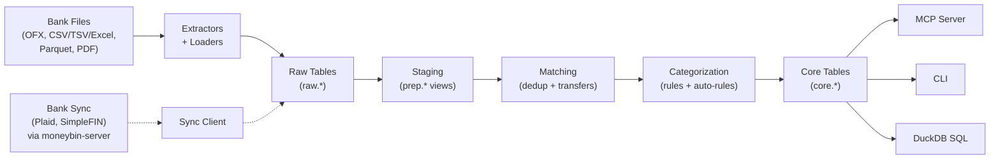

<!-- markdownlint-disable MD033 MD041 -->
<div align="center">
  

  **Your finances, understood by AI.**

  Open-source, local-first, AI-native personal finance platform.<br>
  Encrypted by default. Queryable with SQL. Extensible with MCP.

  [](https://github.com/bsaffel/moneybin/actions/workflows/ci.yml)
  [](LICENSE)
  [](https://www.python.org)
  [](https://duckdb.org)

</div>
<!-- markdownlint-enable MD033 MD041 -->

---

MoneyBin is a personal financial data platform built on Python, DuckDB, and SQLMesh. It imports data from bank files, transforms it through an auditable SQL pipeline, and exposes it through an AI-native [MCP](https://modelcontextprotocol.io) server and a CLI.

It's for people who want to understand their money without handing it to a cloud service, and for engineers who want their financial data in a real database, not a spreadsheet.

> **Status:** Active development. The core pipeline — import, dedup, transfer detection, categorization with auto-rule learning, and AI-native query via MCP — works today. Bank sync, investment tracking, and budgets are designed and on the [roadmap](#roadmap).

## Why MoneyBin

- **AI-native.** Built on [MCP](https://modelcontextprotocol.io). Connect Claude, ChatGPT, Cursor, or any MCP client and ask questions in natural language. Sensitivity tiers and consent controls are part of the protocol surface, not bolted on.
- **Encrypted by default.** Every database is AES-256-GCM encrypted from creation. Stolen laptop, synced folder, shared machine — none of them expose your data.
- **A real database, not a black box.** Three-layer SQLMesh pipeline (raw → staging → core) over [DuckDB](https://duckdb.org). Every transformation is a SQL model you can read, audit, and modify. Query with any DuckDB client.
- **Local-first.** No cloud dependency. Nothing leaves your machine unless you connect a sync service. Your `.duckdb` file is yours — copy it, back it up, or walk away.

## How It Works



> Solid arrows are shipped; dashed arrows are designed (see [`sync-overview.md`](docs/specs/sync-overview.md)).

## Quick Start

```bash
git clone https://github.com/bsaffel/moneybin.git
cd moneybin
make setup
```

Requires Python 3.11+ and [uv](https://docs.astral.sh/uv/).

```bash
moneybin import file path/to/checking.qfx     # OFX/QFX/QBO
moneybin import file path/to/intuit.qbo       # QuickBooks/Quicken Web Connect
moneybin import file path/to/transactions.csv # CSV/TSV/Excel/Parquet/Feather
moneybin import file path/to/w2.pdf           # W-2 PDF
moneybin import inbox                         # drain ~/Documents/MoneyBin/<profile>/inbox/
moneybin import status

moneybin mcp config generate --client claude-desktop --install
```

`import file` is the golden path: extract → load → transform → categorize, in one command. See the [Data Import guide](docs/guides/data-import.md) for formats, batch management, and migration profiles (Tiller, Mint, YNAB, Maybe).

Once connected, ask things like:

- *"What's my spending by category this month?"*
- *"Find all my recurring subscriptions and their annual cost."*
- *"Help me categorize my uncategorized transactions."*

## What Works Today

| Capability | Guide |
|---|---|
| Import: OFX/QFX/QBO, CSV/TSV/Excel/Parquet/Feather, W-2 PDF; heuristic column detection; migration profiles (Tiller, Mint, YNAB, Maybe). OFX/QFX/QBO files share the same import-batch contract as tabular: re-imports of the same file are detected and rejected (use `--force`), institution names auto-resolve from `<FI><ORG>` / FID lookup / filename heuristics (override with `--institution`), and any batch can be reverted via `moneybin import revert <id>`. | [Data Import](docs/guides/data-import.md) |
| Watched inbox: drop files in `~/Documents/MoneyBin/<profile>/inbox/` (or `inbox/<account-slug>/` for single-account files), `moneybin import inbox` drains them — successes move to `processed/YYYY-MM/`, failures to `failed/YYYY-MM/` with a YAML error sidecar. | [Smart Import Inbox](docs/specs/smart-import-inbox.md) |
| Three-layer SQL pipeline: raw → staging → core, multi-source union, source-agnostic consumers | [Data Pipeline](docs/guides/data-pipeline.md) |
| Cross-source dedup, transfer detection, golden-record merge, review/undo workflow | [Data Pipeline](docs/guides/data-pipeline.md) · [matching specs](docs/specs/matching-overview.md) |
| Rule-based categorization (exact / substring / regex), merchant normalization, bulk ops, **auto-rule learning** from your edits | [Categorization](docs/guides/categorization.md) |
| AES-256-GCM encryption at rest, key management, automatic schema migrations | [Database & Security](docs/guides/database-security.md) |
| Multi-profile isolation (per-profile DB, config, logs) | [Profiles](docs/guides/profiles.md) |
| MCP server: 9 tool domains, prompt templates, resources, `--output json` parity with CLI | [MCP Server](docs/guides/mcp-server.md) |
| Direct SQL: shell, DuckDB UI, key tables documented | [SQL Access](docs/guides/sql-access.md) |
| Synthetic data generator (3 personas, ~200 merchants, ground-truth labels) | [Synthetic Data](docs/guides/synthetic-data.md) |
| Scenario test suite (10 scenarios, five-tier taxonomy, bug-report recipe) | [Scenario Authoring](docs/guides/scenario-authoring.md) |
| Structured logs + Prometheus-style metrics with DuckDB persistence | [Observability](docs/guides/observability.md) |

**Scenario test suite (10 scenarios):** Whole-pipeline regression coverage
across structural invariants, semantic correctness (categorization P/R,
transfer F1+P+R, negative expectations), pipeline behavior (idempotency,
empty/malformed input handling), and quality (date continuity,
ground-truth coverage). New scenarios follow the bug-report recipe at
[`docs/guides/scenario-authoring.md`](docs/guides/scenario-authoring.md).

Full command reference: [CLI Reference](docs/guides/cli-reference.md).

## Roadmap

✅ shipped · 📐 designed · 🗓️ planned

| Area | Status |
|---|---|
| OFX/QFX/QBO, tabular (CSV/TSV/Excel/Parquet/Feather), W-2 PDF import; competitor migration profiles; watched-folder inbox; reversible batches with re-import detection | ✅ |
| Cross-source dedup, transfer detection, golden-record merge | ✅ |
| Rule engine + merchant normalization + auto-rule generation | ✅ |
| Encryption at rest, key management, multi-profile, schema migrations, observability | ✅ |
| Comprehensive scenario testing (five-tier taxonomy, 10 scenarios, bug-report recipe) | ✅ |
| Native PDF parsing (beyond W-2), AI-assisted file parsing | 🗓️ |
| ML-powered categorization, merchant entity resolution | 🗓️ |
| Plaid Transactions sync (via `moneybin-server`) | 📐 |
| SimpleFIN sync, Plaid Investments | 🗓️ |
| Net worth & balance tracking, budget tracking | 📐 |
| Investment tracking (holdings, cost basis) | 🗓️ |
| Privacy tiers & consent model | 📐 |
| MCP SQL schema discoverability (curated `moneybin://schema` resource) | ✅ |
| Export (CSV, Excel, Google Sheets) | 🗓️ |

Per-feature design specs live in [`docs/specs/`](docs/specs/INDEX.md).

## How It Compares

|  | Beancount/Fava | Firefly III | Actual Budget | MoneyBin |
|---|---|---|---|---|
| Storage | Plain-text ledger | MySQL/Postgres | Local SQLite | Encrypted DuckDB |
| Bank sync | — | Nordigen (6000+) | Limited | Designed (Plaid/SimpleFIN) |
| AI integration | — | — | — | Native MCP |
| Query interface | Text + Fava UI | Web UI + API | Web UI | SQL, MCP, CLI |
| Maturity | Years | Years | Years | Active early dev |

MoneyBin's bet: AI-native interaction + auditable SQL pipeline + encryption by default, in exchange for less coverage on bank sync, no investment tracking yet, and no web UI. The other tools are mature and excellent at what they do — pick the one that fits your priorities.

## Documentation

- [Feature Guides](docs/guides/) — what's shipped, how to use it
- [Spec Index](docs/specs/INDEX.md) — design specs and status
- [Architecture Decision Records](docs/decisions/) — key design decisions
- [Contributing](CONTRIBUTING.md) — dev setup, project structure, scenario runner

## License

[AGPL-3.0](LICENSE)
