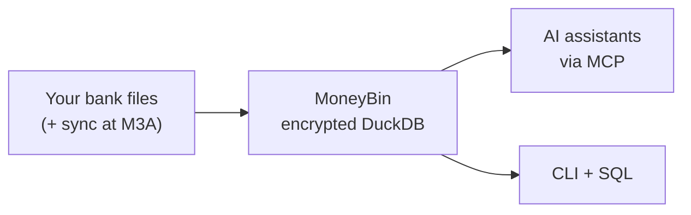

<!-- markdownlint-disable MD033 MD041 -->
<div align="center">
  

  **Your finances, understood by AI.**

  The local-first, AI-native financial data platform you actually own.<br>
  Encrypted by default. Queryable with SQL. Extensible with MCP.

  [](https://github.com/bsaffel/moneybin/actions/workflows/ci.yml)
  [](LICENSE)
  [](https://www.python.org)
  [](https://duckdb.org)

</div>
<!-- markdownlint-enable MD033 MD041 -->

---

MoneyBin is a personal financial data platform built on Python, DuckDB, and SQLMesh. It imports data from bank files, transforms it through an auditable SQL pipeline, and exposes it through an AI-native [MCP](https://modelcontextprotocol.io) server and a CLI.

> **Status:** Pre-launch. M0 (Infrastructure) and M1 (Data Integrity) shipped; M2 (curator state, architecture reference, brand surface) in flight; M3 closes at launch with Plaid sync, investments, multi-currency, Web UI, and the hosted tier. → [Full roadmap](docs/roadmap.md)

## Why MoneyBin

- **Lineage you can audit.** Every number traces from `core.fct_transactions` to a SQLMesh model to `raw` to your source file. When the AI gives an answer, ask for the SQL.
- **Encrypted by default.** AES-256-GCM at rest with Argon2id KDF. Stolen laptop, synced folder, shared machine — none of them expose your data. → [Threat model](docs/guides/threat-model.md)
- **AI-native, but client-agnostic.** Built on [MCP](https://modelcontextprotocol.io). Bring Claude, Cursor, VS Code, Codex — when tomorrow's better model lands, MoneyBin works on day one.
- **Same product, your choice of deployment.** `brew install` for local, hosted SaaS at M3E. Same AGPL code, same encrypted DuckDB, walk-away guarantee on your data.

## How It Works



→ [Architecture](docs/architecture.md) for the full pipeline.

## Quick Start

> **Today's install is for developers.** `brew install moneybin` ships at M2C close. Until then, `git clone` + [uv](https://docs.astral.sh/uv/) is the install path. If you're not comfortable with a CLI checkout, [bookmark the project](https://github.com/bsaffel/moneybin) and check back when M2C closes.

```bash
git clone https://github.com/bsaffel/moneybin.git
cd moneybin
make setup
```

```bash
moneybin import file path/to/transactions.csv  # CSV/TSV/Excel/Parquet/Feather
moneybin import file path/to/checking.qfx      # OFX/QFX/QBO
moneybin import inbox                          # drain ~/Documents/MoneyBin/<profile>/inbox/

moneybin mcp config generate --client claude-desktop --install
```

Once Claude (or any MCP client) is connected, ask:

- *"What's my spending by category this month?"*
- *"Find all my recurring subscriptions and their annual cost."*
- *"Help me categorize my uncategorized transactions."*

→ [Data Import guide](docs/guides/data-import.md) · [MCP clients (9 supported)](docs/guides/mcp-clients.md) · [What works today](docs/features.md) · [Who this is for](docs/audience.md)

## Comparison

|  | Beancount | Wealthfolio | Actual | Firefly III | Fina | Era / BankSync | MoneyBin |
|---|---|---|---|---|---|---|---|
| Local-first | ✅ | ✅ | ✅ | ✅ | ❌ | ❌ | ✅ |
| Encrypted at rest by default | ❌ | ✅ | ❌ | ❌ | 🟡 server-side | 🟡 server-side | ✅ |
| AI-native (MCP) | ❌ | ❌ | ❌ | ❌ | ✅ | ✅ | ✅ |
| SQL-queryable | ❌ | ❌ | ❌ | 🟡 API only | ❌ | ❌ | ✅ |
| Open-source self-host | ✅ | ✅ | ✅ MIT | ✅ | ❌ | ❌ | ✅ AGPL |

The other tools are mature and excellent at what they do. → [Wider 8-way comparison + tier framing](docs/comparison.md)

## Documentation

- [Feature Guides](docs/guides/) — what's shipped, how to use it
- [What Works Today](docs/features.md) — capability snapshot with per-feature links
- [Roadmap](docs/roadmap.md) — milestone breakdown, M0 through M3E
- [Architecture](docs/architecture.md) — placeholder; full distillation lands with M2B
- [Threat Model](docs/guides/threat-model.md) — what encryption protects against, and what it doesn't
- [Comparison](docs/comparison.md) — wider competitor analysis
- [Audience](docs/audience.md) — who MoneyBin is for, today and at launch
- [Licensing](docs/licensing.md) — why AGPL, what it does and doesn't mean
- [Spec Index](docs/specs/INDEX.md) — design specs and status
- [Architecture Decision Records](docs/decisions/) — key design decisions
- [Changelog](CHANGELOG.md) — version history
- [Security Policy](SECURITY.md) — vulnerability disclosure

## Community

- **Issues:** [GitHub Issues](https://github.com/bsaffel/moneybin/issues) for bug reports and feature requests
- **Discussions:** [GitHub Discussions](https://github.com/bsaffel/moneybin/discussions) for questions, ideas, and show-and-tell

## Contributing

→ [`CONTRIBUTING.md`](CONTRIBUTING.md) — dev setup, project structure, scenario runner, branching conventions

## License

[AGPL-3.0](LICENSE). MoneyBin uses the same license model as Bitwarden, Plausible, Element, and Sentry — open source, self-hostable, with a hosted tier (M3E) that runs the same code anyone can self-host. → [Why AGPL](docs/licensing.md)
