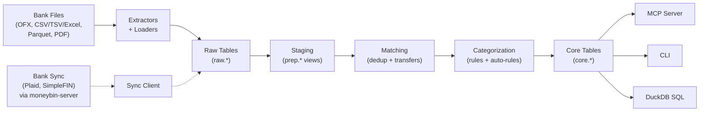

<!-- markdownlint-disable MD033 MD041 -->
<div align="center">
  

  **Your finances, understood by AI.**

  The local-first, AI-native financial data platform you actually own.<br>
  Encrypted by default. Queryable with SQL. Extensible with MCP.

  [](https://github.com/bsaffel/moneybin/actions/workflows/ci.yml)
  [](LICENSE)
  [](https://www.python.org)
  [](https://duckdb.org)

</div>
<!-- markdownlint-enable MD033 MD041 -->

---

MoneyBin is a personal financial data platform built on Python, DuckDB, and SQLMesh. It imports data from bank files, transforms it through an auditable SQL pipeline, and exposes it through an AI-native [MCP](https://modelcontextprotocol.io) server and a CLI.

It's for people who want to understand their money without handing it to a cloud service, and for engineers who want their financial data in a real database, not a spreadsheet.

> **Status:** Pre-launch. The core pipeline — import, dedup, transfer detection, categorization with auto-rule learning, account management, net worth, and AI-native query via MCP — works today. Wave 2 is in flight (curator state, `brew install`, first-run wizard, brand surface). Wave 3 closes at launch (Plaid sync, investments, multi-currency, Web UI, hosted tier). See the [roadmap](#roadmap) for the full plan.

## Why MoneyBin

- **Lineage you can audit.** Every number traces to a row in `core.fct_transactions`, which traces to a SQLMesh model, which traces to a row in `raw`, which traces to your source file. When the AI gives an answer, you can ask for the SQL — and read the model that produced it. Three-layer SQLMesh pipeline (raw → staging → core) over [DuckDB](https://duckdb.org).
- **Encrypted by default.** Every database is AES-256-GCM encrypted from creation. Argon2id KDF for passphrase mode; OS keychain integration for auto-key mode. Stolen laptop, synced folder, shared machine — none of them expose your data. See the [threat model](docs/guides/threat-model.md) for what encryption protects against and what it doesn't.
- **AI-native, but client-agnostic.** Built on [MCP](https://modelcontextprotocol.io). Works today via local stdio with Claude Desktop, Claude Code, Cursor, Windsurf, VS Code, Gemini CLI, Codex (CLI / Desktop / IDE), and ChatGPT Desktop. Streamable HTTP transport arrives with the hosted tier (Wave 3) so ChatGPT web/mobile and other remote clients connect too. When tomorrow's better model lands, MoneyBin works with it on day one.
- **Local-first today, hosted when you want it.** `brew install moneybin` ships at Wave 2C close; the developer install path (`git clone` + `uv`) works today. Hosted SaaS launches at Wave 3 close with zero-knowledge encryption — same AGPL code anyone can self-host. Download your DuckDB any time and walk away. No vendor lock-in.

## How It Works



> Solid arrows are shipped; dashed arrows are designed (see [`sync-overview.md`](docs/specs/sync-overview.md)).

## Who This Is For

**Today, MoneyBin fits you if:**

- You're already running Tiller, Lunch Money, Beancount, hledger, or a heroic spreadsheet, and want a real database with AI on top.
- You want a finance MCP that runs against *your own data file*, not someone else's hosted store.
- You self-host other infrastructure (Vaultwarden, NextCloud, etc.) and the personal-finance gap has been on your todo list.
- You're comfortable with a CLI install today; `brew install moneybin` is coming with Wave 2C.

**It's not yet for you if:**

- You want one-click bank sync today (Plaid lands in Wave 3).
- You want a polished mobile app (post-launch consideration).
- You want investment tracking with cost basis (Wave 3).
- You want pure envelope budgeting — try [YNAB](https://www.ynab.com/) or [Actual Budget](https://actualbudget.org/) instead.

## Quick Start

> **Today's install is for developers.** `brew install moneybin` ships at Wave 2C close; until then, `git clone` + `uv` is the install path. The first-run wizard and `moneybin demo` synthetic-data preset arrive in the same wave.

```bash
git clone https://github.com/bsaffel/moneybin.git
cd moneybin
make setup
```

Requires Python 3.11+ and [uv](https://docs.astral.sh/uv/).

```bash
moneybin import file path/to/checking.qfx     # OFX/QFX/QBO
moneybin import file path/to/intuit.qbo       # QuickBooks/Quicken Web Connect
moneybin import file path/to/transactions.csv # CSV/TSV/Excel/Parquet/Feather
moneybin import file path/to/w2.pdf           # W-2 PDF
moneybin import inbox                         # drain ~/Documents/MoneyBin/<profile>/inbox/
moneybin import status

moneybin mcp config generate --client claude-desktop --install
```

**MCP clients today (local stdio):** claude-desktop, claude-code, cursor, windsurf, vscode, gemini-cli, codex (CLI / Desktop / IDE extension), chatgpt-desktop. ChatGPT web/mobile and other purely-remote clients connect via Streamable HTTP transport — that arrives with the hosted tier in Wave 3. MoneyBin's single-writer DuckDB lock means only one MCP session per profile can run at a time — see [Configuring MCP Clients](docs/guides/mcp-clients.md) for the concurrency model, per-client behavior, and per-session opt-in for Claude Code (`make claude-mcp`).

`import file` is the golden path: extract → load → transform → categorize, in one command. See the [Data Import guide](docs/guides/data-import.md) for formats, batch management, and migration profiles (Tiller, Mint, YNAB, Maybe).

Once connected, ask things like:

- *"What's my spending by category this month?"*
- *"Find all my recurring subscriptions and their annual cost."*
- *"Help me categorize my uncategorized transactions."*

## What Works Today

| Capability | Guide |
|---|---|
| Import: OFX/QFX/QBO, CSV/TSV/Excel/Parquet/Feather, W-2 PDF; heuristic column detection; migration profiles (Tiller, Mint, YNAB, Maybe). OFX/QFX/QBO files share the same import-batch contract as tabular: re-imports of the same file are detected and rejected (use `--force`), institution names auto-resolve from `<FI><ORG>` / FID lookup / filename heuristics (override with `--institution`), and any batch can be reverted via `moneybin import revert <id>`. | [Data Import](docs/guides/data-import.md) |
| Watched inbox: drop files in `~/Documents/MoneyBin/<profile>/inbox/` (or `inbox/<account-slug>/` for single-account files), `moneybin import inbox` drains them — successes move to `processed/YYYY-MM/`, failures to `failed/YYYY-MM/` with a YAML error sidecar. | [Smart Import Inbox](docs/specs/smart-import-inbox.md) |
| Three-layer SQL pipeline: raw → staging → core, multi-source union, source-agnostic consumers | [Data Pipeline](docs/guides/data-pipeline.md) |
| Cross-source dedup, transfer detection, golden-record merge, review/undo workflow | [Data Pipeline](docs/guides/data-pipeline.md) · [matching specs](docs/specs/matching-overview.md) |
| Rule-based categorization (exact / substring / regex), merchant normalization, bulk ops, **auto-rule learning** from your edits. **Cold-start:** curated seed merchants (US/CA/global), LLM-assist workflow for the long tail (via `transactions_categorize_assist` MCP tool or `moneybin transactions categorize export-uncategorized` + `apply-from-file` for agent-driven flows). | [Categorization](docs/guides/categorization.md) |
| AES-256-GCM encryption at rest, key management, automatic schema migrations | [Database & Security](docs/guides/database-security.md) · [Threat Model](docs/guides/threat-model.md) |
| Multi-profile isolation (per-profile DB, config, logs) | [Profiles](docs/guides/profiles.md) |
| MCP server: ~15 tool domains under the v2 path-prefix taxonomy (accounts, transactions, reports, categories, merchants, system, budget, tax, sync, transform, import, …), prompt templates, resources, `--output json` parity with CLI | [MCP Server](docs/guides/mcp-server.md) |
| MCP tool timeouts: every tool returns within a configurable wall-clock cap (default 30 s); timeouts release the DuckDB lock so the next call succeeds | [Spec](docs/specs/mcp-tool-timeouts.md) |
| Account management: `accounts list/show/rename/include/archive/unarchive/set` — display preferences, lifecycle, and Plaid-parity metadata (subtype, holder category, currency, credit limit, last four). Archive cascades to net worth exclusion; soft-validation on subtype with TTY prompt. | [Account Management](docs/specs/account-management.md) |
| Net worth & balance tracking: `accounts balance show/history/assert/list/delete/reconcile` for per-account balance workflow; `reports networth show/history` for cross-account aggregation with period-over-period change. Authoritative observations from OFX, tabular running balances, and user assertions. Daily carry-forward interpolation; reconciliation deltas self-heal on reimport. | [Net Worth](docs/specs/net-worth.md) |
| Direct SQL: shell, DuckDB UI, key tables documented | [SQL Access](docs/guides/sql-access.md) |
| Synthetic data generator (3 personas, ~200 merchants, ground-truth labels) | [Synthetic Data](docs/guides/synthetic-data.md) |
| Scenario test suite (10 scenarios, five-tier taxonomy, bug-report recipe) | [Scenario Authoring](docs/guides/scenario-authoring.md) |
| Structured logs + Prometheus-style metrics with DuckDB persistence | [Observability](docs/guides/observability.md) |

**Scenario test suite (10 scenarios):** Whole-pipeline regression coverage
across structural invariants, semantic correctness (categorization P/R,
transfer F1+P+R, negative expectations), pipeline behavior (idempotency,
empty/malformed input handling), and quality (date continuity,
ground-truth coverage). New scenarios follow the bug-report recipe at
[`docs/guides/scenario-authoring.md`](docs/guides/scenario-authoring.md).

Full command reference: [CLI Reference](docs/guides/cli-reference.md).

## Roadmap

✅ shipped · 📐 designed · 🗓️ planned (post-launch)

| Area | Wave | Status |
|---|---|---|
| OFX/QFX/QBO + tabular import (CSV/TSV/Excel/Parquet/Feather) + W-2 PDF + watched-folder inbox + reversible batches | Levels 0–1 | ✅ |
| Cross-source dedup + transfer detection + golden-record merge | Level 1 | ✅ |
| Rule engine + merchant normalization + auto-rule generation + cold-start (seed merchants, LLM-assist workflow) | Level 1 | ✅ |
| Encryption at rest + key management + multi-profile + schema migrations + observability | Level 0 | ✅ |
| Account management + net-worth & balance tracking with reconciliation deltas | Level 1 | ✅ |
| MCP server (~33 tools, v2 taxonomy, install across 9 clients) + curated `moneybin://schema` resource + tool timeouts | Levels 0–1 | ✅ |
| 10-scenario test suite (five-tier taxonomy, bug-report recipe) | Levels 0–1 | ✅ |
| Manual transaction entry + notes/tags + verified flag + edit-history audit log + split-via-annotation | **Wave 2A** | 📐 |
| Architecture reference doc (shared primitives, `app.*` user-state, `reports.*` presentation) | **Wave 2B** | 📐 |
| `brew install` + first-run wizard + `moneybin doctor` + `reports.*` recipe library + demo profile + landing page | **Wave 2C** | 📐 |
| Plaid Transactions sync (via `moneybin-server`) | **Wave 3** | 📐 |
| Investment tracking (holdings, FIFO lots, cost basis, realized/unrealized gain/loss) | **Wave 3** | 📐 |
| Multi-currency Phase 1 + budget rollovers | **Wave 3** | 📐 |
| Web UI + Streamable HTTP MCP + multi-tenant auth + hosted SaaS launch | **Wave 3** | 📐 |
| Privacy tiers + consent model | Post-launch | 📐 |
| Native PDF (beyond W-2) + AI-assisted file parsing | Post-launch | 🗓️ |
| ML-powered categorization + merchant entity resolution | Post-launch | 🗓️ |
| MCP Apps (interactive UI inside AI clients) | Post-launch | 🗓️ |
| Mobile read-only viewer | Post-launch | 🗓️ |
| Export (CSV, Excel, Google Sheets) | Post-launch | 🗓️ |

Per-feature design specs live in [`docs/specs/`](docs/specs/INDEX.md).

## How It Compares

|  | Beancount/Fava | Firefly III | Actual Budget | Maybe/Sure | Era / BankSync | Lunch Money | Wealthfolio | MoneyBin |
|---|---|---|---|---|---|---|---|---|
| Storage | Plain-text ledger | MySQL/Postgres | Local SQLite | PostgreSQL | Hosted | Hosted | Local SQLite | **Encrypted DuckDB** |
| Bank sync | OFX importers | Nordigen (6000+) | goCardless / SimpleFIN | Plaid / SimpleFIN | Plaid (hosted) | Plaid (hosted) | Manual + CSV | Designed (Plaid via `moneybin-server`) |
| AI / MCP | Community wrappers | — | Community wrappers | — | Hosted MCP, native | Community wrapper | — | First-party local + hosted MCP |
| Encrypted-at-rest | OS only | DB plaintext | SQLite plaintext | DB plaintext | Server-side | Server-side | SQLite plaintext | **AES-256-GCM by default** |
| SQL access | — | API only | — | — | — | API only | — | DuckDB native + curated views |
| License | OSS | AGPL | MIT | AGPL | Closed | Closed | OSS | AGPL |
| Maturity | Years | Years (very active) | Years | Archived; "Sure" fork active | New (2026) | Years | Active (Tauri/Rust) | Pre-launch (Wave 2 in flight) |

MoneyBin's bet: AI-native interaction + auditable SQL pipeline + encryption by default + the same code running locally or hosted, in exchange for less coverage on bank sync, no investment tracking yet, and no Web UI until Wave 3 closes. The other tools are mature and excellent at what they do — pick the one that fits your priorities.

## Documentation

- [Feature Guides](docs/guides/) — what's shipped, how to use it
- [Threat Model](docs/guides/threat-model.md) — what encryption protects against, and what it doesn't
- [Database & Security](docs/guides/database-security.md) — encryption modes, key management, schema migrations
- [Architecture](docs/architecture.md) — placeholder; full distillation lands with Wave 2B
- [Spec Index](docs/specs/INDEX.md) — design specs and status
- [Architecture Decision Records](docs/decisions/) — key design decisions (ADR-000 onward)
- [Changelog](CHANGELOG.md) — version history and shipped milestones
- [Contributing](CONTRIBUTING.md) — dev setup, project structure, scenario runner
- [Security Policy](SECURITY.md) — vulnerability disclosure and response SLAs

## License

[AGPL-3.0](LICENSE).

We chose AGPL deliberately:

- You can use MoneyBin freely, locally or hosted, for any purpose including commercial.
- You can fork it and modify it freely.
- **If you run a modified version as a network service, you must publish your source.** This is why a closed-source competitor can't trivially clone MoneyBin's hosted experience without contributing back.
- The hosted server we run (`moneybin-server`, launching with Wave 3) is the same AGPL code anyone can self-host.

Same model used by Bitwarden, Plausible, Element/Matrix, Sentry, and Ghost. The license is a feature, not a tax.
