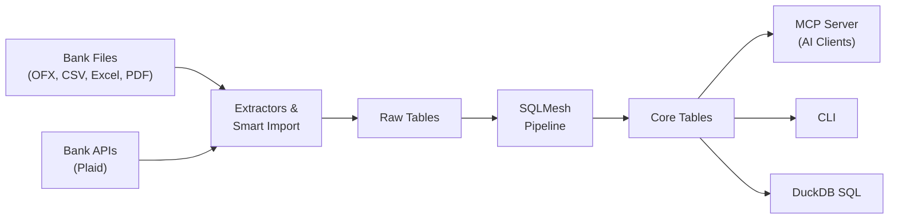

<!-- markdownlint-disable MD033 MD041 -->
<div align="center">
  

  **Your finances, understood by AI.**

  Open-source, local-first, AI-native personal finance platform.<br>
  Encrypted by default. Queryable with SQL. Extensible with MCP.

  [](LICENSE)
  [](https://www.python.org)
  [](https://duckdb.org)

</div>
<!-- markdownlint-enable MD033 MD041 -->

---

MoneyBin is a personal financial data platform built on Python, DuckDB, and SQLMesh. It imports data from bank files and APIs, transforms it through an auditable SQL pipeline, and exposes it through an AI-native [MCP](https://modelcontextprotocol.io) server and a full-featured CLI.

It's designed for people who want to understand their money without handing it to a cloud service — and for engineers who want their financial data in a real database, not a spreadsheet.

## Why MoneyBin?

**AI-native from day one.** MoneyBin is the first personal finance tool built around the [Model Context Protocol](https://modelcontextprotocol.io). Connect it to Claude, ChatGPT, Cursor, or any MCP-compatible client and interact with your finances in natural language. Categorize transactions, review your monthly spending, or prepare for taxes — all through conversation.

**Encrypted by default.** Every database is AES-256-GCM encrypted from the moment it's created. No setup, no extra steps. A stolen laptop, a synced folder, a shared machine — none of them expose your financial data. No other open-source personal finance tool does this.

**A data warehouse, not a black box.** Your data flows through a transparent, three-layer pipeline powered by [SQLMesh](https://sqlmesh.com): raw imports, staging views, and clean core tables. Every transformation is a SQL model you can read, audit, and modify. The database is [DuckDB](https://duckdb.org) — query it with standard SQL from any tool.

**Your data, your way.** Local-first with no cloud dependency. Nothing leaves your machine unless you choose to connect a bank sync service. Your database file is yours — copy it, back it up, query it with any DuckDB client, or export to CSV and walk away. No vendor lock-in, no data hostage.

## How It Works



Import your financial data from local files or bank sync, transform it through a documented SQL pipeline, then interact through AI assistants, the command line, or direct SQL.

## Quick Start

### 1. Install

```bash
git clone https://github.com/bsaffel/moneybin.git
cd moneybin
make setup
```

Requires Python 3.11+ and [uv](https://docs.astral.sh/uv/).

### 2. Import Your Data

```bash
# Import OFX/QFX bank statements
moneybin import file path/to/downloads/checking.qfx

# Import a CSV — auto-detects format or uses a saved profile
moneybin import file path/to/transactions.csv

# Extract W-2 tax data from a PDF
moneybin import file path/to/w2.pdf

# Check what's been imported
moneybin import status

# Build the core analytical model
moneybin data transform apply
```

### 3. Connect Your AI Assistant

Add MoneyBin to your MCP client configuration:

```json
{
  "mcpServers": {
    "moneybin": {
      "command": "uv",
      "args": ["run", "--directory", "/path/to/moneybin", "moneybin", "mcp", "serve"]
    }
  }
}
```

Works with Claude Desktop, Claude Code, ChatGPT, Cursor, Windsurf, VS Code, and any MCP-compatible client.

Then ask things like:

- *"What's my spending by category this month?"*
- *"Find all my recurring subscriptions and their annual cost"*
- *"Show me my net worth over the last year"*
- *"Help me categorize my uncategorized transactions"*
- *"How much did I pay in taxes last year?"*

## Features

### MCP Server

MoneyBin's MCP server is the primary programmatic interface — not an afterthought bolted onto a web app. Tools are organized across 13 domains with built-in privacy tiers, pagination, and structured responses optimized for LLM reasoning.

| Domain | Description |
|--------|-------------|
| `spending` | Category breakdowns, merchant rankings, period comparisons |
| `cashflow` | Income vs expense summaries, income source analysis |
| `accounts` | Balances, net worth over time, account details |
| `transactions` | Search, recurring detection, corrections, annotations |
| `transactions.matches` | Cross-source dedup review, transfer detection |
| `import` | File import, format detection, batch folder import |
| `categorize` | Rules, merchants, bulk categorization, auto-rule generation |
| `budget` | Monthly targets, rollover tracking, budget-vs-actual |
| `tax` | W-2 summaries, deductible expense search |
| `privacy` | Consent management, audit log, sensitivity controls |
| `overview` | Data freshness, system health |
| `sql` | Direct read-only SQL access to the full database |

Plus 4 goal-oriented **prompt templates** (monthly review, categorization workflow, onboarding, tax prep) and 4 **resources** for ambient context (schema, accounts, status, privacy).

### Data Import

| Source | Format | Status |
|--------|--------|--------|
| Bank statements | OFX / QFX | Supported |
| Tax forms | W-2 PDF | Supported |
| Bank transactions | CSV (institution profiles) | Supported |
| Universal tabular | CSV, TSV, Excel, Parquet, Feather | Designed |
| Bank sync | Plaid Transactions API | Designed |
| Competitor migration | Tiller, Mint, YNAB profiles | Designed |

The **smart tabular importer** (designed, not yet shipped) adds heuristic column detection, multi-account file support, and built-in migration profiles for common tools. Import your transaction history from another app and your categorizations come with you — MoneyBin learns from them to seed auto-categorization rules.

### Data Pipeline

```
Raw (raw.*)          Staging (prep.*)         Core (core.*)
─────────────        ────────────────         ─────────────
Untouched data  ──>  Light cleaning,     ──>  Canonical, deduplicated,
from extractors      type casting (views)     multi-source (tables)
```

- **One canonical table per entity** — `dim_accounts`, `fct_transactions`, etc. All consumers read from core.
- **Multi-source union** — core models combine every staging source with a `source_type` column.
- **Dedup in core** — `ROW_NUMBER()` windows for within-source duplicates; cross-source matching for the same transaction from different imports.
- **Adding a data source** means writing staging views and adding a CTE to the relevant core model. No changes to consumers.

### Categorization

- **Rule engine** — exact match, substring, and regex rules with a priority hierarchy.
- **Merchant normalization** — map messy bank descriptions (`STARBUCKS #12345 SEATTLE WA`) to clean merchant names.
- **Auto-rule generation** *(designed)* — categorize a transaction and MoneyBin proposes a rule so it's automatic next time. Your tenth import requires almost no manual work.
- **Bulk operations** — categorize, create rules, and create merchants in batches, not one at a time.

### Privacy and Security

MoneyBin treats financial data with the seriousness it deserves:

- **AES-256-GCM encryption at rest** — every database, from creation. Zero-friction auto-key for single-user machines; passphrase mode for shared environments.
- **Local-first architecture** — no cloud account, no telemetry, no external network calls unless you opt into bank sync.
- **Sensitivity tiers** — MCP tools declare data sensitivity levels. The privacy middleware enforces consent gates and response filtering automatically.
- **Defense in depth** — read-only connections for queries, PII sanitization in logs, parameterized SQL throughout, path validation on file operations.

### Compared to Alternatives

| | MoneyBin | Beancount/Fava | Firefly III | Actual Budget |
|---|---|---|---|---|
| **Primary interface** | AI (MCP) + CLI | CLI + Fava web | Web app | Desktop (Electron) |
| **Database** | DuckDB (SQL-queryable) | Plain text files | MySQL / PostgreSQL | SQLite |
| **Encrypted at rest** | AES-256-GCM | No | No | No |
| **Data pipeline** | SQLMesh (auditable SQL) | N/A (plain text) | Opaque | Opaque |
| **AI integration** | Native (MCP server) | None | None | None |
| **Bank sync** | Plaid *(designed)* | OFX importers | Nordigen (6000+) | goCardless, SimpleFIN |
| **Categorization** | Rules + auto-rules | Smart Importer (ML) | Rule engine | Auto-rules from payees |
| **Budgeting** | Traditional + rollover | Script-based | Envelopes + traditional | Envelopes (zero-based) |
| **Investments** | *Planned* | Advanced | Basic | Basic |
| **License** | AGPL-3.0 | GPL-2.0 | AGPL-3.0 | MIT |

MoneyBin is younger than these projects and not yet feature-complete. What it offers today is a fundamentally different architecture — AI-native, encrypted, SQL-queryable, and transparent — that none of them have. What it doesn't yet have (bank sync, investment tracking, visual dashboards) is [actively designed](docs/specs/INDEX.md) and on the roadmap.

## CLI Reference

| Command | Description |
|---------|-------------|
| `moneybin import file <path>` | Import a financial data file (auto-detects format) |
| `moneybin import status` | Show imported data summary: row counts, dates, sources |
| `moneybin data transform apply` | Run SQLMesh to rebuild staging and core tables |
| `moneybin data categorize` | Manage categories, rules, and merchants |
| `moneybin db init` | Initialize the encrypted database and schemas |
| `moneybin db shell` | Interactive DuckDB SQL shell |
| `moneybin db query "SQL"` | Run a SQL query |
| `moneybin db ui` | Open the DuckDB web UI for exploration |
| `moneybin mcp serve` | Start the MCP server (stdio transport) |
| `moneybin config show` | Show current configuration |
| `moneybin --profile NAME ...` | Use a specific profile (isolated database + data) |

## Project Structure

```
moneybin/
├── src/moneybin/
│   ├── mcp/                # MCP server (FastMCP, tools, resources, prompts)
│   ├── cli/                # Typer CLI (thin wrappers over service layer)
│   ├── services/           # Business logic (shared by MCP + CLI)
│   ├── extractors/         # File parsers (OFX, PDF, CSV)
│   ├── loaders/            # DuckDB data loaders
│   ├── connectors/         # External API integrations (Plaid)
│   ├── database.py         # Connection factory (encryption, schemas, migrations)
│   ├── config.py           # Pydantic Settings (single source of truth)
│   └── log_sanitizer.py    # PII detection and masking for logs
├── sqlmesh/                # SQLMesh project
│   └── models/             # SQL transformation models
│       ├── prep/           #   Staging views (1:1 with raw sources)
│       └── core/           #   Canonical tables (multi-source, deduplicated)
├── tests/                  # pytest suite (unit + integration)
├── docs/
│   ├── specs/              # Feature specs with status tracking
│   ├── decisions/          # Architecture Decision Records
│   └── reference/          # System docs, data model, prompt templates
└── data/{profile}/         # Profile-isolated data (per-user databases)
```

## Development

```bash
make setup              # Set up development environment
make check              # Format + lint + type-check (ruff + pyright)
make test               # Run unit tests
make test-all           # Run all tests including integration
make test-cov           # Tests with coverage report
```

MoneyBin uses [uv](https://docs.astral.sh/uv/) for package management, [Ruff](https://docs.astral.sh/ruff/) for formatting and linting, and [Pyright](https://github.com/microsoft/pyright) for type checking. See [`.claude/rules/`](.claude/rules/) for coding standards.

## Roadmap

MoneyBin is under active development. The [Spec Index](docs/specs/INDEX.md) tracks every designed feature and its status.

**Current priorities:**
- Database migration system and encrypted-by-default databases
- Synthetic test data generator for development and demos
- Transaction matching (cross-source dedup and transfer detection)
- Smart tabular importer with heuristic format detection

**Designed and queued:**
- Auto-rule generation for categorization
- Net worth and balance tracking
- Plaid bank sync
- Investment tracking (holdings, cost basis, gain/loss)
- Multi-currency support

See [`docs/specs/INDEX.md`](docs/specs/INDEX.md) for the full list.

## Documentation

- [Spec Index](docs/specs/INDEX.md) — Feature specs and status tracking
- [Architecture Decision Records](docs/decisions/) — Key design decisions and rationale
- [System Overview](docs/reference/system-overview.md) — Architecture and data flow
- [Data Model](docs/reference/data-model.md) — Schema and ER diagram
- [MCP Architecture](docs/specs/mcp-architecture.md) — MCP server design philosophy
- [MCP Tool Surface](docs/specs/mcp-tool-surface.md) — Complete tool, prompt, and resource catalog
- [Privacy & Data Protection](docs/specs/privacy-data-protection.md) — Encryption, key management, threat model

## License

[AGPL-3.0](LICENSE)
