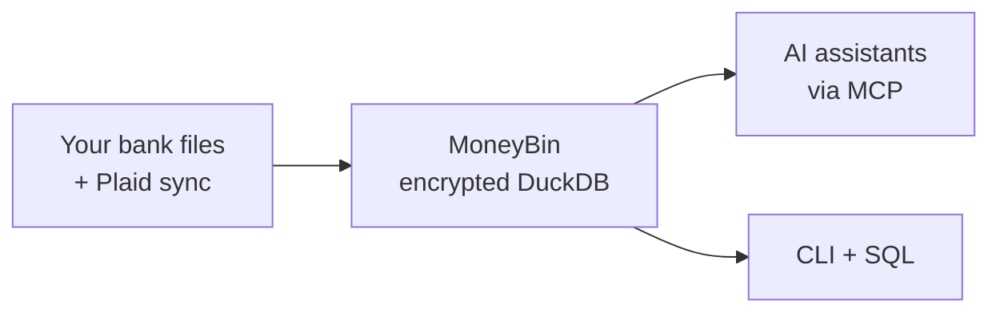

<!-- Last reviewed: 2026-05-17 -->
<!-- markdownlint-disable MD033 MD041 -->
<div align="center">
  

  **Your finances, understood by AI.**

  The local-first, AI-native financial data platform you actually own.<br>
  Encrypted by default. Queryable with SQL. Extensible with MCP.

  [](https://github.com/bsaffel/moneybin/actions/workflows/ci.yml)
  [](LICENSE)
  [](https://www.python.org)
  [](https://duckdb.org)

</div>
<!-- markdownlint-enable MD033 MD041 -->

---

MoneyBin is a personal financial data platform built on Python, DuckDB, and [SQLMesh](https://sqlmesh.com) (the transformation framework that compiles and versions SQL pipelines). It imports data from bank files, syncs from Plaid, transforms it through an auditable SQL pipeline, and exposes the result through an AI-native [MCP](https://modelcontextprotocol.io) server — the protocol your AI assistant speaks to local tools — a CLI that is itself a first-class agent surface, and direct SQL.

> **Status: pre-v1.** The CLI, MCP server, encrypted DuckDB storage, file imports (CSV/OFX/QFX/QBO/Excel/Parquet), and Plaid sync work today. A polished web UI, investment accounts, multi-currency, budgets, and a hosted tier are planned. → [Roadmap](docs/roadmap.md)

## Why MoneyBin

- **Lineage you can audit.** Every number traces from the canonical `core.fct_transactions` table through a SQLMesh model back to `raw` and your original source file. When the AI gives an answer, ask for the SQL. → [Architecture](docs/architecture.md)
- **Encrypted by default.** AES-256-GCM at rest with Argon2id key derivation. One encrypted DuckDB file per profile lives under `~/.moneybin/profiles/<name>/`. A stolen laptop, a synced folder, or a shared machine doesn't expose your data. → [Threat model](docs/guides/threat-model.md)
- **AI-native, but client-agnostic.** Built on [MCP](https://modelcontextprotocol.io) with a wide tool catalog across `accounts.*`, `transactions.*`, `reports.*`, `categorize.*`, `refresh`, and `sync.*` — supported in Claude Desktop, Claude Code, Cursor, Windsurf, VS Code, Gemini CLI, Codex, and ChatGPT Desktop. When tomorrow's better model lands, MoneyBin works on day one. → [MCP guide](docs/guides/mcp-server.md)
- **CLI and MCP are peers.** Every capability ships on both surfaces. Every CLI command supports `--output json` and returns the same `{status, data, error, audit_id}` envelope as the corresponding MCP tool, redacted by the same middleware. Agents driving the shell (Claude Code, Codex CLI) are first-class, not a fallback. → [Audience](docs/audience.md)
- **Same product, your choice of deployment.** Local install today, hosted SaaS planned. Same AGPL code, same encrypted DuckDB, walk-away guarantee on your data. → [Licensing](docs/licensing.md)

## How It Works



→ [Architecture](docs/architecture.md) for the full pipeline.

## Deployment shape

MoneyBin is a CLI plus a local MCP server you install on your own computer (macOS-first; Linux works via PyPI; Windows untested). It runs on demand — no headless daemon mode, no container image, no exposed network ports today. The MCP server speaks the stdio transport; the Streamable HTTP transport ships alongside the planned web UI. A hosted tier running the same code is planned. → [Audience](docs/audience.md)

## Quick Start

> **Today's install is for developers.** A `brew install` path is planned. Until then, `git clone` + [uv](https://docs.astral.sh/uv/) is the install path. If you're not comfortable with a CLI checkout, [bookmark the project](https://github.com/bsaffel/moneybin) and check back later.

```bash
git clone https://github.com/bsaffel/moneybin.git
cd moneybin
make setup
```

Import a file, drain the watched-folder inbox, or sync from a Plaid-connected bank:

```bash
moneybin import files path/to/transactions.csv    # CSV / TSV / Excel / Parquet / Feather
moneybin import files path/to/checking.qfx        # OFX / QFX / QBO
moneybin import inbox                             # drain ~/Documents/MoneyBin/<profile>/inbox/
moneybin sync pull                                # Plaid sync (cash + credit-card accounts)
```

> **Coming from another tool?** Tiller, Lunch Money, Copilot, and Monarch all export CSV — import via `moneybin import files`. Beancount and GnuCash users can drop OFX/QFX exports through the same command. → [Data import guide](docs/guides/data-import.md)

Wire MoneyBin into your AI client and ask in natural language:

```bash
moneybin mcp install --client claude-desktop      # also: claude-code, cursor, codex, gemini-cli, ...
```

- *"What's my spending by category this month?"*
- *"Find all my recurring subscriptions and their annual cost."*
- *"Help me categorize my uncategorized transactions."*

Or drive the same primitives from the shell — agents and humans share the same JSON envelope:

```bash
moneybin reports networth --output json
moneybin transactions list --category Groceries --output json
moneybin refresh                                  # matching → SQLMesh transforms → categorization
```

→ [Data Import](docs/guides/data-import.md) · [MCP clients](docs/guides/mcp-clients.md) · [CLI reference](docs/guides/cli-reference.md) · [What works today](docs/features.md)

## Comparison

|  | Beancount | Wealthfolio | Actual | Firefly III | Fina | Era / BankSync | MoneyBin |
|---|---|---|---|---|---|---|---|
| Local-first | ✅ | ✅ | ✅ | ✅ | ❌ | ❌ | ✅ |
| Encrypted at rest by default | ❌ | ✅ | ❌ | ❌ | 🟡 server-side | 🟡 server-side | ✅ |
| AI-native (MCP) | ❌ | ❌ | ❌ | ❌ | ✅ | ✅ | ✅ |
| SQL-queryable | ❌ | ❌ | ❌ | 🟡 API only | ❌ | ❌ | ✅ |
| Open-source self-host | ✅ | ✅ | ✅ MIT | ✅ | ❌ | ❌ | ✅ AGPL |

The other tools are mature and excellent at what they do. → [Wider 8-way comparison + tier framing](docs/comparison.md)

## What works today

Shipped: smart tabular and OFX/QFX/QBO import, watched-folder inbox, Plaid sync (transactions, balances, and accounts — cash and credit cards; investment accounts planned), cross-source dedup and transfer detection, rule-based categorization with auto-apply of confidently inferred rules and an opt-in LLM-assist step, the full MCP tool catalog with parity CLI, `moneybin system doctor` integrity checks, encrypted DuckDB with multi-profile isolation, and a 10-scenario test suite. → [Capability snapshot](docs/features.md) · [Roadmap](docs/roadmap.md)

## Documentation

- [Feature Guides](docs/guides/) — how to use what's shipped
- [What Works Today](docs/features.md) — capability snapshot with per-feature links
- [Roadmap](docs/roadmap.md) — milestone breakdown
- [Architecture](docs/architecture.md) — guarantees, diagram, read/write contract
- [Threat Model](docs/guides/threat-model.md) — what encryption protects against, and what it doesn't
- [MCP Server](docs/guides/mcp-server.md) — tool catalog, response envelope, redaction
- [Comparison](docs/comparison.md) — wider competitor analysis
- [Audience](docs/audience.md) — who MoneyBin is for, today and at launch
- [Licensing](docs/licensing.md) — why AGPL, what it does and doesn't mean
- [Spec Index](docs/specs/INDEX.md) — design specs and status
- [Architecture Decision Records](docs/decisions/) — key design decisions
- [Changelog](CHANGELOG.md) — version history
- [Security Policy](SECURITY.md) — vulnerability disclosure

## Community

- **Issues:** [GitHub Issues](https://github.com/bsaffel/moneybin/issues) for bug reports and feature requests
- **Discussions:** [GitHub Discussions](https://github.com/bsaffel/moneybin/discussions) for questions, ideas, and show-and-tell

## Contributing

→ [`CONTRIBUTING.md`](CONTRIBUTING.md) — dev setup, project structure, scenario runner, branching conventions

## License

[AGPL-3.0](LICENSE). MoneyBin uses the same license model as Bitwarden, Plausible, Element, and Sentry — open source, self-hostable, with a planned hosted tier that runs the same code anyone can self-host. → [Why AGPL](docs/licensing.md)
