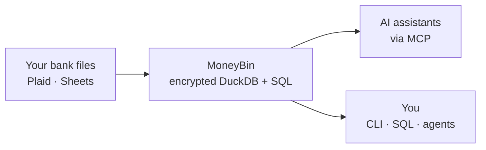

<!-- Last reviewed: 2026-05-24 -->
<!-- markdownlint-disable MD033 MD041 -->
<div align="center">
  

  **Your finances, understood by AI.**

  The personal finance platform you actually own — easy enough to just ask,<br>
  powerful enough to query with SQL, and built for the AI you already use.

  [](https://github.com/bsaffel/moneybin/actions/workflows/ci.yml)
  [](LICENSE)
  [](https://www.python.org)
  [](https://duckdb.org)

</div>
<!-- markdownlint-enable MD033 MD041 -->

---

As easy as Mint was. As powerful as the tools data engineers actually use. Ask your money anything in plain language — then ask to see the exact SQL behind the answer. Your data lives in one encrypted file on your own machine, and you can walk away with it any time.

> **Why I built this.** When Mint shut down, I lost access to years of my own financial data. I'd switched to Mint from Quicken because it was effortless — and then it was just *gone*. I work with data all day and always wanted to query my money the way I query everything else: with SQL. So I built the tool I wanted — the ease of Mint, the power of a best-in-class analytics stack, and AI as the primary way you interact with it. — *Brandon*

## What makes MoneyBin different

- **Ask your money anything.** MoneyBin speaks [MCP](https://modelcontextprotocol.io), the protocol your AI assistant uses to reach local tools — so Claude, Cursor, VS Code, Gemini CLI, Codex, and others can answer real questions about your finances. Bring your own model; when a better one ships, MoneyBin works with it on day one. → [MCP guide](docs/guides/mcp-server.md)

- **Query it like a data engineer.** Underneath the chat is a real analytics warehouse — DuckDB plus [SQLMesh](https://sqlmesh.com), the framework that compiles and versions SQL pipelines. Every number traces from a canonical table back through a model to your original file. When the AI gives you an answer, ask it to *show you the SQL*. → [SQL access](docs/guides/sql-access.md)

- **Built to be extended — by you and your agents.** MoneyBin assumes you'll want to track *your* money *your* way. The schema, the reports, and the import pipeline are stable contracts an agent can build against — so you (or Claude Code, or Cursor) can vibe-code a new report, a custom importer, or a whole tracker on top of your own data. Reports, analysis packages, and data providers are first-class extension points. MoneyBin wants to be the first tool your agent reaches for. → [Extension contract](docs/specs/extension-contracts.md)

- **You own it, end to end.** Local-first by default — one encrypted DuckDB file per profile under `~/.moneybin/`, AES-256-GCM at rest. No vendor account required, no data resale, no lock-in. The same code powers an optional hosted tier; switching deployments is moving one file. → [Architecture](docs/architecture.md) · [Threat model](docs/guides/threat-model.md)

- **Your history comes with you.** Import from bank files (CSV/OFX/QFX/QBO/Excel), sync from Plaid, or connect a live Google Sheet — your categories migrate with you and auto-rules learn from them. Cross-source dedup means re-importing overlapping months never double-counts. → [Data import](docs/guides/data-import.md)

## How it works



→ [Architecture](docs/architecture.md) for the full pipeline.

## Quick Start

> **Today's install is for developers.** A `brew install` path is in flight. Until then, `git clone` + [uv](https://docs.astral.sh/uv/) is the path. Not comfortable with a CLI checkout? [Bookmark the project](https://github.com/bsaffel/moneybin) and check back.

```bash
git clone https://github.com/bsaffel/moneybin.git
cd moneybin
make setup
```

Bring in your data — import a file, drain the watched-folder inbox, or sync a Plaid-connected bank:

```bash
moneybin import files path/to/transactions.csv    # CSV / TSV / Excel / Parquet / Feather
moneybin import files path/to/checking.qfx        # OFX / QFX / QBO
moneybin import inbox                              # drain ~/Documents/MoneyBin/<profile>/inbox/
moneybin sync pull                                 # Plaid sync (cash + credit-card accounts)
```

> **Coming from another tool?** Tiller, Mint, YNAB, and Maybe have first-class migration profiles; Lunch Money, Copilot, and Monarch export CSV that the generic importer reads. Beancount and GnuCash users can drop OFX/QFX exports through the same command. → [Data import guide](docs/guides/data-import.md)

Wire MoneyBin into your AI client and ask in natural language:

```bash
moneybin mcp install --client claude-desktop      # also: claude-code, cursor, codex, gemini-cli, ...
```

- *"What's my spending by category this month?"*
- *"Find all my recurring subscriptions and their annual cost."*
- *"Show me the SQL behind that number."*

Or drive the same primitives from the shell — agents and humans share one JSON envelope:

```bash
moneybin reports networth --output json
moneybin transactions list --category Groceries --output json
moneybin sql query "SELECT category, SUM(amount) FROM core.fct_transactions GROUP BY 1"
```

→ [Data Import](docs/guides/data-import.md) · [MCP clients](docs/guides/mcp-clients.md) · [CLI reference](docs/guides/cli-reference.md) · [What works today](docs/features.md)

## Where it stands

**MoneyBin is pre-v1.** It's in daily use by the author, and the foundation is built to last rather than built to demo.

**Working today:** the CLI and MCP server (≈70 tools across nine AI clients), encrypted multi-profile storage, file imports (CSV/OFX/QFX/QBO/Excel/Parquet) and a watched-folder inbox, Plaid sync (cash + credit cards), live Google Sheets sync, cross-source dedup and transfer detection, rule-based categorization with an opt-in LLM-assist step, eight curated reports, privacy-safe ad-hoc SQL, reversible edits with a full audit trail, and `moneybin system doctor` integrity checks.

**In flight:** a `brew install` path and first-run onboarding, drop-any-PDF import (AI-assisted extraction), an extensible report framework, Plaid production approval, and the contributor extension contract.

**Planned:** investment & cost-basis tracking, multi-currency, budgets, a web UI dashboard, and an opt-in hosted tier — same code you can self-host.

→ [What works today](docs/features.md) · [Roadmap](docs/roadmap.md) · [How MoneyBin compares](docs/comparison.md)

## Is it for you?

MoneyBin's lane is narrow on purpose: your data stays on your machine, AI assists rather than runs the show, the code is open source, and every database file is encrypted at rest. It fits best if you're comfortable in a terminal and want your finances inside your own data and AI workflow. If you need a polished mobile app, a shared household budget, or pure envelope budgeting today, [the audience page](docs/audience.md) names the tool that's genuinely a better fit — honestly. → [Audience](docs/audience.md) · [Comparison](docs/comparison.md)

## Documentation

- [What Works Today](docs/features.md) — capability snapshot with per-feature links
- [Feature Guides](docs/guides/) — how to use what's shipped
- [Roadmap](docs/roadmap.md) — what's in flight and planned
- [Architecture](docs/architecture.md) — guarantees, diagram, read/write contract
- [Threat Model](docs/guides/threat-model.md) — what encryption protects against, and what it doesn't
- [MCP Server](docs/guides/mcp-server.md) — tool catalog, response envelope, redaction
- [How MoneyBin Compares](docs/comparison.md) — head-to-head with other tools
- [Audience](docs/audience.md) — who MoneyBin is for, today and at launch
- [Licensing](docs/licensing.md) — why AGPL, what it does and doesn't mean
- [Spec Index](docs/specs/INDEX.md) · [Decision Records](docs/decisions/) · [Changelog](CHANGELOG.md) · [Security Policy](SECURITY.md)

## Community

- **Issues:** [GitHub Issues](https://github.com/bsaffel/moneybin/issues) for bugs and feature requests
- **Discussions:** [GitHub Discussions](https://github.com/bsaffel/moneybin/discussions) for questions, ideas, and show-and-tell

## Contributing

→ [`CONTRIBUTING.md`](CONTRIBUTING.md) — dev setup, project structure, scenario runner, branching conventions

## License

[AGPL-3.0](LICENSE). MoneyBin uses the same license model as Bitwarden, Plausible, Element, and Sentry — open source, self-hostable, with a planned hosted tier that runs the same code anyone can self-host. → [Why AGPL](docs/licensing.md)
