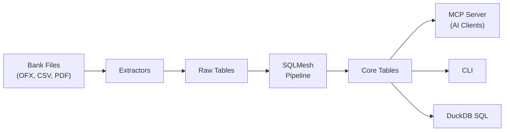

<!-- markdownlint-disable MD033 MD041 -->
<div align="center">
  

  **Your finances, understood by AI.**

  Open-source, local-first, AI-native personal finance platform.<br>
  Encrypted by default. Queryable with SQL. Extensible with MCP.

  [](https://github.com/bsaffel/moneybin/actions/workflows/ci.yml)
  [](LICENSE)
  [](https://www.python.org)
  [](https://duckdb.org)

</div>
<!-- markdownlint-enable MD033 MD041 -->

---

MoneyBin is a personal financial data platform built on Python, DuckDB, and SQLMesh. It imports data from bank files, transforms it through an auditable SQL pipeline, and exposes it through an AI-native [MCP](https://modelcontextprotocol.io) server and a CLI.

It's designed for people who want to understand their money without handing it to a cloud service — and for engineers who want their financial data in a real database, not a spreadsheet.

> **Status:** MoneyBin is in active early development. The core pipeline (import, transform, query) works today. Many features are designed but not yet shipped — the [roadmap](#roadmap) is honest about what's done vs. what's next.

## Why MoneyBin?

**AI-native from day one.** Built around the [Model Context Protocol](https://modelcontextprotocol.io). Connect it to Claude, ChatGPT, Cursor, or any MCP-compatible client and interact with your finances in natural language.

**Encrypted by default.** Every database is AES-256-GCM encrypted from the moment it's created. No setup, no extra steps. A stolen laptop, a synced folder, a shared machine — none of them expose your financial data.

**A data warehouse, not a black box.** Your data flows through a transparent, three-layer pipeline powered by [SQLMesh](https://sqlmesh.com): raw imports, staging views, and clean core tables. Every transformation is a SQL model you can read, audit, and modify. The database is [DuckDB](https://duckdb.org) — query it with standard SQL from any tool.

**Your data stays local.** No cloud dependency. Nothing leaves your machine unless you choose to connect a bank sync service. Your database file is yours — copy it, back it up, query it with any DuckDB client, or export to CSV and walk away.

## Where This Is Going

The long-term vision for MoneyBin is a personal finance platform where AI does the tedious work and you stay in control. Not all of this is built yet — see the [roadmap](#roadmap) for current status — but this is what we're building toward:

- **Import once, never again.** Connect your banks via Plaid or SimpleFIN. New transactions flow in automatically. File imports handle everything else — CSV exports from any institution, OFX statements, tax documents. Migration profiles let you bring your history from Tiller, Mint, YNAB, or Maybe without starting over.
- **AI that understands your finances.** Ask your AI assistant to review your month, find subscriptions you forgot about, prepare for taxes, or explain a spending spike. MoneyBin's MCP server gives the AI structured access to your data with built-in privacy controls — it sees what you allow, nothing more.
- **Categorization that learns.** Start with rules you define. Over time, MoneyBin proposes new rules from your corrections — so each import requires less manual work. The goal is near-zero-touch categorization by your third month.
- **One database, many views.** Your canonical financial data lives in DuckDB. Query it with SQL, explore it in the DuckDB web UI, pipe it to notebooks, or let an AI assistant summarize it. No proprietary format, no export needed.

## How It Works



Import your financial data from local files, transform it through a documented SQL pipeline, then interact through AI assistants, the command line, or direct SQL.

## Quick Start

### 1. Install

```bash
git clone https://github.com/bsaffel/moneybin.git
cd moneybin
make setup
```

Requires Python 3.11+ and [uv](https://docs.astral.sh/uv/).

### 2. Import Your Data

```bash
# Import OFX/QFX bank statements
moneybin import file path/to/downloads/checking.qfx

# Import a CSV with a saved institution profile
moneybin import file path/to/transactions.csv

# Extract W-2 tax data from a PDF
moneybin import file path/to/w2.pdf

# Check what's been imported
moneybin import status

# Build the core analytical model
moneybin transform apply
```

### 3. Connect Your AI Assistant

Generate and install the MCP config for your client:

```bash
# Generate config for Claude Desktop (prints JSON)
moneybin mcp config generate --client claude-desktop

# Or install directly into the client's config file
moneybin mcp config generate --client claude-desktop --install
```

Supports Claude Desktop, Cursor, and Windsurf. Works with any MCP-compatible client.

Then ask things like:

- *"What's my spending by category this month?"*
- *"Find all my recurring subscriptions and their annual cost"*
- *"Help me categorize my uncategorized transactions"*
- *"How much did I pay in taxes last year?"*

## What Works Today

### Data Import

| Source | Format | Status |
|--------|--------|--------|
| Bank statements | OFX / QFX | Working |
| Tax forms | W-2 PDF | Working |
| Bank transactions | CSV, TSV, Excel, Parquet, Feather | Working |

- **Heuristic column detection** — 100+ header aliases, content validation, date format disambiguation, international number formats. Most bank exports just work without configuration.
- **Built-in migration formats** — Tiller, Mint, YNAB, Maybe. Bring your history from other tools.
- **Saved formats** — auto-detected mappings are saved so repeat imports are instant.
- **Import management** — batch tracking, preview (dry run), and revert.

### Data Pipeline

```
Raw (raw.*)          Staging (prep.*)         Core (core.*)
─────────────        ────────────────         ─────────────
Untouched data  ──>  Light cleaning,     ──>  Canonical, deduplicated,
from extractors      type casting (views)     multi-source (tables)
```

- **One canonical table per entity** — `dim_accounts`, `fct_transactions`, etc. All consumers read from core.
- **Multi-source union** — core models combine every staging source with a `source_type` column.
- **Dedup in core** — `ROW_NUMBER()` windows for within-source duplicates.
- **Adding a data source** means writing staging views and adding a CTE to the relevant core model. No changes to consumers.

### Categorization

- **Rule engine** — exact match, substring, and regex rules with a priority hierarchy.
- **Merchant normalization** — map messy bank descriptions (`STARBUCKS #12345 SEATTLE WA`) to clean merchant names.
- **Bulk operations** — categorize, create rules, and create merchants in batches.

### Database & Security

- **AES-256-GCM encryption at rest** — every database, from creation. Zero-friction auto-key for single-user machines; passphrase mode for shared environments.
- **Key management** — lock, unlock, rotate-key, backup, restore.
- **Local-first architecture** — no cloud account, no telemetry, no external network calls.
- **Automatic schema migrations** — upgrades happen transparently on first run after a package update. Versioned SQL and Python migrations, drift detection, stuck migration recovery. Power users can inspect state with `moneybin db migrate status`.
- **Defense in depth** — PII sanitization in logs, parameterized SQL throughout, path validation on file operations.

### Observability

- **Structured logging** — stream-based routing (`cli`, `mcp`, `sqlmesh`) with daily log files, human-readable and JSON formatters, PII sanitization.
- **Metrics** — `prometheus_client`-backed counters, gauges, and histograms with automatic DuckDB persistence across restarts.
- **Instrumentation** — `@tracked` decorator and `track_duration` context manager for zero-boilerplate operation timing.
- **CLI** — `moneybin stats show` for lifetime metric aggregates; `moneybin logs tail --stream mcp` for stream-filtered log viewing.

### Multi-Profile Support

Each profile is an isolation boundary with its own database, config, and logs under `~/.moneybin/profiles/<name>/`.

```bash
moneybin profile create work       # Create a new profile
moneybin profile list              # Show all profiles
moneybin --profile work import file statement.qfx   # Use a specific profile
moneybin profile switch work       # Change the default
```

### MCP Server

The MCP server exposes financial data to AI assistants with structured tools, prompt templates, and resources. It's the primary programmatic interface — not an afterthought.

```bash
moneybin mcp list-tools            # See all registered tools
moneybin mcp list-prompts          # See all registered prompts
moneybin mcp config                # Show current MCP config
```

### Synthetic Data Generator

Generate realistic, deterministic financial data for testing and demos.

```bash
moneybin synthetic generate --persona basic --profile test-data
```

- **Three personas** — `basic` (single income), `family` (dual income, kids), `freelancer` (variable income).
- **~200 real merchants** across 14+ spending categories with realistic amounts and seasonal patterns.
- **Ground-truth labels** — every transaction has a known-correct category and transfer pair, enabling automated accuracy testing.
- **Deterministic** — same persona + same seed = same data every time.

### CLI

Domain commands at the top level for fast access:

```bash
moneybin import file <path>        # Import financial data files
moneybin transform apply           # Run SQLMesh pipeline
moneybin transform status          # Check pipeline state
moneybin categorize apply-rules    # Apply categorization rules
moneybin db shell                  # Interactive SQL shell
moneybin db ps                     # Show processes holding the database
moneybin logs tail -f              # Follow log output
```

> For full command documentation, see the [CLI Reference](docs/guides/cli-reference.md). For detailed feature guides, see the [Feature Guide](docs/guides/).

## Roadmap

Legend: ✅ shipped | 📐 designed (spec written) | 🗓️ planned

### Import & Ingestion

| Feature | Status |
|---------|--------|
| OFX/QFX bank statement import | ✅ |
| W-2 PDF extraction | ✅ |
| CSV import with institution profiles | ✅ |
| Universal tabular import (CSV, TSV, Excel, Parquet, Feather) | ✅ |
| Heuristic column detection | ✅ |
| Competitor migration profiles (Tiller, Mint, YNAB, Maybe) | ✅ |
| Native PDF parsing (beyond W-2) | 🗓️ |
| AI-assisted file parsing fallback | 🗓️ |

### Data Quality & Matching

| Feature | Status |
|---------|--------|
| Within-source dedup | ✅ |
| Cross-source dedup (same transaction from different imports) | 📐 |
| Transfer detection across accounts | 📐 |
| Golden-record merge rules | 📐 |

### Categorization

| Feature | Status |
|---------|--------|
| Rule engine (exact, substring, regex) | ✅ |
| Merchant normalization | ✅ |
| Bulk categorization | ✅ |
| Auto-rule generation from user edits | 📐 |
| ML-powered categorization | 🗓️ |
| Merchant entity resolution | 🗓️ |

### Bank Sync

| Feature | Status |
|---------|--------|
| Plaid Transactions API | 📐 |
| SimpleFIN provider | 🗓️ |
| Plaid Investments | 🗓️ |

### Tracking & Analysis

| Feature | Status |
|---------|--------|
| Net worth & balance tracking | 📐 |
| Budget tracking (targets, rollovers) | 📐 |
| Investment tracking (holdings, cost basis) | 🗓️ |

### Infrastructure

| Feature | Status |
|---------|--------|
| AES-256-GCM encryption at rest | ✅ |
| Key management (lock/unlock/rotate) | ✅ |
| Multi-profile support (isolated DBs, config, logs) | ✅ |
| CLI restructure (profiles, domain commands, base dir) | ✅ |
| Database migration system | ✅ |
| Observability (metrics, structured logging) | ✅ |
| Synthetic test data generator | ✅ |
| Privacy tiers & consent model | 📐 |
| Export (CSV, Excel, Google Sheets) | 🗓️ |

## How MoneyBin Is Different

MoneyBin occupies a different niche than existing tools:

- **[Beancount](https://beancount.github.io/) / [Fava](https://beancount.github.io/fava/)** — Plain-text double-entry accounting. Excellent for accountants who want precision and portability. MoneyBin trades the plain-text ledger for a SQL-queryable database and AI-native interface, targeting people who want insights without learning accounting syntax.

- **[Firefly III](https://www.firefly-iii.org/)** — Self-hosted web app with broad bank sync (6000+ institutions via Nordigen). Mature and full-featured. MoneyBin prioritizes local-first encryption and AI interaction over a web UI, at the cost of current maturity.

- **[Actual Budget](https://actualbudget.org/)** — Desktop-first envelope budgeting. Great UX for zero-based budgeting. MoneyBin is less opinionated about budgeting methodology and more focused on being a queryable data platform.

**What MoneyBin brings that they don't:**

- Native AI integration via MCP (not a bolt-on)
- AES-256-GCM encryption at rest by default
- Auditable SQL transformation pipeline (SQLMesh + DuckDB)
- Direct SQL access to your financial data

**What they have that MoneyBin doesn't (yet):**

- Bank sync with thousands of institutions
- Investment tracking
- Visual dashboards and web UIs
- Years of community maturity

## Project Structure

```
moneybin/
├── src/moneybin/
│   ├── mcp/                # MCP server (FastMCP, tools, resources, prompts)
│   ├── cli/                # Typer CLI (thin wrappers over service layer)
│   ├── services/           # Business logic (shared by MCP + CLI)
│   ├── extractors/         # File parsers (OFX, PDF, CSV)
│   ├── loaders/            # DuckDB data loaders
│   ├── database.py         # Connection factory (encryption, schemas, migrations)
│   ├── config.py           # Pydantic Settings (single source of truth)
│   └── log_sanitizer.py    # PII detection and masking for logs
├── sqlmesh/                # SQLMesh project
│   └── models/             # SQL transformation models
│       ├── prep/           #   Staging views (1:1 with raw sources)
│       └── core/           #   Canonical tables (multi-source, deduplicated)
├── tests/                  # pytest suite (unit + integration)
├── docs/
│   ├── specs/              # Feature specs with status tracking
│   └── decisions/          # Architecture Decision Records
└── ~/.moneybin/            # User data (default location)
    └── profiles/<name>/    # Per-profile: database, config, logs, temp
```

## Development

```bash
make setup              # Set up development environment
make check              # Format + lint + type-check (ruff + pyright)
make test               # Run unit tests
make test-all           # Run all tests including integration
make test-cov           # Tests with coverage report
```

MoneyBin uses [uv](https://docs.astral.sh/uv/) for package management, [Ruff](https://docs.astral.sh/ruff/) for formatting and linting, and [Pyright](https://github.com/microsoft/pyright) for type checking.

## Documentation

- [Feature Guide](docs/guides/) — Detailed documentation for every shipped feature
- [Spec Index](docs/specs/INDEX.md) — Feature specs and status tracking
- [Architecture Decision Records](docs/decisions/) — Key design decisions and rationale
- [Privacy & Data Protection](docs/specs/privacy-data-protection.md) — Encryption, key management, threat model

## License

[AGPL-3.0](LICENSE)
