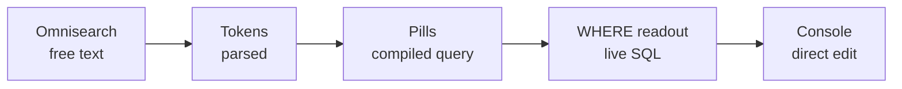

# MoneyBin app-pattern grammar — binding rules

The binding grammar for the app's structural patterns — the chrome and
controls that frame every screen, drawn from the app-screens reference in the
Design Kit project. These patterns are now load-bearing; each is documented
here as grammar. Some are candidate components for the app build; until a
component ships they are pattern specs, not code. Where any other doc's
guidance on these patterns differs, this one wins — `charts.md` still owns
chart grammar and `motion.md` still owns motion, and both win in their own
domain. Sample data throughout; the grammar is what ships. Never hardcode hex
— all values come from `tokens/`.

## Accent tiers (applies to every pattern)

One metal family, three tiers, never blue: **brass** (`--accent-brass`) marks
provenance text and active identity; **gilt** (`--accent-gilt`) fills;
**verdigris** (`--accent-verdigris`) responds — interaction and selection. A
pattern that fills reaches for gilt; a pattern that responds to a pointer or
holds a selection reaches for verdigris; a pattern that marks provenance or an
active row reaches for brass. Serif (`--font-display`) is sanctioned for room
and page titles only — never inside a widget, table, control, overline, or any
other data surface. Money is mono (`--font-data`) through the `Amount`
component, explicit `+` / `−` (U+2212) on income and expense flows, balances
unsigned. Hairline borders, no resting shadows.

## 01 FilterBar

One bar, four rungs of the same ladder — a single continuous escalation from
plain text to SQL, not a set of modes to switch between. Each rung is a more
literal view of one query; the user can read or edit at whichever rung suits
them and every rung stays in sync.



- **Rung 1 — omnisearch.** A free-text field. Typing is parsed into tokens;
  tokens compile to SQL predicates. Plain language in, structure out.
- **Rung 2 — pills.** Each committed token renders as a pill — the compiled,
  editable form of the query. A pill holding the current selection carries the
  verdigris interaction tier; removing a pill drops its predicate.
- **Rung 3 — the WHERE readout.** The pills together render the live `WHERE`
  clause, mono (`--font-data`), exactly as the predicate stands. It is a
  provenance surface, so it follows the brass ladder from `charts.md` — the
  same reveal gesture as a widget's `SQL` chip.
- **Rung 4 — the console.** Clicking the readout opens it in the SQL console
  for direct editing. The console is the bottom rung, not a separate tool.

Settled: the unified omnisearch-plus-pills approach is the answer to the
transactions filter exploration. A separate third filter mode was considered
and rejected — it split one ladder into two parallel surfaces and broke the
"same query, four views" invariant.

## 02 SegmentedControl

A row of mutually exclusive segments, each label mono (`--font-data`) and
ALL-CAPS — `BY TOTAL` / `BY CATEGORY`, or `6M` `1Y` `ALL`. Exactly one segment
is selected; the selected segment holds the verdigris selection tier
(`--accent-verdigris`), the rest sit in `--text-secondary` and step to
`--text-primary` on hover. Hairline container, `--r-control` radius, no
resting shadow. Selecting a segment swaps state instantly, per `motion.md`.
Candidate component when the app build starts; a pattern spec for now.

## 03 PageHeader

A serif room or page title (`--font-display`) set on one baseline with mono
meta (`--font-data`) alongside it — the room's name in the engraved voice, its
counts and timestamps in the ledger voice. This is the one sanctioned place
for the serif display face in app chrome; it never crosses into a widget,
table, control, or data surface. Meta reads left-to-right as numbers first,
verbs second ("184,203 rows · synced 4 min ago").

## 04 NavRail + rail item

The active row reads as `background: var(--bg-raised)` with an inset 2px brass
edge tick — `box-shadow: inset 2px 0 0 var(--accent-brass)` — and a
`--text-primary` glyph and label. The tick carries the active signal; the
**glyph itself is never gold**, active or not. This agrees with the icon
active-treatment grammar (`readme.md` → Iconography): the active *location* is a
brass edge tick beside an ink glyph, and here the tick is that element — the
glyph is never gold.

- **Glyphs** come from the `Icon` component at 20px (nav-rail size), never an
  inline SVG.
- **Collapsed rail.** The same inset brass tick marks the active row; because
  the label is hidden, each item takes a `title` tooltip — mandatory for any
  icon-only control per the iconography grammar.
- **Library rows** carry mono counts (`--font-data`), right-aligned, as a
  secondary read on each row.

## 05 Table anatomy

The table is the app's densest surface; three parts are load-bearing.

- **Sparkline column.** Shape without axes — trend, not a value. It is **never
  a number source**; the `Amount` beside it is (see `charts.md` §04, including
  the amplitude rule). No axis, no gridline, no label inside the cell.
- **Checkbox rows.** Row-level selection via a leading checkbox; a selected row
  holds the verdigris selection tier. Selection drives bulk actions without a
  separate mode.
- **Two densities.** Compact 32px (`--row-compact`, the app default) and cozy
  40px (`--row-cozy`, a setting). Density is a swap, not a redesign — it must
  **not reflow** the layout (same grammar at every size); 44px is the touch
  minimum. Amounts stay right-aligned mono with an explicit sign.

## 06 VaultStatusBar variants + privacy mode

The persistent trust line has two variants sharing one vocabulary — the green
status dot is `--pos-income`, mono throughout (`--font-data`), and the right
edge always ends `local only · no telemetry · AGPL`.

- **App-floor variant.** A single line pinned to the bottom of every app
  surface (the shipping `VaultStatusBar` component) — file · cipher · rows ·
  accounts · sync.
- **Spec footer variant.** A denser four-cell layout for spec docs and
  expanded chrome, the same fields grouped into cells rather than one run.

**Privacy mode.** Masked amounts swap **instantly** to their masked form and
back — no scramble, no ticking, no count-down of characters — per `motion.md`
("Amounts never animate": a value change swaps instantly). Toggling privacy is
a state swap, not a transition.

## Canonical synthetic dataset

One persona backs every specimen, so sample data stops drifting across cards.
A new specimen uses this persona; a drifted one is retrofitted to it as it is
touched.

- **8 accounts · 184,203 rows · net worth $487,231.09 · June 2026 ledger.**
- Categories draw from the fixed chart map (`charts.md` → Category color), so a
  category reads as one hue in every view:

```
Housing=chart-1  Groceries=chart-2  Transport=chart-3  Insurance=chart-4
Dining=chart-5   Utilities=chart-6  Travel=chart-7     Other=chart-8
```

## Reference files

- **The app-screens reference in the Design Kit project** — the interactive
  source these patterns were recreated from. It lives in the claude.ai Design
  Kit project, not this repo; read it as source.
- **`charts.md`** — chart grammar, the sparkline amplitude rule (§04), the
  provenance ladder, density, and the category color map.
- **`motion.md`** — the motion doctrine these patterns defer to for every
  state change (segment select, privacy toggle, value swap).
- **`tokens/`** (colors, typography, shape) — all values; never hardcode hex.
