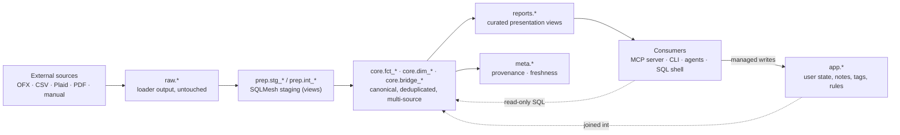

<!-- Last reviewed: 2026-07-18 -->
# Architecture

This is the one-page distillation. The full reference — invariants, layer mechanics, the writer-coordination contract — lives in [`docs/specs/architecture-shared-primitives.md`](specs/architecture-shared-primitives.md). Read that when you need depth; read this when you need the shape.

Implemented in Python 3.12 on DuckDB, SQLMesh, FastMCP, and Typer.

## What MoneyBin guarantees

Five contracts hold across every surface, every release.

- **Encrypted at rest by default.** AES-256-GCM on the DuckDB file, Argon2id KDF for passphrase mode, OS keychain integration for auto-key mode. No "demo mode" plaintext path. See [`docs/guides/database-security.md`](guides/database-security.md).
- **Every number is traceable.** Numbers in `core.*` and `reports.*` are produced by named SQLMesh models from `raw.*` source rows. `meta.fct_transaction_provenance` records the cross-source lineage; `meta.model_freshness` records model-level recency. No service snapshots derived state into a side table.
- **CLI and MCP are peer surfaces.** Every managed capability is reachable from both, through the same service layer, the same response shape (`ResponseEnvelope`), and the same redaction rules. The CLI is a first-class agent surface, not a human-only fallback. Direct SQL is deliberately different — an operator surface with a raw-row contract. See [`docs/specs/moneybin-capabilities.md`](specs/moneybin-capabilities.md) for the per-capability map.
- **PII never appears in logs.** Services log record counts, IDs, and status codes — never amounts, descriptions, or account numbers. `SanitizedLogFormatter` is an always-on safety net on every handler, not a license to be careless.
- **Schema migrations are idempotent and reversible-by-snapshot.** Versioned migrations track in `app.schema_migrations`, self-heal stuck rows when the migration body changes, and respect the `no_auto_upgrade` gate. `moneybin db backup` / `moneybin db restore` provide the recovery path for `app.*` state that isn't derivable from `raw.*`.

**Threat model in one line:** a stolen laptop or compromised synced folder must not expose financial data; an attacker with file access still faces AES-256-GCM with an Argon2id-derived or keychain-held key. See [`docs/guides/threat-model.md`](guides/threat-model.md).

## Data flow



Consumers read from `core` and `reports` only. Managed writes from MCP and CLI target `app.*` (and `raw.*` for the import family). DDL, writes to `core.*`, and writes outside the allowlist are rejected by the privacy middleware. This is the medallion / dbt-style layering pattern, with the `app.*` tier added for user-owned mutable state that isn't derivable from raw inputs.

## Schema layers

| Schema | Materialized | Owner (writes) | Consumers (reads) | Purpose |
|---|---|---|---|---|
| `raw` | Tables | Python loaders, managed-write MCP | SQLMesh staging | Untouched source data; re-importable from the original file |
| `prep` | Views | SQLMesh | SQLMesh core | Light cleaning, type casting, source-system unioning |
| `core` | Tables + views | SQLMesh | All consumers (services, MCP, CLI, reports) | Canonical, deduplicated, multi-source. One table per real-world entity at its primary grain |
| `app` | Tables | Services, managed-write MCP, migrations | Services + `core.dim_*` joins | User state and application metadata. Mutable; not derivable from `raw` |
| `reports` | Views | SQLMesh | CLI `reports *`, MCP `reports_*`, future HTTP | Curated presentation models, one per report surface. Read-only by design |
| `meta` | Tables / views | SQLMesh | Reconciliation tooling, freshness probes | Cross-source provenance and pipeline metadata |
| `seeds` | Tables | SQLMesh seeds (from CSV) | `prep`, `core`, services | Reference data shipped in-repo |
| `synthetic` | Tables | `moneybin synthetic generate` | Scenario tests | Test scenario tables; excluded from production builds |

Prefixes inside each schema describe **grain and role**: `fct_<entity>` for events, `dim_<entity>` for slowly-changing entities, `bridge_<entity>` for M:N relationships (e.g., `bridge_transfers` links a debit row to its matching credit row across accounts). The full prefix table and the layer rules (direction of flow, money convention, row-level `updated_at`) are in [`architecture-shared-primitives.md` §Data Layer](specs/architecture-shared-primitives.md#data-layer).

### Key SQL models you'll actually query

| Model | Grain | What's in it |
|---|---|---|
| `core.fct_transactions` | One row per transaction, all sources | Deduplicated transactions with `transaction_id`, `date`, signed `amount`, `currency`, `merchant_id`, `category`, `account_id`, `source_type` |
| `core.dim_accounts` | One row per account, all sources | Canonical accounts with type, institution, currency, open/close dates |
| `core.dim_merchants` | One row per merchant | Normalized merchant identity for joining and aggregation |
| `core.fct_balances_daily` | One row per (account, date) | End-of-day account balance, gap-filled |
| `core.bridge_transfers` | One row per matched transfer pair | Confirmed transfer matches between two transaction IDs |
| `reports.net_worth` | One row per (date, account) snapshot | Asset/liability rollup driving the net-worth report |
| `reports.cash_flow` | One row per (period, category) | Income and expense rollup driving the cash-flow report |

Schema is **stable but not yet frozen.** Pre-launch, breaking column changes
are still on the table. Post-launch the convention is additive: add columns,
never rename or retype in place; deprecate-then-remove across two releases.

## Surfaces

The CLI and MCP server are thin formatters around the service layer. The SQL layer carries the same contract: the `core.*` and `reports.*` models are the canonical data products, queryable via `moneybin db shell`, the `moneybin://schema` MCP resource, and the read-only SQL MCP tool.

### MCP tools by domain

The MCP server registers more than 100 tools across roughly a dozen domains. Full enumeration in [`docs/guides/mcp-server.md`](guides/mcp-server.md).

| Domain | What it does | Representative tools |
|---|---|---|
| `accounts.*` | List, inspect, and resolve accounts across sources | `accounts`, `accounts_get`, `accounts_balances` |
| `transactions.*` | Query and curate transactions; notes, tags, splits, manual entry | `transactions_get`, `transactions_review`, `transactions_create`, `transactions_notes_add`, `transactions_tags_set`, `transactions_splits_set` |
| `transactions.categorize.*` | Categorization: rules, LLM-assist, commit, auto-review | `transactions_categorize_assist`, `transactions_categorize_commit`, `transactions_categorize_run`, `transactions_categorize_rules` |
| `reports.*` | Pre-built analytical views | `reports_networth`, `reports_cashflow`, `reports_spending`, `reports_recurring`, `reports_uncategorized` |
| `refresh` | Run the matching → SQLMesh apply → categorization cascade | `refresh_run` (single umbrella) |
| `sync.*` | Pull from upstream providers (Plaid) and the inbox | `sync_pull`, `sync_link`, `import_inbox_sync` |
| `merchants.*` | Manage merchant identities | `merchants`, `merchants_create` |
| `sql` | Read-only DuckDB query against the interface set | `sql_query` |

Surface symmetry (same nouns, different verb position):

| Capability | CLI | MCP |
|---|---|---|
| List accounts | `moneybin accounts list` | `accounts` |
| Net worth report | `moneybin reports networth` | `reports_networth` |
| Refresh the pipeline | `moneybin refresh` | `refresh_run` |
| Confirm a match | `moneybin transactions matches confirm <id>` | `transactions_matches_confirm` |

Parity is functional, not nominal — same outcomes reachable on both surfaces, not 1:1 name matching. The capability map is at [`docs/specs/moneybin-capabilities.md`](specs/moneybin-capabilities.md).

### Transport and auth

MCP runs over **stdio today** — Claude Desktop, Claude Code, Cursor, Windsurf, VS Code, Gemini CLI, Codex, and the ChatGPT desktop app (which hosts Codex and shares its config) all attach this way. **ChatGPT on the web and mobile do not**: they reach MCP only through remote connectors over HTTPS, so they cannot see a local MoneyBin. A Streamable HTTP transport with authentication — tracked as M3D on the [roadmap](roadmap.md) — is what unlocks those.

Each profile is encrypted with a key held in the OS keychain (auto-key mode) or derived from a passphrase you supply (passphrase mode). `moneybin db unlock` opens the database once per session; subsequent CLI commands and MCP sessions share that unlocked state via short-lived in-process connections.

### External SQL clients

The DuckDB file is encrypted, so external clients (DBeaver, Datasette, plain `duckdb` CLI, Python/R notebooks) need the key. `moneybin db key` prints the active encryption key for the current profile; pass it as the `encryption_key` config option when opening the file. See [`docs/guides/sql-access.md`](guides/sql-access.md).

### Multi-device, multi-writer

Single-writer per profile. The encrypted DuckDB file is the unit of sync — Git, Syncthing, NextCloud, iCloud Drive all work, but concurrent writes from two machines are **not** supported. The writer-coordination contract (short-lived per-call read-only vs write connections, retry semantics, the upgrade path to an IPC gateway) is in [`docs/decisions/010-writer-coordination.md`](decisions/010-writer-coordination.md).

### Data portability

The DuckDB file is the durable artifact — open it with any DuckDB client and you have your data. A first-class `moneybin export` (CSV / Beancount / SQL dump) is planned but not yet shipped; today the read-only SQL surface plus a DuckDB `COPY ... TO` is the working path. MoneyBin is AGPL-licensed, so the code that wrote your data will always be available to read it. See [`docs/licensing.md`](licensing.md).

## Primitives you'll touch

These are the contracts a consumer (MCP user, CLI driver, SQL writer) actually encounters. Internal invariants the codebase enforces behind these are in the next section.

- **`ResponseEnvelope`** — the JSON shape returned by every MCP tool and every CLI command with `--output json`. Top-level keys: `status` (`"ok"` or `"error"`), `summary` (counts, sensitivity tier, display currency, optional period), `data` (list or dict), `actions` (next-step hints), optional `error`, optional `next_cursor`. **`Decimal` values serialize as JSON numbers** (not strings) — see [`src/moneybin/protocol/envelope.py`](../src/moneybin/protocol/envelope.py). DuckDB-side `DECIMAL(18,2)` covers personal-finance magnitudes well below the float64 precision cap. Example:

  ```json
  {
    "status": "ok",
    "summary": {
      "total_count": 2,
      "returned_count": 2,
      "has_more": false,
      "sensitivity": "medium",
      "display_currency": "USD"
    },
    "data": [
      {"transaction_id": "csv_a1b2c3d4e5f6a7b8", "date": "2026-04-12", "amount": -42.17, "merchant_id": "9f8e7d6c5b4a"},
      {"transaction_id": "csv_b2c3d4e5f6a7b8c9", "date": "2026-04-13", "amount": -18.50, "merchant_id": "9f8e7d6c5b4a"}
    ],
    "actions": ["categorize uncategorized transactions"]
  }
  ```

- **`TableRef`** — registry of schema-qualified table names with an `audience` tag (`"interface"` vs `"internal"`). Import `TableRef.FCT_TRANSACTIONS` rather than hard-coding `"core.fct_transactions"`. The `moneybin://schema` MCP resource derives from the interface set, so what you can query is what the agent sees.
- **Sensitivity tiers** (`low` / `medium` / `high`) — every MCP tool declares its tier; the middleware uses it to classify responses, redact fields, record audit metadata, and cap dispatch at 30 seconds. Consent gating is designed but not yet enforced. `low` = aggregates and counts, `medium` = row-level data with merchants and amounts, `high` = account numbers and PII-adjacent fields. Tools you call were built with the `@mcp_tool(sensitivity=...)` decorator — you don't write one, but you see the tier in every response's `summary.sensitivity`.
- **Privacy middleware** — read-only validation for the general SQL tool (DDL and writes are rejected); managed-write validation that allows `INSERT` / `UPDATE` / `DELETE` only on `app.*` and `raw.*`. See [`docs/specs/mcp-architecture.md`](specs/mcp-architecture.md).

## Internal invariants

Behind the consumer-facing surface, the codebase enforces a small set of patterns so the guarantees above can hold. You won't write against these directly, but they're how new specs avoid re-deriving the same contracts. Depth in [`architecture-shared-primitives.md`](specs/architecture-shared-primitives.md).

- **`Database`** — sole connection factory. Owns encryption, schema init, migrations, SQLMesh adapter injection.
- **`SecretStore`** — keychain-first secret retrieval with env-var fallback. The only place encryption keys and high-sensitivity credentials live.
- **Service-layer contract** — Python class in `src/moneybin/services/`, constructor takes `db: Database`, methods return typed dataclasses or Pydantic models, errors are classified `UserError` with a `code`. No `print`, no Typer, no MCP imports.
- **`SanitizedLogFormatter`** — masks SSN-shaped, account-number-shaped, and dollar-amount-shaped patterns in any log output. Always on; safety net, not first defense.
- **`Database.ingest_dataframe()`** — the ingestion primitive every loader uses. Takes a DataFrame plus a `TabularProfile`, writes `raw.*`, records an `import_log` row for re-import detection and revert.
- **`MoneyBinSettings`** — Pydantic Settings root, profile-scoped, frozen after construction. Every tunable is a typed field; `MONEYBIN_` env-var prefix with `__` for nesting.
- **Observability hooks** — `setup_observability()`, the `@tracked` decorator, the `track_duration()` context manager, `flush_metrics()` at shutdown.
- **Scenario fixture YAML** — declarative test inputs and expectations at `tests/scenarios/data/<scenario>.yaml`. Five-tier assertion taxonomy. Expectations independently derived — never observe-and-paste.

## What this doc deliberately does not cover

- **How encryption, key management, and the threat model actually work.** → [`docs/guides/database-security.md`](guides/database-security.md), [`docs/guides/threat-model.md`](guides/threat-model.md).
- **MCP design philosophy, full tool catalog, sensitivity-tier semantics.** → [`docs/specs/mcp-architecture.md`](specs/mcp-architecture.md), [`docs/specs/moneybin-mcp.md`](specs/moneybin-mcp.md), [`docs/guides/mcp-server.md`](guides/mcp-server.md).
- **CLI command tree and the cross-protocol naming rule in full.** → [`docs/specs/moneybin-cli.md`](specs/moneybin-cli.md), [`docs/guides/cli-reference.md`](guides/cli-reference.md).
- **The writer-coordination contract.** → [`docs/decisions/010-writer-coordination.md`](decisions/010-writer-coordination.md).
- **Architecture decisions and their rationale.** → [`docs/decisions/`](decisions/). ADR-000 (DuckDB), ADR-001 (medallion layers), ADR-002 (privacy tiers), ADR-009 (encryption key management), ADR-010 (writer coordination), ADR-012 (`app.*` integrity invariant).

For a single architectural change, the heuristic is: read the relevant spec; if it's a load-bearing pattern choice, also read the ADR; if you need the contract every spec inherits from, read [`architecture-shared-primitives.md`](specs/architecture-shared-primitives.md).
