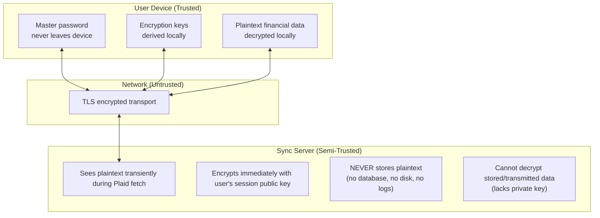

# ADR-004: End-to-End Encryption Design

## Status
proposed

## Context

The Encrypted Sync tier ([ADR-002](002-privacy-tiers.md)) requires bank data to flow from Plaid through a server to the client. The server must see plaintext briefly during Plaid fetch (see [ADR-005](005-security-tradeoffs.md)), but we want to minimize this window and ensure no plaintext is ever stored.

We need an encryption scheme that:
- Encrypts data immediately after Plaid fetch
- Allows only the client to decrypt
- Supports key rotation and multi-device sync
- Is simple enough to implement correctly

## Decision

Use **age** encryption (via `pyrage` Python bindings) with **Argon2** key derivation for file-level encryption of Parquet payloads.

### Security model

**Protected against:**
- Server compromise (data encrypted at rest)
- Network interception (TLS + E2E encryption)
- Database breach (only encrypted data stored)
- Insider threats (server operators can't read stored data)
- Subpoenas (server has no plaintext to provide)

**Not protected against:**
- Client device compromise (malware on user's machine)
- Lost/forgotten master password (no recovery possible)
- Active server compromise during Plaid processing (brief plaintext window)

### Trust boundaries



### Key management

**Master password**: User creates during account setup. Never transmitted to server. Used to derive encryption keys via Argon2.

**Key derivation** (client-side only):
```
master_password + user_account_id (salt)
  --> Argon2 (memory: 64MB, iterations: 3, parallelism: 4)
  --> 256-bit encryption key
```

**Key storage**: OS keychain (macOS Keychain, Windows Credential Manager, Linux Secret Service).

**Session keys**: Ephemeral X25519 key pairs generated per sync session. Client sends session public key in `X-Session-Public-Key` header; server encrypts response to this key.

### Encryption flow

1. Client sends sync request with OAuth token + session public key
2. Server authenticates, fetches data from Plaid
3. Server immediately encrypts Parquet payload with session public key
4. Server returns encrypted data (never stores plaintext)
5. Client decrypts with session private key (derived from master password)
6. Client saves plaintext Parquet locally (relies on OS disk encryption)

### Encryption format

File-level encryption of Parquet files (not column-level). Single decrypt operation per file. Entire payload encrypted as one unit.

```python
# Server-side
parquet_bytes = accounts_df.to_parquet()
encrypted_data = age.encrypt(parquet_bytes, recipient_public_key)

# Client-side
parquet_bytes = age.decrypt(encrypted_data, private_key)
accounts_df = pl.read_parquet(BytesIO(parquet_bytes))
```

### Key rotation

User password change triggers: derive old key, decrypt all data, derive new key, re-encrypt all data, upload to server. System keys (for Plaid access tokens) rotate on a 90-day schedule independently.

## Consequences

- Simple, auditable encryption using well-reviewed library (age).
- File-level encryption is simpler than column-level and sufficient for this use case.
- No server-side plaintext storage eliminates the largest attack surface.
- Lost master password = lost data (no recovery mechanism by design).
- Key rotation requires re-encryption of all data (acceptable for personal finance volumes).
- Performance impact: ~10-50ms per encrypt/decrypt operation.

### Implementation dependencies

- `pyrage >= 1.0.0` -- age encryption (Rust-based)
- `argon2-cffi >= 23.0.0` -- Key derivation
- `cryptography >= 42.0.0` -- Additional crypto primitives

### Decision log

| Decision | Rationale |
|----------|-----------|
| age for encryption | Modern, simple, file-focused, widely audited |
| Argon2 for KDF | Memory-hard, resistant to GPU attacks |
| File-level encryption | Simpler than column-level, sufficient for use case |
| Client-side key derivation | Server never sees master password |

## References

- [ADR-002: Privacy Tiers](002-privacy-tiers.md) -- Custody model context
- [ADR-005: Security Tradeoffs](005-security-tradeoffs.md) -- Threat model analysis
- [Plaid Integration Spec](../specs/plaid-integration.md) -- Implementation plan
- [age specification](https://age-encryption.org/v1)
- [Argon2 RFC 9106](https://datatracker.ietf.org/doc/html/rfc9106)
