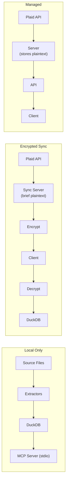

# ADR-002: Privacy Tiers (Data Custody Model)

## Status
accepted

## Context

Personal finance applications handle highly sensitive data. Users have different trust preferences ranging from "nothing leaves my machine" to "just make it work." Most financial apps offer no choice -- they store plaintext data on their servers. We need a model that defaults to hard privacy while supporting optional convenience features.

> **The app must be fully usable without the developer ever seeing a single transaction.**

## Decision

Adopt a three-tier data custody model that makes trust boundaries explicit, defensible, and user-controlled. Tiers are presented as different custody models, not "good/better/best."

### Local Only (Default)

> "Nothing leaves this machine."

- All data stored locally in DuckDB
- Manual imports only (OFX, CSV, PDF)
- Fully usable offline
- No cloud, no sync, no third-party access
- Trust boundary: your machine only

**Status**: Implemented

### Encrypted Sync (Future)

> "We store it, but we can't read it."

- E2E encrypted cloud backup and multi-device sync
- Bank sync via Plaid with immediate encryption
- Server stores only opaque ciphertext
- User holds the encryption keys
- Trust boundary: server sees plaintext briefly during Plaid fetch and encryption (see [ADR-005](005-security-tradeoffs.md))

**Status**: Proposed

### Managed (Future, Low Priority)

> "We manage the data so everything just works."

- Traditional SaaS-style experience
- Server-readable data for rich server-side analytics
- Fastest onboarding
- Trust boundary: you trust the service provider

**Status**: Future

### Architecture by tier

### Design principles

1. **Privacy is structural** -- enforced by architecture, not policy or intent.
2. **All convenience features are opt-in**, reversible, and clearly scoped.
3. **The MCP server is local** -- it runs as a local process via stdio, not a remote service.
4. **"Server" means the Encrypted Sync service only** -- a convenience layer for automatic bank feeds.
5. **Open source first** -- the platform must be fully functional without the sync service.

## Consequences

- Higher engineering complexity: three distinct deployment models.
- Slower onboarding for some users (manual file import in Local Only).
- Clear, defensible privacy guarantees at each tier.
- No dependency on surveillance-based business models.
- Feature tradeoffs at each tier: server-side analytics, merchant normalization, and population-wide insights are only available in Managed tier.

### Comparison to similar services

- **Better than** most financial SaaS (Mint, YNAB) which store plaintext indefinitely.
- **Similar to** 1Password's model, but financial data is harder (high-volume, third-party ingestion, heavy aggregation).
- **Not as good as** true zero-knowledge services (Signal) for the Encrypted Sync tier, because Plaid returns plaintext.

## Addendum: AI Data Flows (2026-04-17)

The original decision addressed **data at rest** — where financial data lives (your machine, encrypted cloud, managed cloud). It did not anticipate AI-first features that send data to external services for parsing, categorization, or analysis. Even in the Local Only tier, AI features create a new class of data movement that the original three-tier model does not cover.

[Privacy & AI Trust](../specs/privacy-and-ai-trust.md) extends this ADR with a complementary model for **data in motion**:

- **AI trust tiers** (0–3) govern when and how data flows to AI backends, with consent gates scaled to risk level
- **Data sensitivity taxonomy** classifies financial fields and defines per-field redaction rules
- **Provider profiles** document both privacy stance and capabilities for each AI backend
- **Verified-local mode** preserves the "nothing leaves this machine" guarantee when using local AI backends (e.g., Ollama on localhost)

The two models are complementary:
- **Custody tiers** (this ADR) define where data *lives*
- **AI trust tiers** ([privacy-and-ai-trust.md](../specs/privacy-and-ai-trust.md)) define how data *moves*

The Local Only tier's promise — "nothing leaves this machine" — remains intact by default. AI features that would send data externally require explicit user consent per the AI trust tier model. Users who configure a local AI backend (Ollama) maintain the full Local Only guarantee while still accessing AI-powered features.

## References

- [ADR-004: E2E Encryption](004-e2e-encryption.md) -- Encryption design for Sync tier
- [ADR-005: Security Tradeoffs](005-security-tradeoffs.md) -- Threat model analysis
- [Plaid Integration Spec](../specs/sync-plaid.md) -- Implementation plan for Encrypted Sync
- [Privacy & AI Trust](../specs/privacy-and-ai-trust.md) -- AI data flow tiers, consent model, and provider profiles
