# DuckDB Data Model - Entity Relationship Diagram

This document contains the Entity Relationship (ER) diagram for the MoneyBin DuckDB data model, showing all tables, their key fields, and relationships.

> **💡 For better rendering:** View the [interactive HTML version](duckdb-er-diagram.html) which renders the Mermaid diagram properly in any web browser.

## Entity Relationship Diagram

```mermaid
erDiagram
    %% Core Institution and Connection Tables
    institutions {
        varchar institution_id PK
        varchar institution_name
        varchar[] country_codes
        varchar[] products
        varchar[] routing_numbers
        boolean oauth
        varchar status
        varchar primary_color
        varchar logo_url
        varchar url
        timestamp created_at
        timestamp updated_at
    }

    items {
        varchar item_id PK
        varchar institution_id FK
        varchar webhook_url
        varchar error_code
        varchar error_type
        varchar[] available_products
        varchar[] billed_products
        timestamp consent_expiration_time
        varchar update_type
        timestamp created_at
        timestamp updated_at
    }

    %% Account Information
    accounts {
        varchar account_id PK
        varchar item_id FK
        varchar institution_id FK
        varchar account_name
        varchar official_name
        varchar account_type
        varchar account_subtype
        varchar mask
        varchar persistent_account_id
        decimal balance_available
        decimal balance_current
        decimal balance_limit
        varchar balance_iso_currency_code
        varchar balance_unofficial_currency_code
        timestamp balance_last_updated_datetime
        varchar verification_status
        timestamp created_at
        timestamp updated_at
        timestamp extracted_at
    }

    %% Transaction Data
    transactions {
        varchar transaction_id PK
        varchar account_id FK
        varchar pending_transaction_id
        decimal amount
        varchar iso_currency_code
        varchar unofficial_currency_code
        date date
        date authorized_date
        timestamp authorized_datetime
        timestamp datetime
        varchar name
        varchar merchant_name
        varchar original_description
        varchar account_owner
        varchar category_primary
        varchar category_detailed
        varchar category_confidence_level
        varchar payment_channel
        varchar transaction_type
        varchar transaction_code
        varchar location_address
        varchar location_city
        varchar location_region
        varchar location_postal_code
        varchar location_country
        decimal location_lat
        decimal location_lon
        varchar location_store_number
        boolean pending
        varchar personal_finance_category
        varchar personal_finance_category_confidence_level
        varchar website
        varchar logo_url
        timestamp created_at
        timestamp updated_at
        timestamp extracted_at
    }

    %% Investment Data
    securities {
        varchar security_id PK
        varchar isin
        varchar cusip
        varchar sedol
        varchar institution_security_id
        varchar institution_id FK
        varchar proxy_security_id
        varchar name
        varchar ticker_symbol
        boolean is_cash_equivalent
        varchar type
        decimal close_price
        date close_price_as_of
        varchar iso_currency_code
        varchar unofficial_currency_code
        varchar market_identifier_code
        struct option_contract
        timestamp created_at
        timestamp updated_at
        timestamp extracted_at
    }

    investment_holdings {
        varchar holding_id PK
        varchar account_id FK
        varchar security_id FK
        decimal institution_price
        date institution_price_as_of
        timestamp institution_price_datetime
        decimal institution_value
        decimal cost_basis
        decimal quantity
        varchar iso_currency_code
        varchar unofficial_currency_code
        decimal vested_quantity
        decimal vested_value
        timestamp created_at
        timestamp updated_at
        timestamp extracted_at
    }

    investment_transactions {
        varchar investment_transaction_id PK
        varchar account_id FK
        varchar security_id FK
        varchar cancel_transaction_id
        date date
        varchar name
        decimal quantity
        decimal amount
        decimal price
        decimal fees
        varchar type
        varchar subtype
        varchar iso_currency_code
        varchar unofficial_currency_code
        timestamp created_at
        timestamp updated_at
        timestamp extracted_at
    }

    %% Liability Information
    liabilities {
        varchar liability_id PK
        varchar account_id FK
        varchar liability_type
        decimal last_payment_amount
        date last_payment_date
        decimal last_statement_balance
        date last_statement_issue_date
        decimal minimum_payment_amount
        date next_payment_due_date
        decimal apr_percentage
        varchar apr_type
        decimal balance_transfer_fee
        decimal cash_advance_fee
        decimal foreign_transaction_fee
        varchar loan_name
        varchar loan_status_type
        date loan_status_end_date
        varchar payment_reference_number
        date pslf_status_estimated_eligibility_date
        varchar repayment_plan_description
        varchar repayment_plan_type
        varchar sequence_number
        varchar servicer_address_city
        varchar servicer_address_country
        varchar servicer_address_postal_code
        varchar servicer_address_region
        varchar servicer_address_street
        varchar account_number
        decimal current_late_fee
        decimal escrow_balance
        boolean has_pmi
        boolean has_prepayment_penalty
        decimal interest_rate_percentage
        varchar interest_rate_type
        varchar loan_type_description
        varchar loan_term
        date maturity_date
        decimal next_monthly_payment
        date origination_date
        decimal origination_principal_amount
        decimal past_due_amount
        varchar property_address_city
        varchar property_address_country
        varchar property_address_postal_code
        varchar property_address_region
        varchar property_address_street
        decimal ytd_interest_paid
        decimal ytd_principal_paid
        timestamp created_at
        timestamp updated_at
        timestamp extracted_at
    }

    %% Identity Information
    identity {
        varchar identity_id PK
        varchar account_id FK
        varchar[] owner_names
        varchar[] phone_numbers
        varchar[] emails
        json addresses
        timestamp created_at
        timestamp updated_at
        timestamp extracted_at
    }

    %% Historical Data
    balance_history {
        varchar balance_history_id PK
        varchar account_id FK
        decimal available_balance
        decimal current_balance
        decimal limit_balance
        varchar iso_currency_code
        varchar unofficial_currency_code
        date snapshot_date
        timestamp snapshot_time
        timestamp created_at
        timestamp extracted_at
    }

    %% Data Extraction Tracking
    extraction_jobs {
        varchar job_id PK
        varchar job_type
        varchar institution_id FK
        varchar item_id FK
        timestamp start_time
        timestamp end_time
        varchar status
        text error_message
        integer accounts_extracted
        integer transactions_extracted
        integer holdings_extracted
        integer investment_transactions_extracted
        json extraction_config
        timestamp created_at
        timestamp updated_at
    }

    data_quality_metrics {
        varchar metric_id PK
        varchar job_id FK
        varchar table_name
        integer total_records
        integer duplicate_records
        integer null_required_fields
        integer invalid_amounts
        integer future_dates
        varchar validation_status
        json validation_errors
        timestamp created_at
    }

    %% Relationships
    institutions ||--o{ items : "has"
    institutions ||--o{ accounts : "provides"
    institutions ||--o{ securities : "lists"
    institutions ||--o{ extraction_jobs : "extracts_from"

    items ||--o{ accounts : "contains"
    items ||--o{ extraction_jobs : "processes"

    accounts ||--o{ transactions : "has"
    accounts ||--o{ investment_holdings : "holds"
    accounts ||--o{ investment_transactions : "executes"
    accounts ||--o{ liabilities : "owes"
    accounts ||--o{ identity : "belongs_to"
    accounts ||--o{ balance_history : "tracks"

    securities ||--o{ investment_holdings : "held_as"
    securities ||--o{ investment_transactions : "traded_as"

    extraction_jobs ||--o{ data_quality_metrics : "measures"
```

## Table Relationships Summary

### Core Entity Hierarchy

1. **institutions** → **items** → **accounts**
   - Institutions provide Items (connections)
   - Items contain multiple Accounts

2. **accounts** → **transactions**, **investment_holdings**, **liabilities**, **identity**, **balance_history**
   - Accounts are the central entity for all financial data

3. **securities** → **investment_holdings**, **investment_transactions**
   - Securities define investment instruments
   - Holdings and transactions reference securities

### Data Lineage and Quality

4. **extraction_jobs** → **data_quality_metrics**
   - Jobs track extraction operations
   - Metrics measure data quality per job

### Key Design Features

- **Referential Integrity**: All foreign key relationships maintain data consistency
- **Audit Trail**: All tables include `created_at`, `updated_at`, and `extracted_at` timestamps
- **Flexibility**: Support for multiple currencies, account types, and transaction categories
- **Performance**: Optimized for analytical queries with appropriate indexing
- **Data Quality**: Built-in tracking and validation mechanisms

### Entity Cardinalities

- One Institution can have many Items (1:N)
- One Item can have many Accounts (1:N)
- One Account can have many Transactions (1:N)
- One Account can have many Investment Holdings (1:N)
- One Security can be held in many Holdings (1:N)
- One Account can have one Identity record (1:1)
- One Account can have many Balance History records (1:N)

This ER diagram provides a complete view of the data model structure, showing how all financial data entities relate to each other in the MoneyBin system.
