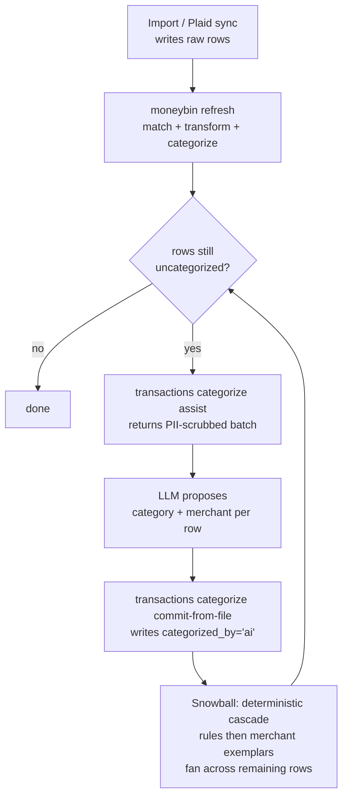

<!-- Last reviewed: 2026-05-17 -->
# Categorization

How MoneyBin categorizes transactions: deterministic rules and merchant mappings first, LLM-assist as the human helper for what's left, source precedence enforced on every write so your manual choices outrank automation. The same workflow is reachable from CLI (`moneybin transactions categorize ...`) and the bounded MCP categorization tools — pick whichever feels natural for the task.

## The model

Every transaction either has a category in `app.transaction_categories` or doesn't (reads from `core.fct_transactions` show `Uncategorized` for missing rows). A category row carries:

- `category` and optional `subcategory` (resolved against `core.dim_categories`)
- `categorized_by` — the source that wrote it
- optional `merchant_id`, `rule_id`, `confidence`

`categorized_by` is the lock. MoneyBin defines a fixed source-precedence ladder; a write only lands if the incoming source is at least as authoritative as the source already on the row:

```
user > rule > auto_rule > migration > ml > provider_native > ai
```

`provider_native` is an aggregator's own categorization — today, Plaid's Personal Finance Category, mapped to your categories through the category-source bridge and applied only when Plaid is confident. It sits just above `ai`: it clears the long tail automatically but yields to every deliberate signal (a rule, a merchant default you set, your own edit).

Enforcement happens in the SQL write path, not after the fact. A write at any source can never displace a higher-source row. The single Python ladder generates the SQL `CASE` expression that backs the `ON CONFLICT DO UPDATE WHERE` clause, so Python and SQL cannot drift.

> **⚠️ Hazard — bulk commits write `ai`-source, not `user`-source.**
>
> Both `transactions categorize commit` and `transactions categorize commit-from-file` write `categorized_by="ai"` — the **lowest** rung on the ladder. Any rule, auto-rule, ML run, Plaid update, or future LLM-assist pass that touches the same row will overwrite your commit.
>
> If you're migrating years of curated categories from another tool, **do not** push them through `commit-from-file`. A single typo in a future rule you author can silently retroactively wipe the entire batch. See [Migrating curated categories](#migrating-curated-categories) below for the honest path.

The three tables you'll touch directly:

| Table | What lives there |
|---|---|
| `app.categorization_rules` | User-authored and auto-promoted rules. Pattern + filters + target category. |
| `app.user_merchants` | Per-merchant canonical name, exemplar set, and optional default category. Surfaced as `core.dim_merchants`. |
| `app.transaction_categories` | The actual category assignment per `transaction_id`. Source-precedence enforced here. |

Categories themselves live in `core.dim_categories` (seeded defaults plus user-created entries from `app.user_categories`). Manage them through `moneybin categories ...` or the MCP `taxonomy` and `taxonomy_set` tools — outside this guide's scope.

## What runs when



A few things worth pinning down:

- **`refresh` runs the deterministic cascade.** The `moneybin refresh` CLI and `refresh_run` MCP tool both invoke the same pipeline: cross-source matching, SQLMesh transform, then rules and merchant matching. Imports and `sync pull` auto-refresh by default — you rarely call this by hand.
- **Newly created rules apply on the next refresh.** Creating a rule does not retroactively categorize old rows unless you opt in. Pass `--reapply` on the CLI `rules create`; MCP callers update the complete rule target state with `transactions_categorize_rules_set` and invoke `transactions_categorize_run` when they need an immediate run.
- **`transactions categorize assist` never writes.** It returns PII-scrubbed records — merchant text is sent, embedded account numbers are masked; an LLM (in your MCP host, or a separate pipeline you wire up) proposes categorizations; you review; then a separate commit call persists the decisions.
- **`commit`, `commit-from-file`, and the MCP `transactions_categorize_commit` tool all write `categorized_by='ai'`** — see the Hazard callout above. This is by design: the LLM is a probabilistic proposer, and `ai`-source means "anything else can override this," which is the right default for a guess.

## Surfaces

### CLI

All commands live under `moneybin transactions categorize ...`. Every read command accepts `-o/--output {text,json}` and `-q/--quiet`; JSON is the same response envelope MCP returns.

| Command | What it does |
|---|---|
| `assist` | Returns uncategorized transactions as PII-scrubbed JSON for an LLM to annotate. Does not write. |
| `export-uncategorized` | Same PII-scrubbed shape, written to a file or stdout. Convenience wrapper for pipeline use. |
| `commit` | ⚠️ Writes `categorized_by='ai'` ([see Hazard](#the-model)). Commits a JSON array of `{transaction_id, category, subcategory}` items. Accepts `--input <path>` or `-` for stdin. |
| `commit-from-file` | ⚠️ Writes `categorized_by='ai'` ([see Hazard](#the-model)). Same as `commit` but takes the path as a positional argument; tolerant of export-shape extras like `description_scrubbed`. |
| `run` | Re-runs the deterministic cascade (rules and merchants) over uncategorized rows. `--methods rules,merchants` controls the order. No LLM involvement. |
| `rules list` | Lists active rules in priority order. |
| `rules create` | Single rule: `NAME --pattern X --category Y [--match-type contains\|exact\|regex] [--priority N] [--min-amount/--max-amount] [--account-id ID]`. Batch: `--from-file rules.json`. `--reapply` re-evaluates uncategorized rows. |
| `rules delete <rule_id>` | Soft-deletes a rule (`is_active=false`). `--reapply` strips categorizations the rule wrote and re-evaluates those rows against remaining matchers. |
| `rules apply` | Runs only active rules, equivalent to `run --methods rules`. Merchant and provider-native passes are not invoked. |
| `auto review` | Lists pending auto-rule proposals with sample transactions and trigger counts. |
| `auto accept` | Batch-accept/reject proposals: `--accept <id>...`, `--reject <id>...`, `--accept-all`, `--reject-all`. Explicit rejects override `--accept-all`. |
| `auto stats` | Counts: active auto-rules, pending proposals, transactions auto-ruled. |
| `auto rules` | Lists active rules where `created_by='auto_rule'`. |
| `stats` | Coverage summary: total, categorized, uncategorized, percentage, and per-source breakdown. |
| `ml status` / `ml train` / `ml apply` | 🚧 Stubs. ML categorization (`categorized_by='ml'`) is reserved but not implemented; commands exit with a not-implemented notice today. |

### MCP

MCP uses the bounded standard surface rather than one tool for every CLI subcommand.

| Tool | Purpose |
|---|---|
| `transactions_categorize_assist` | Return PII-scrubbed candidates for a human or model to propose. |
| `transactions_categorize_commit` | Commit reviewed categorizations. It accepts `canonical_merchant_name` per item (the CLI strips this field). |
| `transactions_categorize_rules` | Inspect the current or historical categorization-rule projection. |
| `transactions_categorize_rules_set` | Set the complete reviewed rule target state. |
| `transactions_categorize_run` | Run the deterministic categorization engines. |

Every tool returns the standard response envelope (`summary`, `data`, `actions`). `summary.display_currency` carries the currency for any amount-bearing data; amounts follow the accounting convention (negative = expense, positive = income; transfers exempt).

## A typical session

1. **Import.** Drop OFX/CSV files into the inbox or run `moneybin sync pull`. Refresh runs automatically; rules and merchant exemplars from prior sessions take care of the recurring transactions.
2. **Check the gap.** `moneybin transactions categorize stats` shows coverage and the per-source breakdown. Anything left in `Uncategorized` is what assist is for.
3. **Export the PII-scrubbed batch.**
   ```bash
   moneybin transactions categorize export-uncategorized -o proposals.json
   ```
   Or stream via stdout: `moneybin transactions categorize assist --limit 100 --output json > proposals.json`.
4. **Have an LLM annotate.** Each row needs `category` and optionally `subcategory` and `canonical_merchant_name`. If you're driving from an MCP-aware client (Claude Code, Codex, etc.), the same loop runs via the `transactions_categorize_assist` tool; the LLM gets the PII-scrubbed batch in-context and you confirm before commit.
5. **Review.** Open `proposals.json`, scan the proposed mappings, fix anything wrong. This is a one-shot human review step — the LLM's pattern recognition is good, but it's still a probabilistic guess.
6. **Commit.**
   ```bash
   moneybin transactions categorize commit-from-file proposals.json
   ```
   Writes the categorizations as `ai`-source (review the Hazard above before doing this for curated historical data). For each row that proposes a merchant identity, MoneyBin accumulates an exemplar on `app.user_merchants` so the next import covers the same pattern automatically — see [Merchant exemplars](#merchant-exemplars-and-the-snowball).
7. **Snowball.** After the batch commits, the deterministic cascade runs once over remaining uncategorized rows: any rule, auto-rule, or merchant exemplar (including ones created in this batch) gets a chance to apply. Categorize one `PAYPAL INST XFER` for YouTube and every other identical PayPal-for-YouTube row picks up the category in the same session.
8. **Promote patterns to rules.** Over time MoneyBin watches your manual categorizations and proposes auto-rules (broad patterns it inferred from your edits). Review with `moneybin transactions categorize auto review` and accept the good ones with `... auto accept --accept <id>` (or `--accept-all`). Accepted proposals become active rules at `categorized_by='auto_rule'` and apply on every subsequent refresh — they also promote your data out of `ai`-source on the rows they cover.

## Migrating curated categories

If you're moving from Tiller, Beancount, hledger, Mint exports, or another tool with years of hand-curated `(transaction, category)` pairs, the goal is to land at `categorized_by='user'` — the only source that nothing else can overwrite. Today, there is **no bulk "set existing rows to user-source" path** in either CLI or MCP. The honest options are:

1. **Author rules from your historical categorizations.** This is the durable answer. For each pattern that produced your prior categorizations, write a `categorization_rules` entry. Rules write `categorized_by='rule'`, which only `user` outranks — they survive every LLM run and every refresh. Use batch mode:
   ```bash
   moneybin transactions categorize rules create --from-file rules.json --reapply
   ```
   `--reapply` immediately runs the deterministic cascade so the rules retroactively cover all matching uncategorized rows.

2. **Commit through `commit-from-file` as a stepping stone, then promote.** Acceptable if you understand the trade-off: the commit lands as `ai`-source (overwritable). Then over your next few sessions, the auto-rule proposer surfaces patterns it inferred from those categorizations; accepting them at `auto review` promotes the data to `auto_rule`-source. Anything still on `ai`-source after a few cycles is genuinely one-off — author a rule for it manually or leave it.

3. **`moneybin transactions create` for new manual entries.** New transactions you enter via `moneybin transactions create --category X` write `categorized_by='user'` at creation time. This is the only path that writes user-source today, and it applies to *new* transactions, not imported historical rows.

A unified bulk-import-as-user CLI is planned but not shipped. If you need it for a migration today, file an issue with your data shape — the existing `set_category_in_active_txn` service method already supports user-source writes, so the gap is a CLI/MCP entry point, not a database constraint.

## JSON shapes

### `proposals.json` (input to `commit-from-file`)

A top-level JSON array. Each item:

```json
[
  {
    "transaction_id": "csv_a1b2c3d4e5f60718",
    "category": "Food & Dining",
    "subcategory": "Restaurants",
    "canonical_merchant_name": "Chipotle"
  },
  {
    "transaction_id": "ofx_FITID_20250412_0042",
    "category": "Transportation"
  }
]
```

| Field | Type | Required | Notes |
|---|---|---|---|
| `transaction_id` | string (1–64) | yes | Must exist in `core.fct_transactions`. Unknown IDs surface as per-row errors; the batch continues. |
| `category` | string (1–100) | yes | Must match a row in `core.dim_categories` (active). Misspellings get "did you mean" suggestions. |
| `subcategory` | string (1–100) | no | Must pair validly with `category` in the taxonomy if present. |
| `canonical_merchant_name` | string (1–200) | no | **MCP only.** The CLI `commit` and `commit-from-file` strip this key at the boundary; only `transactions_categorize_commit` (MCP) routes it through to the exemplar accumulator. |

Export rows from `export-uncategorized` carry additional keys (`description_scrubbed`, `memo_scrubbed`, `transaction_type`, `is_transfer`, etc.) for the LLM to read. The CLI `commit-from-file` silently drops keys outside `{transaction_id, category, subcategory}` at the boundary, so you can pipe the export → annotated payload back through unchanged.

### `rules.json` (input to `rules create --from-file`)

A top-level JSON array. Each item:

```json
[
  {
    "name": "Whole Foods groceries",
    "merchant_pattern": "WHOLE FOODS",
    "match_type": "contains",
    "category": "Food & Dining",
    "subcategory": "Groceries",
    "priority": 100
  },
  {
    "name": "Costco refunds only",
    "merchant_pattern": "COSTCO",
    "match_type": "contains",
    "category": "Refunds",
    "min_amount": 0.01,
    "account_id": "acct_chase_visa",
    "priority": 50
  }
]
```

| Field | Type | Required | Notes |
|---|---|---|---|
| `name` | string (1–200) | yes | Human-readable label; not part of the dedup key. |
| `merchant_pattern` | string (1–500) | yes | Pattern to match against the normalized `match_text`. |
| `category` | string (1–100) | yes | Target category. |
| `subcategory` | string (1–100) | no | Target subcategory. |
| `match_type` | `"exact"` / `"contains"` / `"regex"` | no (default `contains`) | Match strategy. |
| `priority` | int (0–10000) | no (default 100) | Lower runs first. |
| `min_amount`, `max_amount` | float | no | Absolute-value bounds on signed amount. |
| `account_id` | string (1–64) | no | Pin the rule to one account. |

## Idempotency and re-runs

- **`commit-from-file` re-runs.** Re-running the same `proposals.json` is safe: each row attempts a write at `ai`-priority. The first run lands; the second run finds an existing row already at `ai`-priority and the SQL precedence guard (`<=`) lets it overwrite with identical values — no new exemplars accrue because the merchant accumulator only creates a new merchant or appends a new exemplar when the row's `match_text` isn't already covered (`list_distinct(list_append(...))`). Net effect: idempotent.
- **Re-running after a higher-source write has happened.** If a rule or `user` write covered a row between two `commit-from-file` runs, the second `ai` write is rejected and surfaces as a per-row `lower_priority_source` skip — no overwrite, no error. See [Error taxonomy](#error-taxonomy).
- **`rules create` dedup.** Active rules are deduped by `(merchant_pattern, match_type, min_amount, max_amount, account_id, category, subcategory)`; `name` and `priority` are metadata. Retrying the same payload returns the existing `rule_id` and creates no new rows. The result envelope reports `created`, `existing`, and `skipped` separately.
- **`run` / `rules apply` re-invocation.** `run` executes its selected deterministic engines; `rules apply` executes only rules. Both are idempotent against a stable database: a second run with no new uncategorized rows writes nothing.

## Error taxonomy

`commit-from-file` returns partial-success — bad rows don't abort the batch. The response envelope's `data.error_details` is a list of per-row failures with `transaction_id`, `reason`, and an `error` code:

| `error` code | Meaning |
|---|---|
| (parse error) | The row was malformed JSON or failed Pydantic validation (missing `transaction_id`, `category` too long, unknown extra keys, etc.). Surfaced first in `error_details`. |
| `invalid_category` | `category` not in the active `core.dim_categories`. The error carries `did_you_mean` suggestions and the full `valid_categories` list. |
| `lower_priority_source` | A higher-precedence source already covers this row. The write was rejected; the existing categorization stands. This is not a failure — it's the precedence guard doing its job. |
| (unhandled) | DuckDB raised an untyped error during the write (FK violation, constraint failure). Logged; the row is counted as an error. |

Counts: `applied` (writes that landed) + `skipped` (precedence-blocked) + `errors` (parse/validation/runtime) sum to the input row count. Exit code is `1` if any row landed in `errors` or `skipped`; `0` only when every row applied.

## Rules in depth

A rule has:

- `name` — human-readable label, displayed in `rules list`
- `merchant_pattern` — the text to match against `match_text` (description + memo, both normalized)
- `match_type` — `exact`, `contains`, or `regex` (defaults to `contains`)
- `category` and optional `subcategory` — the target assignment
- `priority` — lower runs first (default `100`)
- optional filters: `min_amount`, `max_amount`, `account_id`

**Match input.** The matcher concatenates the normalized description and memo into a single `match_text` (`description + "\n" + memo`) and tries patterns against the concatenation. Anchored patterns (`exact` and anchored `regex`) also get a per-field fallback against the normalized description and memo individually, so patterns that can't span the boundary still hit the original field. The amount filter applies to the absolute signed value; the account filter pins the rule to one `account_id`.

**Normalization** (applied to both `match_text` and the `merchant_pattern` side-effect-free before matching):

1. Strip POS prefixes (`SQ *`, `TST*`, `PP*`, etc.)
2. Strip trailing location info (city / state / ZIP)
3. Strip trailing store IDs / reference numbers
4. Collapse multiple spaces, trim

Casing is preserved (matching is case-sensitive against the normalized form). If you want case-insensitive matching, use `regex` with `(?i)`.

**Worked example — regex with case-insensitive flag:**

```bash
moneybin transactions categorize rules create "Spotify subscription" \
  --pattern "(?i)^spotify( |$)" \
  --match-type regex \
  --category "Entertainment" \
  --subcategory "Streaming"
```

**Match outcome.** The first rule that matches in priority order wins. Tie-break for equal `priority` is `created_at ASC` — older rules win ties. Rules write `categorized_by='rule'` (or `auto_rule` for system-promoted rules); the source-precedence guard means a rule write can replace `auto_rule`, `migration`, `ml`, `plaid`, and `ai` writes, but never a `user` edit.

**Soft delete.** `rules delete` sets `is_active=false`; the row stays in the table. `--reapply` additionally strips categorizations the rule wrote (`categorized_by IN ('rule', 'auto_rule')` with this `rule_id`) and re-runs the deterministic cascade so the affected rows fall back to other matchers. Higher-precedence writes (`user`, `migration`, etc.) that happen to reference this `rule_id` are left intact.

## Merchant exemplars and the snowball

When the MCP `transactions_categorize_commit` tool processes a row with `canonical_merchant_name='Google YouTube'`, MoneyBin creates a merchant in `app.user_merchants` with that name and stores the row's exact normalized `match_text` as a `oneOf` exemplar. Subsequent rows whose `match_text` equals one of that merchant's exemplars match immediately — set membership, no pattern needed. (The CLI `commit` and `commit-from-file` strip `canonical_merchant_name` at the boundary today, so this auto-merchant path is MCP-only. Future work tracked as a follow-up.)

The snowball is the cumulative effect: each session creates merchants and accumulates exemplars; the post-commit deterministic cascade applies them to remaining uncategorized rows in the same batch; the next import gets categorized at refresh time before you ever see it. By the third or fourth import, the LLM is meaningfully less involved.

Two design choices that matter:

1. **Exact exemplars, not inferred patterns.** Categorizing one `PAYPAL INST XFER` row for YouTube does not category-stamp every other PayPal row — only rows whose normalized `match_text` matches one of the exemplars. If you want a broad pattern like "everything containing COSTCO is Groceries," author it as a rule explicitly. Rules are a user choice; exemplars are evidence.
2. **Multiple rows under one canonical name merge.** When several rows in the same batch share a `canonical_merchant_name`, they accumulate exemplars on the same merchant rather than spawning per-row merchants.

**Inspecting and pruning.** `moneybin transactions categorize auto stats` reports active auto-rule and exemplar counts. There is no first-class "list exemplars" or "remove this exemplar from a merchant" CLI today — to surgically remove a bad exemplar you either edit `app.user_merchants` directly via `moneybin db query` (advanced) or hard-delete the merchant and re-categorize the affected rows. Merchant-specific MCP curation is not currently admitted to the standard registry.

## LLM-assist in depth

`transactions_categorize_assist` (and the matching CLI command) returns a `RedactedTransaction` per uncategorized row. The shape is frozen:

- `transaction_id`
- `description_scrubbed`, `memo_scrubbed` — merchant text preserved and sent in full (it's the categorization signal); both passed through `redact_for_llm()` which strips card last-fours, emails, phones, P2P recipient names, and other embedded-PII patterns
- `source_type` — `csv`, `ofx`, `plaid`, etc.
- `transaction_type` — `DEBIT` / `CREDIT` / `CHECK` / `XFER` / `ATM` / ...
- `check_number` — for handwritten checks
- `is_transfer`, `transfer_pair_id` — flagged by the transfer-detection subsystem
- `payment_channel` — `online` / `in_store` / `other` (Plaid-only today)
- `amount_sign` — `+`, `-`, or `0` (no magnitude, no currency)

What's not in the payload: full amount, date, account identifier. Adding any new field requires modifying the frozen dataclass, which means a code review on the privacy contract.

MoneyBin does not call an LLM provider itself. The CLI/MCP tool produces the PII-scrubbed batch; the LLM in your MCP host (or a pipeline you build around the CLI export) does the proposing. That keeps the provider, the model, and the prompt entirely under your control. `categorization.assist_default_batch_size` (default 100) and `assist_max_batch_size` (default 200, hard cap) are the only knobs the service exposes; both live under `MoneyBinSettings.categorization`.

## Privacy posture

What crosses to the LLM on `assist`:

- PII-scrubbed description and memo (merchant text preserved; embedded account numbers masked)
- Structural fields: type, check number, transfer flags, channel, sign
- `source_type` and `transaction_id`

What does not:

- The full amount, the transaction date, the account ID
- Anything matched by the PII redactor (card numbers, emails, phones, P2P recipients)

What lands in the audit log: every `assist` call records `tool`, `sensitivity=medium`, `txn_count`, and `account_filter`. The scrubbed content is not logged — the audit confirms a session occurred, not what was discussed.

See [`docs/guides/threat-model.md`](threat-model.md) for the broader threat model and [`docs/specs/privacy-data-protection.md`](../specs/privacy-data-protection.md) for the redaction spec.

## Audit and undo

There is no `categorize revert` command today. To investigate or undo a batch:

- **Find the batch.** `moneybin db query "SELECT * FROM app.audit_log WHERE action LIKE 'category.%' ORDER BY recorded_at DESC LIMIT 50"` lists recent per-row edits. Bulk paths (`commit-from-file`, `run`, rule reapply) are deliberately audit-silent today — broader coverage is tracked under the app-integrity invariant 9 work.
- **Undo a single user edit.** The audit row carries `before` and `after` JSON; rewrite the row by hand via the MCP `transactions_categorize_commit` path or by direct SQL.
- **Undo a rule batch.** `moneybin transactions categorize rules delete <rule_id> --reapply` strips every row the rule wrote and re-evaluates against remaining matchers — the cleanest path for "I committed a bad rule."
- **Undo a `commit-from-file` batch.** No first-class path. The pragmatic approach: identify the affected `transaction_id`s from your input file, then either author a higher-priority rule that corrects them, or use `moneybin db query` to `DELETE FROM app.transaction_categories WHERE transaction_id IN (...)` and let the next refresh re-evaluate. Audit-based revert tooling is planned.

## What's planned, not shipped

- **ML-based categorization.** The `ml` source slot exists in the precedence ladder and the `transactions categorize ml {status,train,apply}` commands are registered, but they're stubs today — invoking any of them returns a not-implemented notice. A local model would slot in between `migration` and `plaid` in the precedence ladder.
- **Bulk-import-as-user CLI.** See [Migrating curated categories](#migrating-curated-categories). The service method exists; the CLI/MCP entry point doesn't.
- **CLI parity for `canonical_merchant_name`.** The CLI `commit` and `commit-from-file` strip the key today; only the MCP `transactions_categorize_commit` tool routes it through to the exemplar accumulator.
- **Merchant exemplar inspection / pruning.** Merchant-specific curation (list, remove exemplar, hard-delete) is planned; it is not a current MCP tool.
- **Audit-based revert.** No `categorize revert` or `commit-from-file --undo`; bulk paths are also audit-silent, so an "undo last batch" tool would need both audit coverage and a revert primitive.
- **Category-rename cascades** beyond the FK-resolved view path. Renaming a category surfaces immediately on read because `core.dim_categories` resolves through the FK, but the text snapshots on writer tables aren't rewritten yet.
- **Cross-row pattern conditions.** Rules today match per-row. Rules that consider sequences (e.g., "this transaction is a refund of an earlier one") would need a new condition primitive.
- **Rule-conflict detection.** Idempotency dedupes the exact same matcher; rules with the same matcher but a *different* category still create a new row. Detecting and surfacing the conflict at create-time is tracked as follow-up work.

## Related

- [`docs/guides/data-import.md`](data-import.md) — where imports + refresh fit together
- [`docs/guides/cli-reference.md`](cli-reference.md) — full CLI command list
- [`docs/guides/mcp-server.md`](mcp-server.md) — the MCP tool surface
- [`docs/architecture.md`](../architecture.md) — primitives this guide builds on (`TableRef`, source-precedence, response envelope)
