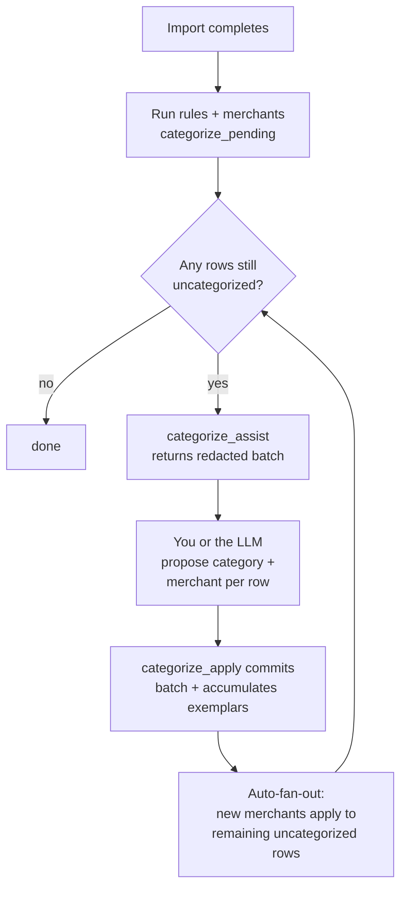

# Categorization

When you import transactions, MoneyBin categorizes them through a deterministic pipeline first — rules, then merchants — and only falls back to LLM-assist for what's left. Manual edits always win. Every new merchant or exemplar you (or the LLM) add fans out to remaining uncategorized rows automatically, so the workload shrinks with every batch.

## The pipeline



The fan-out step (G) is the "snowball." Categorize one PayPal-for-YouTube transaction and every other PayPal-for-YouTube row in the dataset picks up the category in the same session — no second `categorize_assist` round needed.

## What the matcher sees

For every transaction, MoneyBin builds a single `match_text` from two fields:

```
match_text = description + "\n" + memo
```

That's how aggregator transactions get categorized correctly. The bank-supplied `description` for a PayPal subscription might just be `PAYPAL INST XFER`; the actual merchant identity (`GOOGLE YOUTUBE`) lives in `memo`. Both fields are normalized (uppercased, noise stripped) before matching, so rules and exemplars compare cleanly.

Structural fields are matcher signals and LLM-assist signals too:

- `transaction_type` — `DEBIT` / `CREDIT` / `CHECK` / `XFER` / `ATM` / ...
- `check_number` — useful for handwritten checks
- `is_transfer` and `transfer_pair_id` — flagged by the transfer-detection subsystem
- `payment_channel` — Plaid-only today (`online` / `in_store` / `other`)
- `amount_sign` — `+` or `-` (no magnitude leaked to the LLM)

The full numeric `amount` is available to the matcher but never sent to the LLM.

## Source priority — who wins on conflict

Every categorization is tagged with a source. Higher in the list wins:

1. `user` — manual categorization in the CLI/MCP
2. `rule` — user-authored rule
3. `auto_rule` — system-generated rule (promoted from a proposal you approved)
4. `migration` — imported from another tool (Mint, YNAB, etc.)
5. `ml` — local ML prediction
6. `plaid` — Plaid-supplied category
7. `seed` — shipped seed merchant
8. `ai` — LLM-assist

**User edits are immune to automated overwrites.** A category you set manually is never overwritten by any subsequent rule, merchant mapping, or LLM-assist run. The lock is the `categorized_by` column on `app.transaction_categories` — enforcement happens at the SQL write, not after the fact.

## The snowball

The first categorization session in a dataset is the most work. Each subsequent session sees fewer uncategorized rows, because:

1. When you categorize a row with `canonical_merchant_name='Google YouTube'`, MoneyBin creates a merchant with that name and stores the row's exact normalized `match_text` as a `oneOf` exemplar.
2. The auto-fan-out fires immediately. Every still-uncategorized row whose `match_text` matches one of that merchant's exemplars picks up the category in the same commit.
3. Next time the same pattern shows up, it's already categorized at import time.

The matcher accumulates **exact exemplars** rather than inventing a `contains` pattern from one row's description. That's why categorizing one `PAYPAL INST XFER` row for YouTube doesn't accidentally category-stamp every other PayPal transaction in the dataset — only rows with the same memo identity match.

If you want a broader pattern (e.g., "everything that contains COSTCO is Groceries"), author a rule explicitly. That's a deliberate user action, not something the system infers from one example.

## Reapplying after edits

When you edit a merchant or rule, the change does not retroactively re-run against already-categorized rows by default. To opt in, pass `reapply: true` on the edit operation — MoneyBin re-runs `categorize_pending()` scoped to that one entity's match set after the write. Already-locked rows (higher-priority sources) are skipped per the source-priority ladder.

## Privacy

LLM-assist runs against a redacted view of the transaction. The redactor strips card last-fours, emails, phones, P2P recipient names, and other PII patterns from `description` AND `memo`. Amounts, dates, account references, and full currency are never sent. Structural fields are sent in raw form because they're enums, booleans, opaque pair IDs, or a single sign character — no PII surface.

Every `categorize_assist` call is audit-logged with `txn_count`, `account_filter`, and timestamp. The actual contents (descriptions, LLM response, transaction IDs) are not in the audit log — only that a session occurred.

## Rule Engine

Categorization rules match transactions by description pattern and optional filters. Rules are applied in priority order during import and when you run `categorize apply-rules`.

### Match Types

| Type | Behavior | Example |
|------|----------|---------|
| `exact` | Full string match | "NETFLIX.COM" matches only "NETFLIX.COM" |
| `contains` | Substring match (default) | "STARBUCKS" matches "STARBUCKS #1234 SEATTLE WA" |
| `regex` | Regular expression | `UBER\s*(EATS\|TRIP)` matches Uber Eats and Uber Trip |

### Rule Filters

Rules can be further scoped with:
- **Amount range** (`min_amount`, `max_amount`) — only match transactions within a dollar range
- **Account filter** (`account_id`) — only match transactions from a specific account
- **Priority** — lower numbers take precedence (priority 50 beats priority 100)

### CLI Commands

```bash
# Apply all active rules to uncategorized transactions
moneybin transactions categorize rules apply

# List all active rules
moneybin transactions categorize rules list

# View categorization coverage statistics
moneybin transactions categorize stats
```

## Merchant Normalization

Merchant mappings clean up messy bank descriptions and associate merchants with default categories. When you categorize a transaction (via CLI or MCP), a merchant mapping is automatically created so future transactions with similar descriptions are categorized without manual intervention.

**Examples:**

| Raw description | Canonical name | Default category |
|----------------|---------------|-----------------|
| `SQ *STARBUCKS #1234 SEATTLE WA` | Starbucks | Food & Drink > Coffee Shops |
| `AMZN MKTP US*2K4F91R03` | Amazon | Shopping > Online |
| `UBER *EATS 3X7F2` | Uber Eats | Food & Drink > Delivery |
| `WHOLEFDS MKT 10142` | Whole Foods | Food & Drink > Groceries |

Each merchant mapping specifies:
- **Raw pattern** — what to match in transaction descriptions
- **Canonical name** — clean display name
- **Match type** — exact, contains, or regex
- **Default category/subcategory** — auto-assigned to matching transactions

## Bulk Operations

All categorization operations support batch mode for efficient processing. These are designed for AI assistants that review and categorize many transactions in a single interaction turn.

**Via MCP tools** (all batch-capable — single or many records per call):
- `transactions_categorize_apply` — categorize one or many transactions (auto-creates merchant mappings)
- `transactions_categorize_rules_create` — create one or many categorization rules
- `merchants_create` — create one or many merchant mappings
- `transactions_categorize_rule_delete` — remove a rule

**Via CLI** — the categorize-apply tool has a CLI equivalent that accepts the same JSON shape from a file or stdin:

```bash
moneybin transactions categorize apply --input cats.json
cat cats.json | moneybin transactions categorize apply -
```

Both surfaces share the same response envelope; pass `--output json` to get the structured result.

## Category Taxonomy

MoneyBin ships with the Plaid Personal Finance Category v2 (PFCv2) taxonomy — approximately 100 default categories organized into top-level categories and subcategories. Defaults are seeded automatically by `moneybin db init` and refreshed by `moneybin transform apply`. Run `moneybin transform seed` if you need to re-materialize them on demand.

**Top-level categories include:** Food & Drink, Shopping, Travel, Transportation, Entertainment, Bills & Utilities, Health & Fitness, Personal Care, Education, Income, Transfer, and more.

You can also:
- **Create custom categories** via the `categories_create` MCP tool
- **Toggle categories on/off** — disabled categories are hidden from the taxonomy but existing categorizations are preserved

## Auto-Rules

MoneyBin learns categorization patterns from how you (or your AI assistant) categorize transactions and proposes rules you can approve. Once approved, those rules categorize future transactions automatically — and roll themselves back if you start correcting their output.

### How learning works

Every time `transactions_categorize_apply` writes a categorization (CLI, MCP, or AI agent), MoneyBin records the `(pattern, category)` pair. After enough independent transactions categorize the same way, the proposal moves from `tracking` to `pending` and shows up in `auto-review`. You decide whether to promote it to a real rule.

| Term | Meaning |
|---|---|
| Proposal | A `(pattern, category)` pair MoneyBin is considering. Lives in `app.proposed_rules`. |
| `tracking` | Below proposal threshold. Not shown in `auto-review`. |
| `pending` | Reached threshold; waiting for your approve/reject. |
| `approved` | Promoted to an active rule (`categorization_rules.created_by='auto_rule'`). |
| Override | A user/AI categorization that disagrees with what the auto-rule would assign. |

### CLI Commands

```bash
# List pending auto-rule proposals (table or JSON)
moneybin transactions categorize auto review
moneybin transactions categorize auto review --output json

# Approve / reject specific proposals
moneybin transactions categorize auto confirm --approve abc123 --approve def456
moneybin transactions categorize auto confirm --reject abc123

# Approve all pending — except the ones you reject explicitly
moneybin transactions categorize auto confirm --approve-all --reject abc123

# Reject everything pending
moneybin transactions categorize auto confirm --reject-all

# List active auto-rules
moneybin transactions categorize auto rules

# Show health: active auto-rules, pending proposals, transactions auto-ruled
moneybin transactions categorize auto stats
```

### Tunables

These live under `categorization.*` in your profile config (see [profiles guide](profiles.md)):

| Setting | Default | What it does |
|---|---|---|
| `auto_rule_proposal_threshold` | 3 | Distinct transactions needed before a proposal becomes `pending` |
| `auto_rule_override_threshold` | 3 | User corrections needed before an active rule is deactivated |
| `auto_rule_default_priority` | 200 | Priority of new auto-rules (lower number wins; user rules typically use 50–100) |
| `auto_rule_sample_txn_cap` | 5 | Sample transaction IDs shown in `auto-review` per proposal |
| `auto_rule_backfill_scan_cap` | 50,000 | Max uncategorized transactions scanned when an approval back-fills history |

The constraint `proposal_threshold <= override_threshold` is enforced at config load — if proposal were higher, an override-driven re-proposal could land in `tracking` and never resurface.

### Self-healing: override-driven deactivation

If you approve an auto-rule and then start correcting its output (assigning a different category to transactions it would have caught), MoneyBin counts those as overrides. Once override count reaches `auto_rule_override_threshold`:

1. The rule is deactivated (`is_active=false`).
2. Its source proposal is marked `superseded`.
3. A new proposal is created with the **most common** category among your corrections — already promoted to `pending` if you've corrected at least `auto_rule_proposal_threshold` transactions to that category.
4. An audit row is written to `app.rule_deactivations` with the override count and the new category.

You'll see the new proposal in `auto-review`. Approve it to install the corrected rule. There's no manual cleanup step.

### What patterns get proposed

The proposal pattern comes from the merchant resolution that already happens during categorization:

- **If the transaction matched an existing merchant** — the merchant's `raw_pattern` and `match_type` are used (e.g., `AMZN` / `exact`). This is the precise substring that matches statement descriptions, not the canonical display name.
- **If no merchant matched** — the cleaned-up description with `match_type='contains'` is used as a fallback.

A proposal is suppressed when an active rule or merchant mapping already produces the same category for the transaction, so you don't see redundant proposals for patterns already covered.

## Typical Workflow

1. **Import data** — `moneybin import file transactions.csv` (defaults are already seeded by `db init`). Rules + merchants run automatically; uncategorized rows are surfaced in the summary.
2. **Review uncategorized** — ask your AI assistant: *"Help me categorize my uncategorized transactions."* The assistant calls `transactions_categorize_assist`, proposes categories + merchant names, and commits via `transactions_categorize_apply`. Auto-fan-out kicks in after the commit, so duplicate patterns in the same dataset get categorized in the same session.
3. **Review auto-rule proposals** — `moneybin transactions categorize auto review`, then approve the ones that look right. Promoted auto-rules apply immediately to remaining uncategorized rows.
4. **Subsequent imports** — exemplars, merchants, and rules from prior sessions catch most transactions at import time. LLM-assist handles the long tail.

Over time, the rule engine, merchant mappings (with their exemplar sets), and auto-rules handle most categorization automatically. Each import requires less manual work.

## See also

- [Categorization matching mechanics spec](../specs/categorization-matching-mechanics.md) — algorithm contract: `match_text` construction, exemplar accumulation, source-precedence enforcement, snowball auto-apply, OP_SCORES specificity ranking.
- [Categorization overview spec](../specs/categorization-overview.md) — umbrella spec: priority hierarchy, deterministic pipeline, pillars.
- [Cold-start spec](../specs/categorization-cold-start.md) — LLM-assist workflow, redaction contract, seed merchants.

For the architecture and lifecycle internals (state diagrams, sequence diagrams, atomicity guarantees), see [auto-rule pipeline tech brief](../tech/auto-rule-pipeline.md).
