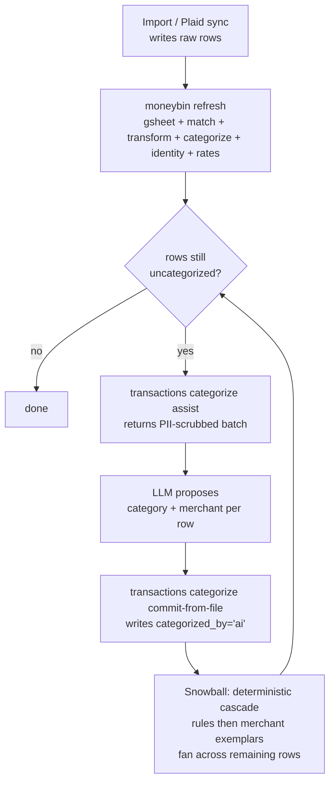

<!-- Last reviewed: 2026-09-23 -->
# Categorization

How MoneyBin categorizes transactions: deterministic rules and merchant mappings first, LLM-assist as the human helper for what's left, source precedence enforced on every write so your manual choices outrank automation. The same workflow is reachable from CLI (`moneybin transactions categorize ...`) and the bounded MCP categorization tools. Both call the same services; the CLI's `--output json` returns the same response envelope MCP returns.

## The model

Every transaction either has a category in `app.transaction_categories` or doesn't (reads from `core.fct_transactions` show `Uncategorized` for missing rows). A category row carries:

- `category` and optional `subcategory` (resolved against `core.dim_categories`)
- `categorized_by` — the source that wrote it
- optional `merchant_id`, `rule_id`, `confidence`

`categorized_by` is the lock. MoneyBin defines a fixed source-precedence ladder; a write only lands if the incoming source is at least as authoritative as the source already on the row:

```
user > rule > auto_rule > migration > ml > provider_native > ai
```

`provider_native` is an aggregator's own categorization — today, Plaid's Personal Finance Category, mapped to your categories through the category-source bridge and applied only when Plaid is confident. It sits just above `ai`: it clears the long tail automatically but yields to every deliberate signal (a rule, a merchant default you set, your own edit).

Enforcement happens in the SQL write path, not after the fact. A write at any source can never displace a higher-source row. The single Python ladder generates the SQL `CASE` expression that backs the `ON CONFLICT DO UPDATE WHERE` clause, so Python and SQL cannot drift.

**Bulk commits write `ai`-source, not `user`-source.** `transactions categorize commit` and `transactions categorize commit-from-file` both write `categorized_by="ai"` — rung 7 of 7, the lowest. Any rule, auto-rule, ML run, Plaid update, or later LLM-assist pass that touches the same row overwrites the commit. Do not push years of curated categories from another tool through `commit-from-file`: one typo in a rule you author later re-categorizes the whole batch. Author rules instead — see [Migrating curated categories](#migrating-curated-categories).

The three tables you'll touch directly:

| Table | What lives there |
|---|---|
| `app.categorization_rules` | User-authored and auto-promoted rules. Pattern + filters + target category. |
| `app.user_merchants` | Per-merchant canonical name, exemplar set, and optional default category. Surfaced as `core.dim_merchants`. |
| `app.transaction_categories` | The actual category assignment per `transaction_id`. Source-precedence enforced here. |

Categories themselves live in `core.dim_categories` (seeded defaults plus user-created entries from `app.user_categories`). Manage them through `moneybin categories ...` or the MCP `taxonomy` and `taxonomy_set` tools — outside this guide's scope.

## What runs when


```mermaid
flowchart TD
    A[Import / Plaid sync<br/>writes raw rows] --> B[moneybin refresh<br/>gsheet + match + transform + categorize + identity + rates]
    B --> C{rows still<br/>uncategorized?}
    C -->|no| END[done]
    C -->|yes| D[transactions categorize assist<br/>returns PII-scrubbed batch]
    D --> E[LLM proposes<br/>category + merchant per row]
    E --> F[transactions categorize commit-from-file<br/>writes categorized_by='ai']
    F --> G[Snowball: deterministic cascade<br/>rules then merchant exemplars<br/>fan across remaining rows]
    G --> C
```

Four points about the diagram above:

- **`refresh` runs the deterministic cascade.** The `moneybin refresh` CLI and `refresh_run` MCP tool both invoke the same canonical pipeline: gsheet pull, cross-source matching, SQLMesh transform, categorization, identity backfill, then exchange-rate gather. Imports and `sync pull` auto-refresh by default — you rarely call this by hand.
- **Newly created rules apply on the next refresh.** Creating a rule does not retroactively categorize old rows unless you opt in. Pass `--reapply` on the CLI `rules create`; MCP callers update the complete rule target state with `transactions_categorize_rules_set` and invoke `transactions_categorize_run` when they need an immediate run.
- **`transactions categorize assist` never writes.** It returns PII-scrubbed records — merchant text is kept as the categorization signal, scrubbed of embedded PII (card and account numbers, emails, phone numbers, dates, city/state); an LLM (in your MCP host, or a separate pipeline you wire up) proposes categorizations; you review; then a separate commit call persists the decisions.
- **`commit`, `commit-from-file`, and the MCP `transactions_categorize_commit` tool all write `categorized_by='ai'`** — see the `ai`-source note in [The model](#the-model) above. This is by design: the LLM is a probabilistic proposer, and `ai`-source means "anything else can override this," which is the right default for a guess.

## Surfaces

### CLI

All commands live under `moneybin transactions categorize ...`. Every read command accepts `-o/--output {text,json}` and `-q/--quiet`; JSON is the same response envelope MCP returns.

Every command, flag, and default is generated from the code in
[`docs/reference/cli/transactions.md`](../reference/cli/transactions.md) under
`moneybin transactions categorize`; the category taxonomy itself is in
[`docs/reference/cli/categories.md`](../reference/cli/categories.md) and the
unified queue in [`docs/reference/cli/review.md`](../reference/cli/review.md).
What `--help` cannot tell you:

- `commit` and `commit-from-file` write `categorized_by='ai'` — rung 7 of 7. Read the `ai`-source note in [The model](#the-model) before committing curated history.
- `rules apply` is `run --methods rules`. It skips the merchant and provider-native passes.
- `improve-ai` re-looks-up every `categorized_by='ai'` row against the Plaid category bridge and upgrades it to `provider_native` where the bridge match is MEDIUM confidence or higher. It never touches `user`, `rule`, or `auto_rule` rows.
- `rules create` refuses a `contains` pattern shorter than 4 characters unless you pass `--allow-broad`, and refuses a matcher an active rule already owns under a different category — see [Auto-rule safety guards](#auto-rule-safety-guards) and [Rule conflicts](#rule-conflicts).
- `ml status`, `ml train`, and `ml apply` are registered but hidden from `--help`; each prints a not-implemented notice and exits 0.

### MCP

MCP uses the bounded standard surface rather than one tool for every CLI subcommand.

| Tool | Purpose |
|---|---|
| `transactions_categorize_assist` | Return PII-scrubbed candidates for a human or model to propose. |
| `transactions_categorize_commit` | Commit reviewed categorizations, including an optional `canonical_merchant_name` per item. |
| `transactions_categorize_rules` | Inspect the current or historical categorization-rule projection. |
| `transactions_categorize_rules_set` | Set the complete reviewed rule target state. |
| `transactions_categorize_run` | `operation="categorize"` (default) runs the deterministic engines (`methods=["rules","merchants"]`). `operation="improve_ai"` runs the `improve-ai` upgrade pass instead (forbids `methods`). |
| `system_status` | Return categorization coverage and queue counts with `sections=["categorization"]`. |
| `reviews` | Read the pending categorization, auto-rule, or rule-conflict queue with `kind="categorization"`, `kind="auto_rules"`, or `kind="rule_conflicts"`. |
| `reviews_decide` | Accept or reject reviewed categorization proposals or auto-rule proposals in one `decisions` batch. `kind="auto_rule"` decisions may set a per-decision `allow_broad` field — see [Auto-rule safety guards](#auto-rule-safety-guards). `kind="rule_conflict"` decisions take `replace`, `reprioritize` (with `priority`), or `cancel` — see [Rule conflicts](#rule-conflicts). |
| `taxonomy` / `taxonomy_set` | Read or declare category and merchant target state with `view="categories"` or `view="merchants"`. |

Every tool returns the standard response envelope (`summary`, `data`, `actions`). `summary.display_currency` carries the currency for any amount-bearing data; amounts follow the accounting convention (negative = expense, positive = income; transfers exempt).

For rule lifecycle writes, use one discriminated `rules` batch. Create or update
with `{"kind": "rule", "state": "present", "rule_id": ..., "matcher":
{"type": "contains", "value": "..."}, "category": "...", "priority": 200}`;
omit `rule_id` for a new rule. Disable with `{"kind": "rule", "state":
"inactive", "rule_id": ...}` and remove with `{"kind": "rule", "state":
"absent", "rule_id": ...}`. Read the relevant projection first through
`transactions_categorize_rules(view="active")`,
`transactions_categorize_rules(view="inactive")`, or
`transactions_categorize_rules(view="history")`.

Taxonomy writes follow the same target-state discipline: `taxonomy_set` accepts
category items with `kind="category"` and `state="present" | "inactive" |
"absent"`, and merchant items with `kind="merchant"` and `state="present" |
"absent"`. Transaction notes, tags, splits, and tag renames share
`transactions_annotate(requests=[...])`; each request has a `kind` of
`note_add`, `note_edit`, `note_delete`, `tags_set`, `splits_set`, or
`tag_rename`.

Submit categorization, auto-rule, and rule-conflict decisions in separate
`reviews_decide` calls. An atomic decision batch may contain ordinary review
kinds together, or only `kind="auto_rule"` items, or only
`kind="rule_conflict"` items; it cannot mix them.

## A typical session

1. **Import.** Drop OFX/CSV files into the inbox or run `moneybin sync pull`. Refresh runs automatically; rules and merchant exemplars from prior sessions take care of the recurring transactions.
2. **Check the gap.** `moneybin transactions categorize stats` shows coverage and the per-source breakdown. Anything left in `Uncategorized` is what assist is for.

   ```console
   $ moneybin transactions categorize stats
   Categorization coverage
   Transactions:    2,886
   Categorized:     2,473 (85.7%)
   Uncategorized:   413
   By merchant_map: 2,473
   Plaid unmapped:  0
   Scope: excludes transfers, archived and unresolved accounts.
   ```

   The breakdown keys are `categorized_by` values, with one split: a `rule` write that carries a `merchant_id` but no `rule_id` came from a merchant exemplar, and reports as `merchant_map` so it reconciles against an empty `rules list`.
3. **Export the PII-scrubbed batch.**
   ```bash
   moneybin transactions categorize export-uncategorized -o proposals.json
   ```
   Or stream via stdout: `moneybin transactions categorize assist --limit 100 --output json > proposals.json`.
4. **Have an LLM annotate.** Each row needs `category` and optionally `subcategory` and `canonical_merchant_name`. If you're driving from an MCP-aware client (Claude Code, Codex, etc.), the same loop runs via the `transactions_categorize_assist` tool; the LLM gets the PII-scrubbed batch in-context and you confirm before commit.
5. **Review.** Open `proposals.json`, scan the proposed mappings, fix anything wrong. This is a one-shot human review step. MoneyBin attaches no confidence score to an LLM proposal and applies no threshold to it: the commit lands at `ai`, rung 7 of 7, and your review is the only gate before it does. (The one confidence threshold in categorization is Plaid's, on the `provider_native` path — `PLAID_MIN_CONFIDENCE = 0.70`, Plaid's MEDIUM, in `src/moneybin/services/categorization/_shared.py`.)
6. **Commit.**
   ```bash
   moneybin transactions categorize commit-from-file proposals.json
   ```
   Writes the categorizations as `ai`-source (review the `ai`-source note in [The model](#the-model) before doing this for curated historical data). For each row that proposes a merchant identity, MoneyBin accumulates an exemplar on `app.user_merchants` so the next import covers the same pattern automatically — see [Merchant exemplars](#merchant-exemplars-and-the-snowball).
7. **Snowball.** After the batch commits, the deterministic cascade runs once over remaining uncategorized rows: any rule, auto-rule, or merchant exemplar (including ones created in this batch) gets a chance to apply. Categorize one `PAYPAL INST XFER` for YouTube and every other identical PayPal-for-YouTube row picks up the category in the same session.
8. **Promote patterns to rules.** Over time MoneyBin watches your manual categorizations and proposes auto-rules (broad patterns it inferred from your edits). Review with `moneybin transactions categorize auto review` and accept the good ones with `... auto accept --accept <id>` (or `--accept-all`). Accepted proposals become active rules at `categorized_by='auto_rule'` and apply on every subsequent refresh — they also promote your data out of `ai`-source on the rows they cover.

   The queue starts empty and stays empty until your manual corrections accumulate — a fresh profile with no edit history reports nothing to review:

   ```console
   $ moneybin transactions categorize auto review
   Result: No pending auto-rule proposals.
   Next: moneybin transactions categorize auto rules
   $ moneybin transactions categorize auto stats
   Auto-rule health
   Active auto-rules:        0
   Pending proposals:        0
   Transactions categorized: 0
   ```

## Migrating curated categories

If you're moving from Tiller, Beancount, hledger, Mint exports, or another tool with years of hand-curated `(transaction, category)` pairs, the goal is to land at `categorized_by='user'` — the only source that nothing else can overwrite. Today, there is **no bulk "set existing rows to user-source" path** in either CLI or MCP. The honest options are:

1. **Author rules from your historical categorizations.** This is the durable answer. For each pattern that produced your prior categorizations, write a `categorization_rules` entry. Rules write `categorized_by='rule'`, which only `user` outranks — they survive every LLM run and every refresh. Use batch mode:
   ```bash
   moneybin transactions categorize rules create --from-file rules.json --reapply
   ```
   `--reapply` immediately runs the deterministic cascade so the rules retroactively cover all matching uncategorized rows.

2. **Commit through `commit-from-file` as a stepping stone, then promote.** Acceptable if you understand the trade-off: the commit lands as `ai`-source (overwritable). Then over your next few sessions, the auto-rule proposer surfaces patterns it inferred from those categorizations; accepting them at `auto review` promotes the data to `auto_rule`-source. Anything still on `ai`-source after a few cycles is genuinely one-off — author a rule for it manually or leave it.

3. **`moneybin transactions create` for new manual entries.** New transactions you enter via `moneybin transactions create --category X` write `categorized_by='user'` at creation time. This is the only path that writes user-source today, and it applies to *new* transactions, not imported historical rows.

A unified bulk-import-as-user CLI does not exist yet. If you need it for a migration today, file an issue with your data shape — the existing `set_category_in_active_txn` service method already supports user-source writes, so the gap is a CLI/MCP entry point, not a database constraint.

## JSON shapes

### `proposals.json` (input to `commit-from-file`)

A top-level JSON array. Each item:

```json
[
  {
    "transaction_id": "csv_a1b2c3d4e5f60718",
    "category": "Food & Dining",
    "subcategory": "Restaurants",
    "canonical_merchant_name": "Chipotle"
  },
  {
    "transaction_id": "ofx_FITID_20250412_0042",
    "category": "Transportation"
  }
]
```

| Field | Type | Required | Notes |
|---|---|---|---|
| `transaction_id` | string (1–64) | yes | Must exist in `core.fct_transactions`. Unknown IDs surface as per-row errors; the batch continues. |
| `category` | string (1–100) | yes | Must match a row in `core.dim_categories` (active). Misspellings get "did you mean" suggestions. |
| `subcategory` | string (1–100) | no | Must pair validly with `category` in the taxonomy if present. |
| `canonical_merchant_name` | string (1–200) | no | Accepted by `commit`, `commit-from-file`, and `transactions_categorize_commit`. It merges the row's exact match text into the canonical merchant's exemplar set. |

Export rows from `export-uncategorized` carry additional keys (`description_scrubbed`, `memo_scrubbed`, `transaction_type`, `is_transfer`, etc.) for the LLM to read. The CLI `commit-from-file` silently drops keys outside `{transaction_id, category, subcategory, canonical_merchant_name}` at the boundary, so you can pipe the export → annotated payload back through unchanged.

### `rules.json` (input to `rules create --from-file`)

A top-level JSON array. Each item:

```json
[
  {
    "name": "Whole Foods groceries",
    "merchant_pattern": "WHOLE FOODS",
    "match_type": "contains",
    "category": "Food & Dining",
    "subcategory": "Groceries",
    "priority": 100
  },
  {
    "name": "Costco refunds only",
    "merchant_pattern": "COSTCO",
    "match_type": "contains",
    "category": "Refunds",
    "min_amount": 0.01,
    "account_id": "acct_chase_visa",
    "priority": 50
  }
]
```

| Field | Type | Required | Notes |
|---|---|---|---|
| `name` | string (1–200) | yes | Human-readable label; not part of the dedup key. |
| `merchant_pattern` | string (1–500) | yes | Pattern to match against the normalized `match_text`. |
| `category` | string (1–100) | yes | Target category. |
| `subcategory` | string (1–100) | no | Target subcategory. |
| `match_type` | `"exact"` / `"contains"` / `"regex"` | no (default `contains`) | Match strategy. |
| `priority` | int (0–10000) | no (default 100) | Lower runs first. |
| `min_amount`, `max_amount` | float | no | Absolute-value bounds on signed amount. |
| `account_id` | string (1–64) | no | Pin the rule to one account. |

## Idempotency and re-runs

- **`commit-from-file` re-runs.** Re-running the same `proposals.json` is safe: each row attempts a write at `ai`-priority. The first run lands; the second run finds an existing row already at `ai`-priority and the SQL precedence guard (`<=`) lets it overwrite with identical values — no new exemplars accrue because the merchant accumulator only creates a new merchant or appends a new exemplar when the row's `match_text` isn't already covered (`list_distinct(list_append(...))`). Net effect: idempotent.
- **Re-running after a higher-source write has happened.** If a rule or `user` write covered a row between two `commit-from-file` runs, the second `ai` write is rejected and surfaces as a per-row `lower_priority_source` skip — no overwrite, no error. See [Error taxonomy](#error-taxonomy).
- **`rules create` dedup.** Active rules are deduped by their *canonical matcher* — `merchant_pattern`, `match_type`, `min_amount`, `max_amount`, `account_id` — plus `category` and `subcategory`; `name` and `priority` are metadata. The matcher is canonical, not literal: `contains` and `exact` patterns compare case-insensitively (matching the matcher's own behavior, which lower-cases both sides), amount bounds compare at the stored `DECIMAL(18,2)` grain, and a `regex` pattern compares verbatim. Retrying the same payload returns the existing `rule_id` and creates no new rows. Same matcher with a *different* category is a conflict, not a second rule — see [Rule conflicts](#rule-conflicts). The result envelope reports `created`, `existing`, `skipped`, and `conflicts` separately. A batch that creates one rule and refuses another reports both counts and keeps `status="ok"`; a batch that wrote nothing fails with `taxonomy_rule_conflict` instead.
- **`run` / `rules apply` re-invocation.** `run` executes its selected deterministic engines; `rules apply` executes only rules. Both are idempotent against a stable database: a second run with no new uncategorized rows writes nothing.

  ```console
  $ moneybin transactions categorize run
  Categorization run complete
  rules:         0
  merchants:     0
  Total applied: 0
  ```

  That run followed the `--reapply` above, which had already applied every matching rule.

## Error taxonomy

`commit-from-file` returns partial-success — bad rows don't abort the batch. The response envelope's `data.error_details` is a list of per-row failures with `transaction_id`, `reason`, and an `error` code:

| `error` code | Meaning |
|---|---|
| (parse error) | The row was malformed JSON or failed Pydantic validation (missing `transaction_id`, `category` too long, unknown extra keys, etc.). Surfaced first in `error_details`. |
| `invalid_category` | `category` not in the active `core.dim_categories`. The error carries `did_you_mean` suggestions and the full `valid_categories` list. |
| `lower_priority_source` | A higher-precedence source already covers this row. The write was rejected; the existing categorization stands. This is not a failure — it's the precedence guard doing its job. |
| (unhandled) | DuckDB raised an untyped error during the write (FK violation, constraint failure). Logged; the row is counted as an error. |

Counts: `applied` (writes that landed) + `skipped` (precedence-blocked) + `errors` (parse/validation/runtime) sum to the input row count. Exit code is `1` if any row landed in `errors` or `skipped`; `0` only when every row applied.

## Rules in depth

A rule has:

- `name` — human-readable label, displayed in `rules list`
- `merchant_pattern` — the text to match against `match_text` (description + memo, both normalized)
- `match_type` — `exact`, `contains`, or `regex` (defaults to `contains`)
- `category` and optional `subcategory` — the target assignment
- `priority` — lower runs first (default `100`)
- optional filters: `min_amount`, `max_amount`, `account_id`

**Match input.** The matcher concatenates the normalized description and memo into a single `match_text` (`description + "\n" + memo`) and tries patterns against the concatenation. Anchored patterns (`exact` and anchored `regex`) also get a per-field fallback against the normalized description and memo individually, so patterns that can't span the boundary still hit the original field. The amount filter applies to the absolute signed value; the account filter pins the rule to one `account_id`.

**Normalization** (applied to both `match_text` and the `merchant_pattern` side-effect-free before matching):

1. Strip POS prefixes (`SQ *`, `TST*`, `PP*`, etc.)
2. Strip trailing location info (city / state / ZIP)
3. Strip trailing store IDs / reference numbers
4. Collapse multiple spaces, trim

Matching is **case-insensitive**: `exact` and `contains` compare both sides lowercased, and `regex` patterns compile with `re.IGNORECASE`. A `(?i)` prefix on a regex is therefore redundant, not required.

**Worked example — regex with case-insensitive flag:**

```bash
moneybin transactions categorize rules create "Spotify subscription" \
  --pattern "(?i)^spotify( |$)" \
  --match-type regex \
  --category "Entertainment" \
  --subcategory "Streaming"
```

**Captured run — create with `--reapply`, then re-read coverage.** Against the demo profile, whose 413 uncategorized rows carried no active rules:

```console
$ moneybin transactions categorize rules create "Target department store" \
    --pattern "TARGET" --category "Shopping" --subcategory "Department Stores" --reapply
Rules created
Created:   1
Existing:  0
Skipped:   0
Conflicts: 0
$ moneybin transactions categorize stats
Categorization coverage
Transactions:    2,886
Categorized:     2,552 (88.4%)
Uncategorized:   334
By merchant_map: 2,473
By rule:         79
Plaid unmapped:  0
Scope: excludes transfers, archived and unresolved accounts.
```

The create receipt counts rules, not rows: the 79 transactions `--reapply` recategorized appear only in the `By rule:` line of the following `categorize stats`. That line reads as this rule's count only because no other rule was active. `By rule:` totals every rule-sourced categorization and no command reports a per-rule count. `--reapply` re-evaluates every active rule over the uncategorized rows, so on a profile with existing rules even the change in `By rule:` across the create can include rows an older rule newly matched; the count of what one rule touched is not available.

Without `--reapply` the rule is created and nothing is categorized until the next refresh.

**Captured run — the specificity floor refuses a short `contains`.** Exit code 1, nothing written:

```console
$ moneybin transactions categorize rules create "Store" --pattern "TO" --category "Shopping"
Rules partially created
Created:   0
Existing:  0
Skipped:   1
Conflicts: 0
Attention: Store: Pattern 'TO' is too short to be a 'contains' rule — it would match unrelated merchants (e.g. a 2-char pattern like 'TO' matches STORE, AUTO, TOTAL). Use match_type='exact' for a short pattern, or re-run with allow_broad=True to accept the risk.
```

The `match_type='exact'` and `allow_broad=True` in that message are the MCP field spellings; the CLI equivalents are `--match-type exact` and `--allow-broad`.

**Match outcome.** The first rule that matches in priority order wins. Tie-break for equal `priority` is `created_at ASC` — older rules win ties. Rules write `categorized_by='rule'` (or `auto_rule` for system-promoted rules); the source-precedence guard means a rule write can replace `auto_rule`, `migration`, `ml`, `provider_native`, and `ai` writes, but never a `user` edit.

**Soft delete.** `rules delete` sets `is_active=false`; the row stays in the table. `--reapply` additionally strips categorizations the rule wrote (`categorized_by IN ('rule', 'auto_rule')` with this `rule_id`) and re-runs the deterministic cascade so the affected rows fall back to other matchers. Higher-precedence writes (`user`, `migration`, etc.) that happen to reference this `rule_id` are left intact.

## Rule conflicts

Two rules whose canonical matcher is equal fire on exactly the same
transactions. If they also disagree about the category, priority and creation
order silently pick the winner and the other rule has no effect — while
creation reports success. MoneyBin refuses that.

- **Same matcher, same category** → idempotent. You get the existing
  `rule_id` back and nothing is written.
- **Same matcher, different category or subcategory** → a conflict. No rule is
  activated. The refused proposal is recorded in `app.rule_conflicts`, the CLI
  prints an `Attention:` line naming the conflict id, the existing rule, both
  categories, and the resolve command, and a call that activated nothing
  fails with `taxonomy_rule_conflict` — its `details.conflict_ids` names each
  refusal.

Sameness is canonical, so a case variant of an existing pattern is the same
rule, not a second one. It mirrors the matcher exactly, which is why
surrounding whitespace is *significant*: `contains "CAFE "` matches strictly
fewer descriptions than `contains "CAFE"`, so they are two matchers rather than
two spellings of one. A `regex` pattern is the exception and is compared
verbatim: lower-casing it would rewrite `\D` (non-digit) into `\d` (digit) and
invert what it matches.

**Captured run.** With the `TARGET` rule above already active, proposing the lower-case
same matcher under a different category is refused — creation, queue, and
resolution in one pass. One output line is trimmed from the first command: the
`Attention:` line, which names the existing rule `8066f6b1a1e8`, both categories,
and the conflict id, then offers the three resolutions as a single alternation
rather than one runnable command —
`moneybin transactions categorize rules resolve conf_e38b3e951e37141e --replace|--reprioritize N|--cancel` <!-- cli-invocation-ok: quotes the CLI's own alternation hint verbatim -->
— so nothing is lost by reading the id off `rules list-conflicts` instead.

```console
$ moneybin transactions categorize rules create "Target groceries" \
    --pattern "target" --category "Food & Drink" --subcategory "Groceries"
× A rule in this batch matches the same transactions as an active rule and assigns a different category.
$ moneybin transactions categorize rules list-conflicts
Rule conflicts
Conflicts: 1
┏━━━━━━━━━━━━━━━━━━━━━━━┳━━━━━━━━━┳━━━━━━━━━━━━━━━━━━━━━━━━━━━━━━┳━━━━━━━━━━━━━━━━━━━━━━━━━━┓
┃ conflict              ┃ pattern ┃ assigns                      ┃ wants                    ┃
┡━━━━━━━━━━━━━━━━━━━━━━━╇━━━━━━━━━╇━━━━━━━━━━━━━━━━━━━━━━━━━━━━━━╇━━━━━━━━━━━━━━━━━━━━━━━━━━┩
│ conf_e38b3e951e37141e │ target  │ Shopping / Department Stores │ Food & Drink / Groceries │
└───────────────────────┴─────────┴──────────────────────────────┴──────────────────────────┘
4 of 8 columns shown — --wide for all
Next: moneybin transactions categorize rules resolve <conflict-id> --replace
$ moneybin transactions categorize rules resolve conf_e38b3e951e37141e --cancel --yes
Rule conflicts resolved
Resolved:   1
Activated:  0
Superseded: 0
```

The refusal exits 1. Case is not a distinguisher: `target` and `TARGET` are one
matcher, which is why the second `rules create` conflicts instead of adding a
second rule.

The other two resolutions take the same shape:

```bash
moneybin transactions categorize rules resolve <conflict_id> --replace
moneybin transactions categorize rules resolve <conflict_id> --reprioritize 50
```

| Resolution | Effect |
|---|---|
| `replace` | Deactivates *every* active rule sharing the matcher — a prior `reprioritize` can have left more than one — and activates the refused rule at its own priority. |
| `reprioritize N` | Activates the refused rule *beside* the existing one at priority `N`. Both stay active, so the lower number decides. |
| `cancel` | Discards the refused rule. Live state is unchanged. |

Agents use the same queue and decisions through
`reviews(kind="rule_conflicts")` and `reviews_decide` with
`kind="rule_conflict"`. `--from-file` (CLI) and one `decisions` batch (MCP)
apply several resolutions atomically.

**Conflicts go stale on purpose.** A recorded conflict binds to the existing
rule's `updated_at`. Edit or deactivate that rule and the comparison no longer
describes anything live: the conflict leaves the queue, and a resolution
quoting it is refused rather than applied against a rule you never saw.
Re-read `rules list-conflicts` and decide again.

Every write — the recorded conflict, the deactivation, the new rule — is
audited, so a resolution is reversible with `moneybin system audit` /
`system_audit_undo`.

## Auto-rule safety guards

Two independent guards run on the write/accept path itself — refused before the row lands, not merely flagged in review output, so a caller that skips the review step still cannot push a ledger-wrecking rule through.

- **Specificity floor.** A `contains` pattern shorter than `auto_rule_min_contains_length` (default 4 characters) is refused: a 2-character `contains "TO"` rule matches `STORE`, `AUTO`, and `TOTAL`. Applies to both manually authored rules (`rules create`) and auto-rule proposals at accept time. CLI `rules create --allow-broad` overrides it for a manual rule (use `--match-type exact` instead where possible); the MCP `transactions_categorize_rules_set` tool has no override.
- **Blast-radius guard (auto-rule proposals only).** `moneybin transactions categorize auto review` flags a proposal broad when its `estimated_match_count` exceeds `auto_rule_broad_match_factor` (default 10) times its `trigger_count` — the pattern would recategorize far more rows than the evidence that produced it. Proposals matching fewer than `auto_rule_broad_match_min` (default 20) transactions are never flagged, however thin the evidence. The review listing marks a flagged proposal `Broad — requires --allow-broad` in its `review` column, against `Ready` for the rest, and repeats `Broad proposals require --allow-broad to accept.` below the table.

`auto accept --allow-broad` (CLI) and `reviews_decide`'s per-decision `allow_broad` field for `kind="auto_rule"` items (MCP) both bypass the specificity floor and the blast-radius guard together for the accepted proposal — there is no way to waive one without the other on that path. Both thresholds live under `MoneyBinSettings.categorization` in `src/moneybin/config.py`.

## Merchant exemplars and the snowball

When `commit`, `commit-from-file`, or MCP `transactions_categorize_commit` processes a row with `canonical_merchant_name='Google YouTube'`, MoneyBin creates a merchant in `app.user_merchants` with that name and stores the row's exact normalized `match_text` as a `oneOf` exemplar. Subsequent rows whose `match_text` equals one of that merchant's exemplars match immediately — set membership, no pattern needed.

The snowball is the cumulative effect: each session creates merchants and accumulates exemplars; the post-commit deterministic cascade applies them to remaining uncategorized rows in the same batch; the next import gets categorized at refresh time before you ever see it. How fast the assist backlog shrinks depends on how repetitive the ledger is — read it off `transactions categorize stats` after each import rather than assuming a rate.

Two design choices that matter:

1. **Exact exemplars, not inferred patterns.** Categorizing one `PAYPAL INST XFER` row for YouTube does not category-stamp every other PayPal row — only rows whose normalized `match_text` matches one of the exemplars. If you want a broad pattern like "everything containing COSTCO is Groceries," author it as a rule explicitly. Rules are a user choice; exemplars are evidence.
2. **Multiple rows under one canonical name merge.** When several rows in the same batch share a `canonical_merchant_name`, they accumulate exemplars on the same merchant rather than spawning per-row merchants.

**Inspecting and pruning.** `moneybin transactions categorize auto stats` reports active auto-rule count, pending proposals, and transactions categorized by auto-rules — it does not report an exemplar count. There is no first-class "list exemplars" or "remove this exemplar from a merchant" CLI today — to surgically remove a bad exemplar you either edit `app.user_merchants` directly via `moneybin db query` (advanced) or hard-delete the merchant and re-categorize the affected rows. Merchant-specific MCP curation is not currently admitted to the standard registry.

## LLM-assist in depth

`transactions_categorize_assist` (and the matching CLI command) returns a `RedactedTransaction` per uncategorized row. The shape is frozen:

- `transaction_id`
- `description_scrubbed`, `memo_scrubbed` — merchant text kept as the categorization signal, scrubbed of embedded PII: card and account numbers, emails, phone numbers, P2P recipient names, dates, and city/state
- `source_type` — `csv`, `ofx`, `plaid`, etc.
- `transaction_type` — `DEBIT` / `CREDIT` / `CHECK` / `XFER` / `ATM` / ...
- `check_number` — for handwritten checks
- `is_transfer`, `transfer_pair_id` — flagged by the transfer-detection subsystem
- `payment_channel` — `online` / `in_store` / `other` (Plaid-only today)
- `amount_sign` — `+`, `-`, or `0` (no magnitude, no currency)

Two rows as returned, unedited:

```console
$ moneybin transactions categorize assist --limit 2 --output json | jq .
{
  "status": "ok",
  "summary": {
    "total_count": 2,
    "returned_count": 2,
    "has_more": false,
    "sensitivity": "medium",
    "display_currency": null
  },
  "data": {
    "transactions": [
      {
        "transaction_id": "8621e03e0d342b35",
        "description_scrubbed": "ONLINE PAYMENT CHASE CARD",
        "memo_scrubbed": "",
        "source_type": "csv",
        "transaction_type": null,
        "check_number": null,
        "is_transfer": false,
        "transfer_pair_id": null,
        "payment_channel": null,
        "amount_sign": "+"
      },
      {
        "transaction_id": "1507f93d05758564",
        "description_scrubbed": "ONLINE PAYMENT CITI",
        "memo_scrubbed": "",
        "source_type": "ofx",
        "transaction_type": "XFER",
        "check_number": null,
        "is_transfer": false,
        "transfer_pair_id": null,
        "payment_channel": null,
        "amount_sign": "-"
      }
    ]
  },
  "actions": []
}
```

What's not in the payload: full amount, date, account identifier. Adding any new field requires modifying the frozen dataclass, which means a code review on the privacy contract.

MoneyBin does not call an LLM provider itself. The CLI/MCP tool produces the PII-scrubbed batch; the LLM in your MCP host (or a pipeline you build around the CLI export) does the proposing. That keeps the provider, the model, and the prompt entirely under your control. `categorization.assist_default_batch_size` (default 100) and `assist_max_batch_size` (default 200, hard cap) are the only knobs the service exposes; both live under `MoneyBinSettings.categorization`.

## Privacy posture

What crosses to the LLM on `assist`:

- PII-scrubbed description and memo (merchant text kept; embedded PII scrubbed — card and account numbers, emails, phone numbers, dates, city/state)
- Structural fields: type, check number, transfer flags, channel, sign
- `source_type` and `transaction_id`

What does not:

- The full amount, the transaction date, the account ID
- Anything matched by the PII redactor (card numbers, emails, phones, P2P recipients)

What lands in the audit log: every `assist` call records `tool`, `sensitivity=medium`, `txn_count`, and `account_filter`. The scrubbed content is not logged — the audit confirms a session occurred, not what was discussed.

See [`docs/guides/threat-model.md`](threat-model.md) for the broader threat model and [`docs/specs/privacy-data-protection.md`](../specs/privacy-data-protection.md) for the redaction spec.

## Audit and undo

There is no `categorize revert` command today. To investigate or undo a batch:

- **Find the batch.** `moneybin db query "SELECT * FROM app.audit_log WHERE action LIKE 'category.%' ORDER BY recorded_at DESC LIMIT 50"` lists recent per-row edits. Bulk paths (`commit-from-file`, `run`, rule reapply) are deliberately audit-silent today — broader coverage is tracked under the app-integrity invariant 10 work.
- **Undo a single user edit.** The audit row carries `before` and `after` JSON; rewrite the row by hand via the MCP `transactions_categorize_commit` path or by direct SQL.
- **Undo a rule batch.** `moneybin transactions categorize rules delete <rule_id> --reapply` strips every row the rule wrote and re-evaluates against remaining matchers — the cleanest path for "I committed a bad rule."
- **Undo a `commit-from-file` batch.** No first-class path. The pragmatic approach: identify the affected `transaction_id`s from your input file, then either author a higher-priority rule that corrects them, or use `moneybin db query` to `DELETE FROM app.transaction_categories WHERE transaction_id IN (...)` and let the next refresh re-evaluate. Audit-based revert tooling is planned.

## Known gaps

- **ML-based categorization.** The `ml` source already occupies its position in the precedence ladder — between `migration` and `provider_native` — and the `transactions categorize ml {status,train,apply}` commands are registered, but they're stubs today, hidden from `--help`: invoking any of them returns a not-implemented notice.
- **Bulk-import-as-user CLI.** See [Migrating curated categories](#migrating-curated-categories). The service method exists; the CLI/MCP entry point doesn't.
- **Merchant exemplar inspection / pruning.** No MCP route currently lists or removes exemplars or hard-deletes merchants. `taxonomy(view="merchants")` exposes catalog state; any future mutation remains unnamed until admission.
- **Audit-based revert.** No `categorize revert` or `commit-from-file --undo`; bulk paths are also audit-silent, so an "undo last batch" tool would need both audit coverage and a revert primitive.
- **Category-rename cascades** beyond the FK-resolved view path. Renaming a category surfaces immediately on read because `core.dim_categories` resolves through the FK, but the text snapshots on writer tables aren't rewritten yet.
- **Cross-row pattern conditions.** Rules today match per-row. Rules that consider sequences (e.g., "this transaction is a refund of an earlier one") would need a new condition primitive.

## Related

- [`docs/guides/data-import.md`](data-import.md) — where imports + refresh fit together
- [`docs/guides/cli-reference.md`](cli-reference.md) — full CLI command list
- [`docs/guides/mcp-server.md`](mcp-server.md) — the MCP tool surface
- [`docs/architecture.md`](../architecture.md) — primitives this guide builds on (`TableRef`, source-precedence, response envelope)
