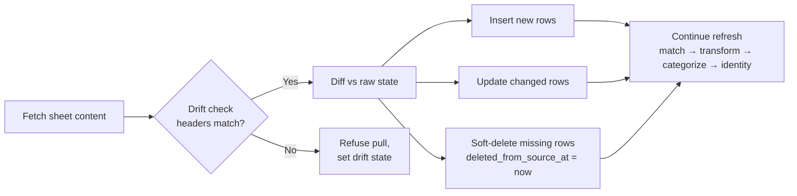

<!-- Last reviewed: 2026-05-20 -->
# Google Sheets

Connect a Google Sheet as a live data source. MoneyBin authenticates once via direct OAuth, then every `moneybin refresh` re-pulls the sheet's current state — additions, edits, and deletions all flow through. Tiller-style ledger sheets participate in the full matching and categorization pipeline; any other sheet lands as queryable JSON with an auto-generated typed view.

This is the first entry in the `connect-*` family. Future siblings — Airtable, Smartsheet, Notion — share the same lifecycle. The full design lives in [`connect-gsheet.md`](../specs/connect-gsheet.md).

## What this is, and what it isn't

**Use Google Sheets sync when:**

- You maintain a Tiller-style transaction sheet by hand and want it in MoneyBin without exporting CSVs.
- You have an arbitrary tabular sheet — asset valuations, subscription tracker, a budget tab — that you'd like to query alongside your transactions in SQL or MCP.
- You want changes in the sheet to reflect in MoneyBin within one `refresh_run`, without re-importing files.

**This is not:**

- A two-way sync. MoneyBin only reads from your sheet (`spreadsheets.readonly` OAuth scope); it never writes back.
- An aggregator integration like Plaid. MoneyBin's client speaks Google's API directly — no moneybin-sync mediation, no shared client secret.
- A schema designer. You bring your sheet's shape; MoneyBin detects it. If you want to restructure, do it in the sheet and run `gsheet reconnect`.

## `_link` vs `_connect` — which family is this?

MoneyBin has two verbs for "establish a relationship with an external data source":

- **`sync_link`** (Plaid, future SimpleFIN/MX) — *mediated* third-party financial aggregators. Credentials are server-held; the client never speaks the bank's API directly.
- **`gsheet_connect`** — *direct* OAuth to data the user owns. Tokens live in the local `SecretStore`; no server mediation. Future direct-storage connectors remain unnamed until bounded-registry admission.

The verb predicts the trust model. You should never need a qualifier to know which is which. Full rationale: [`.claude/rules/surface-design.md`](../../.claude/rules/surface-design.md) verb vocabulary.

## One-time setup

```bash
moneybin gsheet auth
```

This opens your browser to Google's OAuth consent screen using the **Desktop app** PKCE flow — no shared client secret is bundled with MoneyBin, and no third party sees your refresh token. On consent, the token lands in your local `SecretStore` (keychain or passphrase-derived key, same as every other MoneyBin secret).

You only need to do this once per profile. `gsheet connect` will trigger `gsheet auth` automatically on first run if you skip this step.

## Connect a sheet

```bash
moneybin gsheet connect "https://docs.google.com/spreadsheets/d/1AbC.../edit#gid=0"
```

MoneyBin parses the spreadsheet ID and `gid` from the URL, fetches the sheet's headers and a sample of rows, and decides which adapter to use:

- **High-confidence transactions match** → `transactions` adapter (the integrated path).
- **Low-confidence or arbitrary shape** → offers the `seed` adapter (the catch-all).
- **Medium-confidence** → you pick.

Pass `--adapter=transactions` or `--adapter=seed` to skip auto-detection.

### A concrete walk-through

```bash
# 1. Authenticate once
moneybin gsheet auth

# 2. Connect a Tiller-style ledger sheet
moneybin gsheet connect \
  "https://docs.google.com/spreadsheets/d/1AbC.../edit#gid=0" \
  --account-name "Joint Checking"

# 3. Confirm the detected column mapping (or pass --yes to auto-accept)

# 4. Initial pull runs automatically; subsequent pulls happen on every refresh
moneybin refresh

# 5. Query the result like any other source
moneybin reports cashflow --from 2026-01
```

After step 2, rows flow into `raw.tabular_transactions` (with `source_origin = <connection_id>`), through the staging layer, into `core.fct_transactions`, and through matching and categorization the same way OFX or CSV imports do.

## The two adapters

### `transactions` — integrated path

Best for: Tiller, Tiller-style hand-maintained ledgers, anything with date / amount / description / account columns.

- Rows land in `raw.tabular_transactions` and participate in **all** downstream machinery: cross-source dedup, transfer detection, categorization rules, LLM-assist, reports.
- The pinned column mapping is detected once at connect time and reused on every pull — no re-detection unless the sheet's structure drifts (see below).
- `--account-name` (or `--account-id`) names the destination account; required if the sheet doesn't carry an account column.

### `seed` — catch-all

Best for: anything else. Asset valuations, a subscription tracker, a budget tab, scratch data you want SQL access to.

- Rows land in `raw.gsheet_seeds` as JSON, one row per sheet row.
- An **auto-generated typed view** at `raw.gsheet_<alias>` exposes the rows with inferred column types (string, number, date, boolean), queryable from `sql_query` and visible in `moneybin://schema`.
- Does **not** participate in matching, categorization, or reports — there's no schema contract beyond "rectangular tabular data."
- `--alias=<slug>` names the generated view (required for the seed adapter; derived from sheet name if omitted).

```bash
moneybin gsheet connect "https://docs.google.com/spreadsheets/d/.../edit#gid=42" \
  --adapter=seed --alias=subscriptions
# Now queryable:
moneybin db shell -c "SELECT * FROM raw.gsheet_subscriptions"
```

### When `seed` is the right choice

- The sheet has no transaction-like shape (you'd be force-fitting columns).
- The data is reference material rather than a transaction stream (asset prices, valuations, lookup tables).
- You want SQL/MCP access without committing the sheet to the canonical pipeline.

The `seed` adapter is the learn-from-usage path. Common shapes that show up here over time become candidates for future typed adapters (categories / budgets / AutoCat for Tiller, asset valuations, etc.).

## How the live mirror works

Every `moneybin refresh` (or explicit `gsheet pull`) runs this per connection:



The full `moneybin refresh` path continues through identity backfill. A
dedicated `moneybin gsheet pull` runs the narrower live match → transform →
categorize post-pull subset. Three things to know:

1. **Edits in the sheet update the matching MoneyBin row.** A stable-key heuristic identifies "this is the same row" across pulls — edits don't create duplicate rows.
2. **Deletions soft-delete.** A row removed from the sheet gets `deleted_from_source_at = NOW()` in `raw.tabular_transactions`. It disappears from reports by default but survives in the raw layer for audit.
3. **Per-connection isolation.** A failure on connection A (auth expired, sheet deleted, drift detected) doesn't block connection B's pull.

## Drift detection and recovery

If you add a column to your sheet, rename one, or rearrange them, MoneyBin's next pull will detect that the headers no longer match the pinned mapping and **refuse the pull for that connection**. The connection enters `drift_detected` state; the rest of your connections keep pulling normally.

```bash
moneybin gsheet status
```

Will show something like:

```
Google Sheets — 2 connections, 1 needs attention

  abc123  Joint Checking (transactions)   healthy        last pull 2m ago
  def456  Budget Tab     (seed)           drift_detected last pull 1h ago
                                          → expected columns: [date, amount, description]
                                          → found columns:    [date, amount, description, notes]
                                          → run: moneybin gsheet reconnect def456
```

To recover, run:

```bash
moneybin gsheet reconnect def456
```

This re-runs detection against the current sheet structure, shows you the diff vs. the pinned mapping, and on confirmation updates the mapping and re-runs the pull. The refusal-by-default design exists so you never accidentally pull half-typed data into a shifted schema.

## Disconnecting

```bash
# Soft disconnect — keeps raw data, stops pulling
moneybin gsheet disconnect abc123

# Hard delete — removes raw rows too
moneybin gsheet disconnect abc123 --purge --yes
```

Soft disconnect is reversible (the rows stay in `raw.tabular_transactions` and `app.gsheet_connections` keeps the row at `status=disconnected`). Hard delete cascades through the raw layer; downstream `core.*` and `reports.*` reflect the removal on the next refresh.

## CLI surface

| Command | Purpose |
|---------|---------|
| `moneybin gsheet auth` | One-time OAuth (interactive browser flow). |
| `moneybin gsheet connect <url>` | Connect a sheet; runs detection + initial pull. |
| `moneybin gsheet pull [<id>]` | Pull one connection or all healthy connections. |
| `moneybin gsheet` | List all connections with status. |
| `moneybin gsheet status [<id>]` | Detailed status — pinned mapping, drift detail, recent pulls. |
| `moneybin gsheet reconnect <id>` | Re-detect after drift; update the pinned mapping. |
| `moneybin gsheet disconnect <id>` | Soft disconnect by default; `--purge` for hard delete. |

Full spec coverage: [`connect-gsheet.md`](../specs/connect-gsheet.md) §CLI Interface.

## MCP surface

MCP reaches the same outcomes with the bounded standard surface. All calls return the standard `ResponseEnvelope`.

| Tool | Purpose |
|------|---------|
| `gsheet_connect` | Authenticate, connect a sheet, or re-establish a drifted connection with `connection_id=...`. |
| `gsheet_pull` | Pull one or all healthy connections. |
| `gsheet` | List connections (`view='connections'`) or inspect their health (`view='status'`). |
| `gsheet_disconnect` | Set a connection disconnected, or use the explicitly confirmed absent state to purge it. |

Drift responses populate `actions[]` with a `gsheet_connect(connection_id=...)` hint. Auth-expired responses direct callers to `gsheet_connect(force_reauth=true)`; the same tool covers authentication, new connections, and reconnects.

## Limitations

- **Read-only OAuth scope.** MoneyBin requests `https://www.googleapis.com/auth/spreadsheets.readonly` only. We never write back to your sheet. Write-scope is deferred to a future version (stable-ID write-back design).
- **Google API quotas.** Google's default Sheets API quota is 60 read requests per minute per user. MoneyBin uses one request per pull per connection, so practical-use quotas are very hard to hit — but if you're connecting tens of large sheets, stagger pulls.
- **Single Google identity per profile** in v1. Multi-identity support is deferred.
- **Soft-deleted rows are hidden by default.** Rows removed from your sheet disappear from reports but survive in `raw.tabular_transactions` with `deleted_from_source_at` set. To inspect them:

  ```sql
  SELECT *
  FROM raw.tabular_transactions
  WHERE deleted_from_source_at IS NOT NULL
    AND source_origin = '<connection_id>'
  ORDER BY deleted_from_source_at DESC;
  ```

- **Sheet structure drift refuses pulls.** This is intentional — silent re-mapping is the cause of most data-quality bugs in spreadsheet ETL. If you change column headers in your sheet, you'll need to `gsheet reconnect`.
- **No sheet creation or template provisioning.** MoneyBin doesn't seed sheets for you; bring your own.

## See also

- [`connect-gsheet.md`](../specs/connect-gsheet.md) — full feature spec (architecture, data model, OAuth flow, drift semantics, adapter contract).
- [Data import guide](data-import.md) — broader ingestion patterns (CSV, OFX, Plaid sync).
- [Data pipeline guide](data-pipeline.md) — how `raw` → `prep` → `core` → `reports` works downstream of the connector.
- [SQL access guide](sql-access.md) — querying the `raw.gsheet_*` tables and views directly.
