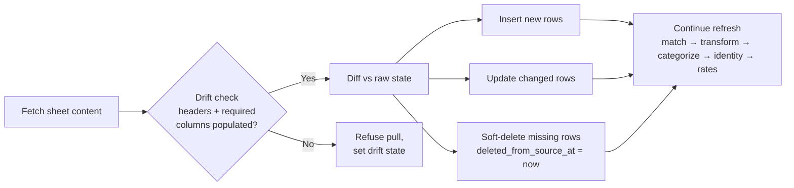

<!-- Last reviewed: 2026-09-03 -->
# Google Sheets

Connect a Google Sheet as a live data source. MoneyBin authenticates once via direct OAuth, then every `moneybin refresh` re-pulls the sheet's current state — additions, edits, and deletions all flow through. Tiller-style ledger sheets participate in the full matching and categorization pipeline; any other sheet lands as queryable JSON with an auto-generated typed view.

This is the first entry in the `connect-*` family. Future siblings — Airtable, Smartsheet, Notion — share the same lifecycle. The full design lives in [`connect-gsheet.md`](../specs/connect-gsheet.md).

## What this is, and what it isn't

**Use Google Sheets sync when:**

- You maintain a Tiller-style transaction sheet by hand and want it in MoneyBin without exporting CSVs.
- You have an arbitrary tabular sheet — asset valuations, subscription tracker, a budget tab — that you'd like to query alongside your transactions in SQL or MCP.
- You want changes in the sheet to reflect in MoneyBin within one `refresh_run`, without re-importing files.

**This is not:**

- A two-way sync. MoneyBin only reads from your sheet (`spreadsheets.readonly` OAuth scope); it never writes back.
- An aggregator integration like Plaid. MoneyBin's client speaks Google's API directly — no moneybin-sync mediation, and no third party ever sees your refresh token.
- A schema designer. You bring your sheet's shape; MoneyBin detects it. If you want to restructure, do it in the sheet and run `gsheet reconnect`.

## `_link` vs `_connect` — which family is this?

MoneyBin has two verbs for "establish a relationship with an external data source":

- **`sync_link`** (Plaid, future SimpleFIN/MX) — *mediated* third-party financial aggregators. Credentials are server-held; the client never speaks the bank's API directly.
- **`gsheet_connect`** — *direct* OAuth to data the user owns. Tokens live in the local `SecretStore`; no server mediation. Future direct-storage connectors remain unnamed until bounded-registry admission.

The verb predicts the trust model. You should never need a qualifier to know which is which. Full rationale: [`.claude/rules/surface-design.md`](../../.claude/rules/surface-design.md) verb vocabulary.

## One-time setup

```bash
moneybin gsheet auth
```

This opens your browser to Google's OAuth consent screen using the **Desktop app** PKCE flow. No third party sees your refresh token: on consent it lands in your local `SecretStore` (keychain or passphrase-derived key, same as every other MoneyBin secret).

You only need to do this once per profile. `gsheet connect` will trigger `gsheet auth` automatically on first run if you skip this step.

### Why MoneyBin ships a client secret

MoneyBin ships a public client ID *and* the client secret Google issued for it, so `gsheet auth` works on a fresh install with nothing to configure. That is a deliberate choice, and worth understanding before you decide whether to keep it.

**Google's Desktop clients require both halves.** The secret is needed to exchange the authorization code for a token even under PKCE. Only Android, iOS and Chrome clients are exempt — they bind to a signing certificate, and desktop has no equivalent attestation. Google's [OAuth for installed apps](https://developers.google.com/identity/protocols/oauth2/native-app) documentation puts the exemption exactly there: the `client_secret` is "not applicable to requests from clients registered as Android, iOS, or Chrome applications."

**A shipped secret is not a confidential secret.** This is the settled position for installed apps, not a MoneyBin shortcut. [RFC 8252 §8.5](https://datatracker.ietf.org/doc/html/rfc8252#section-8.5) puts it plainly: "Secrets that are statically included as part of an app distributed to multiple users should not be treated as confidential secrets, as one user may inspect their copy and learn the shared secret." The same section adds that it is "NOT RECOMMENDED for authorization servers to require client authentication of public native apps clients using a shared secret." Google says the same of its own flow — "it is assumed that these apps cannot keep secrets." PKCE and the loopback redirect are what carry the security; the client ID and secret identify the app, they do not authenticate you.

**The alternative was worse.** A wheel carries no dotenv, so a user-supplied secret means every `pip install` begins with registering a Desktop client in the Google Cloud Console — the 15 minutes of setup this connector chose OAuth to avoid in the first place.

What it costs, stated honestly:

- **The consent screen carries MoneyBin's name.** Anyone holding the credential can render one — though that is further from a working phish than it sounds. Google delivers the authorization code only to a redirect URI registered for the client, and a Desktop client may register only loopback (`http://127.0.0.1:port`) or a custom scheme, so a mailed consent link delivers the code to the victim's own machine, not the sender's. The manual copy/paste flow that once let a remote attacker collect one has been [blocked for every client](https://developers.google.com/identity/protocols/oauth2/resources/oob-migration) since January 2023, explicitly because it "poses a remote phishing risk". What remains is a malicious app you install and run yourself — and an attacker already running code on your machine can read the stored refresh token directly, so the shipped credential adds nothing to their reach.
- **MoneyBin never requests write access with this client.** Its consent screen declares `spreadsheets.readonly` and nothing else, which is what keeps a warning signal alive: Google shows an [unverified-app warning](https://support.google.com/cloud/answer/7454865) whenever an app requests a sensitive scope its consent screen does not declare. So a screen carrying MoneyBin's name that asks to *edit* your spreadsheets is never a legitimate one. That costs something real — exporting *to* a Google Sheet needs your own client (below), because requesting write here would declare the scope on the shared screen and spend the signal for everyone.
- **The API quota is shared.** Google meters the Sheets API [per Cloud project](https://developers.google.com/workspace/sheets/api/limits) at 300 read requests per minute, with a separate 60-per-minute cap per user per project. The per-user cap stops any one user monopolizing it, but the project ceiling is genuinely shared.

The shared client is a starting point, not a permanent foundation. rclone — the most-cited precedent for this pattern — now tells its users that "the shared client_id is being retired and will stop working during 2026" ([rclone Google Drive docs](https://rclone.org/drive/)). If you get throttled, or would rather not trust MoneyBin's project identity on the consent screen, bring your own client.

### Bring your own Google OAuth client (optional)

Reading a sheet needs none of this — the shipped client works. Exporting *to* a sheet does require your own client, because the shipped one is registered read-only and MoneyBin refuses to request write with it. Register your own **Desktop app** client in [Google Cloud Console](https://console.cloud.google.com/apis/credentials) with the Sheets API enabled if you want a private quota, or would rather not trust MoneyBin's project identity on the consent screen. Then set both:

```bash
export MONEYBIN_GSHEET__OAUTH_CLIENT_ID="<your-client-id>.apps.googleusercontent.com"
export MONEYBIN_GSHEET__OAUTH_CLIENT_SECRET="<your-client-secret>"
```

Set both or neither. A secret belongs to the client ID it was issued with, so setting only the secret leaves it paired with MoneyBin's embedded ID, which Google never issued it for — `gsheet auth` refuses that by name rather than letting it fail at the token exchange, after you have already consented.

Export them somewhere your scheduled runs will see them, not just your interactive shell. The refresh grant needs the same pair as the initial exchange, so a `launchd`/`cron` `moneybin refresh` that starts without them fails once the cached access token ages out, roughly an hour after an authorization that looked fine.

Switching between the shipped client and your own — in either direction — means authorizing again. Google issues a refresh token to one specific client and will not honor it for another, so MoneyBin records which client obtained each grant and refuses to reuse it under a different one. `gsheet auth` reports such a grant as unauthorized and walks you through consent again, rather than reporting success and then failing an hour later when the cached access token ages out and the refresh is rejected.

Your own client also gives you your own quota, which is the main reason to bother — see [Why MoneyBin ships a client secret](#why-moneybin-ships-a-client-secret) above for the numbers.

## Connect a sheet

```bash
moneybin gsheet connect "https://docs.google.com/spreadsheets/d/1AbC.../edit#gid=0"
```

MoneyBin parses the spreadsheet ID and `gid` from the URL, fetches the sheet's headers and a sample of rows, and decides which adapter to use:

- **High-confidence transactions match** → `transactions` adapter (the integrated path).
- **Low-confidence or arbitrary shape** → offers the `seed` adapter (the catch-all).
- **Medium-confidence** → you pick.

Pass `--adapter=transactions` or `--adapter=seed` to skip auto-detection.

### A concrete walk-through

```bash
# 1. Authenticate once
moneybin gsheet auth

# 2. Connect a Tiller-style ledger sheet
moneybin gsheet connect \
  "https://docs.google.com/spreadsheets/d/1AbC.../edit#gid=0" \
  --account-name "Joint Checking"

# 3. Confirm the detected column mapping (or pass --yes to auto-accept)

# 4. Initial pull runs automatically; subsequent pulls happen on every refresh
moneybin refresh

# 5. Query the result like any other source
moneybin reports cashflow --from-month 2026-01
```

After step 2, rows flow into `raw.tabular_transactions` (with `source_origin = <connection_id>`), through the staging layer, into `core.fct_transactions`, and through matching and categorization the same way OFX or CSV imports do.

## The two adapters

### `transactions` — integrated path

Best for: Tiller, Tiller-style hand-maintained ledgers, anything with date / amount / description / account columns.

- Rows land in `raw.tabular_transactions` and participate in **all** downstream machinery: cross-source dedup, transfer detection, categorization rules, LLM-assist, reports.
- The pinned column mapping is detected once at connect time and reused on every pull — no re-detection unless the sheet's structure drifts (see below).
- `--account-name` (or `--account-id`) names the destination account; required if the sheet doesn't carry an account column.
- `--sign` sets the amount sign convention (`negative_is_expense`, `negative_is_income`, `split_debit_credit`) when MoneyBin can't derive it from the selected columns — for example, when a column mapping replaces the amount source MoneyBin auto-detected. An inferred whole-ledger inversion (`negative_is_income`) always requires an explicit `--sign` to confirm before it's saved.

### `seed` — catch-all

Best for: anything else. Asset valuations, a subscription tracker, a budget tab, scratch data you want SQL access to.

- Rows land in `raw.gsheet_seeds` as JSON, one row per sheet row.
- An **auto-generated typed view** at `raw.gsheet_<alias>` exposes the rows with inferred column types (string, number, date), visible in `moneybin://schema`. Read it with `moneybin db query`, `db shell`, `moneybin sql query`, or the `sql_query` MCP tool. The last two reach `raw`, and mask this view by value shape rather than by column class — your sheet's headers are minted at connect time, so no declaration can cover them. An SSN-shaped value comes back `***-**-****`; an unbroken run of 8 or more digits keeps only its last four (`12345678` → `****...5678`). A 4-to-7 digit account number, or one written `1234-5678`, passes through — so does one carrying a decimal point, which the view types `DECIMAL` and the scan skips. A whole number types `BIGINT` and is scanned like text. That scan is the only masking this view gets — disconnect the sheet with `moneybin gsheet disconnect <connection-id> --purge` if its cells should not reach a model. See [`sql_query` rules](sql-access.md#sql_query-rules-mcp-tool-and-moneybin-sql-query-cli).
- Does **not** participate in matching, categorization, or reports — there's no schema contract beyond "rectangular tabular data."
- `--alias=<slug>` names the generated view (required for the seed adapter; derived from sheet name if omitted).

```bash
moneybin gsheet connect "https://docs.google.com/spreadsheets/d/.../edit#gid=42" \
  --adapter=seed --alias=subscriptions
# Now queryable:
moneybin db query "SELECT * FROM raw.gsheet_subscriptions"
```

### When `seed` is the right choice

- The sheet has no transaction-like shape (you'd be force-fitting columns).
- The data is reference material rather than a transaction stream (asset prices, valuations, lookup tables).
- You want SQL/MCP access without committing the sheet to the canonical pipeline.

The `seed` adapter is the learn-from-usage path. Common shapes that show up here over time become candidates for future typed adapters (categories / budgets / AutoCat for Tiller, asset valuations, etc.).

## How the live mirror works

Every `moneybin refresh` (or explicit `gsheet pull`) runs this per connection:


```mermaid
flowchart LR
    A[Fetch sheet content] --> B{Drift check<br/>headers + required<br/>columns populated?}
    B -->|Yes| C[Diff vs raw state]
    B -->|No| Z[Refuse pull,<br/>set drift state]
    C --> D[Insert new rows]
    C --> E[Update changed rows]
    C --> F[Soft-delete missing rows<br/>deleted_from_source_at = now]
    D --> G[Continue refresh<br/>match → transform → categorize → identity → rates]
    E --> G
    F --> G
```

A dedicated `moneybin gsheet pull` runs that four-step post-pull subset —
`rates` is included because a sheet can carry foreign-currency rows. The full
`moneybin refresh` path adds identity backfill, running all five steps in the
order match → transform → categorize → identity → rates. Three things to know:

1. **Edits in the sheet update the matching MoneyBin row.** A stable-key heuristic identifies "this is the same row" across pulls — edits don't create duplicate rows.
2. **Deletions soft-delete.** A row removed from the sheet gets `deleted_from_source_at = NOW()` in `raw.tabular_transactions`. It disappears from reports by default but survives in the raw layer for audit.
3. **Per-connection isolation.** A failure on connection A (auth expired, sheet deleted, drift detected) doesn't block connection B's pull.

## Drift detection and recovery

What counts as drift depends on the adapter.

A `transactions` connection pins a column mapping. If you rename or remove a column MoneyBin has mapped — or the cells of a *required* column go mostly empty (the date column, plus either the amount column or the debit/credit pair) — the next pull detects the drift and **refuses the pull for that connection**. A mostly-blank optional column like Description or Notes is normal and never trips it. Adding a new column or reordering existing ones is not drift: MoneyBin matches headers by set membership, not position, and ignores columns outside the pinned mapping.

A `seed` connection pins nothing. It regenerates its view on every pull, so renamed, added, and reordered columns are absorbed silently; only a sheet with no header row at all refuses.

Either way the connection enters `drift_detected` state; the rest of your connections keep pulling normally.

```bash
moneybin gsheet status
```

Will show something like:

```
abc123  status=healthy  adapter=seed  last_success=2026-07-24T14:32:00  failures=0
def456  status=drift_detected  adapter=transactions  last_success=2026-07-23T09:00:00  failures=1
   ⚠️  missing headers: ['description']
```

To recover, run:

```bash
moneybin gsheet reconnect def456
```

This re-runs detection against the current sheet structure, shows you the diff vs. the pinned mapping, and on confirmation updates the mapping and re-runs the pull. The refusal-by-default design exists so you never accidentally pull half-typed data into a shifted schema.

## Disconnecting

```bash
# Soft disconnect — keeps raw data, stops pulling
moneybin gsheet disconnect abc123

# Hard delete — removes raw rows too
moneybin gsheet disconnect abc123 --purge --yes
```

Soft disconnect is reversible (the rows stay in `raw.tabular_transactions` and `app.gsheet_connections` keeps the row at `status=disconnected`). Hard delete cascades through the raw layer; downstream `core.*` and `reports.*` reflect the removal on the next refresh.

## CLI surface

| Command | Purpose |
|---------|---------|
| `moneybin gsheet auth` | One-time OAuth (interactive browser flow). |
| `moneybin gsheet connect <url>` | Connect a sheet; runs detection + initial pull. |
| `moneybin gsheet pull [<id>]` | Pull one connection or all healthy connections. |
| `moneybin gsheet list` | List all connections with status. |
| `moneybin gsheet status [<id>]` | Detailed status — pinned mapping, drift detail, recent pulls. |
| `moneybin gsheet reconnect <id>` | Re-detect after drift; update the pinned mapping. |
| `moneybin gsheet disconnect <id>` | Soft disconnect by default; `--purge` for hard delete. |

Full spec coverage: [`connect-gsheet.md`](../specs/connect-gsheet.md) §CLI Interface.

## MCP surface

MCP reaches the same outcomes with the bounded standard surface. All calls return the standard `ResponseEnvelope`.

| Tool | Purpose |
|------|---------|
| `gsheet_connect` | Authenticate, connect a sheet, or re-establish a drifted connection with `connection_id=...`. |
| `gsheet_pull` | Pull one or all healthy connections. |
| `gsheet` | List connections (`view='connections'`) or inspect their health (`view='status'`). |
| `gsheet_disconnect` | Set a connection disconnected, or use the explicitly confirmed absent state to purge it. |

Drift responses populate `actions[]` with a `gsheet_connect(connection_id=...)` hint. Auth-expired responses direct callers to `gsheet_connect(force_reauth=true)`; the same tool covers authentication, new connections, and reconnects.

## Limitations

- **Read-only OAuth scope.** MoneyBin requests `https://www.googleapis.com/auth/spreadsheets.readonly` only. We never write back to your sheet. Write-scope is deferred to a future version (stable-ID write-back design).
- **Google API quotas.** Google allows 60 read requests per minute per user per Cloud project, under a 300-per-minute project ceiling. MoneyBin issues two requests per pull per connection (workbook metadata, then sheet values), so a single pull of 30 connections reaches the per-user cap. Stagger pulls past that. MoneyBin does not throttle client-side; a `429` from Google is retried, for 3 attempts total with backoff, then the connection is left in `rate_limited` state and the next pull picks it up.
- **Single Google identity per profile** in v1. Multi-identity support is deferred.
- **Soft-deleted rows are hidden by default.** Rows removed from your sheet disappear from reports but survive in `raw.tabular_transactions` with `deleted_from_source_at` set. To inspect them:

  ```sql
  SELECT *
  FROM raw.tabular_transactions
  WHERE deleted_from_source_at IS NOT NULL
    AND source_origin = '<connection_id>'
  ORDER BY deleted_from_source_at DESC;
  ```

- **Sheet structure drift refuses pulls.** This is intentional — silent re-mapping is the cause of most data-quality bugs in spreadsheet ETL. If you change column headers in your sheet, you'll need to `gsheet reconnect`.
- **No sheet creation or template provisioning.** MoneyBin doesn't seed sheets for you; bring your own.

## See also

- [`connect-gsheet.md`](../specs/connect-gsheet.md) — full feature spec (architecture, data model, OAuth flow, drift semantics, adapter contract).
- [Data import guide](data-import.md) — broader ingestion patterns (CSV, OFX, Plaid sync).
- [Data pipeline guide](data-pipeline.md) — how `raw` → `prep` → `core` → `reports` works downstream of the connector.
- [SQL access guide](sql-access.md) — querying the `raw.gsheet_*` tables and views directly.
