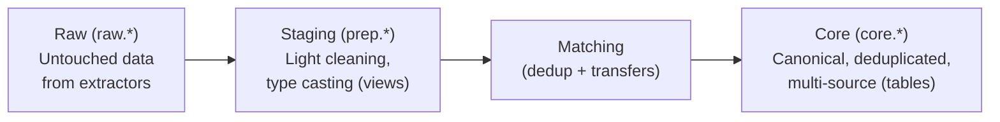

# Data Pipeline

MoneyBin uses a three-layer medallion architecture powered by [SQLMesh](https://sqlmesh.com) and [DuckDB](https://duckdb.org). Every transformation is a SQL model you can read, audit, and modify.

## Three-Layer Architecture



### Raw Layer (`raw.*`)

Exact data from file extractors and loaders. Never modified after import.

| Table | Source |
|-------|--------|
| `raw.ofx_transactions` | OFX/QFX bank statements |
| `raw.ofx_accounts` | OFX account metadata |
| `raw.ofx_balances` | OFX balance snapshots |
| `raw.tabular_transactions` | CSV, TSV, Excel, Parquet, Feather imports |
| `raw.tabular_accounts` | Tabular account metadata |
| `raw.w2_forms` | W-2 PDF tax data |

### Staging Layer (`prep.stg_*`)

Light cleaning and type casting. One view per raw source. DuckDB views — they recompute from raw data on each transform.

| View | Purpose |
|------|---------|
| `prep.stg_ofx__transactions` | Clean OFX transactions |
| `prep.stg_ofx__accounts` | Clean OFX accounts |
| `prep.stg_ofx__balances` | Clean OFX balances |
| `prep.stg_ofx__institutions` | OFX institution metadata |
| `prep.stg_tabular__transactions` | Clean tabular transactions |
| `prep.stg_tabular__accounts` | Clean tabular accounts |

### Matching Intermediate Views (`prep.int_*`)

Sit between staging and core, implementing the union → match → merge flow that produces the golden record. Also DuckDB views.

| View | Purpose |
|------|---------|
| `prep.int_transactions__unioned` | All sources unioned with `source_type` |
| `prep.int_transactions__matched` | Unioned rows annotated with accepted match decisions |
| `prep.int_transactions__merged` | Golden-record merge — one winning row per matched cluster |

### Core Layer (`core.*`)

Canonical, deduplicated, multi-source tables. All consumers (MCP server, CLI, direct SQL) read from core.

| Table | Purpose |
|-------|---------|
| `core.dim_accounts` | All accounts from all sources, deduplicated |
| `core.fct_transactions` | All transactions, deduplicated, with categorization |
| `core.bridge_transfers` | Linked debit/credit pairs from transfer detection |
| `meta.fct_transaction_provenance` | Per-transaction lineage: which source rows merged into the golden record |

## Matching: Dedup and Transfers

The matching engine runs after staging and before core materialization. It identifies two kinds of relationships:

- **Dedup matches** — the same transaction imported from two sources (e.g., the OFX statement and a Mint CSV export). One canonical row wins; the other is suppressed in core.
- **Transfer matches** — a debit on one account paired with the offsetting credit on another (e.g., credit-card payment from checking). Linked in `core.bridge_transfers` so spending reports don't double-count.

Both go through a review/accept/reject workflow with full undo. See the [matching specs](../specs/matching-overview.md) for the four-tier scoring model.

```bash
moneybin transactions matches run                  # Run matcher against existing data
moneybin transactions review --type matches        # Interactive review of pending proposals
moneybin transactions review --type matches --confirm-all   # Non-interactive bulk confirm
moneybin transactions matches history              # Recent decisions
moneybin transactions matches undo <match-id>      # Reverse a decision
moneybin transactions matches backfill             # One-time scan of all existing data
```

`moneybin import file` runs the matcher automatically; the standalone commands are for reviewing pending work or tuning thresholds.

## Key Design Decisions

- **One canonical table per entity.** Consumers never query raw or staging directly.
- **Multi-source union, then match.** Core unions every staging source (`UNION ALL` with a `source_type` column), then applies match decisions to choose a golden record per cluster.
- **Match decisions are persisted, not recomputed.** Accept/reject/undo state lives in `app.match_decisions` and is replayed on every transform — review work is durable.
- **Adding a data source** means writing staging views and adding a CTE to the relevant intermediate model. No consumer changes needed.
- **Accounting sign convention.** Negative = expense, positive = income. `DECIMAL(18,2)` for amounts, `DATE` for dates.

## SQLMesh Transforms

SQLMesh manages the transformation pipeline. It runs automatically after each `moneybin import file` unless `--skip-transform` is specified.

```bash
moneybin transform apply       # Apply pending changes (rebuild from raw data)
moneybin transform plan        # Preview changes before applying
moneybin transform status      # Current model state
moneybin transform validate    # Check model SQL parses correctly
moneybin transform audit       # Run data quality audits
moneybin transform restate     # Force recompute a model for a date range
```

### Model Files

```
sqlmesh/models/
├── prep/                                  # Staging views (1:1 with raw + intermediate)
│   ├── stg_ofx__transactions.sql
│   ├── stg_ofx__accounts.sql
│   ├── stg_ofx__balances.sql
│   ├── stg_ofx__institutions.sql
│   ├── stg_tabular__transactions.sql
│   ├── stg_tabular__accounts.sql
│   ├── int_transactions__unioned.sql
│   ├── int_transactions__matched.sql
│   └── int_transactions__merged.sql
├── core/                                  # Canonical tables
│   ├── dim_accounts.sql
│   ├── fct_transactions.sql
│   └── bridge_transfers.sql
└── meta/                                  # Lineage and provenance
    └── fct_transaction_provenance.sql
```

Each model is a plain SQL file with a `MODEL()` header that declares dependencies, materialization, and scheduling.
