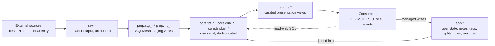

<!-- Last reviewed: 2026-05-17 -->
# Data Pipeline

Every transaction you see in `core.fct_transactions` traces back to a specific source row in `raw.*`. The pipeline that gets it there is a layered medallion: Python loaders write raw, SQLMesh transforms raw into staging views and canonical tables, services maintain user state in a parallel `app.*` schema, and curated `reports.*` views shape the result for display. This guide walks the layers, explains what each one's job is, names the actual models in the repo, and shows where consumers should query from.

For the one-page distillation, see [`docs/architecture.md`](../architecture.md). For column-level schema, see [`docs/reference/data-model.md`](../reference/data-model.md). For the canonical depth reference (invariants, layer rules, the writer-coordination contract), see [`docs/specs/architecture-shared-primitives.md`](../specs/architecture-shared-primitives.md).

## The pipeline at a glance



The arrow direction is the rule. Data flows left to right through `raw → prep → core → reports`. Consumers read from `core` and `reports` only. Managed writes from the CLI and MCP target `app.*` (notes, tags, splits, categorizations, match decisions, balance assertions) and `raw.*` (imports and manual entry). DDL, writes to `core.*`, and any write outside the allowlist are rejected by the privacy middleware on the MCP side and are not exposed by the CLI.

## Layer reference

The schemas correspond exactly to the directories under `sqlmesh/models/` and the schema DDL files under `src/moneybin/sql/schema/`. Each layer has one owner and one job.

| Schema | Materialized | Owner (writes) | Consumers (reads) | Purpose |
|---|---|---|---|---|
| `raw` | Tables | Python loaders, manual-entry service, Plaid sync | SQLMesh staging only | Untouched source data; re-importable from the original file or API response |
| `prep` | Views | SQLMesh | SQLMesh core | Light cleaning, type casting, source unioning; internal to the pipeline |
| `core` | Views and tables | SQLMesh | All consumers (CLI, MCP, SQL shell, reports) | Canonical, deduplicated, multi-source; one table per real-world entity |
| `app` | Tables | Services, managed-write MCP, migrations | Services and `core.dim_*` joins | User state and application metadata. Mutable; not derivable from `raw` |
| `reports` | Views | SQLMesh | CLI `reports *`, MCP `reports_*`, future HTTP | Curated presentation models, one per report surface; read-only by design |
| `meta` | Tables and views | SQLMesh | Reconciliation tooling, freshness probes | Cross-source provenance and pipeline metadata |
| `seeds` | Tables | SQLMesh seeds (from CSV) | `prep`, `core`, services | Reference data shipped in-repo (e.g., the category taxonomy) |

### Source types and priority order

Every row in `core.fct_transactions` carries a `source_type` recording which loader produced it. The full set:

| `source_type` | Loader / origin | Lands in (raw) |
|---|---|---|
| `manual` | `transactions create` | `raw.manual_transactions` |
| `plaid` | `sync pull` (Plaid `/transactions/sync`) | `raw.plaid_transactions` |
| `csv` | `import files` (CSV) | `raw.tabular_transactions` |
| `excel` | `import files` (`.xlsx`/`.xls`) | `raw.tabular_transactions` |
| `tsv` | `import files` (TSV) | `raw.tabular_transactions` |
| `parquet` | `import files` (Parquet) | `raw.tabular_transactions` |
| `feather` | `import files` (Feather/Arrow IPC) | `raw.tabular_transactions` |
| `pipe` | `import files` (pipe-delimited) | `raw.tabular_transactions` |
| `ofx` | `import files` (OFX/QFX/QBO) | `raw.ofx_transactions` |

When two sources both observed the same real-world transaction (matched via dedup, below) the per-field merge in `prep.int_transactions__merged` picks the highest-priority non-null value for each column. The default priority order is:

1. `manual` (you typed it; trust it)
2. `plaid` (live API, normalized merchant + category)
3. `csv`, `excel`, `tsv`, `parquet`, `feather`, `pipe` (tabular file imports)
4. `ofx` (lowest — file metadata is often institution-specific and lossy)

Configurable via the `matching.source_priority` setting; the live list is seeded into `app.seed_source_priority` on every matcher run.

### `raw.*` — what loaders produce

Owned by Python: every loader writes to a source-specific `raw` table via `Database.ingest_dataframe()` and records a row in `raw.import_log` for re-import detection and revert. Data is preserved as it arrived, including columns SQLMesh won't end up reading. Re-importing the same file is a no-op against the import log.

| Table | Source | Written by |
|---|---|---|
| `raw.ofx_institutions` | OFX/QFX/QBO headers | `import files` |
| `raw.ofx_accounts` | OFX/QFX/QBO account blocks | `import files` |
| `raw.ofx_transactions` | OFX/QFX/QBO transactions | `import files` |
| `raw.ofx_balances` | OFX/QFX/QBO balance snapshots | `import files` |
| `raw.tabular_accounts` | CSV/TSV/Excel/Parquet/Feather account columns | `import files` |
| `raw.tabular_transactions` | CSV/TSV/Excel/Parquet/Feather transaction rows | `import files` |
| `raw.plaid_accounts` | Plaid `/accounts/get` | `sync pull` |
| `raw.plaid_transactions` | Plaid `/transactions/sync` | `sync pull` |
| `raw.plaid_balances` | Plaid balance snapshots | `sync pull` |
| `raw.manual_transactions` | Manual entries | `transactions create` |
| `raw.import_log` | Per-file import metadata | every loader |

Adding a new source = a new `raw.<source>_transactions` (and `_accounts`, `_balances` as relevant) plus the staging view below. No consumer code changes.

### `prep.*` — staging and intermediate views

Owned by SQLMesh. All views, all recomputed on each transform. Two naming patterns:

- **`stg_<source>__<entity>`** — one staging view per `raw.*` table. Type casting, column renaming, trimming, null handling. One view per source so adding a new source is a local edit.
- **`int_<domain>__<step>`** — domain-level intermediate views that union sources, apply match decisions, and produce the deduplicated golden record.

| View | Role |
|---|---|
| `prep.stg_ofx__institutions` | Normalize OFX institution rows |
| `prep.stg_ofx__accounts` | Normalize OFX account rows |
| `prep.stg_ofx__transactions` | Normalize OFX transaction rows; cast `date_posted` to `DATE`, trim payee strings |
| `prep.stg_ofx__balances` | Normalize OFX balance snapshots |
| `prep.stg_tabular__accounts` | Normalize tabular account rows |
| `prep.stg_tabular__transactions` | Normalize tabular transaction rows |
| `prep.stg_plaid__accounts` | Normalize Plaid account rows |
| `prep.stg_plaid__transactions` | Normalize Plaid transactions; carry `merchant_name` and `plaid_category` |
| `prep.stg_plaid__balances` | Normalize Plaid balance snapshots |
| `prep.stg_manual__transactions` | Normalize manual entries |
| `prep.int_transactions__unioned` | `UNION ALL` of every source's transactions; one row per source row, shape-aligned |
| `prep.int_transactions__matched` | Unioned rows annotated with accepted dedup match decisions from `app.match_decisions`; assigns a `transaction_id` shared by all rows in a match group |
| `prep.int_transactions__merged` | One row per `transaction_id`, with per-field source-priority merge: highest-priority source wins per column, earliest `transaction_date` wins, `is_pending = OR(...)` across sources |

**Consumers should never read `prep.*` directly.** The shape is unstable and the column comments aren't published to DuckDB's catalog by design (it's an internal layer). If you find yourself wanting to read `prep`, you want `core` instead.

### `core.*` — canonical, deduplicated, multi-source

Owned by SQLMesh. Mix of views and tables. **One canonical table per real-world entity.** Consumers read here.

| Model | Grain | Role |
|---|---|---|
| `core.fct_transactions` | One row per transaction (after cross-source dedup) | The fact table everything else hangs off. Joins `prep.int_transactions__merged` with `app.transaction_categories`, `core.dim_categories`, `core.dim_merchants`, `core.bridge_transfers`, and the curation tables (`app.transaction_notes`, `app.transaction_tags`, `app.transaction_splits`) to produce a single read shape. Notes, tags, and splits arrive as `LIST(STRUCT)` columns. |
| `core.dim_accounts` | One row per account | Deduplicated accounts from every source. Joins `app.account_settings` so the dim is the single source of truth for display name, archived state, and `include_in_net_worth` (no consumer joins `app.account_settings` directly). |
| `core.dim_merchants` | One row per merchant | Normalized merchant identity for joining and aggregation |
| `core.dim_categories` | One row per category | Combines the Plaid-PFC seed taxonomy with `app.user_categories` user-added entries |
| `core.bridge_transfers` | One row per matched transfer pair | Confirmed transfer matches between two `transaction_id`s; derived from `app.match_decisions` where `match_type = 'transfer'` |
| `core.fct_transaction_lines` | One row per transaction line | Splits expanded for line-level analysis |
| `core.fct_balances` | One row per balance snapshot | Snapshot balances from `raw.*_balances` reconciled across sources |
| `core.fct_balances_daily` | One row per (account, date) | End-of-day balance, gap-filled (Python model, not SQL) |

**Identity:** `transaction_id` is a deterministic SHA-256 hash. For unmatched rows, it's a hash of `(source_type, source_transaction_id, account_id)`. For matched groups, it's a hash of the sorted set of those tuples — so reimporting the same two sources produces the same `transaction_id` every time. See `.claude/rules/identifiers.md` for the full strategy.

**Sign convention:** negative amount = expense, positive = income. `amount_absolute` is also exposed for sign-agnostic aggregation. Money is `DECIMAL(18,2)`; quantities and prices are `DECIMAL(18,8)`.

### `app.*` — user state

Owned by services (Python). The `app` schema holds anything you do *to* a transaction that isn't derivable from the source — notes, tags, splits, categorizations, match decisions, balance assertions, budgets, audit log entries, format profiles, user-added categories and merchants. Mutable. Backed up via `moneybin db backup`; **not** rebuildable from `raw.*`.

| Table | Role | Touched by |
|---|---|---|
| `app.transaction_notes` | Free-form notes | `transactions notes add/remove` |
| `app.transaction_tags` | Tag labels | `transactions tags add/set/remove` |
| `app.transaction_splits` | Split child rows | `transactions splits add/set/remove` |
| `app.transaction_categories` | Category/subcategory per transaction | `transactions categorize`, categorization engines |
| `app.categorization_rules` | Pattern-based auto-categorization rules | `transactions categorize rules` |
| `app.proposed_rules` | Pending auto-rule suggestions | rules service |
| `app.match_decisions` | Accept/reject decisions from the matching engine | `transactions matches`, refresh |
| `app.balance_assertions` | User-asserted balance checkpoints | `transactions balance assert` |
| `app.budgets` | Monthly budget targets | `budget set` |
| `app.account_settings` | Display name, archived, `include_in_net_worth`, credit limit | `accounts settings` |
| `app.user_categories` | User-added categories layered onto the seed taxonomy | category service |
| `app.user_merchants` | User-asserted merchant identities and aliases | merchant service |
| `app.audit_log` | Append-only audit trail of every state-changing operation | every write |
| `app.imports`, `app.tabular_formats`, `app.schema_migrations`, `app.versions` | Pipeline state and migration bookkeeping | system |

**`app.*` writes are flat-relational** (one row per note, tag, split). The nesting into `LIST(STRUCT)` happens at the read boundary inside `core.fct_transactions`. That's a deliberate split: writes are simple and indexable; reads are agent-friendly.

### `reports.*` — curated presentation views

One view per CLI/MCP report. Read-only by design; the privacy middleware enforces it. Adding a new report means adding a new view here, not changing core.

| View | Powers |
|---|---|
| `reports.net_worth` | `moneybin reports networth` / `reports_networth` |
| `reports.cash_flow` | `moneybin reports cashflow` / `reports_cashflow` |
| `reports.spending_trend` | `moneybin reports spending` / `reports_spending` |
| `reports.recurring_subscriptions` | `moneybin reports recurring` / `reports_recurring` |
| `reports.uncategorized_queue` | `moneybin reports uncategorized` / `reports_uncategorized` |
| `reports.large_transactions` | `moneybin reports large` / `reports_large_transactions` |
| `reports.merchant_activity` | `moneybin reports merchants` / `reports_merchant_activity` |
| `reports.balance_drift` | `moneybin reports balance-drift` / `reports_balance_drift` |

### `meta.*` and `seeds.*`

- `meta.fct_transaction_provenance` — per-transaction lineage: which source rows merged into the golden record. Use this when reconciling "where did this row come from." Shape:

  | Column | Meaning |
  |---|---|
  | `transaction_id` | The gold key in `core.fct_transactions`. Join here. |
  | `source_transaction_id` | Source-native ID (Plaid `transaction_id`, OFX `FITID`, content hash for tabular). Joinable back to `raw.*`. |
  | `source_type` | One of the values in the table above. |
  | `source_origin` | Institution / connection / format profile that produced the row. |
  | `source_file` | Path to the file that produced the row, or `NULL` for API sources. |
  | `source_extracted_at` | When the source row was parsed. |
  | `match_id` | FK into `app.match_decisions` for matched groups; `NULL` for unmatched (single-source) records. |

  Grain: one row per (gold `transaction_id`, contributing source row). Unmatched rows have exactly one provenance row; matched groups have one row per contributing source.
- `meta.model_freshness` — per-model recency: when each model last ran, what it last consumed.
- `seeds.categories` — the Plaid Personal Finance Categories taxonomy, shipped in-repo at `sqlmesh/models/seeds/categories.csv`. Combined with `app.user_categories` to produce `core.dim_categories`.

## How a row gets in

Trace a single transaction end to end, starting from a CSV row.

1. **The CSV lands in the inbox or you run `moneybin import files`.** The tabular importer detects delimiter, header, and sign convention; matches columns against the alias dictionary; resolves the account.
2. **The loader writes `raw.tabular_transactions`** via `Database.ingest_dataframe()`. Each row carries a content-hash `transaction_id` (SHA-256 of `date|amount|description|account_id`, truncated to 16 hex, prefixed by source — see `.claude/rules/identifiers.md`). A row also lands in `raw.import_log` capturing the file hash, batch ID, and source path.
3. **`refresh` runs automatically after the import** (unless you passed `--no-refresh`). The cascade is matching → SQLMesh apply → categorization, in that order.
4. **`prep.stg_tabular__transactions`** projects the raw row into the canonical staging shape: casts types, trims strings, normalizes column names. Still one row per source row.
5. **`prep.int_transactions__unioned`** unions OFX, tabular, manual, and Plaid staging views. The CSV row sits alongside any other source rows with their own source-specific `transaction_id`s.
6. **The matcher writes `app.match_decisions`** for any new dedup candidates (e.g., the CSV row matched against an existing OFX row from the same statement). Decisions persist; on a future `refresh`, the matcher replays accepted decisions rather than re-running scoring.
7. **`prep.int_transactions__matched`** annotates each unioned row with its match group. Matched rows share a single `transaction_id` (a hash of the sorted source-tuple set). Unmatched rows get their own.
8. **`prep.int_transactions__merged`** collapses each match group into one row. Per field, the highest-priority source wins. `transaction_date` takes the earliest non-null. `is_pending` is `OR` across sources. `source_count` records how many source rows contributed.
9. **`core.fct_transactions`** joins the merged row with `app.transaction_categories` (your categorization), `core.dim_categories` and `core.dim_merchants` (canonical taxonomies), `core.bridge_transfers` (the `is_transfer` and `transfer_pair_id` flags), and the curation aggregates (`notes`, `tags`, `splits` as nested types). This is the row you actually query.
10. **`reports.*` views shape it for display.** `reports.cash_flow` pivots into period/category buckets; `reports.net_worth` joins with `core.fct_balances_daily`; etc.

The chain is fully reproducible from `raw` + `app`. If you ever wipe `core/prep/reports`, a `moneybin refresh` rebuilds them. The unrecoverable state is `app.*` — that's why `moneybin db backup` exists.

## What dedup actually compares

The matcher's blocking key is strict: two rows are even *considered* a dedup candidate only if **all** of these hold (verify in `src/moneybin/matching/scoring.py`):

- Same `account_id`.
- Exactly equal `amount` (DuckDB `DECIMAL` equality — no tolerance).
- `transaction_date` within `matching.date_window_days` days of each other (default `3`).
- Neither row has `source_type = 'manual'` (manual entries are deliberately exempt — see `transaction-curation` spec Req 6).

Surviving candidates are then scored by:

- **Date distance** — linear decay across the window.
- **Description similarity** — Jaro-Winkler over the two `description` strings.

The combined confidence score is checked against two thresholds from settings:

- `>= high_confidence_threshold` (default `0.85`) → auto-accept, written to `app.match_decisions` with `match_status = 'accepted'`.
- `>= review_threshold` (default `0.70`) → land in the review queue (`transactions review --type matches`).
- Below `review_threshold` → discarded.

Notably **not** part of the comparison: payee fuzzy match (description similarity does the work), merchant ID, category, or any field that the matcher itself is supposed to harmonize downstream. Dedup is identity, not normalization.

## Amendments and corrections

The pipeline is built so re-running a loader against changed source data converges, never duplicates:

- **Plaid revisions.** When a pending Plaid transaction posts, or Plaid corrects an existing transaction, `/transactions/sync` returns it under `modified` with the same `transaction_id`. The Plaid loader upserts on `transaction_id`, so the row in `raw.plaid_transactions` is overwritten in place. After the next `refresh`, the gold record reflects the new fields.
- **Plaid removals.** `removed_transactions` IDs are deleted from `raw.plaid_transactions`. The downstream gold row vanishes on the next refresh.
- **CSV re-imports.** The tabular loader upserts on the content-hash `transaction_id` (SHA-256 of `date|amount|description|account_id`, truncated and prefixed). Re-importing a file with a *fixed* description, amount, or date produces a *new* `transaction_id` — so the corrected row lands alongside the original. Use `moneybin import history --import-id <id> --revert` to remove the prior import first if you want a clean swap.
- **Manual edits.** Manual entries live in `raw.manual_transactions` and have their own write paths; correcting one is a normal `transactions` update.

The invariant: `raw.*` is the system of record. If you need to undo, revert the import; if you need to amend, re-run the loader (Plaid) or revert-then-reimport (tabular).

## Categorizations across refresh

Your category, tags, notes, and splits live in `app.transaction_*` keyed by `transaction_id`. Whether they follow a row across `refresh` depends on whether the `transaction_id` itself changes:

- **Stable case (unchanged source).** Re-running `refresh` against the same raw rows produces the same `transaction_id`s (hashes are deterministic). All `app.*` curation joins back cleanly — nothing moves.
- **Match-group change.** If a previously-unmatched row gains a dedup partner (or loses one), its `transaction_id` flips from `hash(single tuple)` to `hash(sorted set of tuples)` or vice versa. The category row in `app.transaction_categories` then refers to a `transaction_id` that no longer exists in `core.fct_transactions` — it becomes an orphan. Categorization will re-run against the new gold row, but **any user-typed category the orphaned row carried does not migrate automatically**.
- **Source-row hash change.** Editing the underlying CSV (different date, amount, or description) produces a different content-hash, so it's a different transaction entirely — see "Amendments and corrections."

If you confirm or reject a pending match in `transactions review`, expect potentially-orphaned user categorizations on the affected rows. Recategorize after the `refresh`.

## Transfers vs dedup

Dedup and transfer matching solve different problems:

- **Dedup** collapses two records of the *same* real-world payment observed by different sources (e.g., the same charge in OFX and in Plaid) into one row in `core.fct_transactions`.
- **Transfer matching** pairs the *outflow* on one account with the *inflow* on another (you moved $500 from checking to savings — two distinct real-world rows, one logical transfer event). Confirmed pairs land in `core.bridge_transfers`, exposed on `core.fct_transactions` as `is_transfer` + `transfer_pair_id`.

Both share the `app.match_decisions` table — `match_type = 'dedup'` versus `match_type = 'transfer'` — but the candidate rules, scoring weights, and downstream consumers differ.

## `refresh` — the canonical command

`refresh` is the post-load cascade: matching → SQLMesh apply → categorization. Idempotent. Safe to retry. It's the right answer 99% of the time when you want derived state to catch up with new raw data.

```bash
moneybin refresh                         # full cascade
moneybin refresh --step match            # matcher only
moneybin refresh --step transform        # SQLMesh apply only
moneybin refresh --step categorize       # categorization engines only
moneybin refresh --step match --step transform   # subset, in order
```

`import files` and `sync pull` invoke the full cascade automatically. Reach for the explicit `moneybin refresh` when:

- You edited a categorization rule and want it applied to existing transactions.
- You confirmed pending matches in `transactions review` and want `core.*` to reflect the new dedup state.
- You ran `import files --no-refresh` to chain many imports, and now want to settle the pipeline once.
- A scheduled job (cron, `launchd`, `systemd`) drives it on a cadence.

On the MCP side the peer tool is `refresh_run`, with the same `steps` parameter. Matching and categorization are best-effort — only a SQLMesh apply error causes a non-zero exit.

### Concurrency and locking

`refresh` is idempotent but **not concurrency-friendly**. DuckDB is single-writer per file: a second `refresh` started while one is already running will hit the writer lock and either retry-with-backoff (start 50 ms, ×1.5, cap 500 ms) until `database.max_wait_seconds` elapses (default 5 s), or fail with `DatabaseLockError`. Two agents driving `refresh_run` against the same database in parallel is **not supported** — they serialize at best, deadlock at worst. Run one driver at a time; if you need parallel imports, queue the imports and let a single `refresh` settle them.

There is no per-step progress signaling today. `refresh_run` returns when the cascade finishes (or fails); intermediate state is observable only via logs.

### What `refresh_run` returns

The response envelope follows the standard shape ([`mcp-server.md`](mcp-server.md)). Today:

| Outcome | `summary.applied` | Exit / error |
|---|---|---|
| All three steps succeed | `true` | success |
| Matching fails (e.g., views missing on first load) | `true` if transform later succeeds | logged; **not** surfaced in the envelope |
| SQLMesh apply fails | `false` | `error` field populated; CLI exits non-zero |
| Categorization fails | `true` | logged; **not** surfaced in the envelope |
| `--step` omits `transform` | `false` (with `duration_seconds = null`) | success — explicit signal that no apply happened |

This is deliberate: SQLMesh apply is the only step that can leave the warehouse in a broken-shape state. Matching and categorization are restartable on the next refresh, so their failures are best-effort and log-only. If you need per-step accountability today, watch the logs; structured per-step status in the envelope is a known gap.

The lower-level `moneybin transform` group exposes individual SQLMesh operations (`apply`, `plan`, `status`, `validate`, `audit`, `restate`). Reach for those when debugging a specific model or restating a date range; for normal post-load work, `refresh` is the entry point.

## Querying the pipeline

The same data is reachable from three surfaces, with the same shape.

### From SQL

```bash
moneybin db shell                        # interactive DuckDB shell against the encrypted file
moneybin db query "SELECT * FROM core.fct_transactions WHERE category = 'Groceries' LIMIT 20"
```

Read from `core.*` and `reports.*`. The full column reference is in [`docs/reference/data-model.md`](../reference/data-model.md). For external clients (DBeaver, Datasette, `duckdb` CLI, Python or R notebooks), `moneybin db key` prints the encryption key — see [`docs/guides/sql-access.md`](sql-access.md).

### From the CLI

```bash
moneybin transactions list --from 2026-04-01 --category Groceries
moneybin reports cashflow --period month
moneybin accounts list
```

All read commands accept `--output json` and emit the standard response envelope.

### From MCP

The `sql_query` tool runs read-only DuckDB against `core.*` and `reports.*` (DDL and writes are rejected). For discovery, the `moneybin://schema` resource enumerates the *interface set* — the consumer-facing tables and views in `core.*` and `reports.*` declared as `TableRef` constants in code — with column-level descriptions auto-derived from SQLMesh model comments. Domain-specific tools (`transactions_get`, `reports_networth`, etc.) are the higher-affordance path; `sql_query` is the escape hatch.

Sensitivity tiers are declared per tool: aggregates return at `low`; row-level data with merchant and amount returns at `medium`; account numbers and PII-adjacent fields return at `high`. Tiers drive consent flows and redaction.

## What can go wrong

Symptom-to-fix, in rough order of how often they come up.

- **A new transaction is in `raw.*` but not `core.*`.** Run `moneybin refresh`. The import probably ran with `--no-refresh`.
- **A row appears twice in `core.fct_transactions`.** Two sources contributed without being matched. Run `moneybin transactions review --type matches` to see pending dedup candidates; confirm the right ones and `refresh`.
- **A row is missing entirely after a successful import.** Check `moneybin import status` for the batch counts, then `moneybin import history --import-id <id>` for per-file detail. If the row is in `raw.*` but not flowing through, run `moneybin refresh` and watch for SQLMesh errors.
- **Numbers don't reconcile against your statement.** Run `moneybin system doctor` for integrity checks. Look at `meta.fct_transaction_provenance` to see which sources contributed to a given `transaction_id`. Balance assertions in `app.balance_assertions` let you pin known-good checkpoints.
- **Schema drift after a migration.** Boot-time self-heal runs the pending migrations on the next `moneybin db unlock` (subject to the `no_auto_upgrade` config gate). `moneybin system doctor` confirms.
- **A categorization rule isn't taking effect.** Rules apply on `categorize run` (part of `refresh`). Edit the rule, then `moneybin refresh --step categorize`. See the [categorization guide](categorization.md) for rule precedence.
- **A categorization came back wrong after a `refresh`.** Per-row user categorizations (`app.transaction_categories` with `categorized_by = 'user'`) win over rules and AI. If a rule is overriding a user categorization, the rule has a bug — file it.

## What consumers must not do

A few invariants that the codebase enforces, but worth knowing as the contract:

- **Don't write to `core.*`.** It's derived. The MCP privacy middleware rejects `INSERT`/`UPDATE`/`DELETE` outside `app.*` and `raw.*`; the CLI doesn't expose any direct-write paths into `core`. Every shape you see in `core` traces back to a model in `sqlmesh/models/core/` or a join into `app.*`.
- **Don't read from `prep.*`.** Internal layer. Shape is unstable across releases. Read `core.*` instead — every column you'd want from `prep` is there or surfaced via the dimension joins.
- **Use `TableRef` constants in code, not hardcoded names.** `TableRef.FCT_TRANSACTIONS` rather than `"core.fct_transactions"`. The `moneybin://schema` MCP resource is derived from the `TableRef` interface set, so what you can query via SQL is exactly what the agent sees.
- **Parameterize SQL with `?` placeholders** for any user-supplied value. Identifier interpolation (when needed) goes through `TableRef`, an allowlist, or `sqlglot.exp.to_identifier(...)` — never bare f-strings. See `.claude/rules/security.md`.
- **Money is `DECIMAL(18,2)`, never `FLOAT`.** Quantities and prices are `DECIMAL(18,8)`. See `.claude/rules/database.md` for the type table.

## Sanity-check the pipeline

After an import, the cheapest cross-check that nothing was dropped is a per-source rollup against `core.fct_transactions`:

```sql
SELECT
  source_type,
  date_trunc('month', transaction_date) AS month,
  count(*)             AS row_count,
  sum(amount)          AS net_amount,
  sum(amount_absolute) AS gross_amount
FROM core.fct_transactions
GROUP BY 1, 2
ORDER BY 1, 2;
```

`source_type` here reflects the canonical (highest-priority) source of each gold row; matched rows count once. To trace the full provenance — including which sources merged into each row and how many contributed — join through `meta.fct_transaction_provenance`:

```sql
SELECT
  t.transaction_id,
  t.transaction_date,
  t.amount,
  t.description,
  list(p.source_type)   AS contributing_sources,
  count(*)              AS source_count
FROM core.fct_transactions  AS t
JOIN meta.fct_transaction_provenance AS p USING (transaction_id)
GROUP BY 1, 2, 3, 4
ORDER BY source_count DESC, transaction_date DESC
LIMIT 50;
```

Compare these counts against your source-file row counts (the per-file totals in `moneybin import history`) to confirm every row reached `core`. Discrepancies usually mean either (a) dedup collapsed multiple sources into one gold row — visible as `source_count > 1` above — or (b) `refresh` hasn't run since the last import.

## Where to go from here

- [`docs/architecture.md`](../architecture.md) — one-page distillation; the framing this guide expands on.
- [`docs/reference/data-model.md`](../reference/data-model.md) — column-level schema for raw, core, and app.
- [`docs/guides/data-import.md`](data-import.md) — what enters `raw` and how.
- [`docs/guides/categorization.md`](categorization.md) — how `app.transaction_categories` gets populated and how rules layer in.
- [`docs/guides/cli-reference.md`](cli-reference.md) — the full CLI surface, including the `transform` subgroup for SQLMesh-only operator work.
- [`docs/guides/sql-access.md`](sql-access.md) — opening the encrypted DuckDB file from external clients.
- [`docs/specs/architecture-shared-primitives.md`](../specs/architecture-shared-primitives.md) — the canonical reference for invariants and layer mechanics.
