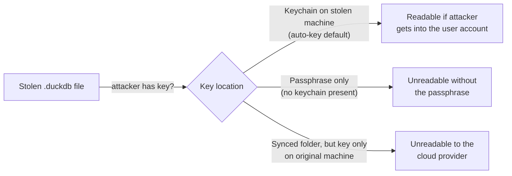

<!-- Last reviewed: 2026-05-17 -->
# Database & Security

MoneyBin encrypts every profile database at rest by default. This guide covers the encryption model, key lifecycle, headless and multi-machine deployments, backup and restore, disaster recovery, and what a stolen laptop or synced folder actually reveals. There is no unencrypted mode — every `.duckdb` file MoneyBin creates is AES-256-GCM encrypted from the moment it exists.

If you only read one other doc on this topic, read the [Threat Model](threat-model.md). It is the honest one-pager about what encryption protects and what it doesn't.

---

## At-rest encryption

- **Algorithm.** AES-256-GCM, provided natively by DuckDB. When MoneyBin opens the database it issues an `ATTACH '<path>' AS moneybin (TYPE DUCKDB, ENCRYPTION_KEY '...')` — there is no separate cipher layer.
- **Key length.** 256 bits (32 bytes), hex-encoded as a 64-character string.
- **Per-profile keys.** Each profile has its own encryption key, stored under its own keychain service name (`moneybin-<profile>`). Switching profiles re-attaches the active database with a different key — there is no global "MoneyBin key".
- **DuckDB temp / spill files.** Automatically encrypted with the same key whenever DuckDB writes them. You cannot accidentally leak a spill file in plaintext.
- **File location.** `<base>/profiles/<profile>/moneybin.duckdb`. `<base>` resolves in this order:
  1. `MONEYBIN_HOME` env var (explicit override)
  2. `<cwd>/.moneybin` when `MONEYBIN_ENVIRONMENT=development` or you're inside the MoneyBin repo checkout
  3. `~/.moneybin/` (the normal user install)

  So a typical install puts the database at `~/.moneybin/profiles/default/moneybin.duckdb`.
- **File permissions.** On POSIX systems the database file is created with mode `0600` (user read/write only). If you re-open a database with looser permissions, MoneyBin logs a warning telling you to run `chmod 600 <path>`.

You don't have to do anything to "turn encryption on" — it's always on, and there is no flag to disable it.

---

## Key storage and lifecycle

MoneyBin has two key modes. Both end up with a 256-bit key that DuckDB uses verbatim; they differ in how that key is produced.

### Auto-key mode (default)

`moneybin db init` (no flags) generates a fresh random 256-bit key and writes it to the OS keychain:

- macOS → Keychain Services
- Linux → Secret Service (GNOME Keyring, KWallet, etc.)
- Windows → Credential Locker

You never see the key, and you don't enter a passphrase on any command. The moneybin process reads the key from the keychain on each invocation; the OS gates that read on whatever policy your keychain enforces (typically: "this user is logged in").

### Passphrase mode

`moneybin db init --passphrase` prompts for a passphrase, then derives a 256-bit key from it using **Argon2id**. A random 16-byte salt is generated at init and stored alongside the derived key in the keychain. The derived key is what DuckDB uses; the passphrase itself is never persisted.

Parameter defaults live in `DatabaseConfig` (`src/moneybin/config.py`): `time_cost=3`, `memory_cost=65536` KiB, `parallelism=4`, `hash_len=32` bytes. The rationale for these values is in [`docs/specs/privacy-data-protection.md`](../specs/privacy-data-protection.md).

> **Important:** changing the Argon2id parameters after a database has been created locks you out — the new derived key won't match the file's encryption. Stick with the defaults unless you understand the consequence.

`moneybin db unlock` prompts for the passphrase, re-derives the key with Argon2id using the stored salt, and writes the derived key into the keychain so subsequent commands can open the database without re-prompting.

### Lifecycle commands

```bash
# First-time setup. Creates the profile DB and stores its key.
moneybin db init                 # auto-key mode
moneybin db init --passphrase    # passphrase mode

# Drop the key from the keychain. Subsequent commands fail until you re-unlock.
moneybin db lock

# Re-derive the key from a passphrase and cache it in the keychain.
# (Only meaningful for passphrase-mode databases.)
moneybin db unlock

# Show metadata without unlocking. Reports lock state and key mode.
moneybin db info

# Print the current key to stdout (treat as root password).
moneybin db key show

# Generate a new key and re-encrypt the database in place.
moneybin db key rotate

# Reserved subcommands — print "not yet implemented" today.
moneybin db key export
moneybin db key import
moneybin db key verify
```

**What "unlock" means here.** `db unlock` writes the derived key into the OS keychain — so "unlocked" is a *system-wide* state, not a shell-session state. Every moneybin process running under the same user can read the key for as long as it's in the keychain. `db lock` clears it. Locking your laptop or rebooting does not automatically lock the MoneyBin database; the keychain entry survives until you explicitly run `db lock` or delete it from the OS keychain UI. The OS keychain itself may be encrypted at rest and gated on your login session — that's an OS-level property, not a MoneyBin one; check your platform's keychain documentation if you want tighter scoping.

### Key management

- **`moneybin db key show`** prints the 64-character hex encryption key to stdout. Treat it like a root password — anyone with this string and the database file can read everything. The CLI emits a security warning to stderr alongside the key. Useful for: writing the key down somewhere durable before you can lose it.
- **`moneybin db key rotate`** generates a new random key, opens both old and new databases with DuckDB's `COPY FROM DATABASE old_db TO new_db`, and atomically replaces the file. The old key is invalidated. **Existing backups are still encrypted with the old key** — they don't get re-encrypted. If you rotate, save the new key (`db key show`) and consider taking a fresh backup right after. There is no `--passphrase` or `--auto` flag on `db key rotate`; it always emits a fresh random key.
- **`moneybin db key export` / `import` / `verify`** are reserved subcommands that print "not yet implemented" today. The intent is an encrypted-envelope export for off-machine recovery; until those ship, use `db key show` and store the output in a password manager or paper-in-a-safe.

### Headless and env-var key injection

For environments without an OS keychain — CI runners, headless Linux boxes, Docker containers, NAS appliances — MoneyBin reads the encryption key from `MONEYBIN_DATABASE__ENCRYPTION_KEY`.

- **Format.** A 64-character lowercase hex string — the *raw 256-bit key DuckDB uses*, not a passphrase. Obtain it from a machine that already has the database initialized: `moneybin db key show`.
- **Precedence.** Keychain entry takes priority; the env var is read only when the keychain has no entry (or no keyring backend exists). On a normal desktop install, setting the env var has no effect unless you've also run `db lock`.
- **Argon2id is bypassed.** The env var *is* the derived key — no passphrase derivation happens. Anyone who can read your environment can read your database.
- **First-init persistence.** When `db init` runs with the env var set and a working keyring backend, the env-supplied key is persisted to the keychain so subsequent commands still work after the env var is unset. With *no* keyring backend, `db init` refuses to mint a fresh random key (it would be lost on process exit) — the env var must stay set for every invocation.
- **Where the key leaks from.** `/proc/<pid>/environ`, a systemd unit's `Environment=` line, a `.env` file on disk, shell history. Treat those locations like the key itself — mode `0600`, dedicated user, never in source control.

---

## Headless and cron deployments

**Systemd.** Put the key in a unit-scoped `EnvironmentFile` (`chmod 0600`, owned by the service user) rather than the unit body, which is world-readable on most distros:

```ini
[Service]
Type=oneshot
User=moneybin
EnvironmentFile=/etc/moneybin/secrets.env
ExecStart=/usr/local/bin/moneybin import inbox sync
```

**Cron.** Put the export in a `chmod 0700` script, not the crontab itself (crontabs are world-readable):

```bash
#!/usr/bin/env bash
set -euo pipefail
export MONEYBIN_DATABASE__ENCRYPTION_KEY="$(cat /home/moneybin/.moneybin-key)"  # chmod 0600
exec /usr/local/bin/moneybin import inbox sync
```

**Docker.** Mount the data volume, pass the key via env:

```bash
docker run --rm \
  -v ~/.moneybin:/root/.moneybin \
  -e MONEYBIN_DATABASE__ENCRYPTION_KEY="$(moneybin db key show)" \
  moneybin:latest import inbox sync
```

Most container images have no OS keyring running; the env var fallback is the supported path. `db init` refuses to mint a fresh key inside such a container — initialize the database on a machine that does have a keyring, capture the key with `db key show`, then move both the file and the env var to the container. The same applies to headless Debian, Alpine, or any Linux without GNOME Keyring / KWallet running: there is no fallback file-store, so unset env var + no keyring → every command fails with a clear "set `MONEYBIN_DATABASE__ENCRYPTION_KEY`" error.

---

## Multi-machine sync

The encrypted DB file is portable; the key is not.

- **The file moves freely.** rsync, scp, a cloud-sync folder, an external drive — all fine. Opaque without the key.
- **The key follows separately.** Until `db key import` ships, set `MONEYBIN_DATABASE__ENCRYPTION_KEY` on the second machine. `db init` there — with the env var set and a working keyring — persists the key so subsequent commands don't need the env var.
- **Concurrent access will corrupt the file.** DuckDB is a single-writer embedded engine. Two machines attaching the same `.duckdb` over NFS, SMB, or a cloud-sync folder *at the same time* will corrupt it. Use **active-passive** (one writer, the other read-only or stopped), **snapshot-and-copy** (`db backup` on source, restore on target — the two machines never share an open file), or **pause sync during writes** (cloud-sync clients racing DuckDB are the same hazard as two machines).

### Cross-machine restore walkthrough

To move a working profile from machine A to machine B:

```bash
# On machine A — capture the key and a snapshot.
moneybin db key show > /tmp/moneybin.key            # chmod 0600 immediately
moneybin db backup -o /tmp/moneybin-snapshot.duckdb
scp /tmp/moneybin.key /tmp/moneybin-snapshot.duckdb userB@machineB:~/

# On machine B — env var seeds the keychain, then restore.
export MONEYBIN_DATABASE__ENCRYPTION_KEY="$(cat ~/moneybin.key)"
moneybin db init --yes
moneybin db restore --from ~/moneybin-snapshot.duckdb --yes
unset MONEYBIN_DATABASE__ENCRYPTION_KEY && shred -u ~/moneybin.key   # rm -P on macOS
```

Machine B's keychain now holds the key; verify with `moneybin db info`.

---

## Backup and restore

### What `db backup` does

```bash
# Default: writes ~/.moneybin/profiles/<profile>/backups/moneybin_<timestamp>.duckdb
moneybin db backup

# Custom destination
moneybin db backup -o /path/to/snapshot.duckdb
```

It's a `shutil.copy2` of the encrypted file with `0600` permissions applied. The backup is **encrypted with the same key as the live database** — the file you copy off the machine is opaque without that key.

### What `db restore` does

```bash
# Interactive: lists backups in the profile's backup dir and prompts
moneybin db restore

# Pick the newest backup non-interactively
moneybin db restore --latest --yes

# Restore from an explicit path
moneybin db restore --from /path/to/snapshot.duckdb --yes
```

Before overwriting the live database, MoneyBin takes an automatic safety backup (`moneybin_<timestamp>_pre_restore.duckdb`) so you can roll back. After the copy, it tries to open the restored file with the current key. If the open fails, the most likely cause is a backup taken before a key rotation — MoneyBin tells you so and points at `MONEYBIN_DATABASE__ENCRYPTION_KEY` plus `db key rotate` for recovery.

### Backup automation

`db backup` is a one-shot snapshot. **MoneyBin does not manage retention** — old snapshots accumulate until you prune them. A working cron pattern:

```bash
#!/usr/bin/env bash
set -euo pipefail
export MONEYBIN_DATABASE__ENCRYPTION_KEY="$(cat /home/moneybin/.moneybin-key)"
DEST=/srv/backups/moneybin/moneybin_$(date +%Y-%m-%d).duckdb
moneybin db backup -o "$DEST"
find /srv/backups/moneybin -name 'moneybin_*.duckdb' -mtime +30 -delete
rsync -a /srv/backups/moneybin/ offsite:/backups/moneybin/
```

Two caveats: (1) check `db ps` before snapshotting or schedule for off-hours — copying mid-write produces a corrupt snapshot; (2) the off-site target stores the same opaque file, but the key still has to live somewhere, so treat the remote host accordingly.

### Restore verification (without clobbering live data)

There is no `db restore --dry-run` today. To verify a backup is restorable, restore it into a scratch profile:

```bash
moneybin profile create restore-test
moneybin --profile restore-test db init --yes
moneybin --profile restore-test db restore --from /path/to/snapshot.duckdb --yes
moneybin --profile restore-test db info        # confirm it opens
```

A backup you've never restored is an assumption, not a backup. Do this at least once after the initial setup, and again whenever you change the backup pipeline.

### What `db backup` does *not* back up

**The keychain entry.** `db backup` copies the database file; it does not copy the OS keychain entry that holds the key. If you lose access to the keychain (new machine, deleted keychain, OS reinstall) and you don't have the key written down elsewhere, every backup you ever made is also unrecoverable. See **Disaster recovery** below.

---

## Disaster recovery

The encryption is real. There is no vendor reset, no master key, no support email that can decrypt your file. Plan for the failure modes explicitly.

### Lost key + lost backups = irrecoverable

If both the keychain entry and any written-down copy of the key are gone, the database file is permanently opaque. Mitigation, in priority order:

1. **Write the key down once.** After `db init`, run `moneybin db key show` and store the output in a password manager *and* a paper copy in a safe. Paper survives drive failures, malware, and OS reinstalls.
2. **Take regular backups** — see `db backup` above.
3. **Test a restore at least once.** A backup you've never restored is an assumption.

### Keychain wiped (OS reinstall, profile reset, new machine)

If the file survives but the keychain entry doesn't, the next command fails with `DatabaseKeyError: encryption key not found`. Recover by re-supplying the key — either durably (re-run `db init` with the env var set so it persists back into the keychain) or ad-hoc (`MONEYBIN_DATABASE__ENCRYPTION_KEY=<hex> moneybin db info` for a one-shot read).

### Passphrase forgotten

There is no recovery. Argon2id with the documented parameters makes offline brute-force computationally infeasible for a strong passphrase; a weak passphrase (dictionary word, short, reused) is vulnerable to brute force from anyone who has the file and the keychain salt. Treat passphrase mode as a strict upgrade over auto-key *only* if you can generate and remember a high-entropy passphrase. Otherwise auto-key plus a written-down key is safer.

### Switching modes (auto-key ↔ passphrase)

There is no in-place CLI conversion today. `db key rotate` always emits a fresh random key — no `--passphrase` flag — and `db init --passphrase` on an existing database fails because the file is already encrypted under the old key. The manual workaround starts from a fresh shell:

```bash
moneybin db backup -o /tmp/snapshot.duckdb         # snapshot under the old key
moneybin db key show > /tmp/old.key                # recovery insurance
rm ~/.moneybin/profiles/default/moneybin.duckdb
moneybin db init --passphrase                      # prompts for the new passphrase
moneybin db restore --from /tmp/snapshot.duckdb --yes
moneybin db key rotate                             # re-encrypt the restored bytes
```

The catch: `db restore` copies the snapshot file in place, so the restored bytes are still encrypted under the *old* key until `db key rotate` re-encrypts them. After rotation the file is protected by a fresh random key — full passphrase coverage of restored data requires the `db key import` / `db key export` envelopes that aren't shipped today.

---

## Threat model: what a stolen laptop or synced folder reveals

Encryption is a layer, not a magic shield. The honest answers:



- **Encrypted DB file alone, no key.** Unreadable. AES-256-GCM with a 256-bit random key has no shortcut. This is the case for: a stolen disk image, a `.duckdb` file pulled out of a cloud-sync folder by the cloud provider, a backup tape, a leaked rsync target.
- **Auto-key + stolen laptop with the user logged in.** The attacker has the key. The OS keychain is unlocked because your session is unlocked. The practical defense is **full-disk encryption + screen-lock policy**, not the application-level encryption — MoneyBin already did its job by keeping the key out of the file.
- **Passphrase mode + stolen file.** Unreadable to anyone without the passphrase. Argon2id makes offline brute force expensive; the practical defense is **the strength of your passphrase**. Forget the passphrase, lose the data — there is no reset.
- **Synced folder (iCloud, Dropbox, OneDrive) on one machine, key on the same machine.** The file in the cloud is encrypted; the cloud provider cannot read it. But anyone with logged-in access to the *original* machine has both the file and the key, so the encryption protects you against the cloud provider, not against the person at your unlocked desk.
- **Synced folder, key only on another machine.** The file on the second machine is unreadable until you put the key there. This is the deliberate behaviour, not a bug — your data doesn't follow the file just because the file follows the sync.

The full treatment (malware, AI-vendor data flow, the forgotten-passphrase trap) is in the [Threat Model](threat-model.md).

---

## Migrations and schema evolution

MoneyBin applies schema migrations automatically on first open after a package update. You don't normally invoke the migration system; the power-user commands are there when you want to.

```bash
# Show applied, pending, and drift state
moneybin db migrate status

# Apply pending migrations
moneybin db migrate apply

# Preview pending without executing
moneybin db migrate apply --dry-run
```

Behavior:

- **Forward-only.** Migrations apply in version order; there is no down-migration. Recovery from a bad migration is "restore from backup, fix the code, re-apply".
- **Atomic per step.** Each migration runs inside a transaction; a failure rolls back that step. Subsequent migrations don't run until the failure is resolved.
- **Self-heal on body changes.** If a previously-failed migration's body has changed since the failure (e.g. you pulled a fix), the runner clears the stale failure row and retries automatically — no manual cleanup required.
- **Drift detection.** `migrate status` reports if materialized `core.*` tables are missing columns the current models expect; fix with `moneybin transform apply` to rebuild affected SQLMesh models.

After a schema change, downstream views and reports are refreshed by the data pipeline; see the [Data Pipeline guide](data-pipeline.md) for what gets re-derived and when.

---

## Day-to-day operational commands

```bash
# Show processes holding the DB file open (useful before backup/restore)
moneybin db ps

# Send SIGTERM to those processes (last resort for stuck writers)
moneybin db kill

# Interactive DuckDB SQL shell, encrypted DB pre-attached as "moneybin"
moneybin db shell

# One-shot SQL query, supports --output text|json|csv|markdown|box
moneybin db query "SELECT COUNT(*) FROM core.fct_transactions"

# Profile/path/encryption state, without unlocking if locked
moneybin db info
```

`db shell` and `db query` build a short-lived temporary init script (`0600` permissions) that runs `ATTACH '<path>' (..., ENCRYPTION_KEY '...')` and then `USE moneybin`. The DuckDB CLI binary must be installed separately (see [duckdb.org/docs/installation](https://duckdb.org/docs/installation/)) — `db shell` exits with a hint if it's missing. There's also `moneybin db ui` for browser-based read-only exploration; it's not relevant to the security model and uses the same attach pattern.

---

## What's intentionally not protected

- **Memory of running MoneyBin processes.** While the database is unlocked, the encryption key lives unmasked in the moneybin process's memory. A debugger or memory dump on the live process recovers it. The defense is OS-level.
- **Tool results sent to a hosted LLM.** If you connect Claude Desktop, ChatGPT, Cursor, or another MCP client and ask a question, the data needed to answer that question goes to the model provider, per the MCP host's privacy policy. This is the entire point of the AI integration — see [MCP Server](mcp-server.md) for the trust model and what each surface sends. MoneyBin does not silently scrub or redact tool output before it leaves the machine. A future opt-in redaction layer is on the roadmap; it is not shipped today.
- **Logs.** `SanitizedLogFormatter` strips PII patterns (SSNs, account numbers, dollar amounts) at the formatter layer as a safety net. It is *not* a guarantee — an explicit `logger.error(f"description={user_description}")` against a non-pattern value still writes that value to disk. Treat the log directory (`<base>/profiles/<profile>/logs/`) as semi-trusted: don't paste log files into public bug reports without skimming them first.
- **Anyone with a live unlocked keychain session on the same machine.** Encryption at rest is a defense against snapshots of your data — disk images, sync replicas, backup tapes. It is not a defense against an attacker who can already act as you on a machine that's unlocked and running. Use a screen lock and `db lock` when you walk away.

---

## See also

- [Threat Model](threat-model.md) — what's protected, what isn't, including the AI-vendor data flow.
- [Profiles](profiles.md) — how per-profile databases and keychain entries are isolated.
- [Data Pipeline](data-pipeline.md) — what re-derives after a schema change.
- [MCP Server](mcp-server.md) — sensitivity tiers and what tool output reveals.
