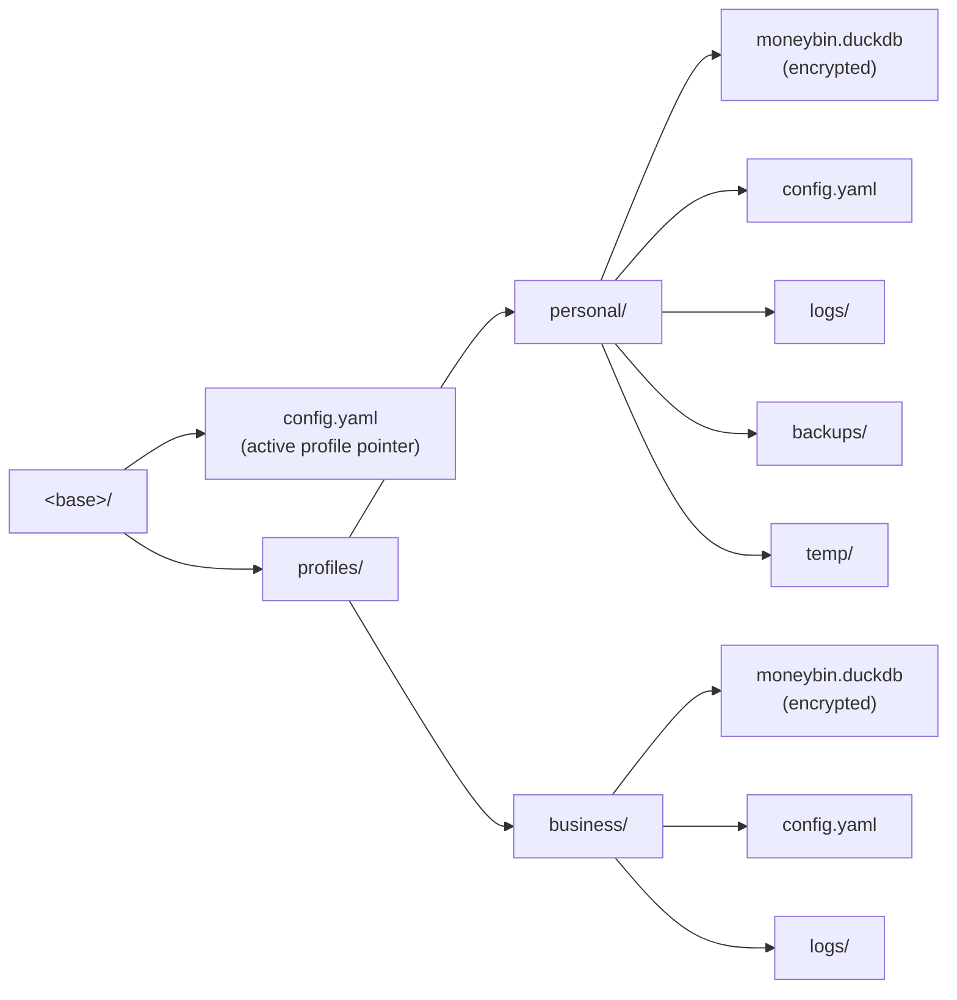

<!-- Last reviewed: 2026-05-17 -->

# Profiles

A profile is the isolation boundary in MoneyBin — its own encrypted DuckDB file, its own keychain entry, its own logs and metrics. This guide covers what a profile is, how to create and manage them, how to switch between them, and the edge cases worth knowing about before you delete one or move it to a second machine.

## What a profile is

A profile is a directory under `<base>/profiles/<name>/`, holding everything that belongs to one logical user, household, or environment. Nothing leaks across profile boundaries: separate file, separate key, separate audit trail.



What lives inside a profile:

- **Database.** `<base>/profiles/<name>/moneybin.duckdb`, AES-256-GCM encrypted at rest. Holds every `raw`, `prep`, `core`, `reports`, and `app.*` table. Created with file mode `0600`.
- **Encryption key.** Either a per-profile keychain entry under service name `moneybin-<name>` (auto-key mode, default) or a per-profile passphrase you type to unlock (passphrase mode). Profiles never share keys.
- **Logs.** `<base>/profiles/<name>/logs/` — daily-rotating files written by the `SanitizedLogFormatter`. One profile's logs never mix with another's.
- **Metrics.** The `app.metrics` table lives inside each profile's database, so metric counters are profile-internal.
- **Audit trail.** The `app.audit_log` table is also profile-internal — privacy consent grants, redaction decisions, and tool invocations are scoped to the profile that recorded them.
- **Config.** A profile-level `<base>/profiles/<name>/config.yaml` holds overridable defaults (logging level, sync enable flag, encryption mode); the user-level `<base>/config.yaml` holds the active-profile pointer.
- **Backups.** `db backup` writes into `<base>/profiles/<name>/backups/` by default; `profile delete` removes the entire profile directory, including backups stored there.

### Base directory resolution

`<base>` is the MoneyBin home, resolved in this order (first match wins):

1. `MONEYBIN_HOME` env var (explicit override)
2. `MONEYBIN_ENVIRONMENT=development` → `<cwd>/.moneybin`
3. CWD is the MoneyBin repo checkout → `<cwd>/.moneybin`
4. Default → `~/.moneybin`

So a typical install puts a profile at `~/.moneybin/profiles/<name>/`. See [`database-security.md`](database-security.md) for the full resolution rule and what it means for backups and sync.

## Profile lifecycle CLI

### `moneybin profile create <name>`

Creates a new profile end-to-end:

- Normalizes the name (lowercase, hyphens — `"Alice Work"` becomes `alice-work`).
- Creates `<base>/profiles/<name>/` with `logs/` and `temp/` subdirectories.
- Writes a default `config.yaml` into the profile directory.
- Generates a fresh AES-256 encryption key and stores it under the keychain service `moneybin-<name>`.
- Initializes the encrypted DuckDB file at `<base>/profiles/<name>/moneybin.duckdb` and runs the baseline schema.
- Optionally creates the import-inbox layout at `~/Documents/MoneyBin/<name>/{inbox,processed,failed}/` (`--init-inbox` to force, `--no-init-inbox` to skip; prompts interactively when neither is set).

```bash
moneybin profile create personal
moneybin profile create business --init-inbox
```

If any step fails, the partially created profile directory is rolled back so you can retry without hitting a "profile already exists" error.

#### Name collisions

`profile create` calls `mkdir(exist_ok=False)`, so it refuses outright if a directory at `<base>/profiles/<normalized_name>/` already exists — even an empty one with no `config.yaml`. To recover from a stale dir, remove it manually (`rm -rf <base>/profiles/<name>`) and re-run.

A **stale keychain entry** from a previously-deleted profile is the more interesting failure mode: `profile delete` removes the directory but best-effort-deletes the keychain entry (silent debug-log on keyring failure). If keyring cleanup failed at delete time, the next `profile create <same-name>` overwrites the entry with the new key, which is the intended behavior. To verify or hand-clean before recreating, target the service name `moneybin-<name>`:

- **macOS:** `security delete-generic-password -s moneybin-<name> -a DATABASE__ENCRYPTION_KEY` (and `-a DATABASE__PASSPHRASE_SALT` for passphrase-mode entries).
- **Linux (Secret Service):** `secret-tool clear service moneybin-<name> username DATABASE__ENCRYPTION_KEY`.

The CLI does not yet expose a "list / clean orphan keychain entries" command.

### `moneybin profile list`

Lists every profile under `<base>/profiles/` (any subdirectory with a `config.yaml`), marking the active one. Supports `--output json` for scripting:

```bash
moneybin profile list
#   personal (active)
#   business

moneybin profile list --output json
```

The JSON envelope's `data` is a list of `{name, active, path}` objects.

### `moneybin profile switch <name>`

Sets `<name>` as the active profile. The active profile is persisted in the user-level config file `<base>/config.yaml` under the `active_profile` key. Subsequent invocations of `moneybin` with no `--profile` flag and no `MONEYBIN_PROFILE` env var pick up this value.

```bash
moneybin profile switch business
moneybin profile list   # shows business as (active)
```

> **`switch` is a configuration write only.** It updates a single line in `<base>/config.yaml`. No database is opened, no key is touched, no migration runs. Switching to a profile whose database is missing or corrupt does not surface that problem until the next command that actually reads it. Use this when you want to flip the default without any read-side work.

### `moneybin profile show [<name>]`

Prints the resolved settings for a profile (defaults to the active one). Fields: name, active flag, profile directory, database path, database-exists flag, and the parsed `config.yaml`. `--output json` returns the same data as a `ResponseEnvelope` for scripting.

### `moneybin profile set <section>.<field> <value>`

Writes a value into the profile-level `config.yaml`. Keys are two-level dotted (`logging.level`, `sync.enabled`, `database.encryption_key_mode`). Boolean strings (`true`, `false`) and digit-only strings are coerced to native types before writing. Targets the active profile unless `--profile/-p` overrides it.

```bash
moneybin profile set logging.level DEBUG
moneybin profile set sync.enabled true --profile business
```

This only updates the per-profile YAML — env-var overrides like `MONEYBIN_DATABASE__PATH` still take precedence at load time.

### `moneybin profile delete <name>`

Removes a profile permanently:

- Deletes the entire `<base>/profiles/<name>/` tree, including `logs/`, `backups/`, `temp/`, the `config.yaml`, and the encrypted database file.
- Best-effort-clears the profile's keychain entries (`DATABASE__ENCRYPTION_KEY` and `DATABASE__PASSPHRASE_SALT` under service `moneybin-<name>`). Sibling profiles' keychain entries are never touched.
- Refuses to delete the currently active profile — switch away first.
- Prompts for confirmation; pass `--yes/-y` to skip the prompt for scripting.

> **There is no undelete.** No grace period, no trash directory, no "are you sure" re-typing of the profile name beyond the single confirm prompt. The directory tree is removed with `shutil.rmtree`. The keychain entry — and therefore the only copy of the encryption key — is removed immediately after. If you deleted in error: check `~/.Trash` on macOS or your filesystem snapshot tool (Time Machine, ZFS / Btrfs snapshots, restic, Borg) before doing anything else. The OS keychain entry is gone the moment delete finishes; restoring the `.duckdb` file alone is not enough — you must also have an off-profile copy of the key. **Before deleting any profile you care about, run `db backup -o <path-outside-profile>` to a location that won't be swept by the delete, and save the key (`db key show`) somewhere safe.**

```bash
moneybin profile switch personal

# Snapshot to a path outside the profile tree before deleting.
moneybin --profile business db backup -o ~/backups/business-final.duckdb.backup
moneybin --profile business db key show   # record the key out of band

moneybin profile delete business -y
```

## Selecting a profile per command

Three ways to pick the profile a command runs against, in precedence order:

1. **`--profile <name>` / `-p <name>` flag** — top-level flag, wins over everything (including an exported `MONEYBIN_PROFILE`). Use for one-off invocations against a non-active profile without changing the saved default or your shell environment.
2. **`MONEYBIN_PROFILE` env var** — shell-session-scoped override. Wins over the saved default, loses to the flag.
3. **Saved active profile** — the value persisted by `profile switch` (or set by the first-run wizard) in `<base>/config.yaml`.

```bash
# One-off: import into 'business' without changing the active profile,
# even if MONEYBIN_PROFILE=personal is exported.
moneybin --profile business import file statement.qfx

# Whole shell session
export MONEYBIN_PROFILE=business
moneybin import status     # uses business

# Persistent default
moneybin profile switch business
```

## Multi-profile workflows

**Personal + business.** Two profiles, separate files, separate keys. Switch for routine work; use `--profile` for cross-profile commands.

**Production + test / scratch.** Keep a scratch profile distinct from your real data — restore a backup into it, validate, then delete it:

```bash
moneybin profile create scratch
moneybin --profile scratch db restore --from ~/.moneybin/profiles/personal/backups/moneybin_20260517.duckdb
moneybin --profile scratch reports summary
moneybin profile delete scratch -y
```

**Backup automation across every profile.** A simple loop snapshots each profile to a central directory. Cross-link [`database-security.md`](database-security.md#backup-automation) for the cron + retention pattern.

```bash
DEST="/backups/$(date +%F)"
mkdir -p "$DEST"
for p in $(moneybin profile list --output json | jq -r '.data[].name'); do
  moneybin --profile "$p" db backup -o "$DEST/$p.duckdb.backup"
done
```

## Profile and MCP

The MCP server is bound to **one profile per process**. `moneybin mcp serve` resolves the profile once at startup (flag → env → saved default), unlocks that profile's database, and keeps the connection for the session lifetime.

- **Switching profiles between sessions:** supported. Restart the server with `--profile <name>` or after `profile switch`.
- **Switching profiles mid-session is not supported.** The DuckDB connection is bound to one profile's key.
- **`profile switch` in another shell does NOT affect a running MCP server.** It only updates the active-profile pointer in `<base>/config.yaml`, which is read at the *next* unbound CLI or MCP startup. The already-running server keeps serving its original profile until you stop it.
- **Multiple profiles at once:** run separate `moneybin mcp serve --profile <name>` processes per profile. Stdio MCP clients spawn each as a child process; each client config entry points at one profile.

## Multi-machine workflows

A profile's encrypted DuckDB file is portable across machines; the OS keychain entry is not. The supported moves:

- **Same profile on a second machine.** Copy `<base>/profiles/<name>/moneybin.duckdb` (and any backups you want to keep) to the second machine. Transfer the key out of band: `moneybin db key show` on the source, then on the target either run `db init` with `MONEYBIN_DATABASE__ENCRYPTION_KEY=<hex>` set (this re-persists the key into the local keychain) or keep the env var set for every invocation. See [`database-security.md`](database-security.md) "Multi-machine sync" for the full walkthrough.
- **Sync to moneybin-sync from two machines under the same profile name.** moneybin-sync treats the upload identity as the authenticated user; the profile name on each machine is a local label, not part of the remote identity. Sync cursor state is tracked per local profile in `app.*` tables, so two machines syncing the same logical user will each maintain their own cursors and last-sync timestamps. Conflicts at the row level are resolved server-side per the sync contract.
- **What is NOT supported: shared live access to one file from two machines.** DuckDB is single-writer. A `.duckdb` file on NFS, SMB, Dropbox, iCloud, or any sync-on-save folder is a corruption hazard the moment a second process opens it. Active-passive (snapshot, copy, restore on the other end) is fine; concurrent open is not.

## Headless and no-keychain operation

Auto-key mode (the default) requires a working OS keyring backend. Self-hosters running MoneyBin in a place that has no keyring — Docker containers, headless Linux servers without GNOME Keyring or KWallet running, CI runners, NAS appliances — need to know what fails and what falls through.

The actual code path (`src/moneybin/secrets.py`):

- **Reads** (`SecretStore.get_key`) — try keychain first; if the backend raises `NoKeyringError`, fall through to the `MONEYBIN_<name>` env var. So an env-supplied key works for every read path even with no keyring at all.
- **Writes** (`SecretStore.set_key`) — try keychain; if no backend, raise `SecretStorageUnavailableError`. There is no file-backed or in-memory fallback. **This means `profile create` and `db init` cannot mint and persist a fresh random key on a no-keyring host** — the freshly minted key would be lost on process exit.
- **Deletes** (`SecretStore.delete_key`) — best-effort; no-keyring becomes a no-op.

The practical recipe for headless deployments:

1. On a machine that *does* have a keyring, run `moneybin profile create <name>` and capture the key: `moneybin --profile <name> db key show`.
2. Copy `<base>/profiles/<name>/moneybin.duckdb` to the headless target.
3. On the target, export `MONEYBIN_DATABASE__ENCRYPTION_KEY=<hex>` before invoking moneybin. Every command — CLI, `mcp serve`, cron jobs — needs the env var set in its environment.
4. If the headless target *does* have a keyring (unusual but possible), `db init` with the env var set will persist the key into it and you can stop exporting the env var afterwards.

Passphrase mode (`profile create --passphrase` once it lands; today via `db init --passphrase` on a freshly created profile) sidesteps the auto-key trap: the passphrase is the input, the derived key is held in memory for the command's lifetime, and an env-var fallback is still available via `MONEYBIN_DATABASE__ENCRYPTION_KEY` after `db unlock`. See [`database-security.md`](database-security.md) "Headless and cron deployments" for Docker, systemd, and cron patterns.

## Multi-user on one machine

A profile's keychain entry belongs to the OS user that ran `profile create`. Two human users on the same Linux box cannot share an auto-key profile via the keychain alone — User A's GNOME Keyring is not readable by User B.

The honest current state for shared-host deployments:

- **Per-user profile trees (default).** Each user runs MoneyBin under their own account; `<base>` resolves to `~/.moneybin/profiles/...` per user; keychain entries are per-user. Profiles are fully isolated by Unix ownership; nothing else to do.
- **Shared profile tree.** Set `MONEYBIN_HOME=/var/lib/moneybin` (or similar) in every user's environment. Use passphrase mode, or supply the key via `MONEYBIN_DATABASE__ENCRYPTION_KEY` (e.g., from a root-owned `/etc/moneybin/env` that each authorized user can source). Lock down `/var/lib/moneybin` with Unix permissions: typically `chown root:moneybin /var/lib/moneybin && chmod 2770 /var/lib/moneybin` so only group members read or write.
- **Concurrent writes to the same profile remain unsafe.** DuckDB enforces single-writer per file; two simultaneous writers from two OS users to the same profile will serialize at best and corrupt at worst. Use separate profiles per user even when the tree is shared.

### File permissions

MoneyBin sets `0600` on the DuckDB file when it's created or copied (backup, restore, key rotate) and on per-day log files. It does **not** chmod the profile directory itself — directory mode follows your umask at `mkdir` time, which on most desktop installs is `0755`. For headless or multi-user deployments, tighten by hand after `profile create`:

```bash
chmod 700 ~/.moneybin/profiles/<name>
```

The inbox layout (when `--init-inbox` is used) is created with `0700` directories and `0600` files explicitly.

## Profile and encryption key

Every profile has its own key, stored under its own keychain service name. The key relationship is mechanical:

- `profile create` generates a fresh key (auto-key mode) or derives one from your passphrase (passphrase mode) and stores it under `moneybin-<name>`.
- `profile switch` does not touch keys — the next command that opens the database re-attaches with the new profile's key.
- `profile delete` removes the encrypted file and best-effort-removes the keychain entry.

See [`database-security.md`](database-security.md) for the full key lifecycle, passphrase mode, headless deployments, key rotation, and cross-machine transfer.

## Profile and sync

Each profile owns its own sync identity: its own `sync.server_url`, its own server credentials, its own list of remote connections (Plaid items, future cloud sources). Switching profiles switches the sync identity entirely — a `moneybin sync pull` after `profile switch` talks to whatever server and credentials the new profile has configured, with no leak from the previous profile.

## Migration between profiles

There is no `profile copy` or `profile rename`. The supported migration path uses backup/restore — the encrypted snapshot is re-encrypted under the new profile's key on restore, and the `app.audit_log` and `app.metrics` rows ride along inside the database file unchanged:

```bash
moneybin --profile source db backup
moneybin profile create target
moneybin --profile target db restore \
  --from ~/.moneybin/profiles/source/backups/moneybin_<timestamp>.duckdb
moneybin profile switch target
moneybin profile delete source -y   # only after you've verified target
```

## What's not supported today

- **Profile rename / copy / clone.** Use the backup/restore migration path above.
- **Shared live access to one profile from two machines.** Active-passive snapshot-and-copy is fine; concurrent open is a corruption hazard (DuckDB is single-writer).
- **Multi-user concurrent writes to one profile.** Use separate profiles per user.
- **MCP serving multiple profiles from one process.** Run one `mcp serve` process per profile.
- **Mid-session profile switch in MCP.** End the session, restart with `--profile <name>`.
- **Undelete / trash / grace period on `profile delete`.** Deletion is irreversible — keep an off-profile backup and the key.
