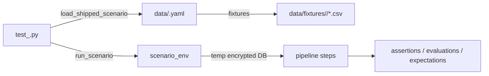

<!-- Last reviewed: 2026-05-17 -->
# Scenario Authoring Guide

How to write a scenario test that exercises the whole pipeline end-to-end against a synthetic dataset or a hand-authored fixture, with assertions that survive code changes. Companion: [`synthetic-data.md`](synthetic-data.md) covers the generator that scenarios consume.

This guide is for contributors who are reproducing a bug, locking in regression coverage, covering a new pipeline stage, or asserting a new data invariant. It is normative: the taxonomy and the independent-derivation rule come from [`docs/specs/testing-scenario-comprehensive.md`](../specs/testing-scenario-comprehensive.md) and [`.claude/rules/testing.md`](../../.claude/rules/testing.md).

The framing for "what is a scenario test versus a unit or E2E test" lives in [`.claude/rules/testing.md`](../../.claude/rules/testing.md#test-coverage-by-layer). Scenarios are reserved for whole-pipeline correctness — they open a real encrypted DuckDB in a tempdir, boot a SQLMesh context, and run the configured pipeline through every stage. They live under `@pytest.mark.scenarios` + `@pytest.mark.slow` so the unit-test loop stays fast.

---

## Bug-Repro Recipe

This is the path most contributors land on. If you have a bug — a broken import, a wrong category assignment, a dedup that collapsed records that should have stayed separate — this is the seven-step recipe.

1. **Reproduce the bug locally with a minimal input.** Trim a CSV down to 3–5 rows, including the one that triggers the bug. If the bug needs the synthetic generator, narrow it to one persona + one year + one seed.
2. **Copy the canonical scenario test.** `cp tests/scenarios/test_basic_full_pipeline.py tests/scenarios/test_<bug-slug>.py`. The slug should describe the broken behavior, not the input — `csv-amazon-trailing-comma`, not `amazon-csv-bug`.
3. **Drop the minimal input under `tests/scenarios/data/fixtures/<bug-slug>/`.** Anonymize first (see [Fixture from real data](#fixture-from-real-data) below).
4. **Write a ≤10-line YAML scenario** at `tests/scenarios/data/<bug-slug>.yaml` with one assertion that captures the bug behavior. See [Minimal scenario template](#minimal-scenario-template).
5. **Confirm the test FAILS on `main`.** `uv run pytest tests/scenarios/test_<bug-slug>.py -m scenarios -v`. A scenario that passes immediately against broken code is testing the wrong thing — re-derive the expectation from the fixture, not from what the pipeline produced.
6. **Confirm the test PASSES against the fix.** If you have a fix commit, `git checkout <fix-commit>` and re-run. If you don't have the fix yet, leave the test as a known-failing regression marker and note it in the PR.
7. **Write the PR.** Link the bug or issue. Paste the assertion summary from `result.failure_summary()` (with PII stripped) so a reviewer can see what the test catches. Name the broken commit if you bisected it. Name the assertion tier(s) you covered (Tier 1 + one Tier 2 is enough for most bug repros — see [Assertion Taxonomy](#assertion-taxonomy)).

If you don't know which tier your bug lives in: start with Tier 1 (the structural invariants every scenario already runs via `tier1_backfill`) plus one Tier 2 assertion that captures the bug's specific behavior. That's enough for a bug-repro PR.

---

## Anatomy of a Scenario

A scenario has up to three pieces:

1. **`tests/scenarios/test_<name>.py`** — the pytest test. Always present.
2. **`tests/scenarios/data/<name>.yaml`** — declarative scenario spec (pipeline, assertions, evaluations, expectations). Optional — simple tests can drive steps directly in Python.
3. **`tests/scenarios/data/fixtures/<name>/...`** — hand-authored input fixtures (CSV / OFX-shaped CSV). Only present when the scenario uses fixture-driven input rather than the synthetic generator.



### Minimal scenario template

The smallest useful YAML for a fixture-driven bug repro:

```yaml
scenario: csv-amazon-trailing-comma
description: "Trailing comma in Amazon CSV must not corrupt the amount column."

setup:
  persona: basic
  fixtures:
    - path: csv-amazon-trailing-comma/transactions.csv
      account: amazon-card
      source_type: csv

pipeline:
  - load_fixtures
  - transform

assertions:
  - name: amount_precision
    fn: assert_amount_precision
    args:
      table: core.fct_transactions
      column: amount
      precision: 18
      scale: 2
```

That's the minimum: one fixture, one assertion, no evaluations, no expectations, default `gates: required_assertions: all` (inherited). Add complexity as the bug shape requires.

### Worked example: `test_basic_full_pipeline.py`

The canonical generator-driven test. ~22 lines:

```python
"""Scenario: end-to-end pipeline correctness for the basic persona."""

from __future__ import annotations
import pytest
from tests.scenarios._runner import load_shipped_scenario, run_scenario
from tests.scenarios._tier1_backfill import tier1_backfill


@pytest.mark.scenarios
@pytest.mark.slow
def test_basic_full_pipeline() -> None:
    """tiers: T1 (source/schema/amount/date/row-count), T2-categorization-pr."""
    scenario = load_shipped_scenario("basic-full-pipeline")
    assert scenario is not None
    result = run_scenario(
        scenario,
        extra_assertions=tier1_backfill(scenario.setup),
    )
    assert result.passed, result.failure_summary()
```

The companion YAML (`tests/scenarios/data/basic-full-pipeline.yaml`) drives `pipeline: [generate, transform, match, seed_merchants, categorize, transform]` and combines `assertions` (table-level FK + sign convention) with an `evaluations` block (`score_categorization` ≥ 0.70). The test docstring's `tiers:` line is informational metadata for reviewers; nothing parses it.

Every scenario test carries `@pytest.mark.scenarios` and almost always `@pytest.mark.slow` — required by `.claude/rules/testing.md` for full-pipeline tests.

### YAML schema reference

| Block | Field | Type | Notes |
|---|---|---|---|
| (top) | `scenario` | `str` (kebab-case, path-safe) | Required. Used as tempdir prefix. |
| (top) | `description` | `str` | Free-text; appears in failure output. |
| `setup` | `persona` | `str` | Persona slug; must exist under `tests/scenarios/personas/`. |
| `setup` | `seed` | `int` | Default `42`. Drives the deterministic generator. |
| `setup` | `years` | `int` | Default `1`. Defines the date window. |
| `setup` | `fixtures` | `list[FixtureSpec]` | Optional. CSV / OFX-shaped CSV inputs under `tests/scenarios/data/fixtures/<name>/`. |
| `setup` | `imports` | `list[ImportFileSpec]` | Optional. Real-format files (OFX/QFX/QBO/CSV) under `tests/fixtures/`, imported via `ImportService.import_file`. |
| `pipeline` | (list) | `list[str]` | One of: `generate`, `load_fixtures`, `import_file`, `transform`, `match`, `seed_merchants`, `categorize`, `migrate`, `transform_via_subprocess`. Registered in `tests/scenarios/_runner/steps.py`. |
| `assertions` | `name` / `fn` / `args` | `str` / `str` / `dict` | `fn` must be in `_assertion_registry.ASSERTION_REGISTRY`. `args` are forwarded as kwargs. |
| `evaluations` | `name` / `fn` / `threshold.metric` / `threshold.min` / `args` | `str` / `str` / `str` / `float` / `dict` | `fn` must be in `_evaluation_registry.EVALUATION_REGISTRY`. Returns a score; passes when `value ≥ threshold.min`. |
| `expectations` | `kind` / `description` / (kind-specific body) | `Literal[...]` / `str` / free-form | `kind` is one of: `match_decision`, `gold_record_count`, `category_for_transaction`, `provenance_for_transaction`, `transfers_match_ground_truth`. |
| `gates` | `required_assertions` / `required_evaluations` / `required_expectations` | `Literal["all"]` | Currently only `"all"` is supported. |

**Expectations block** — the only block from the worked example not shown above. It declares per-record outcomes that the runner verifies after the pipeline runs. Excerpted from `tests/scenarios/data/dedup-negative-fixture.yaml`:

```yaml
expectations:
  - kind: match_decision
    description: "WHOLE FOODS 04-10 vs AMAZON 04-10 must NOT match (different merchants)"
    transactions:
      - source_transaction_id: NEG_CSV_2024-04-10_WF_32.45
        source_type: csv
      - source_transaction_id: NEG_OFX_2024-04-10_AMZN
        source_type: ofx
    expected: not_matched
```

The full ExpectationSpec shapes live in `tests/scenarios/_runner/loader.py` and the adapters in `_expectation_registry.py`. New expectation kinds require a `Literal` extension, a predicate in `moneybin.validation.expectations`, and an adapter registered in `_expectation_registry.py`.

### Helper API

| Symbol | Source | Purpose |
|---|---|---|
| `load_shipped_scenario(name: str) -> Scenario \| None` | `tests/scenarios/_runner/loader.py` | Load a YAML by stem (no extension); returns `None` if missing. |
| `run_scenario(scenario, *, keep_tmpdir=False, extra_assertions=None) -> ScenarioResult` | `tests/scenarios/_runner/runner.py` | Provision tempdir profile, open encrypted DB, run pipeline, evaluate every check, return result. |
| `scenario_env(scenario, *, keep_tmpdir=False) -> Generator[tuple[Database, str, dict[str, str]], None, None]` | `tests/scenarios/_runner/runner.py` | Context manager yielding `(db, tmpdir, env)` for step-by-step tests. |
| `run_step(name, setup, db, *, env)` | `tests/scenarios/_runner/steps.py` | Dispatch one pipeline step. Used inside `scenario_env`. |
| `tier1_backfill(setup, *, expected_sources=..., expected_row_count=None, schema=None) -> Callable[[Database], list[AssertionResult]]` | `tests/scenarios/_tier1_backfill.py` | Build an `extra_assertions` callback wiring the five Tier 1 checks (source attribution, amount precision, date bounds, exact row count, schema snapshot). |
| `ScenarioResult.passed` | `tests/scenarios/_runner/result.py` | `True` iff `halted is None` and every assertion / expectation / evaluation passes. |
| `ScenarioResult.failure_summary() -> str` | `tests/scenarios/_runner/result.py` | Multi-line string naming every failing check; safe to assert against. |
| `assert_idempotent`, `assert_incremental_safe`, `assert_empty_input_safe`, `assert_malformed_input_rejected`, `assert_subprocess_parity` | `tests/scenarios/_harnesses.py` | Pipeline-driving harnesses (Tier 3). Use with `scenario_env` + `run_step`. |

### When to skip the YAML

Some scenarios need to inspect state between pipeline steps — snapshotting row counts before and after a re-run to assert idempotency, for example. Use `scenario_env` directly:

```python
from tests.scenarios._harnesses import assert_idempotent
from tests.scenarios._runner import load_shipped_scenario, scenario_env
from tests.scenarios._runner.steps import run_step


@pytest.mark.scenarios
@pytest.mark.slow
def test_idempotency_rerun() -> None:
    scenario = load_shipped_scenario("idempotency-rerun")
    assert scenario is not None
    with scenario_env(scenario) as (db, _tmp, env):
        run_step("generate", scenario.setup, db, env=env)
        run_step("transform", scenario.setup, db, env=env)
        run_step("match", scenario.setup, db, env=env)

        result = assert_idempotent(
            db,
            tables=["core.fct_transactions", "core.dim_accounts"],
            rerun=lambda: run_step("transform", scenario.setup, db, env=env),
        )
    result.raise_if_failed()
```

---

## The Independent-Derivation Rule

Verbatim from `.claude/rules/testing.md`:

> Scenario assertions, expectations, and tolerances must be derived **independently of the program's output**. A test that codifies "what the code currently produces" only proves the code is consistent with itself — it does not prove the code is correct.

**Allowed derivation paths**, in order of preference:

1. **The input fixture.** Count rows by hand; label match/no-match outcomes before running the pipeline.
2. **The persona / generator config.** Derive expected values from a deterministic formula over declared parameters (e.g., `years × accounts × mean_txns_per_month × 12`). `tier1_backfill` does this via `GeneratorEngine`.
3. **Hand-authored ground truth.** Label rows in `synthetic.ground_truth` before running the pipeline.

**Forbidden:** observe-and-paste (running the scenario, watching the output, pasting it into the YAML) and bare tolerance bands without a formula. When code change breaks an expectation, fix the code first — updating an expectation requires a written PR justification explaining why the new value is correct in itself.

This rule has caught real bugs in this codebase. It produces the only kind of test that survives a refactor: one whose expected value can be re-derived from first principles without reading the implementation.

---

## Assertion Taxonomy

Per [`testing-scenario-comprehensive.md`](../specs/testing-scenario-comprehensive.md), every scenario is evaluated against five tiers. Tier 1 is required for every scenario; tiers 2–5 are conditional on what the scenario exercises. Declare your coverage in the test docstring (`tiers: T1, T2-balanced-transfers, T3-incremental`).

For a bug-repro PR: Tier 1 plus the single Tier 2 / Tier 3 assertion that captures the bug shape is enough.

### Tier 1 — Structural Invariants (every scenario)

| Assertion | What it asserts | Use when |
|---|---|---|
| `assert_row_count_exact` | Exact row count matches an independently-derived expected value | Always (use `tier1_backfill` for generator-driven scenarios) |
| `assert_no_nulls` | Required columns are populated | Always |
| `assert_no_duplicates` | Natural-key uniqueness (e.g., `transaction_id`) | Always |
| `assert_valid_foreign_keys` | Child rows reference existing parents | Always |
| `assert_no_orphans` | Every transaction has at least one provenance row | Always |
| `assert_source_system_populated` | `source_type` populated and in the expected set | Always |
| `assert_schema_snapshot` | Column set + types match a hand-authored snapshot | Always |
| `assert_amount_precision` | Money columns are `DECIMAL(p,s)` with no truncation | Always |
| `assert_date_bounds` | All dates fall within the scenario's declared window | Always |
| `assert_sign_convention` | Expense<0, income>0, transfers exempt | Always |

### Tier 2 — Semantic Correctness (when applicable)

| Assertion | What it asserts | Use when |
|---|---|---|
| `assert_balanced_transfers` | Confirmed transfer pairs sum to zero | Scenario exercises transfer detection |
| `score_categorization` | Categorization accuracy + per-category precision/recall vs ground truth | Scenario runs `categorize` |
| `score_transfer_detection` | Transfer F1 + precision + recall (separately, to catch one-sided bias) | Scenario exercises transfer detection |
| `assert_distribution_within_bounds` | Match confidence (or amount) distribution within expected bounds | Multi-source matching or amount-distribution checks |
| `verify_match_decision` (with `expected="not_matched"`) | Negative cases: labeled non-matches that must NOT collapse | Any scenario with positive matching expectations |

**Negative expectations are required wherever positive expectations exist.** A test asserting "these N records match" must also assert "these other M records do NOT match" — otherwise you catch under-matching but miss over-matching. See `tests/scenarios/data/dedup-negative-fixture.yaml` for the canonical pattern.

### Tier 3 — Pipeline Behavior

Harness primitives live in `tests/scenarios/_harnesses.py`. They drive the pipeline rather than introspect data.

| Harness | What it asserts | Use when |
|---|---|---|
| `assert_idempotent` | Re-running a step does not change row counts | Any scenario where re-running should be safe |
| `assert_incremental_safe` | Load A then B (overlapping) — only new rows added | Incremental sync, re-import scenarios |
| `assert_empty_input_safe` | Empty CSV / OFX produces empty downstream tables, no crash | Import-format and loader scenarios |
| `assert_malformed_input_rejected` | Malformed input raises the expected exception with a matching message | Loader scenarios |
| `assert_subprocess_parity` | Same input via subprocess vs. in-process produces identical output | Subprocess-spawning steps |

### Tier 4 — Distribution / Quality

For multi-account or multi-year scenarios where aggregate-level assertions catch bugs that per-row checks miss.

| Assertion | What it asserts | Use when |
|---|---|---|
| `assert_amount_distribution` | Min/max/mean within a plausible range | Synthetic-generator scenarios |
| `assert_date_continuity` | No gaps larger than 31 days per account | Multi-year scenarios |
| `assert_ground_truth_coverage` | ≥X% of `fct_transactions` are labeled in `synthetic.ground_truth` | Synthetic-generator scenarios |
| `assert_category_distribution` | No single category swallows >X% of rows | Categorization scenarios |

### Tier 5 — Operational (opt-in)

Step duration thresholds via pytest `--durations`, slow-marker gating. Memory ceilings via `pytest-memray` when wired. Currently informational — not required.

---

## Adding a Custom Assertion

Scenario YAML can only call functions registered in three explicit registries:

- `tests/scenarios/_runner/_assertion_registry.py` — `ASSERTION_REGISTRY` (table-level predicates returning `AssertionResult`).
- `tests/scenarios/_runner/_evaluation_registry.py` — `EVALUATION_REGISTRY` (scored evaluations returning `EvaluationResult`).
- `tests/scenarios/_runner/_expectation_registry.py` — `EXPECTATION_REGISTRY` (per-record adapters dispatched by `ExpectationSpec.kind`).

To add a new YAML-callable assertion:

1. Write the predicate in `src/moneybin/validation/assertions/<area>.py`. Signature: `def assert_<name>(db: Database, **kwargs) -> AssertionResult`. Return both `passed: bool` and `details: dict` describing the evidence — the runner copies `details` straight into the failure summary.
2. Add a `from ... import` line and an entry to `ASSERTION_REGISTRY` in `_assertion_registry.py`. The registry key is the YAML `fn:` name; gaps between the function name and the registry key are sources of confusion — keep them identical unless you have a reason.
3. Reference it from YAML as `fn: assert_<name>` with `args:` matching your kwargs.

Adding a new expectation `kind` is the same shape with one extra step: extend the `Literal[...]` union in `loader.ExpectationSpec` and write a `_adapt_<kind>` adapter in `_expectation_registry.py`.

### MCP and CLI scenarios

The current scenario runner is data-pipeline-centric. The step registry covers `generate`, `load_fixtures`, `import_file`, `transform`, `match`, `seed_merchants`, `categorize`, `migrate`, `transform_via_subprocess` — there is no first-class step for "invoke an MCP tool" or "shell out to a `moneybin` CLI command." Asserting tool envelopes or CLI exit codes inside a scenario is a manual pattern today:

```python
@pytest.mark.scenarios
@pytest.mark.slow
def test_mcp_tool_envelope_after_full_pipeline() -> None:
    scenario = load_shipped_scenario("basic-full-pipeline")
    assert scenario is not None
    result = run_scenario(scenario, extra_assertions=tier1_backfill(scenario.setup))
    assert result.passed, result.failure_summary()

    # Now drive the MCP tool against the populated database and assert the
    # response envelope shape. Tool calls run inside the same temp profile
    # because run_scenario set MONEYBIN_HOME / MONEYBIN_PROFILE for the
    # duration of the run.
    # ... call the tool, parse the envelope, assert against your expectations.
```

CLI scenarios use the same shape: invoke `subprocess.run(["uv", "run", "moneybin", ...], env=env, capture_output=True)`, parse the JSON envelope from stdout, assert `returncode == 0` and the envelope's fields. If you find yourself doing this more than twice, propose a first-class `invoke_mcp_tool` / `invoke_cli` step in the runner rather than spreading the pattern across tests.

---

## Sibling Scenarios

For non-bug-repro work (covering a new pipeline stage, adding distribution assertions, exercising transfer detection), find a sibling scenario in the same shape and align style. Generator-driven scenarios use `tier1_backfill` to derive expected counts; fixture-driven scenarios hand-count rows. Put per-record outcomes in `expectations:`, table-level checks in `assertions:`, scored metrics in `evaluations:`. If a fixture's shape is non-obvious, drop a `README.md` alongside it (`tests/scenarios/data/fixtures/dedup-negative/README.md` is the template).

- Fixture-driven dedup → `tests/scenarios/test_dedup_cross_source.py` + `data/dedup-cross-source.yaml`.
- Negative expectations → `tests/scenarios/test_dedup_negative_fixture.py` + `data/dedup-negative-fixture.yaml`.
- Pipeline-behavior harness → `tests/scenarios/test_idempotency_rerun.py`.
- Malformed input → `tests/scenarios/test_malformed_input_rejection.py`.
- Empty input → `tests/scenarios/test_empty_input_handling.py`.

---

## Fixture from real data

If you're reproducing a bug from a real CSV, OFX, or DB snapshot, the input must be anonymized before it lands in the repo.

The fully-automated path is the planned `moneybin synthetic anonymize` engine (see [`docs/specs/testing-anonymized-data.md`](../specs/testing-anonymized-data.md)) — a structure-preserving anonymizer that masks merchants, perturbs amounts, shifts dates while preserving distributions. It is **planned but not implemented today**.

The manual recipe in the meantime — sufficient for bug-repro fixtures:

1. **Open the file in a text editor.** Pick 3–5 representative rows including the one that triggers the bug. Discard the rest.
2. **Scrub account numbers.** Replace real account / routing numbers with `1234567890` (or any obviously-fake string). Consistency within the file matters — every reference to the same real account becomes the same fake account.
3. **Scrub names in descriptions.** Replace person names, business names that identify the user, and any free-text PII. Generic descriptions like `STARBUCKS`, `WHOLE FOODS`, `AMAZON` are fine — those are global merchant names that any user could have.
4. **Leave amounts and dates alone if the bug shape depends on them.** Most loader bugs (parsing, trailing commas, OFX quirks) are about *shape*, not values. Jittering amounts or shifting dates can mask the bug. Only perturb when the values themselves are the PII (e.g., a balance that uniquely identifies the user).
5. **Verify by eye.** Read the trimmed file end-to-end. If a description still reveals something you wouldn't share publicly, fix it.
6. **`moneybin privacy redact`** can sanity-check a single description string against the same PII patterns the LLM export uses: `echo "MY DESCRIPTION" | moneybin privacy redact -`. It does not anonymize a file — use it as a spot-check, not as the anonymization step.

Save under `tests/scenarios/data/fixtures/<bug-slug>/` and reference from YAML. If the fixture shape is non-obvious (which row triggers what), drop a `README.md` alongside it.

---

## Running Scenarios

```bash
make test-scenarios                                                # All scenarios, with --durations=25
uv run pytest tests/scenarios/ -m scenarios -v                     # Same, manual
uv run pytest tests/scenarios/test_<name>.py -m scenarios -v       # Single scenario
uv run pytest tests/scenarios/ -m scenarios -n0 -v                 # Disable xdist (for pdb / clean output)
```

CI runs `make test-scenarios` on every PR. A failing scenario blocks merge.

Scenario wall-clock varies — from a few seconds (small fixture-driven test) to a few minutes (full multi-year synthetic pipeline). The `--durations=25` flag in `make test-scenarios` surfaces the slowest 25 so you can spot regressions.

### Failure artifacts

When `run_scenario` fails, the assertion message is `result.failure_summary()` — a multi-line string naming every failing check, the assertion name, and the details dict (counts, expected vs actual, exception type if the assertion crashed). It does NOT include amounts or descriptions — by design, per the project's PII-in-logs rule.

The tempdir is removed by default. Pass `keep_tmpdir=True` to `run_scenario` when debugging — the runner logs the path (`scenario.tmpdir_kept path=...`) and leaves the encrypted DB, the SQLMesh project copy, and any imported fixtures in place for post-mortem inspection. Re-open the DB with the same `MONEYBIN_HOME` / `MONEYBIN_PROFILE` env vars the runner set.

### CI vs local

Same command runs in both places. When CI fails and local passes:

- **Timezone.** Set `TZ=UTC` locally and re-run — CI runs in UTC, and date-bound assertions can drift across timezone boundaries.
- **RNG seeds.** Every scenario must seed any RNG it touches. A "passes locally, fails in CI" pattern with no timezone smell usually means an unseeded RNG.
- **xdist interactions.** Add `-n0` to disable parallelism — a flaky scenario is sometimes leaking state to a sibling. The conftest resets DB module state between tests, but Python-level globals can survive.
- **File paths.** Absolute vs relative path leakage — scenario YAML paths are resolved relative to the repo, but pytest is invoked from different CWDs in CI.

---

## What Goes Wrong

| Symptom | Likely cause | Fix |
|---|---|---|
| Test passes locally, fails in CI | Timezone-dependent date math, or non-determinism in fixture | Pin dates explicitly in the fixture; ensure all RNG is seeded |
| Test passes against broken code | Fixture or expectation doesn't capture the bug | Re-derive expectation from the fixture; verify the test fails against the known-broken commit |
| Test passes once, fails on re-run | Mutating fixture not isolated, or cached settings leaking across tests | `conftest.py` resets DB module state per test — check you're not creating a `Database` outside the `scenario_env` context |
| Stale generator output | Synthetic generator changed shape but expected count didn't | Re-derive via `expected_generator_txn_count(setup)` from `_tier1_backfill.py`; never paste the new number |
| Expectation drifts after a refactor | Code change altered output | **Fix the code first.** Updating the expectation requires a written PR justification explaining why the new value is correct in itself, not "what the new code produces." |
| Tier 1 fails on a new column | `FCT_TRANSACTIONS_SCHEMA` in `_tier1_backfill.py` is out of date | Re-enumerate from `sqlmesh/models/core/fct_transactions.sql` by hand — never paste a query result |

---

## Reference

- [`docs/specs/testing-scenario-comprehensive.md`](../specs/testing-scenario-comprehensive.md) — full taxonomy and architectural rules; the binding spec for this guide.
- [`.claude/rules/testing.md`](../../.claude/rules/testing.md) — testing standards, including "Scenario Expectations Must Be Independently Derived."
- [`docs/guides/synthetic-data.md`](synthetic-data.md) — the generator scenarios consume.
- [`docs/specs/testing-scenario-runner.md`](../specs/testing-scenario-runner.md) — the assertion/expectation/evaluation primitives.
- [`docs/specs/testing-anonymized-data.md`](../specs/testing-anonymized-data.md) — the prescribed tool for producing PII-free fixtures from real user databases (planned).
- [`docs/specs/data-reconciliation.md`](../specs/data-reconciliation.md) — runtime user-facing checks that share the assertion primitives this guide uses.
