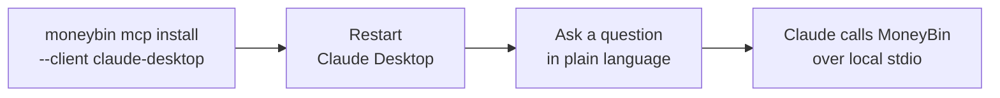

<!-- Last reviewed: 2026-07-18 -->
# Setting up MoneyBin in Claude Desktop

The shortest path from a fresh install to asking Claude about your own money. Four steps: install MoneyBin, wire it into Claude Desktop with one command, restart the app, and ask a question. On a machine that already has MoneyBin installed, this takes a couple of minutes.

This guide covers the Claude Desktop happy path only. For every other client (Claude Code, Cursor, Codex, VS Code, Gemini CLI, the ChatGPT desktop app), the per-client config details, and troubleshooting, see the [MCP clients guide](mcp-clients.md).

## What you need first

- **MoneyBin installed**, with at least one profile holding some data. If you have not installed it yet, follow the [source-install instructions](../../README.md#sixty-seconds-on-synthetic-data). To try it with no real data, run `uv run moneybin demo` — it builds a populated, categorized `demo` profile you can point Claude at immediately.
- **Claude Desktop** — Anthropic's macOS or Windows app.

## The flow



## Step 1 — Wire MoneyBin into Claude Desktop

```bash
moneybin mcp install --client claude-desktop -y
```

This writes the MoneyBin server entry into Claude Desktop's config file (`~/Library/Application Support/Claude/claude_desktop_config.json` on macOS), preserving any other MCP servers already configured. It does not start anything — Claude Desktop launches MoneyBin on its own when it needs the tools. The entry embeds whichever profile is active when you run the command; to install a specific one, add `--profile <name>`.

To preview the exact config without writing it, use `moneybin mcp install --client claude-desktop --print`.

## Step 2 — Restart Claude Desktop

Quit Claude Desktop **fully** — menu bar → Quit, not just closing the window — and reopen it. The app reads its MCP config only at launch, so a running instance will not see MoneyBin until it restarts.

## Step 3 — Ask your first question

Start a new chat and ask in plain language:

- *"What's my net worth right now?"*
- *"What did I spend on groceries last month?"*
- *"Find my recurring subscriptions and their annual cost."*
- *"Show me the SQL behind that number."*

Claude calls MoneyBin's tools locally over stdio and answers from your own data. The first call after launch is slower — MoneyBin's runtime is loading — and subsequent calls in the same session are fast.

Tools that change data (categorization commits, rule deletes, refresh runs) are marked destructive and prompt for a more explicit confirmation than read-only queries. Read them before approving.

## Verifying and troubleshooting

To confirm the connection, ask Claude to run `system_status` (a low-sensitivity data inventory) or check the tool list — Claude Desktop shows MoneyBin's tools once the server starts cleanly. If tools never appear, the two most common causes are not restarting the app and a locked database (`moneybin db unlock`). The [MCP clients guide](mcp-clients.md#verifying-the-connection) has the full smoke test and troubleshooting table.

## Good to know

- **No `.mcpb` bundle yet.** Anthropic's desktop extensions are the newer one-click install path; MoneyBin ships the `mcp install` config path above instead — supported, not legacy.
- **Cowork sessions can't see MoneyBin.** Claude's *remote* Cowork sessions run in Anthropic's cloud and cannot reach a server on your machine — a local session sees MoneyBin normally, a remote one behaves as though it is not installed. See the [MCP clients guide](mcp-clients.md#claude-desktop) for the Cowork caveat and the managed-device admin flags that can disable local MCP.
- **Where your data goes.** MoneyBin has no telemetry or ambient egress, but explicit `sync_*` and `gsheet_*` connector calls reach their configured services. Claude Desktop forwards the tool results it receives to Anthropic's model as ordinary context. The [MCP clients guide](mcp-clients.md#where-data-goes) and the [threat model](threat-model.md) spell out the boundary.

## Next steps

- [Data import guide](data-import.md) — bring in more of your history.
- [MCP server guide](mcp-server.md) — the full tool catalog and response envelope.
- [MCP clients guide](mcp-clients.md) — every other client MoneyBin supports.
