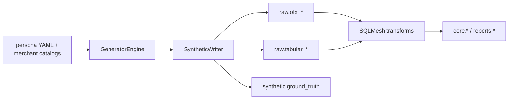

<!-- Last reviewed: 2026-05-17 -->
# Synthetic Data

MoneyBin ships a synthetic-data generator so you can try the full pipeline — reports, categorization, the MCP surface — without uploading a single real statement. This guide covers what the generator produces, how to drive it from the CLI or from Python, and how it stays isolated from any real data you have.

## What it generates

The generator drives one of three named personas through a multi-year transaction history, then writes the rows into the same raw tables that real CSV and OFX imports populate. Downstream staging, core, and reports models work identically against synthetic and real data — the goal is to exercise the full pipeline end-to-end.

Per persona you get:

- **Multiple accounts.** Checking, savings, and credit-card accounts. No investment accounts today; brokerage / 401(k) generation is a future addition.
- **Mixed source paths.** Some accounts route through the OFX loader (`raw.ofx_*`); others through the tabular CSV loader (`raw.tabular_*`). Provenance columns flag them as synthetic (see below).
- **Categorized merchants in the input, NOT pre-applied categories.** Each transaction is generated against one of ~14 merchant catalogs (`grocery`, `dining`, `transport`, `subscriptions`, `health`, `utilities`, `insurance`, `kids`, `shopping`, `entertainment`, `personal_care`, `travel`, `education`, `gifts`). The expected category is recorded in `synthetic.ground_truth`; the raw transaction itself ships uncategorized so the categorizer has work to do.
- **Realistic merchant strings.** Each catalog ships a weighted list of real-world merchant names so descriptions look like what a categorizer would actually see.
- **Income.** Biweekly direct deposits (`basic`, `family`), dual-income households (`family`), or irregular freelance invoices plus a monthly retainer (`freelancer`).
- **Recurring transactions.** Rent or mortgage, utilities, insurance premiums, subscription services, and (for `freelancer`) quarterly IRS estimated payments — fired on declared days of month.
- **Transfers.** Inter-account movements: checking → savings, credit-card statement payments, and (for `freelancer`) business → personal owner draws. Both legs of every transfer share a `transfer_pair_id` in ground truth.
- **Seasonal modifiers.** November/December grocery and shopping spikes; summer kids-activities bumps for `family`.

### Date range and volume

Each persona declares a default of **3 years** ending at the calendar year before the current year (e.g., generating in 2026 covers 2023-01-01 through 2025-12-31). Override with `--years`. Volume scales with persona complexity:

- `basic` — ~300 transactions per year (one checking + one credit card, modest spending).
- `family` — several thousand per year across four accounts.
- `freelancer` — irregular but heavy business activity across three accounts.

Exact counts are deterministic given a seed — see Seed stability below.

## Profile isolation

This is the property that makes the generator safe to run on a laptop that already has real data on it.

Each persona generates into its **own profile**, which means its own encrypted DuckDB file, its own keychain entry, its own backups directory, and its own logs. The default mappings are:

| Persona | Default profile |
|---|---|
| `basic` | `alice` |
| `family` | `bob` |
| `freelancer` | `charlie` |

If `alice`/`bob`/`charlie` collide with profiles you already use, pass `--profile <name>` to route the generator into a different name. Your real profile is never touched.

To completely remove synthetic data when you're done:

```bash
moneybin profile delete alice    # or bob, charlie, whatever you used
```

`profile delete` removes the DuckDB file, the encryption key in the keychain, the backups directory, and the config entry — leaving no synthetic data on disk.

If you want to reseed the *same* profile with a different seed or year count without nuking it, use `synthetic reset` (described below) instead.

## Quick start

```bash
# 1. Generate. Writes raw rows, then runs SQLMesh to build core + reports.
moneybin synthetic generate --persona family --seed 42

# 2. Look at what the reports surface produces against fresh data.
moneybin --profile bob reports networth
moneybin --profile bob reports cashflow --from 2024-01-01 --to 2024-12-01 --by month
moneybin --profile bob reports recurring
moneybin --profile bob reports spending

# 3. Verify provenance — every row is flagged synthetic.
moneybin --profile bob db query \
  "SELECT DISTINCT source_origin FROM raw.tabular_transactions"
# -> synthetic_family

moneybin --profile bob db query "SELECT COUNT(*) FROM synthetic.ground_truth"
```

`reports networth` shows balance composition across all generated accounts; `reports cashflow` rolls income vs spending by month or category; `reports recurring` lists the detected recurring stream (rent, utilities, subscriptions, statement payments). These are the same commands that run against real data — the only difference is the data underneath.

To start over with a different seed or year count:

```bash
moneybin synthetic reset --persona family --seed 7 --years 5 --yes
```

## Choosing a persona

| If you... | Pick | Why |
|---|---|---|
| Are a single-income renter, few accounts, no kids, want a fast smoke test | `basic` | ~300 txns/year, 2 accounts (checking + credit card) |
| Have a mortgage, kids, dual income, multiple cards | `family` | Several thousand txns/year, 4 accounts, summer + holiday seasonality |
| Are self-employed with irregular income and business expenses | `freelancer` | Quarterly estimated tax payments, owner draws, business-vs-personal account split |

If you're evaluating MoneyBin and your real finances would be closest to `family`, `family` is what you should generate — the reports surface lights up most fully there.

## Categorizing synthetic data

Synthetic transactions ship **uncategorized**. Ground truth lives in `synthetic.ground_truth`, separate from the raw rows the categorizer sees. That separation lets you score the categorizer against known-correct labels.

```bash
# Rule-based pass (deterministic, local, no LLM).
moneybin --profile bob transactions categorize run

# LLM-assist for whatever's still uncategorized.
moneybin --profile bob transactions categorize assist

# Score: compare assigned categories against ground truth.
moneybin --profile bob db query "
  SELECT
    SUM(CASE WHEN ft.category = gt.expected_category THEN 1 ELSE 0 END) AS correct,
    SUM(CASE WHEN ft.category IS NULL THEN 1 ELSE 0 END) AS uncategorized,
    COUNT(*) AS total
  FROM core.fct_transactions ft
  JOIN synthetic.ground_truth gt
    ON ft.source_transaction_id = gt.source_transaction_id
  WHERE gt.expected_category IS NOT NULL
"
```

Transfers have `expected_category = NULL` (a transfer is not a spending category) — filter them out with the `WHERE` clause above when scoring categorizer accuracy.

## MCP compatibility

The MCP surface works against a synthetic profile with no special configuration:

```bash
moneybin --profile bob mcp install --client claude-desktop
```

Point Claude Desktop (or Claude Code, Codex, VS Code, Gemini CLI — see `moneybin mcp install --help` for the supported clients) at the synthetic profile, and every MCP tool returns the same shape it would against real data. This is the safest way to let an agent explore MoneyBin's tool surface.

## CLI commands

The synthetic surface lives under `moneybin synthetic`.

### Generate

```bash
moneybin synthetic generate --persona <name> [--profile <name>] [--years <N>] [--seed <int>] [--skip-transform]
```

| Flag | Required | Default | Notes |
|---|---|---|---|
| `--persona` | yes | — | One of `basic`, `family`, `freelancer` |
| `--profile` | no | derived from persona (`alice`, `bob`, `charlie`) | Target MoneyBin profile to write into |
| `--years` | no | persona default (3) | Number of complete years to generate |
| `--seed` | no | random `1..9999` | Integer seed for deterministic output |
| `--skip-transform` | no | `False` | Skip running SQLMesh after the raw write |

`generate` refuses to write into a profile that already has imported data — it exits with code 1 and points you at `synthetic reset`. The profile is created if it does not exist.

After raw rows are written, the command runs SQLMesh to materialize the staging, core, and reports models against the new data. Pass `--skip-transform` to keep just the raw write — useful when you want to inspect the loader output before transformation.

### Reset

```bash
moneybin synthetic reset --persona <name> [--profile <name>] [--years <N>] [--seed <int>] [--yes] [--skip-transform]
```

Wipes the synthetic rows from a profile and regenerates from scratch. Reset:

- **Refuses to delete non-synthetic data.** It first checks that `synthetic.ground_truth` exists in the target profile. If the profile was created by ordinary imports rather than the generator, reset bails out and tells you to use `moneybin profile delete` instead.
- **Scopes deletes to synthetic rows.** Tables are filtered by `source_file LIKE 'synthetic://%'`, so a partially-synthetic profile (rare, but possible) keeps its real rows.
- **Confirms interactively** unless you pass `--yes`/`-y`.

## Where output lands



Synthetic data is written to the **same raw tables** as real imports — there is no separate "synthetic" data path. The only signal that a row came from the generator is the `source_file` prefix (`synthetic://<persona>/<seed>/...`) and, for tabular rows, `source_origin = 'synthetic_<persona>'`.

| Table | Purpose |
|---|---|
| `raw.ofx_accounts` | Account metadata for OFX-routed accounts |
| `raw.ofx_balances` | Opening balance snapshots |
| `raw.ofx_transactions` | OFX-routed transactions (checking, savings) |
| `raw.tabular_accounts` | Account metadata for CSV-routed accounts |
| `raw.tabular_transactions` | CSV-routed transactions (credit cards) with running balance |
| `synthetic.ground_truth` | Per-transaction expected category and `transfer_pair_id` |

Unless `--skip-transform` is set, SQLMesh then builds `prep.*`, `core.*`, and `reports.*` from these raw rows just like a real import.

### `synthetic.ground_truth` schema

```sql
CREATE TABLE synthetic.ground_truth (
    source_transaction_id VARCHAR NOT NULL PRIMARY KEY,  -- joins to raw.* and core.fct_transactions
    account_id            VARCHAR NOT NULL,              -- synthetic source-system account ID
    expected_category     VARCHAR,                       -- NULL for transfers
    transfer_pair_id      VARCHAR,                       -- non-NULL for both legs of a transfer
    persona               VARCHAR NOT NULL,              -- which persona generated this row
    seed                  INTEGER NOT NULL,              -- seed used (for reproducibility)
    generated_at          TIMESTAMP NOT NULL
);
```

`source_transaction_id` joins to raw and core transaction tables. `expected_category` uses the canonical category vocabulary (the same one the categorizer assigns into). Transfers have `expected_category = NULL` and a shared `transfer_pair_id` across the two legs.

## Persona reference

| Persona | Default profile | Accounts | Annual txn volume | Income shape | Notable behaviors |
|---|---|---|---|---|---|
| `basic` | `alice` | 1 checking, 1 credit card | ~300 | Single biweekly salary, 3% annual raise | Holiday shopping bump; weekend dining bias; statement-balance card payoff |
| `family` | `bob` | 1 checking, 1 savings, 2 credit cards | ~thousands | Dual biweekly salaries | Mortgage, 3 subscriptions, 2 card payments, automatic savings transfer; summer kids-activities bump; holiday grocery + shopping spike |
| `freelancer` | `charlie` | 2 checking (personal + business), 1 credit card | ~hundreds, irregular | Irregular client invoices + monthly retainer | Quarterly IRS estimated tax (Jan/Apr/Jun/Sep); business-vs-personal account split; monthly owner draw |

Persona definitions are YAML files under `src/moneybin/synthetic/data/personas/`. Merchant catalogs live in `src/moneybin/synthetic/data/merchants/`. To add a new persona or expand a catalog, drop a YAML file and follow the existing schema — see `CONTRIBUTING.md`.

## Programmatic invocation (Python)

For pytest fixtures and CI scoring jobs, drive the generator from Python rather than shelling out:

```python
from moneybin.synthetic.engine import GeneratorEngine
from moneybin.synthetic.writer import SyntheticWriter
from moneybin.database import get_database

# Run the engine. No DB access yet — pure data structures.
result = GeneratorEngine(persona_name="basic", seed=42, years=2).generate()

# Persist to the active profile's DB.
with get_database() as db:
    counts = SyntheticWriter(db).write(result)
```

For isolated test profiles, point `MONEYBIN_HOME` at a `tmp_path` before the engine touches the DB:

```python
import os
import pytest
from moneybin.synthetic.engine import GeneratorEngine
from moneybin.synthetic.writer import SyntheticWriter
from moneybin.database import get_database


@pytest.fixture
def synthetic_profile(tmp_path, monkeypatch):
    monkeypatch.setenv("MONEYBIN_HOME", str(tmp_path))
    result = GeneratorEngine("basic", seed=42, years=1).generate()
    with get_database() as db:
        SyntheticWriter(db).write(result)
    yield tmp_path
    # tmp_path is removed by pytest; nothing to tear down manually.
```

For full scenario assertions against ground truth (Tier 1 invariants, structural checks, categorization scoring), use the YAML-driven scenario runner — see [`scenario-authoring.md`](scenario-authoring.md). It composes on top of the same `GeneratorEngine` + `SyntheticWriter` primitives and handles the `tmp_path` profile plumbing for you.

## Seed stability

Determinism has two scopes — be deliberate about which one you depend on.

- **Within a release.** Same persona + same seed + same MoneyBin version → identical accounts, transactions, IDs, and ground truth. Account IDs are derived from the seed (`SYN00420001`, `SYN00420002`, …); transaction IDs are assigned in stable sort order (`SYN0000000001`, …); every distribution sample comes from a seeded RNG.
- **Across releases.** No formal stability promise today. A refactor to a merchant catalog, persona YAML, or the generation algorithm can shift exact row counts and IDs. After upgrading MoneyBin, expect to re-record any pinned expected counts.

Practical implications for CI and regression tests:

- Pin both the seed **and** the MoneyBin version your expected counts were derived against.
- Prefer assertions on **shape** (counts ≥ N, distribution within tolerance, every transfer has a paired counterpart) over assertions on exact row counts.
- After a MoneyBin upgrade, re-run `synthetic reset && synthetic generate` and re-record any pinned values.

## Limitations

- **Not a realistic distribution of any specific user's spending.** Volumes, merchant mixes, and income shapes are parametric — deliberate, declared, deterministic. They are not learned from real data and should not be treated as representative of a real household.
- **No Plaid pull semantics.** The generator writes directly to raw tables. It does not exercise the Plaid sync cursor, incremental-pull skip logic, or auth refresh flows — those paths are covered by mocks elsewhere.
- **No investment accounts yet.** Only checking, savings, and credit-card account types are generated. Brokerage, retirement, and crypto accounts are planned but not shipped.
- **No multi-currency.** Every persona is USD-only.
- **No manual entries or rule training.** The generator produces raw transactions and ground truth; it does not seed `app.*` user-state tables (manual entries, custom rules, budgets).
- **Random `--seed` is logged but not persisted.** If you omit `--seed`, the generator picks a value in `1..9999` and logs it. Save it from the log if you need to reproduce that exact run; otherwise prefer passing an explicit seed.
