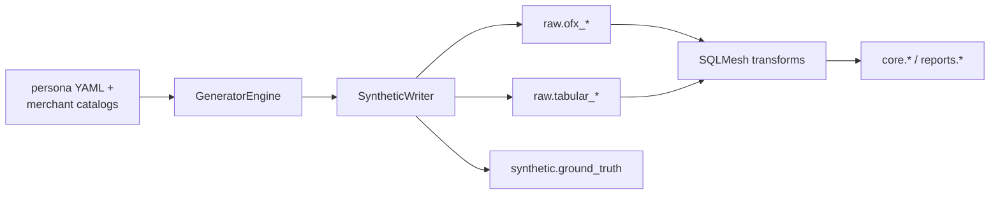

<!-- Last reviewed: 2026-09-17 -->
# Synthetic Data

MoneyBin ships a synthetic-data generator that builds a multi-year transaction history from a declared persona. It reads no real statement: every input is a persona YAML file shipped in the repo. This guide covers what the generator produces, how to drive it from the CLI, and how it stays isolated from any real data on the same machine.

## What it generates

The generator drives one of four named personas — `basic`, `family`, `freelancer`, `international` — through a multi-year transaction history, then writes the rows into the same raw tables that real CSV and OFX imports populate. Downstream staging, core, and reports models work identically against synthetic and real data — the goal is to exercise the full pipeline end-to-end.

Per persona you get:

- **Multiple accounts.** Checking, savings, and credit-card accounts. No investment accounts today; brokerage / 401(k) generation is a future addition.
- **Mixed source paths.** Some accounts route through the OFX loader (`raw.ofx_*`); others through the tabular CSV loader (`raw.tabular_*`). Provenance columns flag them as synthetic (see below).
- **Categorized merchants in the input, NOT pre-applied categories.** Each transaction is generated against a merchant catalog. Fourteen cover the categories a US persona spends in (`grocery`, `dining`, `transport`, `subscriptions`, `health`, `utilities`, `insurance`, `kids`, `shopping`, `entertainment`, `personal_care`, `travel`, `education`, `gifts`); twelve more hold non-US merchants and non-US cities for `international` (`grocery`, `dining`, and `transport`, each in a `_eu`, `_uk`, `_ca`, and `_ae` edition). The expected category is recorded in `synthetic.ground_truth`; the raw transaction itself ships uncategorized so the categorizer has work to do.
- **Realistic merchant strings.** Each catalog ships a weighted list of real-world merchant names so descriptions look like what a categorizer would actually see.
- **Income.** Biweekly direct deposits (`basic`, `family`), dual-income households (`family`), irregular freelance invoices plus a monthly retainer (`freelancer`), or one local monthly stream per country (`international`).
- **Recurring transactions.** Rent or mortgage, utilities, insurance premiums, subscription services, and (for `freelancer`) quarterly IRS estimated payments — fired on declared days of month.
- **Transfers.** Inter-account movements: checking → savings, credit-card statement payments, and (for `freelancer`) business → personal owner draws. Both legs of every transfer share a `transfer_pair_id` in ground truth. `international` declares two monthly USD/EUR transfers whose received amount is written in the YAML (`src/moneybin/synthetic/data/personas/international.yaml`), so each leg carries its own currency's magnitude and no rate is inferred.
- **Seasonal modifiers.** November/December grocery and shopping spikes; summer kids-activities bumps for `family`.

### Date range and volume

Each persona declares its own default, ending at the calendar year before the current year. Generating in 2026 covers 2023-01-01 through 2025-12-31 for a 3-year persona; `international` declares 2 years (`src/moneybin/synthetic/data/personas/international.yaml:11`), the other three declare 3. Override with `--years`.

Volume scales with persona complexity. `basic` generates 995 transactions over its three years and `family` generates 2,886 over the same span — both at `--seed 42`, both shown in the transcripts under Quick start. `freelancer` and `international` fall between those two. The generator prints its own total on every run (`Generated N transactions for persona ...`), so read the count off the build rather than pinning one from this page.

Counts are deterministic given a seed and a MoneyBin version — see Seed stability below.

## Profile isolation

This is the property that makes the generator safe to run on a laptop that already has real data on it.

Each persona generates into its **own profile**, which means its own encrypted DuckDB file, its own keychain entry, its own backups directory, and its own logs. The default mappings are:

| Persona | Default profile |
|---|---|
| `basic` | `alice` |
| `family` | `bob` |
| `freelancer` | `charlie` |
| `international` | `eve` |

Each mapping is declared twice and the two agree: in the CLI's persona table (`src/moneybin/cli/commands/synthetic.py:16-21`) and in the persona's own YAML (`profile: bob` at `src/moneybin/synthetic/data/personas/family.yaml:2`).

If `alice`/`bob`/`charlie`/`eve` collide with profiles you already use, pass `--profile <name>` to route the generator into a different name. Your real profile is never touched.

To completely remove synthetic data when you're done:

```console
$ moneybin profile delete alice --yes
✅ Deleted profile: alice
```

`profile delete` removes the DuckDB file, the encryption key in the keychain, the backups directory, and the config entry — leaving no synthetic data on disk. Without `--yes`/`-y` it confirms first.

If you want to reseed the *same* profile with a different seed or year count without nuking it, use `synthetic reset` (described below) instead.

## Quick start

Create the target profile first. `synthetic generate` does not create it: against a
missing profile the command exits 1 without writing anything (see Limitations).

```console
$ moneybin profile create bob --no-init-inbox
✅ Created profile bob at <MONEYBIN_HOME>/profiles/bob
```

Then generate. The command writes raw rows, then runs SQLMesh to build core and reports.

```console
$ moneybin synthetic generate --persona family --seed 42
⚙️  Generating 'family' persona into profile 'bob' (seed=42)
Generated 2886 transactions for persona 'family' (seed=42, 2023-01-01 to 2025-12-31)
Wrote synthetic data: {'ofx_accounts': 2, 'ofx_balances': 2, 'tabular_accounts': 2, 'ofx_transactions': 1381, 'tabular_transactions': 1505, 'ground_truth': 2886}
⚙️  Running transforms to materialize pipeline...
Transforms completed in 7.41s
```

Two things are trimmed from that transcript: the SQLMesh plan and snapshot logging
between those lines, and the closing `✅` line, which reads that profile `bob` is
ready at `seed=42` and to pass `--profile=bob` to any later command. The run emitted
3,685 lines in total against those six user-facing ones; both figures are counted
from the captured run. Every line the command prints, the `✅` included, goes to
stderr — redirect stderr, not stdout, to keep it.

`basic` is the smaller build, and the same two steps produce it:

```console
$ moneybin synthetic generate --persona basic --seed 42
⚙️  Generating 'basic' persona into profile 'alice' (seed=42)
Generated 995 transactions for persona 'basic' (seed=42, 2023-01-01 to 2025-12-31)
Wrote synthetic data: {'ofx_accounts': 1, 'ofx_balances': 1, 'tabular_accounts': 1, 'ofx_transactions': 540, 'tabular_transactions': 455, 'ground_truth': 995}
⚙️  Running transforms to materialize pipeline...
Transforms completed in 13.35s
```

Same two trims, with `alice` in place of `bob` on the closing line. Both builds finished in under 20 seconds wall-clock on a laptop,
transforms included. The transform stage dominates, and its cost does not track the
row count: in these two runs the 2,886-row `family` build transformed in 7.41s and
the 995-row `basic` build in 13.35s.

Read the reports against the fresh data:

```console
$ moneybin --profile bob reports networth
Using profile: bob
USD as of 2025-12-31
Net worth:   420,080.77
Assets:      420,080.77
Liabilities: 0.00
Accounts:    4
```

The per-account balance table and three trailing hint lines are trimmed. `reports
networth` shows balance composition across all generated accounts; `reports cash-flow`
rolls up monthly inflow, outflow, and net, grouped by account, category, or both;
`reports recurring-subscriptions` lists the detected recurring stream (rent, utilities,
subscriptions, statement payments). These are the same commands that run against real
data — the only difference is the data underneath.

```bash
moneybin --profile bob reports cash-flow --from-month 2024-01 --to-month 2024-12 --by category
moneybin --profile bob reports recurring-subscriptions
moneybin --profile bob reports spending-trend
```

Every generated row carries its provenance. `db query` writes its table to stdout:

```console
$ moneybin --profile bob db query "SELECT DISTINCT source_origin FROM raw.tabular_transactions"
+------------------+
|  source_origin   |
+------------------+
| synthetic_family |
+------------------+
```

```console
$ moneybin --profile bob db query "SELECT COUNT(*) AS ground_truth_rows FROM synthetic.ground_truth"
+-------------------+
| ground_truth_rows |
+-------------------+
| 2886              |
+-------------------+
```

The ground-truth row count matches the `Generated 2886 transactions` line from the
build: one ground-truth row per generated transaction.

To start over with a different seed or year count:

```bash
moneybin synthetic reset --persona family --seed 7 --years 5 --yes
```

## Choosing a persona

| If you... | Pick | Why |
|---|---|---|
| Are a single-income renter, few accounts, no kids, want a fast smoke test | `basic` | 995 transactions over 3 years, 2 accounts (checking + credit card) |
| Have a mortgage, kids, dual income, multiple cards | `family` | 2,886 transactions over 3 years, 4 accounts, summer + holiday seasonality |
| Are self-employed with irregular income and business expenses | `freelancer` | Quarterly estimated tax payments, owner draws, business-vs-personal account split |
| Hold accounts in more than one currency | `international` | Five banks in five countries, one currency each (EUR, GBP, CAD, AED, USD); net worth reports per currency instead of one total |

If your real finances are closest to `family`, generate `family` — it also covers more of the reports surface than the other three: 4 accounts, 11 recurring streams, and 3 transfers, versus 2 accounts, 5 recurring streams, and 1 transfer for `basic`. Those counts are the entries declared in `src/moneybin/synthetic/data/personas/family.yaml` and `basic.yaml`.

## Categorizing synthetic data

Synthetic transactions ship **uncategorized**. Ground truth lives in `synthetic.ground_truth`, separate from the raw rows the categorizer sees. That separation lets you score the categorizer against known-correct labels.

```bash
# Rule-based pass (deterministic, local, no LLM).
moneybin --profile bob transactions categorize run

# LLM-assist for whatever's still uncategorized.
moneybin --profile bob transactions categorize assist

# Score: compare assigned categories against ground truth.
moneybin --profile bob db query "
  SELECT
    SUM(CASE WHEN ft.category = gt.expected_category THEN 1 ELSE 0 END) AS correct,
    SUM(CASE WHEN ft.category IS NULL THEN 1 ELSE 0 END) AS uncategorized,
    COUNT(*) AS total
  FROM core.fct_transactions ft
  JOIN prep.int_transactions__matched m
    ON m.transaction_id = ft.transaction_id
  JOIN synthetic.ground_truth gt
    ON gt.source_transaction_id = m.source_transaction_id
  WHERE gt.expected_category IS NOT NULL
"
```

`core.fct_transactions.transaction_id` is a gold key computed by the dedup/matching pipeline, not the generator's original ID — `synthetic.ground_truth.source_transaction_id` only survives through `prep.int_transactions__matched`, so the join bridges through that table. This is the same join `moneybin`'s own categorization-accuracy evaluation uses (`tests/validation/evaluations/categorization.py`).

Transfers have `expected_category = NULL` (a transfer is not a spending category) — filter them out with the `WHERE` clause above when scoring categorizer accuracy.

## MCP compatibility

The MCP surface works against a synthetic profile with no special configuration:

```bash
moneybin --profile bob mcp install --client claude-desktop
```

Point Claude Desktop (or Claude Code, Codex, VS Code, Gemini CLI — see `moneybin mcp install --help` for the supported clients) at the synthetic profile, and every MCP tool returns the same shape it would against real data. A synthetic profile holds no real data, so an agent pointed at one cannot read any.

## CLI commands

The synthetic surface lives under `moneybin synthetic`.

### Generate

```bash
moneybin synthetic generate --persona <name> [--profile <name>] [--years <N>] [--seed <int>] [--skip-transform]
```

Every flag, its type, and its bounds: [`moneybin synthetic generate`](../reference/cli/synthetic.md#moneybin-synthetic-generate), generated from the command tree. Behaviour `--help` does not carry:

- **The target profile must already exist.** `generate` does not create it. Run `moneybin profile create <name>` first; against a missing profile the command exits 1 and reports a missing encryption key rather than a missing profile.
- **It refuses to write into a profile that already holds imported data.** Exits 1 and points you at `synthetic reset`.
- **Omitting `--seed` picks a value in `1..9999` and logs it.** The value is not persisted anywhere else — see Limitations.

After raw rows are written, the command runs SQLMesh to materialize the staging, core, and reports models against the new data. Pass `--skip-transform` to keep just the raw write — useful when you want to inspect the loader output before transformation.

### Reset

```bash
moneybin synthetic reset --persona <name> [--profile <name>] [--years <N>] [--seed <int>] [--yes] [--skip-transform]
```

Wipes the synthetic rows from a profile and regenerates from scratch. Reset:

- **Refuses to delete non-synthetic data.** It first checks that `synthetic.ground_truth` exists in the target profile. If the profile was created by ordinary imports rather than the generator, reset bails out and tells you to use `moneybin profile delete` instead.
- **Scopes deletes to synthetic rows.** Tables are filtered by `source_file LIKE 'synthetic://%'`, so a partially-synthetic profile (rare, but possible) keeps its real rows.
- **Confirms interactively** unless you pass `--yes`/`-y`.

## Where output lands


```mermaid
flowchart LR
    YAML[persona YAML +<br/>merchant catalogs] --> Engine[GeneratorEngine]
    Engine --> Writer[SyntheticWriter]
    Writer --> RawOFX[raw.ofx_*]
    Writer --> RawTab[raw.tabular_*]
    Writer --> GT[synthetic.ground_truth]
    RawOFX --> SQLMesh[SQLMesh transforms]
    RawTab --> SQLMesh
    SQLMesh --> Core[core.* / reports.*]
```

Synthetic data is written to the **same raw tables** as real imports — there is no separate "synthetic" data path. The only signal that a row came from the generator is the `source_file` prefix (`synthetic://<persona>/<seed>/...`) and, for tabular rows, `source_origin = 'synthetic_<persona>'`.

| Table | Purpose |
|---|---|
| `raw.ofx_accounts` | Account metadata for OFX-routed accounts |
| `raw.ofx_balances` | Opening balance snapshots |
| `raw.ofx_transactions` | OFX-routed transactions (checking, savings) |
| `raw.tabular_accounts` | Account metadata for CSV-routed accounts |
| `raw.tabular_transactions` | CSV-routed transactions (credit cards) with running balance |
| `synthetic.ground_truth` | Per-transaction expected category and `transfer_pair_id` |

Unless `--skip-transform` is set, SQLMesh then builds `prep.*`, `core.*`, and `reports.*` from these raw rows just like a real import.

### `synthetic.ground_truth` schema

The generator executes this DDL on demand, from `src/moneybin/sql/schema/synthetic_ground_truth.sql`:

```sql
-- Create synthetic schema on demand (not during normal init)
CREATE SCHEMA IF NOT EXISTS synthetic;

/* Known-correct labels for scoring categorization and transfer detection accuracy against synthetic data */
CREATE TABLE IF NOT EXISTS synthetic.ground_truth (
    source_transaction_id VARCHAR NOT NULL, -- Joins to raw/core transaction identity; primary key
    account_id VARCHAR NOT NULL, -- Synthetic source-system account ID; joins to raw account tables
    expected_category VARCHAR, -- Ground-truth category label; NULL for transfers
    transfer_pair_id VARCHAR, -- Non-NULL for transfer pairs; both sides share the same ID
    persona VARCHAR NOT NULL, -- Which persona generated this row
    seed INTEGER NOT NULL, -- Seed used for reproducibility
    generated_at TIMESTAMP NOT NULL, -- When this ground truth was produced
    PRIMARY KEY (source_transaction_id)
);
```

`source_transaction_id` joins directly to `raw.ofx_transactions.source_transaction_id` and `raw.tabular_transactions.transaction_id`; reaching `core.fct_transactions` requires the `prep.int_transactions__matched` bridge (see Categorizing synthetic data, above). `expected_category` uses the canonical category vocabulary (the same one the categorizer assigns into). Transfers have `expected_category = NULL` and a shared `transfer_pair_id` across the two legs.

## Persona reference

| Persona | Default profile | Accounts | Default years | Income shape | Notable behaviors |
|---|---|---|---|---|---|
| `basic` | `alice` | 1 checking, 1 credit card | 3 | Single biweekly salary, 3% annual raise | Holiday shopping bump; weekend dining bias; statement-balance card payoff |
| `family` | `bob` | 1 checking, 1 savings, 2 credit cards | 3 | Dual biweekly salaries | Mortgage, 3 subscriptions, 2 card payments, automatic savings transfer; summer kids-activities bump; holiday grocery + shopping spike |
| `freelancer` | `charlie` | 2 checking (personal + business), 1 credit card | 3 | Irregular client invoices + monthly retainer | Quarterly IRS estimated tax (Jan/Apr/Jun/Sep); business-vs-personal account split; monthly owner draw |
| `international` | `eve` | 5 checking, one each at a Dutch, British, Canadian, Emirati, and US bank | 2 | One local monthly stream per account, in that account's currency | Five currencies (EUR, GBP, CAD, AED, USD); two monthly USD/EUR transfers with declared received amounts, no inferred rate; local merchants and cities per country; AED sits outside the FX provider's published set, so its rate is unavailable by construction |

Account counts, types, and `years_default` come from the persona YAML files below. Transaction volume is seed-dependent and printed by the build; see Date range and volume.

Persona definitions are YAML files under `src/moneybin/synthetic/data/personas/`. Merchant catalogs live in `src/moneybin/synthetic/data/merchants/`. To add a new persona or expand a catalog, drop a YAML file and follow the existing schema — see `CONTRIBUTING.md`.

## Programmatic invocation (Python)

The contributor surface is `moneybin.synthetic`: `GeneratorEngine` (`engine.py`) produces
the data as plain structures with no database access, and `SyntheticWriter` (`writer.py`)
persists a result to the active profile. The package layout and the month-by-month
generation pipeline are documented in
[`testing-synthetic-data.md`](../specs/testing-synthetic-data.md).

For full scenario assertions against ground truth (Tier 1 invariants, structural checks, categorization scoring), use the YAML-driven scenario runner — see [`scenario-authoring.md`](scenario-authoring.md). It composes on top of the same `GeneratorEngine` + `SyntheticWriter` primitives and handles the `tmp_path` profile plumbing for you.

## Seed stability

Determinism has two scopes — be deliberate about which one you depend on.

- **Within a release.** Same persona + same seed + same MoneyBin version → identical accounts, transactions, IDs, and ground truth. Account IDs are derived from the seed (`SYN00420001`, `SYN00420002`, …); transaction IDs are assigned in stable sort order (`SYN0000000001`, …); every distribution sample comes from a seeded RNG.
- **Across releases.** No formal stability promise today. A refactor to a merchant catalog, persona YAML, or the generation algorithm can shift exact row counts and IDs. After upgrading MoneyBin, expect to re-record any pinned expected counts.

Practical implications for CI and regression tests:

- Pin both the seed **and** the MoneyBin version your expected counts were derived against.
- Prefer assertions on **shape** (counts ≥ N, distribution within tolerance, every transfer has a paired counterpart) over assertions on exact row counts.
- After a MoneyBin upgrade, re-run `synthetic reset && synthetic generate` and re-record any pinned values.

## Limitations

- **Not a realistic distribution of any specific user's spending.** Volumes, merchant mixes, and income shapes are parametric — deliberate, declared, deterministic. They are not learned from real data and should not be treated as representative of a real household.
- **No Plaid pull semantics.** The generator writes directly to raw tables. It does not exercise the Plaid sync cursor, incremental-pull skip logic, or auth refresh flows — those paths are covered by mocks elsewhere.
- **No investment accounts yet.** Only checking, savings, and credit-card account types are generated. Brokerage, retirement, and crypto accounts are planned.
- **No inferred conversion.** Accounts carry their own `currency_code` (see the `international` persona). A same-currency transfer moves one magnitude to both sides. A cross-currency transfer must declare `received_amount` in the persona YAML; the generator writes the two declared magnitudes and looks up no rate, and a cross-currency transfer without `received_amount` is refused at persona load (`src/moneybin/synthetic/models.py`). Without a home currency set, reports sub-total per currency — see [Multi-currency](multi-currency.md).
- **No manual entries or rule training.** The generator produces raw transactions and ground truth; it does not seed `app.*` user-state tables (manual entries, custom rules, budgets).
- **Random `--seed` is logged but not persisted.** If you omit `--seed`, the generator picks a value in `1..9999` and logs it. Save it from the log if you need to reproduce that exact run; otherwise prefer passing an explicit seed.
- **`generate` does not create the target profile.** Run `moneybin profile create <name>` first. Against a missing profile the command exits 1 and reports a missing encryption key, which names the symptom rather than the cause.
- **All output goes to stderr, mixed with SQLMesh logging.** A build emits thousands of plan and snapshot lines around its six user-facing ones, and the `✅` completion line is on stderr with them. To keep the result, redirect stderr; `db query` is the exception and writes its table to stdout.
