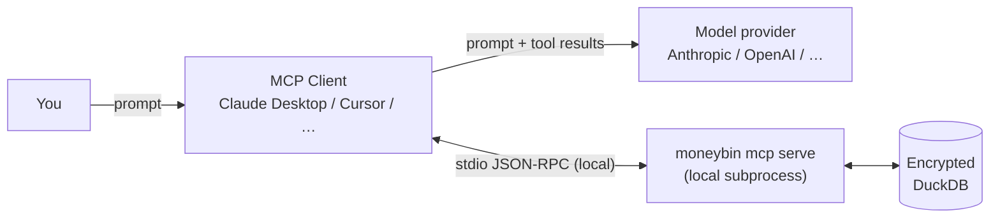

<!-- Last reviewed: 2026-07-17 -->
# What the AI Provider Sees

When you drive MoneyBin with an AI agent, some of your financial data reaches
the model provider behind that agent — Anthropic, OpenAI, Google, or whoever
your MCP client is configured against. This page states exactly what, so you can
decide before you connect. It is written to be accurate, not reassuring; where a
protection is planned but not shipped, it says so.

The one-sentence version: **anything the agent reads to answer you, the model
provider receives** — except account and routing numbers, which are masked
before they ever leave MoneyBin. If that trade is unacceptable, the [last
section](#if-that-isnt-acceptable) lists the ways to narrow or eliminate it,
including running a fully local model so nothing leaves your machine at all.

This is the AI-data-flow companion to the [Threat Model](threat-model.md) (the
full in-scope/out-of-scope threat list) and the [MCP Server
guide](mcp-server.md) (how to connect and use tools). It is the single owner of
"what leaves, what's masked, what's recorded"; the other two point here.

---

## The trust boundary

MoneyBin has no server of its own in this picture. The MCP server is a local
subprocess that reads your encrypted DuckDB file and hands results back to your
MCP client. **MoneyBin never calls a model.** The model call happens inside your
MCP client (Claude Desktop, Cursor, Codex, …), which talks to whichever provider
you chose.

Two consequences fall out of that shape:

- **The provider is your MCP client's provider, chosen by you.** MoneyBin does
  not add, change, or route around it. Point the client at a local model and the
  provider disappears (see [Total privacy](#total-privacy-run-a-local-model)).
- **Tool results ride the same wire as your prompt.** When the agent calls a
  MoneyBin tool, the result envelope travels back to the model so it can continue
  the conversation. That is the entire trust boundary: your client's process, and
  your client's provider. Nothing else phones home — MoneyBin sends no telemetry,
  analytics, or update checks (see the [network boundary in the threat
  model](threat-model.md#network-boundary)).

---

## What leaves, per kind of tool

Every MoneyBin tool returns a structured envelope. The table is what a given
envelope contains once it reaches the model.

| Tool kind | Goes to the provider | Always masked first | Recorded locally |
|---|---|---|---|
| Transaction reads (`transactions_search`, `transactions_get`) | Descriptions, merchant names, amounts, dates, notes, tags, categories | Account/routing numbers | Per-call event |
| Report views (`reports_networth`, `reports_spending`, …) | Balances, totals, amounts, merchant names, dates | Account/routing numbers | Per-call event |
| Ad-hoc SQL (`sql_query`) | Whatever your `SELECT` returns from `core`/`app` (amounts, descriptions, merchants, dates, locations) | Account/routing numbers (by column classification) | Per-call event |
| Categorization assist (`transactions_categorize_assist`) | Description *shape* only — see below | Amounts, dates, account IDs, embedded PII | Per-call event |
| Mutations (categorize, note, tag, split, revert, …) | The values you're writing + confirmation | Account/routing numbers | Per-call event **+ audit row (undoable)** |
| Errors / timeouts | A generic message; no row content, no SQL text | — | Per-call event |

The rest of this page expands each column.

---

## Always masked (enforced today)

Two field families never leave MoneyBin in the clear, on any tool, on both the
MCP and the CLI `--output json` surface:

- **Account identifiers** → `****1234` (last four kept).
- **Routing numbers** → `*****` (fully masked).

This is enforced structurally, not by convention. Every one of MoneyBin's ~105
tools must declare the privacy class of each field it returns, or it fails to
register at startup — there is no way to ship a tool that returns an unclassified
account number. For `sql_query` and the report views, the same masking is applied
by tracing each output column back to its source column through the SQL; a column
the tracer can't resolve **fails closed** (it gets the most-sensitive treatment,
never the least). So raw SQL is not a privacy bypass: `SELECT last_four FROM
core.dim_accounts` comes back masked.

> The operator commands `moneybin db query`, `db shell`, and `db ui` are the
> deliberate exception — they are raw, unmasked, local operator access and print
> a banner saying so. They involve no AI. Everything on the agent path is masked.

---

## Not masked (stated plainly)

Everything else in a tool result reaches the provider **as-is**:

- Transaction **descriptions** and **merchant names**
- **Amounts**, **balances**, and **totals**
- **Dates**
- Your **notes**, **tags**, and **category** choices
- Any **location** fields (e.g. merchant lat/long carried from a provider)

MoneyBin does **not** scan free-text for secondary PII. If you typed an SSN into
a transaction note, that note reaches the model verbatim. Descriptions arrive
from your bank unfiltered — MoneyBin does not rewrite them.

There is one exception, and it is the only place MoneyBin minimizes a payload
before an AI sees it:

**Categorization assist** (`transactions_categorize_assist`) sends the model the
*shape* of a description, not your money. Before the prompt is built, it:

- replaces the amount with a single **sign** (`+`, `-`, or `0`) — never the value,
- drops the **date** and the **account identifier** entirely,
- scrubs embedded **locations, emails, phone numbers, and card-reference tails**
  out of the description and memo.

So the model categorizing "SQ *BLUE BOTTLE 0123, OAKLAND CA" sees roughly "coffee
shop, outflow" — enough to label it, not enough to reconstruct the transaction.
No other tool does this; the reads and reports above send the real values.

---

## What the agent gets is scoped to what it asked for

The provider sees the *results of the queries the agent ran*, not your database:

- `sql_query` is walled to the `core` and `app` schemas, is read-only (writes,
  DDL, and file/URL functions are rejected), and caps results at 1,000 rows with
  a 30-second limit. It cannot reach `raw`/`prep`, cannot read local files, and
  cannot exfiltrate to a URL.
- Typed reads return the rows matching the filter the agent chose, capped and
  paginated.

Be clear-eyed about the flip side: **over a long session an agent can ask for a
lot.** Nothing stops a cooperative agent from paging through every transaction if
you ask it to summarize everything. "Scoped per call" is not "small in
aggregate." The floor on exposure for any single answer is the set of rows that
answer needed; the ceiling over a session is whatever you direct.

---

## Total privacy: run a local model

The provider in the diagram exists only because your MCP client points at a cloud
model. Run a **local** model instead and the cloud provider drops out entirely:
prompts and tool results never leave your machine. This is the only way to get a
genuine privacy *guarantee* rather than a narrowed exposure — with any cloud
model, the results you ask about reach that model, the same as any cloud
assistant.

MoneyBin makes this possible but does not do it for you: the server side doesn't
care which model is on the other end of the stdio pipe, so a local model connects
exactly like Claude Desktop does. The gap is on the client side — you need an MCP
client that *both* speaks MCP *and* runs against a local model, and that
combination is still thin today (Ollama doesn't expose MCP; LM Studio's support is
experimental). See the [supported-client notes on local LLMs](mcp-clients.md) for
the current state. When a first-class local-MCP client stabilizes, MoneyBin
already works with it — no MoneyBin change required. The same account/routing
masking applies either way.

*(Planned: a "verified-local" mode that additionally unmasks CRITICAL fields when
— and only when — the backend is confirmed local. Not shipped; today CRITICAL
stays masked regardless of backend.)*

---

## Consent: what the ledger does, and doesn't

MoneyBin has a consent ledger (`privacy_consent_grant` / `_revoke` /
`privacy_status`). Today it is a **record**, not a **gate**:

- Grants and revocations are stored and audited.
- **Nothing is currently gated on them.** Granting or revoking `mcp-data-sharing`
  does not change what any tool returns. Every tool executes and returns its full
  (CRITICAL-masked) result regardless of consent state.
- A "one-time" grant currently persists until you revoke it — one-time expiry is
  not yet enforced.

The planned model degrades `medium`/`high` tools to aggregate-only responses when
consent is absent (never failing outright). It is designed and specified, not
shipped. Until it lands, **treat the consent ledger as a log of your intentions,
not an enforcement layer** — and treat anything you ask the agent as sent to your
provider, because it was.

---

## What MoneyBin records locally

Two independent local records, neither of which leaves your machine:

- **Per-call privacy log** (`privacy.log.jsonl`, `privacy_log` tool / `moneybin
  privacy log`). One line per tool call — the tool name, its sensitivity tier,
  the data classes returned, and the row count. It records **no row content and
  no SQL text**. This lets you audit *which* rows a past session could have
  exposed, which is the floor on impact if you later regret a question.
- **Audit log for mutations** (`app.audit_log`, `system_audit` tool). Every write
  an agent makes — categorization, note, tag, split, revert — lands here with
  before/after values and an operation id, and is undoable. **Reads are not
  written to this table.** The audit log is a forensic aid for an honest
  operator, not tamper-proof evidence against someone who already holds your key
  (see [audit-log integrity](threat-model.md#audit-log-integrity)).

---

## Training and retention

- **By MoneyBin: nothing.** There is no MoneyBin server in the agent path, so
  there is nothing for MoneyBin to store, sell, or train on. Your data stays in
  your local encrypted file.
- **By your provider: governed by your agreement with them.** Tool results that
  reach the model become part of that conversation, and persist in your chat
  history and the provider's logs on whatever terms you accepted when you signed
  up — including whether they may be used for training. MoneyBin cannot change or
  override those terms. If a question would be regrettable in your provider's
  hands, the recall story is the same as for any chat: there is none. Ask the CLI
  instead (no model in the loop), or use a local model.

---

## Try it on synthetic data first

You do not have to expose a single real row to see how an agent behaves against
MoneyBin. `moneybin demo` builds a complete synthetic profile — accounts,
categorized transactions, a clean `system doctor` — that the agent can drive
exactly like real data. Kick the tires there, watch what the tools return, then
decide what to connect to your real profile.

---

## If that isn't acceptable

Ranked from strongest guarantee to smallest change:

1. **Run a local model** (above) — keep the AI agent, but send nothing to a cloud
   provider. The strongest option that preserves the agent workflow.
2. **Use the CLI instead of the agent.** `moneybin` commands answer from your
   local data with no model in the loop at all. The CLI is a first-class surface,
   not a fallback.
3. **Import from files only, skip Plaid.** OFX/QFX/QBO/CSV/PDF imports never touch
   the network; that keeps your data off both the model provider and the sync
   broker (see [the threat model on Plaid](threat-model.md#plaid-itself-when-you-use-bank-direct-sync)).
4. **`moneybin db lock` when you're not actively using the agent.** A locked
   profile can't be opened by a new MCP session at all.

---

## Verify these claims

MoneyBin is [AGPL-3.0](../licensing.md) — the masking, the classification
contract, the `sql_query` gate, and the per-call log are all in the source tree
under `src/moneybin/privacy/`. Nothing on this page asks you to take our word for
it; read the code, or drive `moneybin demo` and watch the envelopes. If you find
this page drifting from the code, that is a bug — the code is the source of
truth.
