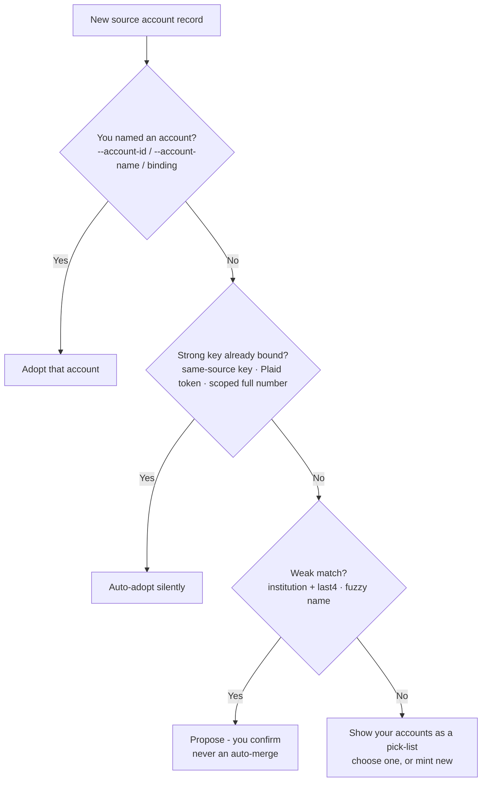

<!-- Last reviewed: 2026-06-19 -->
# Account Matching

One real-world account shows up as many records — a QFX statement this month, a
CSV export the next, a Plaid feed later, the same account from two banks' tools.
MoneyBin collapses those into **one canonical account** so balances and
transactions don't double-count. This page explains how it decides two records
are the same account, **what information it uses and where each piece comes from
per file format**, and the moments it stops to ask you.

If you just want to get files in, start with [Data Import](../guides/data-import.md);
this page is the "how does it actually decide?" companion.

## The canonical account

Every account gets an **opaque, minted `account_id`** — a 12-character handle
like `fc238e82f883`, never your bank's account number. It is:

- **Stable** — it doesn't change when you rename the account or when a new
  source for it arrives.
- **Safe to share** — no PII, so it's fine in logs, scripts, and agent prompts.
- **The key everything joins on** — reports, `core.fct_transactions`, and the
  MCP tools all reference the canonical id; your real account number is *never*
  the key.

Each source record binds to the canonical account through a per-source link.
Re-importing the same source reuses the same id rather than creating a twin.

## How a source record resolves to an account

On every import and sync, MoneyBin runs a resolution ladder — ordered from the
most reliable signal to the least, stopping at the first rung that fires:



1. **Explicit binding.** You pinned the identity (`--account-id`,
   `--account-name`, `import_confirm(account_bindings=…)`, or "import into account
   X"). Adopted above all detection.
2. **Strong key → silent auto-adopt.** A stable, upstream-assigned key that's
   already bound to an account: the source's own account key on a same-source
   re-import, a Plaid persistent token, or a full account number scoped by its
   routing/bank id. These are near-certain, so MoneyBin adopts silently.
3. **Weak match → always a confirm.** A shared **institution + last 4 digits**,
   or a **fuzzy name** match. Weak signals collide — two Wells Fargo accounts can
   both end in `4267` — so MoneyBin *proposes* and waits. **It never merges two
   accounts on a weak signal.**
4. **Nothing strong, and you haven't said.** MoneyBin shows a **pick-list of your
   existing accounts** to choose from (or "new"). A bare CSV that carries no
   in-file identity always lands here.

The governing rule is **"magic stays visible":** MoneyBin acts silently only on a
near-certain signal, and surfaces a confirm exactly where its inference could be
wrong. A wrong account *merge* is hard to notice and undo, so the bar for acting
without asking is deliberately high.

## What information is used, per format

What MoneyBin can match on depends entirely on what the file carries. The
**strong key** is the only thing that auto-adopts; **last 4** corroborates and
makes a candidate recognizable but is never a key on its own; **institution** and
**name** feed the weak-match and pick-list rungs.

| Source | Strong key (auto-adopts) | Last 4 (corroborating) | Institution | Name |
|---|---|---|---|---|
| **OFX / QFX / QBO** | `<ACCTID>` scoped by `<BANKID>` | `RIGHT(<ACCTID>, 4)` | `<ORG>`, else `<FID>` lookup, else filename | account type / label |
| **Plaid** | `persistent_account_id` | `mask` | `institution_name` | official account name |
| **Tabular — aggregator export** (Tiller, Monarch, …, with account info) | *none* — labels are mutable | parsed from the account-label / `Account #` column | a per-row `Institution` column, or parsed from the label | the account label |
| **Tabular — bare bank export** (Date / Description / Amount only) | *none* | *none* | filename heuristic, or unknown | filename stem (a placeholder) |

Three things worth calling out:

- **Last 4, not the full number.** MoneyBin derives and stores only the last four
  digits; the full account number is never kept in the canonical account
  dimension and is masked everywhere (`****4267`).
- **Institution ≠ exporter.** The *exporter* (Tiller, Monarch, a bank's web
  export) decides how the file is parsed. The *institution* is a property of the
  account and comes from row data (an `Institution` column, OFX `<ORG>`, Plaid
  `institution_name`) — MoneyBin never treats the tool name as the institution.
- **A bare bank CSV carries no identity.** Date/Description/Amount alone can't
  tell MoneyBin which account it is, so binding is always explicit — which is why
  the pick-list (rung 4) exists.

## When MoneyBin asks you: the import gate

If an import can't pin the account, it **pauses without loading any rows** and
returns an account confirmation. You see the proposed account(s) plus a pick-list
of your existing accounts. Bind it in one command:

```bash
# Adopt an existing account, or mint a distinct new one:
moneybin import confirm <file> --accept --account-binding <source_key>=<account_id|new>

# Or name a brand-new account directly:
moneybin import confirm <file> --accept --account-name "WF Business Checking"
```

The `<source_key>` comes from the confirmation (and the `.pending.yml` sidecar
when the file came through the inbox). Supply a binding for **every** account the
file contains in that one command — the gate is all-or-nothing.

**Human vs. agent.** A person importing interactively is *gated* — rows don't
land until the account is bound. An agent-driven import does **not** block: it
mints a provisional account and files any weak matches into the review queue,
and it **never self-accepts** a weak match. Either way, you stay in control of
account identity.

The MCP equivalent is the same propose → confirm loop: `import_files` /
`import_preview` return a confirmation, and `import_confirm(account_bindings=…)`
ratifies it.

## Cross-source twins found later: the review queue

When the same account arrives from a second source and only matches *weakly*
(institution + last 4), MoneyBin files a proposal instead of merging:

```bash
moneybin accounts links pending                 # see proposals: provisional account, candidate, signal, last4
moneybin accounts links set <decision_id> <account_id>   # accept the merge
moneybin accounts links set <decision_id> --standalone   # keep it as its own account
moneybin accounts links run                     # re-scan existing accounts for twins
```

The agent path uses `reviews(kind="account_links", status="pending")`,
`identity_links_decide(decisions=[...])`, and `refresh_run(steps=["identity"])`.
The `review` command (`moneybin review --type
account-links`) shows the pending count across queues. **You decide every merge**
— MoneyBin won't combine two accounts on a weak signal on its own.

## What happens after a match

- **Duplicates collapse.** Bind a CSV to the same account as its OFX twin and the
  overlapping transactions deduplicate: `core.fct_transactions` keeps one row per
  transaction with `source_count = 2` (both sources contributed). No
  double-counting, and the contributing sources stay recorded for provenance.
- **Your work survives.** Categorizations, notes, tags, and splits persist across
  re-imports — transaction identity is derived from the source row's content, not
  from the (mutable) account id, so re-binding an account never orphans them.

## Re-imports and what's remembered

- **Same source, re-imported → silent.** The source's own account key (or a
  remembered binding) adopts the same account with no prompt. Re-running the exact
  same bare file is matched on its content and adopts without re-asking.
- **A confirmed binding is remembered.** Once you bind a source account, the next
  import of that same account adopts it automatically rather than gating again.
- **A genuinely new file still asks.** A different bare file, or a source whose
  account can't be matched, surfaces the gate again rather than guessing.

## See also

- [Data Import](../guides/data-import.md) — how to import each format, step by step.
- [Data Sources](data-sources.md) — per-source identifiers, formats, and sign conventions.
