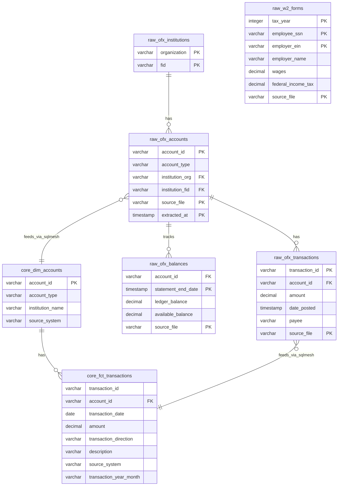
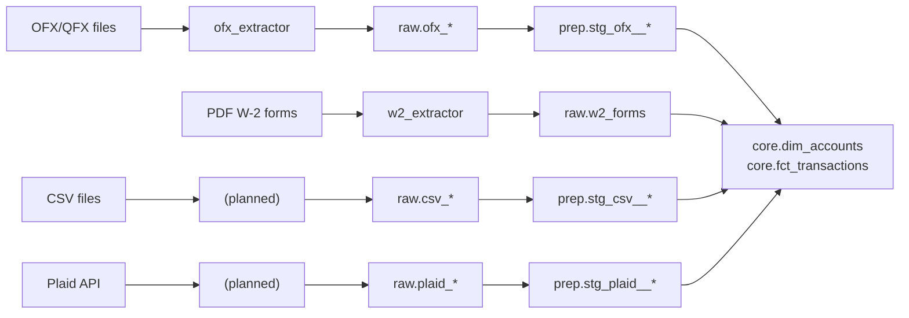

# Data Model

MoneyBin stores all financial data in a local DuckDB database organized into three layers. Column-level definitions live in code (DDL in `src/moneybin/sql/schema/`, SQLMesh models in `sqlmesh/models/`), not in this document. Use `moneybin db shell` or the MCP `schema.describe` tool to inspect the live schema.

## Entity Relationship Diagram



## Schemas

| Schema | Purpose | Materialization |
|--------|---------|-----------------|
| `raw` | Source-specific tables, preserved as-is | Tables (created by Python loaders) |
| `prep` | Staging transformations | Views (created by SQLMesh) |
| `core` | Canonical analytical tables | Tables (created by SQLMesh) |
| `app` | Application-managed data (categories, budgets, notes) | Tables (created by MCP write tools) |

## Raw layer

Raw tables preserve source data exactly as extracted. All include `source_file`, `extracted_at`, and `loaded_at` metadata columns.

| Table | Description | Primary Key |
|-------|-------------|-------------|
| `raw.ofx_institutions` | Financial institution info from OFX files | `(organization, fid)` |
| `raw.ofx_accounts` | Account details from OFX files | `(account_id, source_file, extracted_at)` |
| `raw.ofx_transactions` | Transactions from OFX files | `(transaction_id, account_id, source_file)` |
| `raw.ofx_balances` | Balance snapshots from OFX files | `(account_id, statement_end_date, source_file)` |
| `raw.w2_forms` | W-2 tax form data from PDFs | `(tax_year, employee_ssn, employer_ein, source_file)` |

## Staging layer

SQLMesh views in `prep` schema performing light transformations (renaming, type casting, trimming):

| View | Source | Key Transformations |
|------|--------|---------------------|
| `prep.stg_ofx__institutions` | `raw.ofx_institutions` | Renames `organization` to `institution_name` |
| `prep.stg_ofx__accounts` | `raw.ofx_accounts` | Standardizes column names |
| `prep.stg_ofx__transactions` | `raw.ofx_transactions` | Casts `date_posted` to DATE, trims strings |
| `prep.stg_ofx__balances` | `raw.ofx_balances` | Casts timestamps to DATE |

## Core layer

### `core.dim_accounts`

Canonical deduplicated account dimension. One row per unique account, most recent extraction wins. Includes `source_system` column (ofx, plaid, manual).

**Current sources**: OFX. **Planned**: Plaid, CSV.

### `core.fct_transactions`

Canonical fact table for all transactions. Standardizes amounts (negative = expense, positive = income), adds derived time dimensions (`transaction_year_month`, `transaction_year_quarter`, day-of-week), and includes `transaction_direction` label.

**Current sources**: OFX. **Planned**: Plaid, CSV.

## App schema

Application-managed tables for categorization, budgeting, and notes. Separated from the raw/prep/core pipeline which holds externally-imported data.

| Table | Purpose |
|-------|---------|
| `app.transaction_categories` | Category/subcategory assignments per transaction |
| `app.budgets` | Monthly budget targets by category |
| `app.transaction_notes` | Free-form notes on transactions |
| `app.categories` | Category taxonomy (seeded from Plaid PFCv2) |
| `app.merchants` | Merchant name normalization and category cache |
| `app.categorization_rules` | Pattern-based auto-categorization rules |

## Data flow



## Planned source tables

### Plaid API (Encrypted Sync tier)

`raw.plaid_accounts`, `raw.plaid_transactions`, `raw.plaid_balances`, `raw.plaid_securities`, `raw.plaid_holdings`, `raw.plaid_investment_transactions`, `raw.plaid_liabilities`

### CSV Import

`raw.csv_transactions`, `raw.csv_accounts`

All planned sources flow through staging views into the same core tables via `UNION ALL`.

## Key design decisions

- **Composite primary keys** in raw tables prevent duplicate imports while preserving multi-import history.
- **Amount convention**: negative = expense, positive = income. `amount_absolute` for unsigned aggregations.
- **`source_system` column** in core tables enables source-specific filtering and debugging.
- **JSON columns** in `raw.w2_forms` for variable data (`state_local_info`, `optional_boxes`).

## Example queries

```sql
-- Monthly spending summary
SELECT transaction_year_month,
    SUM(CASE WHEN transaction_direction = 'expense' THEN amount_absolute ELSE 0 END) AS expenses,
    SUM(CASE WHEN transaction_direction = 'income' THEN amount ELSE 0 END) AS income,
    SUM(amount) AS net
FROM core.fct_transactions
GROUP BY transaction_year_month
ORDER BY transaction_year_month DESC;

-- Account balances with institution
SELECT a.account_id, a.institution_name, a.account_type,
    b.ledger_balance, b.ledger_balance_date
FROM core.dim_accounts a
LEFT JOIN (
    SELECT account_id, ledger_balance, ledger_balance_date,
        ROW_NUMBER() OVER (PARTITION BY account_id ORDER BY ledger_balance_date DESC) AS rn
    FROM raw.ofx_balances
) b ON a.account_id = b.account_id AND b.rn = 1
ORDER BY a.institution_name;
```
