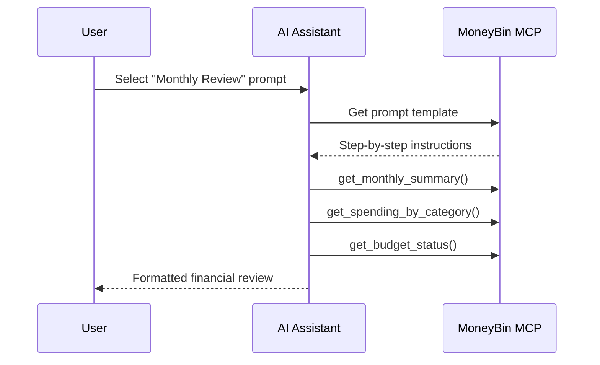

# MCP Prompt Templates

MoneyBin includes 9 prompt templates that guide AI assistants through common financial workflows. Each prompt is registered with the MCP server and available to any connected client (Claude Desktop, Cursor, etc.).

## How Prompts Work

MCP prompts are pre-built conversation starters. When you select a prompt in your AI assistant, it provides structured instructions that walk the assistant through a multi-step financial workflow using MoneyBin's tools.



## Available Prompts

### Data Management

| Prompt | Description | Parameters |
|--------|-------------|------------|
| [`import_data`](import-data.md) | Import financial data files (OFX, PDF) | None |
| [`categorize_transactions`](categorize-transactions.md) | Assign categories to uncategorized transactions | None |
| [`setup_budget`](setup-budget.md) | Create monthly budgets based on spending patterns | None |

### Financial Analysis

| Prompt | Description | Parameters |
|--------|-------------|------------|
| [`monthly_review`](monthly-review.md) | Comprehensive monthly financial review | `month` (YYYY-MM, optional) |
| [`analyze_spending`](analyze-spending.md) | Analyze spending patterns and top categories | `period` (e.g. "last 30 days") |
| [`find_anomalies`](find-anomalies.md) | Detect unusual or suspicious transactions | `days` (default: 30) |

### Information Retrieval

| Prompt | Description | Parameters |
|--------|-------------|------------|
| [`account_overview`](account-overview.md) | Overview of all accounts and balances | None |
| [`transaction_search`](transaction-search.md) | Find transactions matching a description | `description` (optional) |
| [`tax_preparation`](tax-preparation.md) | Gather tax-related information for filing | `tax_year` (default: 2024) |

## Using Prompts

### Claude Desktop

Prompts appear in the prompt selector when MoneyBin is configured as an MCP server. Click the prompt icon or type `/` to browse available prompts.

### Cursor

In Cursor's chat, MCP prompts are accessible through the MCP integration panel.

### Programmatic Access

Any MCP client can list and invoke prompts:

```python
# List available prompts
prompts = await client.list_prompts()

# Get a specific prompt with arguments
result = await client.get_prompt(
    "monthly_review",
    arguments={"month": "2025-01"}
)
```

## Source

All prompts are defined in [`src/moneybin/mcp/prompts.py`](../../../src/moneybin/mcp/prompts.py).
