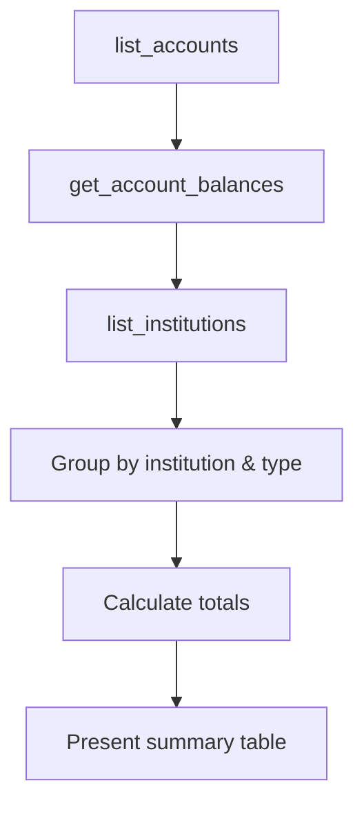

# Prompt: `account_overview`

**Get a comprehensive overview of all financial accounts.**

## Overview

Guides the AI assistant through listing all connected accounts, retrieving current balances, grouping by institution and type, and presenting a summary table with totals.

## Parameters

None.

## Workflow

| Step | Action | Tool Used |
|------|--------|-----------|
| 1 | List all connected accounts | `list_accounts` |
| 2 | Get current balances | `get_account_balances` |
| 3 | See connected institutions | `list_institutions` |
| 4 | Summarize by institution and account type | -- |
| 5 | Calculate total balance across all accounts | -- |

## Output Format

The assistant presents a clear summary table showing:

- Accounts grouped by financial institution
- Account type (checking, savings, credit card, etc.)
- Current balance for each account
- Total balance across all accounts

## Example Usage

> **User:** "Show me all my accounts"
>
> **Assistant:** Runs `account_overview`, presenting a table with 3 accounts at Chase (checking, savings, credit card) and 2 at Fidelity (401k, brokerage), with a combined net balance.

## Related

- [`monthly_review`](monthly-review.md) -- Review that includes account context
- [`analyze_spending`](analyze-spending.md) -- Drill into spending from specific accounts
