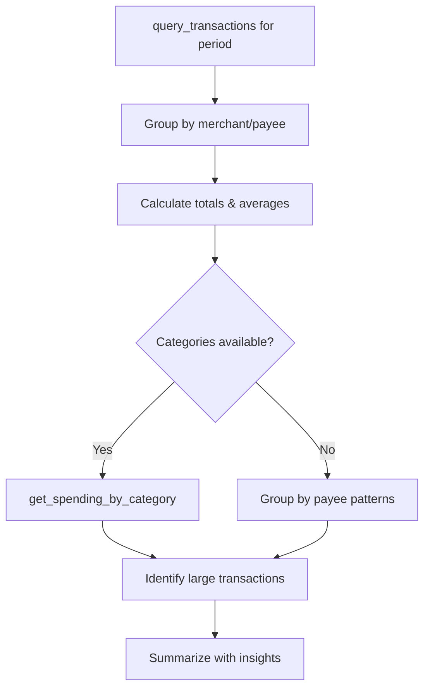

# Prompt: `analyze_spending`

**Analyze spending patterns and identify top categories.**

## Overview

Guides the AI assistant through querying transactions for a specific period, grouping by merchant/category, calculating summary statistics, and presenting actionable insights.

## Parameters

| Parameter | Type | Default | Description |
|-----------|------|---------|-------------|
| `period` | `str` | `"last 30 days"` | Time period to analyze (e.g., "last 30 days", "January 2025", "Q4 2024") |

## Workflow

| Step | Action | Tool Used |
|------|--------|-----------|
| 1 | Get transactions for the period | `query_transactions` |
| 2 | Group spending by merchant | -- |
| 3 | Calculate total, average, and count | -- |
| 4 | Get category breakdown (if available) | `get_spending_by_category` |
| 5 | Flag unusually large transactions | -- |
| 6 | Summarize findings | -- |

## Analysis Output

- **Total spending** for the period
- **Top merchants** by amount
- **Average transaction size** and count
- **Category breakdown** (if categorized)
- **Outlier transactions** that are significantly larger than typical
- **Actionable insights** for reducing spending

## Example Usage

> **User:** "Where did my money go last month?"
>
> **Assistant:** Runs `analyze_spending` with `period="last 30 days"`, showing $3,200 total across 89 transactions, with top merchants being Whole Foods ($420), Shell ($280), and Netflix ($15.99).

## Related

- [`monthly_review`](monthly-review.md) -- Broader review including income and budgets
- [`find_anomalies`](find-anomalies.md) -- Focus on unusual transactions
- [`categorize_transactions`](categorize-transactions.md) -- Add categories for better analysis
