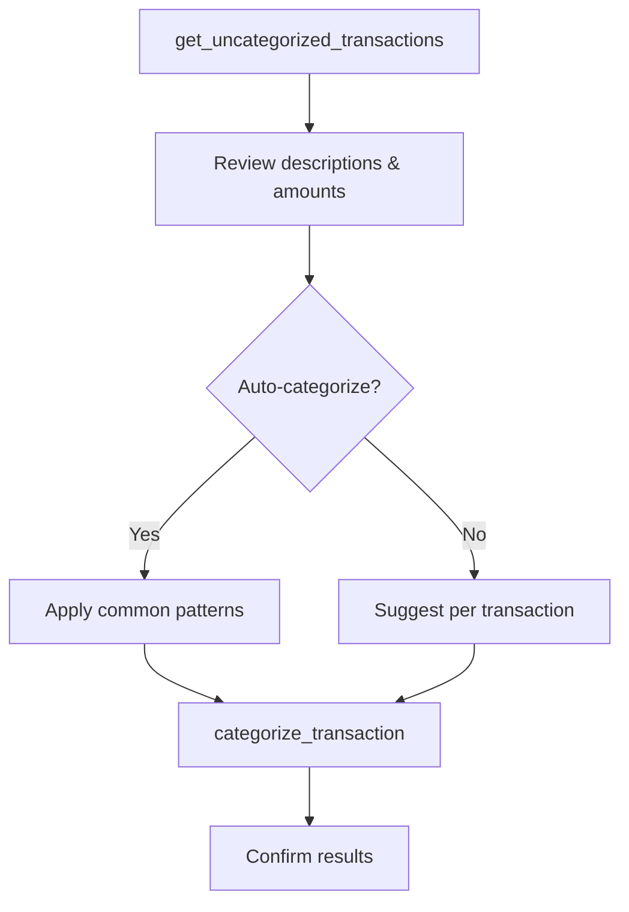

# Prompt: `categorize_transactions`

**Assign categories to uncategorized transactions.**

## Overview

Guides the AI assistant through finding transactions that lack categories, suggesting appropriate categories based on payee/description, and assigning them -- either one by one with confirmation or in bulk.

## Parameters

None.

## Workflow

| Step | Action | Tool Used |
|------|--------|-----------|
| 1 | Find transactions without categories | `get_uncategorized_transactions` |
| 2 | Review each transaction's description and amount | -- |
| 3 | Suggest categories based on payee/description | -- |
| 4 | Assign categories (with user confirmation) | `categorize_transaction` |

## Default Categories

Food, Housing, Transportation, Entertainment, Healthcare, Shopping, Utilities, Income, Transfer.

## Categorization Modes

- **Interactive** -- Present each transaction and ask the user to confirm or adjust the suggested category before applying.
- **Auto-categorize** -- Apply categories based on common patterns (e.g., "NETFLIX" → Entertainment) and ask the user to review the results.

## Example Usage

> **User:** "Help me organize my recent transactions"
>
> **Assistant:** Finds 47 uncategorized transactions, groups them by likely category, and offers to auto-categorize common merchants while asking about ambiguous ones.

## Related

- [`setup_budget`](setup-budget.md) -- Set budgets using the categories
- [`analyze_spending`](analyze-spending.md) -- Analyze spending by category
- [Transaction Categorization spec](../../specs/transaction-categorization.md)
