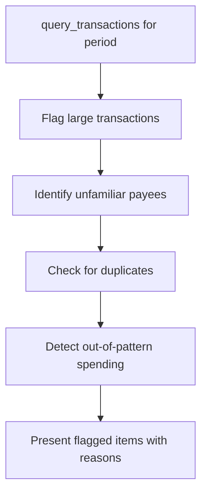

# Prompt: `find_anomalies`

**Detect unusual or suspicious transactions.**

## Overview

Guides the AI assistant through scanning recent transactions for anomalies -- unusually large amounts, unfamiliar merchants, duplicate charges, and out-of-pattern spending.

## Parameters

| Parameter | Type | Default | Description |
|-----------|------|---------|-------------|
| `days` | `str` | `"30"` | Number of days to look back |

## Workflow

| Step | Action | Tool Used |
|------|--------|-----------|
| 1 | Get recent transactions | `query_transactions` |
| 2 | Identify unusually large transactions | -- |
| 3 | Look for unfamiliar payees/merchants | -- |
| 4 | Check for duplicate charges | -- |
| 5 | Flag out-of-pattern transactions | -- |

## Detection Criteria

| Type | Description |
|------|-------------|
| **Large amounts** | Transactions significantly above the user's typical spending |
| **Unknown merchants** | Payees that don't appear in historical data |
| **Duplicates** | Same amount + same payee within a short window |
| **Pattern breaks** | Spending in unusual categories, times, or frequencies |

## Output Format

Each flagged transaction is presented with:
- Transaction details (date, payee, amount)
- Reason it was flagged
- Severity indication

## Example Usage

> **User:** "Anything weird in my recent transactions?"
>
> **Assistant:** Runs `find_anomalies` with `days="30"`, flagging a $450 charge from an unfamiliar merchant and two duplicate $12.99 charges to the same subscription service.

## Related

- [`analyze_spending`](analyze-spending.md) -- Broader spending analysis
- [`transaction_search`](transaction-search.md) -- Investigate specific flagged items
- [`monthly_review`](monthly-review.md) -- Include anomaly detection in reviews
