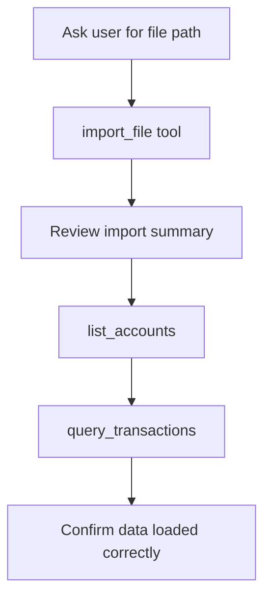

# Prompt: `import_data`

**Import financial data files into MoneyBin.**

## Overview

Guides the AI assistant through importing a financial data file, verifying the import, and confirming the data was loaded correctly.

## Parameters

None.

## Workflow

| Step | Action | Tool Used |
|------|--------|-----------|
| 1 | Ask the user for the file path to import | -- |
| 2 | Import the file | `import_file` |
| 3 | Review the import summary | -- |
| 4 | Verify accounts and transactions loaded | `list_accounts`, `query_transactions` |

## Supported File Types

| Format | Extension | Content |
|--------|-----------|---------|
| OFX/Quicken | `.ofx`, `.qfx` | Bank statements with transactions |
| PDF | `.pdf` | W-2 tax forms |

## Example Usage

> **User:** "I just downloaded my bank statement"
>
> **Assistant:** Uses the `import_data` prompt to walk through importing the file, then shows what accounts and transactions were loaded.

## Related

- [`categorize_transactions`](categorize-transactions.md) -- Categorize the imported transactions
- [OFX Import spec](../../specs/implemented/ofx-import.md)
- [W-2 Extraction spec](../../specs/implemented/w2-extraction.md)
