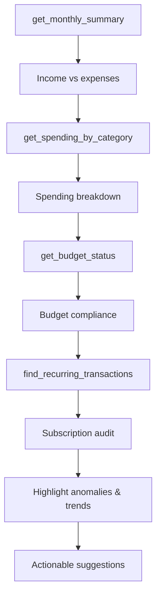

# Prompt: `monthly_review`

**Conduct a comprehensive monthly financial review.**

## Overview

Guides the AI assistant through a structured monthly review covering income vs expenses, spending breakdown, budget compliance, recurring charges, and actionable insights.

## Parameters

| Parameter | Type | Default | Description |
|-----------|------|---------|-------------|
| `month` | `str` | Current month | Month to review in `YYYY-MM` format |

## Workflow

| Step | Action | Tool Used |
|------|--------|-----------|
| 1 | Summarize income vs expenses | `get_monthly_summary` |
| 2 | Analyze spending by category | `get_spending_by_category` |
| 3 | Check budget compliance | `get_budget_status` |
| 4 | Identify recurring charges | `find_recurring_transactions` |
| 5 | Highlight unusual spending or trends | -- |
| 6 | Suggest areas for improvement | -- |

## Output

The assistant presents a clear, concise summary with:

- **Income vs Expenses** -- Net savings/deficit for the month
- **Category Breakdown** -- Where the money went
- **Budget Status** -- Over/under budget by category
- **Subscriptions** -- Active recurring charges and their annual cost
- **Insights** -- Unusual spending patterns and improvement suggestions

## Example Usage

> **User:** "How did I do financially in January?"
>
> **Assistant:** Runs `monthly_review` with `month="2025-01"`, presenting a structured review showing $5,200 income, $4,100 expenses, with Food spending 20% over budget.

## Related

- [`analyze_spending`](analyze-spending.md) -- Deeper spending analysis
- [`find_anomalies`](find-anomalies.md) -- Investigate flagged transactions
- [`setup_budget`](setup-budget.md) -- Create/adjust budgets based on review
