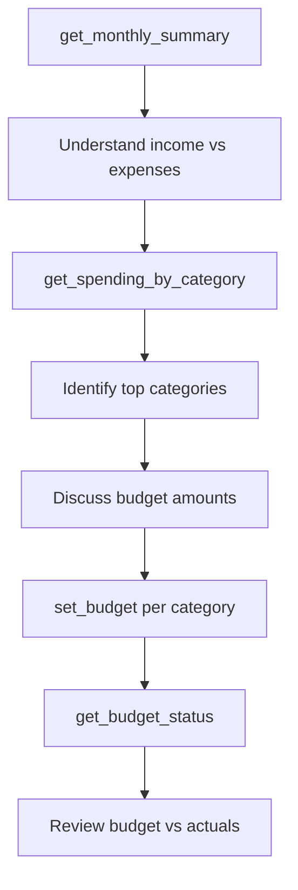

# Prompt: `setup_budget`

**Create monthly budgets based on actual spending patterns.**

## Overview

Guides the AI assistant through analyzing current spending, discussing reasonable budget targets for each category, and creating budget entries. Starts with the highest-spending categories for maximum impact.

## Parameters

None.

## Workflow

| Step | Action | Tool Used |
|------|--------|-----------|
| 1 | Understand current income vs expenses | `get_monthly_summary` |
| 2 | See spending breakdown by category | `get_spending_by_category` |
| 3 | Discuss reasonable budget amounts | -- |
| 4 | Create budgets for each category | `set_budget` |
| 5 | Review budget vs actual spending | `get_budget_status` |

## Strategy

The prompt recommends starting with the biggest spending categories first, where budget adjustments have the most impact. The assistant uses actual spending data to suggest realistic targets rather than arbitrary amounts.

## Example Usage

> **User:** "I want to start budgeting"
>
> **Assistant:** Shows that the user spent $2,400 on Housing, $800 on Food, and $400 on Transportation last month, then suggests budget targets for each and creates them.

## Related

- [`categorize_transactions`](categorize-transactions.md) -- Prerequisite: transactions need categories
- [`monthly_review`](monthly-review.md) -- Check budget compliance monthly
- [Budget Tracking spec](../../specs/budget-tracking.md)
