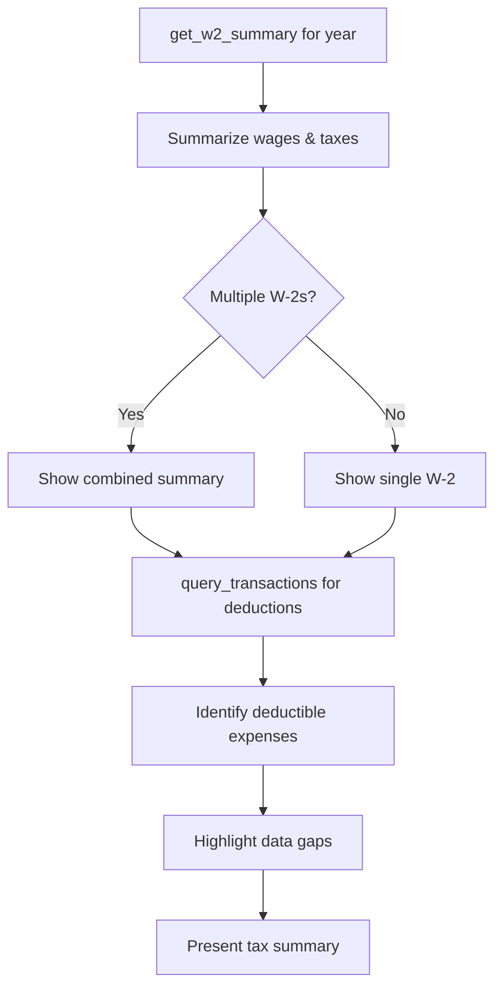

# Prompt: `tax_preparation`

**Gather tax-related information for a specific year.**

## Overview

Guides the AI assistant through retrieving W-2 data, summarizing wages and withholdings, identifying potentially deductible expenses, and highlighting any data gaps.

## Parameters

| Parameter | Type | Default | Description |
|-----------|------|---------|-------------|
| `tax_year` | `str` | `"2024"` | The tax year to prepare for |

## Workflow

| Step | Action | Tool Used |
|------|--------|-----------|
| 1 | Retrieve W-2 data for the year | `get_w2_summary` |
| 2 | Summarize wages, federal tax, state taxes | -- |
| 3 | Combine if multiple W-2s exist | -- |
| 4 | Search for potentially deductible expenses | `query_transactions` |
| 5 | Highlight missing forms or incomplete data | -- |

## Tax Data Summary

The prompt produces a summary including:

- **Total wages** across all employers
- **Federal tax withheld**
- **State tax withheld** (by state)
- **Social Security and Medicare** contributions
- **Potentially deductible expenses** found in transaction data
- **Data gaps** (missing W-2s, incomplete records)

## Disclaimer

> This is informational only -- not tax advice. Consult a tax professional for filing decisions.

## Example Usage

> **User:** "Help me get ready for tax season"
>
> **Assistant:** Runs `tax_preparation` with `tax_year="2025"`, showing W-2 wages of $95,000 with $18,500 federal tax withheld, plus $1,200 in potentially deductible charitable donations found in transaction history.

## Related

- [`import_data`](import-data.md) -- Import W-2 PDFs first
- [W-2 Extraction spec](../../specs/implemented/w2-extraction.md)
