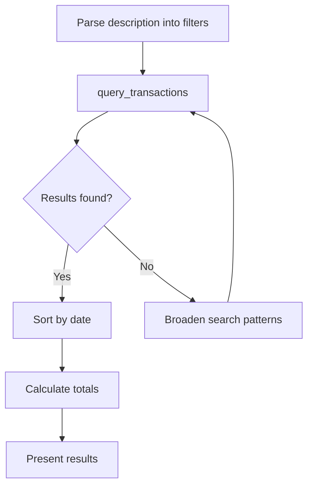

# Prompt: `transaction_search`

**Find specific transactions matching a description.**

## Overview

Guides the AI assistant through converting a natural-language description into search filters, querying transactions, broadening the search if needed, and summarizing results with totals.

## Parameters

| Parameter | Type | Default | Description |
|-----------|------|---------|-------------|
| `description` | `str` | `""` | What to search for (e.g., "Amazon purchases", "rent payments") |

## Workflow

| Step | Action | Tool Used |
|------|--------|-----------|
| 1 | Convert description into search filters | -- |
| 2 | Search with payee pattern, date range, or amount | `query_transactions` |
| 3 | Broaden pattern if no matches (e.g., `%AMZN%`) | `query_transactions` |
| 4 | Sort results by date | -- |
| 5 | Calculate totals across matches | -- |

## Search Tips

The prompt instructs the assistant to use SQL `ILIKE` patterns with `%` wildcards for flexible matching. Common patterns:

| Search Term | Pattern |
|------------|---------|
| Amazon | `%AMZN%` or `%AMAZON%` |
| Starbucks | `%STARBUCKS%` or `%SBUX%` |
| Gas stations | `%SHELL%`, `%CHEVRON%`, `%EXXON%` |

## Example Usage

> **User:** "Find all my Amazon purchases this year"
>
> **Assistant:** Runs `transaction_search` with `description="Amazon purchases"`, searching with `%AMZN%` and `%AMAZON%` patterns, returning 34 transactions totaling $1,247.83.

## Related

- [`find_anomalies`](find-anomalies.md) -- Search for suspicious transactions
- [`analyze_spending`](analyze-spending.md) -- Broader spending analysis
