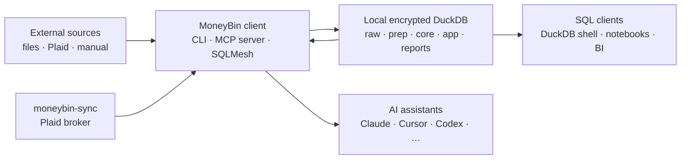
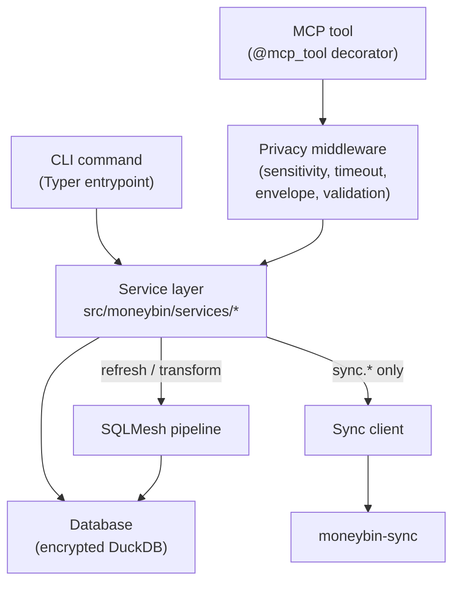

<!-- Last reviewed: 2026-07-20 -->
# System Overview

MoneyBin is a local-first, AI-native personal finance platform. This page is the orientation map — what each major piece does, how they fit together, and what runs when. For the architectural depth (primitives, contracts, layers, internal invariants), see [`docs/architecture.md`](../architecture.md). For column-level schema, see [`data-model.md`](data-model.md). For the full reference, see [`docs/specs/architecture-shared-primitives.md`](../specs/architecture-shared-primitives.md).

## Components at a glance

Five runtime components plus three cross-cutting concerns. The data they share is one encrypted DuckDB file per profile, organized into layers (`raw` → `prep` → `core` → `reports`) plus the `app.*` overlay — the user-state layer holding categorizations, notes, tags, manual corrections, and other locally-managed metadata.

| Component | Kind | What it does | Read more |
|---|---|---|---|
| **Local DuckDB store** | Storage | One encrypted file per profile under `~/.moneybin/profiles/<name>/moneybin.duckdb`. Holds `raw → prep → core → reports` plus the `app.*` overlay. | [`database-security.md`](../guides/database-security.md), [`data-model.md`](data-model.md) |
| **CLI** | Runtime (per-invocation) | Typer-based command surface (Typer is the argparse-style CLI framework); first-class agent peer to MCP. Every command supports `--output json` and returns the same response envelope as the matching MCP tool. | [`cli-reference.md`](../guides/cli-reference.md) |
| **MCP server** | Runtime (per session) | FastMCP-based local server (FastMCP is the Python MCP server library). One 45-tool standard registry spans 11 domains over stdio; the generic `reports` catalog and runner lists and executes registered reports. Capable hosts may optionally defer schemas only from that same registry. The registry advertises zero output schemas. | [`mcp-server.md`](../guides/mcp-server.md) |
| **SQLMesh pipeline** | Runtime (on-demand) | Compiles and runs the `raw → prep → core → reports` transformations. SQLMesh owns every write to `prep.*`, `core.*`, `reports.*`, `meta.*`, and `seeds.*`. | [`data-pipeline.md`](../guides/data-pipeline.md) |
| **Sync client** | Runtime (on-demand) | Talks to `moneybin-sync` to broker Plaid pulls. The server is opaque — the client only knows the API surface. | [`server-api-contract.md`](server-api-contract.md) |
| **Privacy middleware** | Cross-cutting | Tool decorator (`@mcp_tool`) plus FastMCP middleware that classifies responses, masks critical fields, and enforces the read/write allowlist. Global consent-based response gating remains deferred. | [`docs/specs/mcp-architecture.md`](../specs/mcp-architecture.md) |
| **Observability** | Cross-cutting | Structured logs through `SanitizedLogFormatter` (always on), Prometheus-style metrics persisted to `app.metrics`, daily-rotating log files per profile. | [`observability.md`](../guides/observability.md) |
| **Migrations** | Cross-cutting | Forward-only versioned migrations in `app.schema_migrations`; self-heal stuck rows when the migration body changes; `no_auto_upgrade` gate for explicit operator control. Runs at every `Database` open. | [`docs/specs/architecture-shared-primitives.md`](../specs/architecture-shared-primitives.md) |

`moneybin-sync` is not listed here because it is not part of the client install — it runs separately, either self-hosted or as a hosted reference instance. The client reaches it only through the sync client.

## Data flow



The client is the only writer to the local store. Agents reach the data through MCP tools the client exposes; external SQL clients read the file directly (with the encryption key from `moneybin db key`). There is no ambient egress or telemetry. Explicit `sync_*` calls reach opaque `moneybin-sync` APIs, and explicit `gsheet_*` calls reach Google OAuth/Sheets APIs.

## How components fit together

The client is a single Python package. Every CLI command and MCP tool funnels through the same service layer, so the surface (CLI vs MCP) is decided at the edge and the work below it is identical.



Concretely:

- **CLI and MCP both call the service layer.** Neither invokes the other. CLI commands import services directly (e.g., `from moneybin.services.transaction_service import TransactionService`); MCP tool bodies do the same. Same redaction, same audit log, same response envelope.
- **The privacy middleware sits in front of every MCP call.** The `@mcp_tool` decorator wraps each tool body with sensitivity tagging, a wall-clock timeout, error classification, and envelope assembly; FastMCP's `ValidationErrorMiddleware` translates argument-validation failures into friendly error envelopes before the body runs. CLI commands skip the decorator (they reach the service layer directly) but emit the same audit primitives.
- **The SQLMesh pipeline is invoked from the service layer**, never from CLI/MCP code directly. `services/refresh.py` and `services/transform_service.py` open a `sqlmesh_context(db)` from `moneybin.database` and apply plans against the open DuckDB connection.
- **`moneybin-sync` is reached only via the sync client** (`src/moneybin/connectors/sync_client.py`) when `moneybin sync *` commands or `sync_*` MCP tools fire. File-based imports (OFX, CSV, PDF) and inbox watch never touch the network.
- **The categorization service** runs from three callers: the orchestrator during `refresh` (best-effort, after SQLMesh apply), the `transactions categorize *` CLI commands, and the `transactions_categorize_*` MCP tools.
- **The migration runner** runs at process startup (inside `Database.__init__`, gated by `no_auto_upgrade`) and as a manual command (`db migrate apply`). Every process that opens the database checks the migration log first.

## What's running when

There is no daemon and no background worker. Components are either always present in the file, on-demand per invocation, or on-demand per session.

- **Always on (in the file, not a process):** the encrypted DuckDB file, the `app.metrics` table, the audit log table, the daily-rotating log file.
- **On-demand per CLI invocation:** the Typer entrypoint (one process per command), the service layer it imports, the DuckDB connection it opens, and — for `refresh` / `transform` — the SQLMesh adapter.
- **On-demand per MCP session:** the MCP server child process, launched by the client when the session opens and torn down when it closes. Database-touching tools open a fresh short-lived connection per call; sync authentication and other connector-only tools may open none.
- **Optional / opt-in:** the sync client (only when `moneybin sync *` fires), the LLM-assist step in categorization (only when `transactions categorize assist` runs, and only the user's hosted LLM sees the prompt — amounts and account identifiers are stripped first).
- **Never running locally:** `moneybin-sync` itself runs separately (self-hosted or hosted reference instance). The client has no listener, no background sync, no scheduler.

A command runs, the relevant connection opens against the encrypted DuckDB file, work happens, the connection closes. That's the whole runtime model.

## First run

End-to-end on a fresh install:

```bash
# 1. Create a profile (writes ~/.moneybin/profiles/default/).
moneybin profile create default

# 2. Initialize the encrypted database. Generates the AES-256-GCM key,
#    persists it to the OS keychain (default), and writes the empty DB file.
#    Use --passphrase to derive the key with Argon2id from a passphrase
#    instead — the keychain is bypassed.
moneybin db init

# 3. Land your first data. Smart-import detects format (OFX, QFX, CSV,
#    Beancount, PDF) and prompts for account assignment.
moneybin import files my_export.csv

# 4. Run the pipeline (gsheet → match → transform → categorize → identity).
#    Most commands trigger refresh automatically; you rarely run it by hand.
moneybin refresh

# 5. Query the result.
moneybin reports networth          # canned report
moneybin db shell                  # interactive SQL against core.* / reports.*
```

Once `db init` completes, the keychain (or your passphrase) holds the key; subsequent commands unlock the database transparently. See [`data-import.md`](../guides/data-import.md) for the deeper import story, [`profiles.md`](../guides/profiles.md) for multi-profile setup, and [`database-security.md`](../guides/database-security.md) for key management.

## Surfaces

The three peer surfaces (CLI, MCP, SQL) read from the same `core.*` / `reports.*` interface set and the same `app.*` overlay. Writes from MCP are restricted to `app.*` (user state) and `raw.*` (imports and manual entry) by the privacy middleware, and the MCP `sql_query` tool enforces read-only via SQL parsing. The CLI's `moneybin db shell` and `moneybin db query` attach the database **writable** — the convention forbids writes to `core.*` and `reports.*`, but the middleware does not run on those paths, so ad-hoc SQL is on you.

### CLI

Workflow-ordered command groups (`import`, `sync`, `refresh`, `transactions`, `reports`, `accounts`, `categorize`, `system`, `profile`, `db`, `mcp`). Every command supports `--output json` for scripting and agent use; the JSON shape is the same `ResponseEnvelope` returned by the matching MCP tool. The CLI is built for agents driving the shell (Claude Code, Codex CLI) as much as for humans. → [`cli-reference.md`](../guides/cli-reference.md)

### MCP server

One 45-tool standard registry spans 11 domains over stdio. The generic `reports`
catalog and runner lists and executes registered reports, so a new report does
not add a tool slot. Capable hosts may optionally defer schemas from that same
registry without changing its tool names, approvals, allowlists, annotations,
or audit identity. The registry advertises zero output schemas. Supported in eight clients
— see [`mcp-clients.md`](../guides/mcp-clients.md). MoneyBin uses four
sensitivity tiers (`low` / `medium` / `high` / `critical`). Static tools derive
classification from typed payloads; variable projections classify dynamically
under a declared maximum. → [`mcp-server.md`](../guides/mcp-server.md)

### SQL

Read-only DuckDB query against the `core.*` and `reports.*` interface set. Reachable via `moneybin db shell`, the `sql_query` MCP tool, and any DuckDB-compatible client given the profile's encryption key. External clients (DBeaver, Datasette, the plain `duckdb` CLI, Python/R notebooks) need that key — `moneybin db key` prints it for the current profile. → [`sql-access.md`](../guides/sql-access.md)

## Lifecycle of an MCP tool call

A single tool invocation, end-to-end:

1. **Session opens.** The MCP client launches the `moneybin mcp serve` process; FastMCP advertises the registered tool catalog on `tools/list`. No session-wide DuckDB connection is held.
2. **Client invokes a tool** with arguments. FastMCP's `ValidationErrorMiddleware` runs first — Pydantic argument binding errors are translated into a friendly error envelope (`error.code = invalid_arguments`) and returned without ever reaching the tool body.
3. **`@mcp_tool` decorator wraps the body.** It applies static or dynamic classification, starts the wall-clock timeout guard (30s default, with bounded 180s workflow overrides), and dispatches synchronous bodies through a worker thread.
4. **Tool body delegates to the service layer.** It imports a service (e.g., `TransactionService`), runs SQL against the open DuckDB connection, and returns a typed dataclass.
5. **Envelope wrap-up.** The decorator checks the return is a `ResponseEnvelope`, attaches sensitivity metadata, and lets the body's action hints (suggested next tools) ride along. Classified domain exceptions become error envelopes; timeouts become a `timed_out` envelope; anything unclassified propagates to FastMCP.
6. **Audit + return.** The audit primitive logs `tool=<name> sensitivity=<tier> metadata=<...>`. FastMCP serializes the envelope and returns it to the client.

Source: `src/moneybin/mcp/decorator.py`, `src/moneybin/mcp/middleware.py`, `src/moneybin/mcp/privacy.py`.

## Storage

One encrypted DuckDB file per profile: `~/.moneybin/profiles/<name>/moneybin.duckdb`. Encryption is AES-256-GCM at rest (the standard authenticated-encryption cipher used by TLS 1.3 and disk-encryption stacks); there is no plaintext "demo mode" path. Profile-isolated logs, backups, and temp files live alongside the database file:

```text
~/.moneybin/profiles/<name>/
  moneybin.duckdb    # encrypted database
  config.yaml        # profile configuration
  logs/              # daily-rotating log files
  backups/           # moneybin db backup output
  temp/              # short-lived working files
```

The DuckDB file is the durable artifact — back it up like any other file. The unit of sync (Git, Syncthing, NextCloud, iCloud Drive) is this file. → [`database-security.md`](../guides/database-security.md), [`profiles.md`](../guides/profiles.md)

## Concurrency and isolation per profile

- **Profiles are isolated by file.** Each profile is its own encrypted DuckDB file, its own `logs/`, its own `backups/`, its own keychain entry (keyed by profile name), and its own `app.metrics` rows. No shared mutable state.
- **DuckDB is single-writer per file.** Two `moneybin` processes writing to the same profile concurrently will conflict — one waits or fails. Multiple read-only attaches to the same file work concurrently when no write is active; a read-only open that lands during an active write retries on the same backoff as writers.
- **Per-machine, not per-cluster.** The encrypted DB file can be replicated across machines via Syncthing / iCloud / etc., but concurrent writes from two machines are not supported. Treat the file as owned by one host at a time.
- **Two simultaneous CLI invocations against different profiles** are fully isolated — different files, different connections, different keychain entries.
- **The write lock is per-operation, not per-session.** An MCP server takes the exclusive write lock only for the duration of each write tool call, and read calls hold the read lock only for their own duration. So a long-running MCP session and a concurrent `moneybin import files ...` against the same profile contend when both try to write at once, or when a write lands during a long-running read — the later operation retries on the same backoff before failing.

## Identity and auth

Profile-based. Each profile has its own database, encryption key, and configuration. Two key modes:

- **Auto-key mode** — the encryption key is held in the OS keychain. Unlock is transparent on a trusted machine.
- **Passphrase mode** — the key is derived via Argon2id (the password-hashing standard, OWASP-recommended) from a passphrase you supply. The keychain is bypassed; `moneybin db unlock` opens the database for the session.

There is no user account, no login, and no remote identity provider. The profile is the boundary; the encryption key is the credential. → [`profiles.md`](../guides/profiles.md), [`database-security.md`](../guides/database-security.md)

## Sync and external services

MoneyBin has no ambient network egress. Explicit `sync_*` operations call the opaque `moneybin-sync` API, whose provider implementations remain hidden from the client. Explicit `gsheet_*` operations call Google OAuth/Sheets directly. The sync client/server boundary is documented in the API contract. → [`server-api-contract.md`](server-api-contract.md)

Import-only flows (files, inbox watch, manual entry) require no network access.

## Extensibility

- **Contributors** add MCP tools and CLI commands via the patterns documented in [`CONTRIBUTING.md`](../../CONTRIBUTING.md) and the relevant specs. The MCP architecture spec defines the tool registration pattern and sensitivity-tier requirements; the CLI spec defines the command-group taxonomy. New surfaces follow the existing patterns — coherence is the rule.
- **Consumers** do not extend MoneyBin via plugins. There is no plugin system, no extension API, and none is planned for v1. The extension surface is **open SQL**: query `core.*` and `reports.*` from any DuckDB client, build your own Streamlit-style dashboards, or chain your own scripts against the CLI's JSON output. → [`sql-access.md`](../guides/sql-access.md)
- **Replaceability of core dependencies is not a goal.** DuckDB, SQLMesh, FastMCP, and Typer are foundational — every model in `src/moneybin/sqlmesh/models/`, every tool, every command would have to be rewritten to swap them. The stack is chosen to be the durable answer; see [`docs/architecture.md`](../architecture.md) for the rationale.
