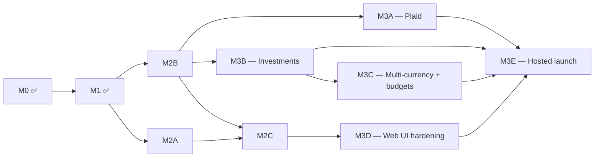

# Roadmap

MoneyBin's pre-launch plan is organized as **milestones**: M0 through M3, each with named sub-milestones where the work decomposes into parallel tracks. M3E closing = launch.

> Per-feature design specs live in [`docs/specs/INDEX.md`](specs/INDEX.md). Architecture decisions live in [`docs/decisions/`](decisions/). Shipped milestones are documented in [`CHANGELOG.md`](../CHANGELOG.md).

## Milestone overview

| Code | Name | Track | Status |
|---|---|---|---|
| **M0** | Infrastructure | — | ✅ shipped |
| **M1** | Data Integrity | — | ✅ shipped |
| **M2A** | Curator State | — | 🚧 in flight |
| **M2B** | Architecture Reference | — | 🚧 in flight |
| **M2C** | Install & Onboarding | — | 🚧 in flight |
| **M3A** | Plaid Transactions sync | Domain | ✅ shipped |
| **M3B** | Investment tracking | Domain | 📐 designed |
| **M3C** | Multi-currency + budget rollovers | Domain | 📐 designed |
| **M3D** | Web UI hardening + Streamable HTTP MCP | Surface | 📐 designed |
| **M3E** | Hosted launch | Surface — closes launch | 📐 designed |
| **Post-launch** | (anything after M3E) | — | 🗓️ planned |

Legend: ✅ shipped · 🚧 in flight · 📐 designed · 🗓️ planned

## Detail

### M0 — Infrastructure (shipped)

The foundation every later milestone builds on.

- AES-256-GCM encryption at rest with Argon2id KDF for passphrase mode
- `Database` connection factory + `SecretStore` + service-layer contract
- Dual-path schema migration system (SQL + Python, auto-upgrade)
- Multi-profile isolation (`~/.moneybin/profiles/{name}/`)
- Observability: `prometheus_client` metrics in DuckDB + `SanitizedLogFormatter`
- Persona-based synthetic data generator (3 personas, ~200 merchants, ground-truth labels)
- MCP v1 scaffolding (response envelope, sensitivity decorator, namespace registry)
- E2E test infrastructure

### M1 — Data Integrity (shipped)

Makes analytics trustworthy. Spending totals match what you'd compute from bank statements.

- Smart tabular importer (CSV/TSV/Excel/Parquet/Feather) with heuristic column detection and migration profiles for Tiller, Mint, YNAB, Maybe
- OFX/QFX/QBO import parity through the same `import_log` infrastructure
- Watched-folder inbox UX
- Cross-source dedup with SHA-256 content hashes + golden-record merge
- Transfer detection across accounts (Tier 4 of shared matching engine)
- Auto-rule learning from user edits (`app.proposed_rules` review queue)
- Account management namespace (`accounts list/show/rename/include/archive/...`)
- Net-worth + balance tracking with reconciliation deltas (three-model SQLMesh pipeline)
- ~33 MCP tools across the v2 path-prefix taxonomy
- MCP install across nine clients
- 10-scenario test suite with five-tier assertion taxonomy

### M2 — Pre-launch beachhead (in flight)

Three sub-milestones close out the local curator-grade product before M3 begins.

#### M2A — Curator State

Reverses the original "no manual entry" cut. Cohesive umbrella covering:

- Manual transaction entry (CLI + MCP, no UI)
- Free-text notes on transactions
- Multi-tag table
- Edit-history audit log
- Import-batch labels
- Split-via-annotation (interim before first-class splits, which remain parked)

All on a new `app.*` user-state schema layer; zero changes to the `raw → prep → core` pipeline. Spec: [`docs/specs/transaction-curation.md`](specs/transaction-curation.md).

A per-transaction `verified` flag was considered and dropped — see the spec's *Out of Scope* section. The trust narrative is "integrity by construction," surfaced through `moneybin doctor` (M2C) running continuous invariant checks, not through per-row user assertion.

#### M2B — Architecture Reference

Codifies the 12 primitives that crystallized through M0–M1 (`Database` factory, `SecretStore`, service-layer contract, `TableRef`, `ResponseEnvelope`, `@mcp_tool` decorator + privacy middleware, `@tracked` / `track_duration()`, `SanitizedLogFormatter`, `TabularProfile` + `ingest_dataframe()`, `MoneyBinSettings`, SQLMesh layer conventions, scenario fixture YAML format). Names the `app.*` user-state layer and `reports.*` presentation-layer schema explicitly. Encodes the local/hosted split contract.

Includes a **writer-coordination contract**: sync, MCP, and the local Web UI (M2C prototype, M3D production) all coordinate through one writer interface so the user never observes a DuckDB lock-contention error. Tested via a concurrent-writers scenario in the runner. Without this, M3A's Plaid sync would conflict with active MCP sessions, and the local tier would feel structurally worse than hosted.

Reference doc all M3 specs cite rather than re-deriving. Spec: `architecture-shared-primitives.md` (planned).

#### M2C — Install & Onboarding

The installable beachhead — `brew install moneybin` works end-to-end on a clean Mac, and an evaluator who lands on the repo can get to a useful first answer without external hand-holding:

- `moneybin doctor` — continuous integrity check (FK invariants, sign convention, balanced transfers, reconciliation deltas). Designed as the trust artifact: "✅ N invariants passing across M transactions." This is the surfaced form of *integrity by construction* — the brand's load-bearing claim. An invariant audit + gap-fill against the architecture spec is tracked as an internal roadmap-review follow-up.
- `reports.*` SQLMesh recipe library (`cash_flow`, `recurring_subscriptions`, `year_over_year_spending`, `top_merchants`, `uncategorized_queue`, `balance_drift`)
- `moneybin demo` — instant synthetic-data preset
- First-run wizard
- **Web UI prototype** (FastAPI + React, narrow scope): AI-categorization-proposal review queue + transactions list. Treated as the first iteration of the M3D UI, not throwaway. Stress-tests the writer-coordination architecture (M2B) under real concurrent load before M3A and M3D depend on it. **Scope is being narrowed** (internal roadmap review, 2026-05-16) — specific cuts pending and tracked as follow-up work. Spec: `web-ui-prototype.md` (planned).
- 📐 `smart-import-transform` — close the agent ingest loop: ship 5 `transform_*` MCP tools, batch `import_files`, `system_status.transforms` freshness block. ✅ shipped.
- PyPI publish workflow + Homebrew formula
- README quickstart tightening + `docs/guides/setting-up-claude-desktop.md` — covers the genuinely confusing MCP-client setup step (internal roadmap review, replaces the earlier `moneybin tutorial` command proposal).
- `docs/architecture.md` one-pager (closes M2B; structure: guarantees → diagram → read/write contract → negative space; internal roadmap review).

**Cut from M2C scope (2026-05-16):** static landing page and 60-second demo video. These are *public-preview* surfaces and are intentionally deferred — the founder's stance is that the product reaches maturity before any external preview. Tracked in the *Public preview prerequisites* section below; revisit when launch posture is reopened. Monthly-ritual MCP prompts also cut from M2C scope — replaced by a single anomaly-detection tool (internal roadmap review; tracked in `docs/specs/INDEX.md`).

Spec: [`docs/specs/user-facing-doc-polish.md`](specs/user-facing-doc-polish.md) (already shipped) plus `web-ui-prototype.md` (planned).

### M3 — Launch (designed; closes at launch)

Two parallel tracks. Both must close for M3E (and launch).

#### M3 Domain track

- **M3A — Plaid Transactions sync** (via `moneybin-server`). Long-running sync uses job-handle pattern (`sync.start` / `sync.status` / `sync.result`) to fit MCP timeout cap. Plaid Production approval is 4–8 weeks; paperwork starts the week the investment-tracking spec lands. Spec: `sync-plaid.md`.
- **M3B — Investment tracking.** Holdings, FIFO lots, realized/unrealized gain/loss, ST/LT classification, Yahoo + CoinGecko prices. Largest competitive moat. Spec: `investment-tracking.md` (planned). Pre-spec ADRs: cost-basis engine location (pure Python vs SQL); investment fact-table shape (new `fct_investment_transactions` vs extend `fct_transactions`). Spec must include a load-bearing Testing section (invariants, fixture strategy, blocking property tests); M3B does not ship until cost-basis output ties to a real-world 1099-B end-to-end through the pipeline.
- **M3C — Multi-currency + budget rollovers.** `amount_original` + `currency_original` on `fct_transactions`, Frankfurter FX rates, realized FX gain/loss on conversions; budget rollovers close the last traditional-budgeting gap. Pre-spec ADRs: FX cost-basis policy (FIFO matching investments?); home currency detection (OS locale default vs explicit). Specs: `multi-currency.md` (planned), `budget-tracking.md` (planned).

#### M3 Surface track

- **M3D — Web UI hardening + Streamable HTTP MCP.** Extends the M2C Web UI prototype to the full surface (dashboards, account management, balance reconciliation, investment lots from M3B, multi-currency from M3C) and ships the Streamable HTTP MCP transport that unlocks ChatGPT web/mobile and other remote clients. Same UI at `moneybin ui` (local) and the hosted tier. Spec: `web-ui-overview.md` (planned).
- **M3E — Hosted launch.** Auth0 + Stripe + per-user encrypted DuckDB + zero-knowledge passphrase + recovery codes + GDPR data-export/delete + on-call ready. **This is launch.**

### Post-launch (designed but not gating launch)

- **Privacy tiers + consent model.** Redaction engine, consent management, audit log, provider profiles, AIConfig (`docs/specs/privacy-and-ai-trust.md` framework + children).
- **Native PDF parsing beyond W-2 + AI-assisted file parsing.**
- **ML-powered categorization + merchant entity resolution.** Needs accumulated labeled data from real users.
- **MCP Apps** (interactive UI inside Claude Desktop, VS Code, etc.). Revisit when client support widens.
- **Mobile read-only viewer.**
- **Export** (CSV, Excel, Google Sheets).

## Public preview prerequisites

A set of artifacts is intentionally deferred until the founder decides to expose MoneyBin to a large external audience. These are *not* feature work — they're presentation-and-distribution surfaces. They sit outside the M0–M3E milestone graph because they're gated on a posture decision, not on engineering work:

- Static landing page (one-page brand + value-prop surface)
- 60-second demo video / asciinema cast
- AGPL + encryption visuals (icon cards or screenshots reinforcing the trust story)
- README hoist of `moneybin doctor` as the lead trust artifact (if the README ever becomes a top funnel)
- Show HN / external preview posture (anonymous vs. Auth0-attributed, etc.)

Status decision (2026-05-16): no urgency. The product reaches the maturity bar first; preview surfaces get built when the founder reopens the launch question. Anything in this list that lands earlier should be on its own merit, not on launch-readiness grounds.

## Sub-milestone parallelism

Within M2 and M3, sub-milestones can run in parallel where dependencies allow:

M2A and M2B run in parallel (different cognitive modes). M2C depends on both — M2B because the writer-coordination contract must exist before the M2C Web UI prototype writes concurrently with MCP, M2A because curator-state is what the prototype's queue reviews. M3A and M3B both depend on M2B settling the architecture contract. M3C waits on M3B for the investment fact-table shape. M3D extends M2C's Web UI prototype rather than starting from scratch. M3E waits on everything.

## When milestones close

| Milestone | Closes when… |
|---|---|
| M2A | `transaction-curation.md` ships and curator-state features are usable end-to-end |
| M2B | `architecture-shared-primitives.md` is published and the public distillation lands at `docs/architecture.md` |
| M2C | `brew install moneybin && moneybin demo` works on a clean Mac with a clean `moneybin doctor` output, the Web UI prototype (descoped per internal roadmap review) runs at `moneybin ui` and lets a user review AI-categorization proposals end-to-end, the README quickstart + Claude Desktop guide carry a new user from zero to a first MCP answer, and `docs/architecture.md` ships as the one-page public distillation |
| M3A | Plaid Production is approved and a first user syncs from a real bank |
| M3B | Investment cost-basis numbers tie to at least one broker's official 1099-B for a full tax year |
| M3C | A non-USD user can import multi-currency transactions, see home-currency equivalents, and FX gain/loss on a deliberate round-trip ties to bank-statement-derived expectation within $0.01 |
| M3D | The full UI surface (dashboards, accounts, balances, investments, multi-currency) ships at `moneybin ui` (local) and the hosted tier from the same codebase; ChatGPT web connects via Streamable HTTP MCP |
| M3E | Hosted ops + billing + GDPR + on-call all close; a beta user signs up, links a bank, asks Claude a question, and downloads their full encrypted DuckDB. **Launch.** |

## Anti-roadmap

To keep solo capacity focused, the following are **explicitly not on the roadmap** until post-launch (and many never will be):

- First-class split transactions (parked; M2A ships split-via-annotation as interim)
- Envelope budgeting (parked; traditional + rollovers cover the 80% case)
- Mobile native apps (post-launch web viewer at most)
- Direct broker APIs beyond Plaid (CSV import covers the long tail)
- Real estate / illiquid assets
- Receipt scanning / per-item OCR
- Email forwarding ingestion
- Tax-form generation (Schedule D, Form 8949)
- Public REST API for third-party integrations (FastAPI scaffold exists post-M3D; build when a real consumer requests it)
- Windows native distribution (Mac is the curator audience; Linux works via PyPI)
- Enterprise / SOC 2 path (consumer + indie tier; revisit only on enterprise signal)
