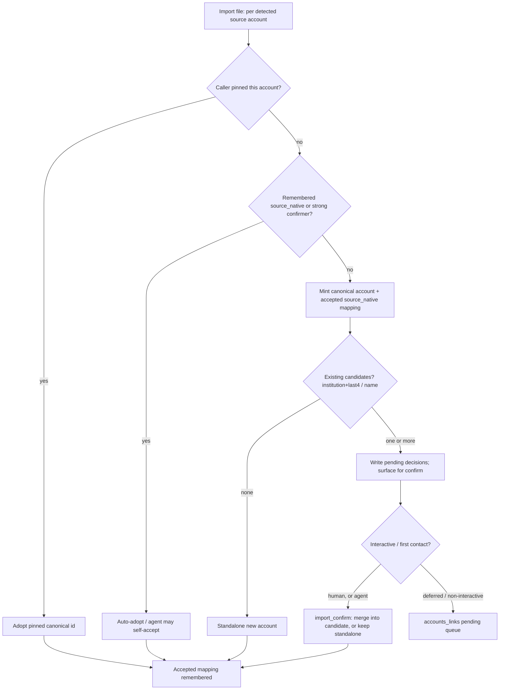

# Cross-Source Account Identity Resolution

> Last updated: 2026-06-14
> Status: draft
> Address: M1S (Ingestion Core)
> Type: Feature
> Owns: the canonical-account-identity contract (`core.dim_accounts.account_id`
> semantics + `app.account_links` + `app.account_link_decisions`)
> Decisions: [ADR-015](../decisions/015-transaction-identity-content-derived.md)
> (transaction-identity model + the account-surrogate asymmetry)
> Bundles with: [`account-management.md`](account-management.md) (shares the
> `accounts` namespace + `app.account_settings`)
> Unblocks: cross-source transaction dedup
> ([`matching-exact-key-dedup.md`](matching-exact-key-dedup.md)); account
> merge (deferred in `account-management.md` §"Account merge")

## One-line goal

One real-world account = one canonical, opaque, non-PII `account_id`, regardless
of how many sources (OFX/QFX/QBO, CSV/tabular, PDF, Plaid sync) it arrives from —
via a resolution step every import/sync runs through, backed by a durable
`native_ref → canonical_id` link registry.

## Problem statement (verified live 2026-06-13)

Today each loader mints its **own** `account_id`, so one real account becomes one
`account_id` *per source*. There is **no reconciliation layer** (grep finds no
`account_link` / `canonical_account` / account-alias concept anywhere in `src/`,
`sqlmesh/`, or `docs/specs/`).

Live test on real Wells Fargo data: the same 5 WF accounts imported as **both**
`.qfx` (279 txns) and `.csv` (279 exact twins). Expected cross-source dedup to
collapse to 279; got **558**, every row `source_count = 1`. Verified root-cause
chain:

- `core.fct_transactions` carried **10 distinct `account_id`s for 5 real
  accounts** (5 ofx + 5 csv). The cross-source dedup blocking join requires
  `a.account_id = b.account_id` (`src/moneybin/matching/scoring.py`, the
  self-join `ON a.account_id = b.account_id`), so it produced **zero** candidate
  pairs. PR #250's exact-key auto-merge
  ([`matching-exact-key-dedup.md`](matching-exact-key-dedup.md)) is correct but
  **can never fire** on real cross-source data — the pairs never reach scoring.
- `core.dim_accounts` held only the **5 OFX** ids; the **CSV `account_id`s were
  0-of-5 present** in the dimension — the CSV transactions were *orphaned* from
  the account dimension (an independent integrity bug: net-worth / reports
  mis-state the CSV side).
- Account-number masking (`****4267`) collapsed the 10 ids to 5 *displays*, which
  is why this looked like "the same 5 accounts" on every read surface.

The **proximate bug** is `ImportService._resolve_account_via_matcher`
(`src/moneybin/services/import_service.py`): it queries **only
`raw.tabular_accounts`** (`GROUP BY account_id`), so a CSV for an OFX-only account
finds no match → falls back to `slugify(account_name)` → mints a new id. It must
resolve against a **cross-source** registry instead.

So cross-source transaction dedup — and the whole Ingestion-Complete validation
gate — is **blocked on account identity**, not on matching heuristics.

### How each source assigns account identity today (verified)

| Source | native account key | signals it carries | full number? | last4? | institution? |
|---|---|---|---|---|---|
| OFX/QFX/QBO | raw bank account number (`<ACCTID>`, PII) | number, routing (`<BANKID>`), FID | ✅ | `RIGHT(number,4)` | `institution_org` / `institution_fid` |
| Plaid sync | opaque Plaid token | token, `mask`, `official_name`, subtype; `persistent_account_id` at some institutions | ❌ never | `mask` | `institution_name` |
| CSV / tabular | `slugify(account_name)` or prior match | user-supplied name; `account_number`/`account_number_masked` when present | sometimes | `account_number_masked` | `institution_name` |
| PDF | tabular path → same as CSV | last4 if the statement exposes it | sometimes | sometimes | sometimes |

**What the signals can and can't do.** `institution + last4` is the only
identifier a bank file **and** Plaid both expose — but it is a *weak candidate*,
not a reliable key: a `mask` is not always the literal last4 (Plaid's own
warning), two accounts can share a last4, and for a **bare CSV the institution is
frequently unknowable** (only Tiller exports carry an `Institution` column; Mint,
YNAB, and Maybe carry an account *name* and nothing more). A full account number
is a strong *confirmer* when present (OFX↔CSV) but never reaches Plaid. A name is
a last-resort candidate that must require confirmation. **The reliable identity
signals, in order, are: (1) a remembered `native_ref` (idempotent re-import),
(2) a strong confirmer (full number / Plaid `persistent_account_id`), (3) an
explicit user/agent binding ("this file is account X"), (4) a format-carried
account name.** `institution + last4` only ever produces a *review candidate* —
never an auto-merge — and institution itself is treated as best-effort metadata,
not a required identity input (see [§Decision 3](#decision-3--resolution-ladder--confidence-tiers)
and [§Decision 7](#decision-7--import-time-ux--ax-detect--confirm--remember)).

## Prior art

Parallel research across seven well-documented players (GnuCash, Plaid,
SnapTrade, Firefly III, Actual Budget, Maybe, Beancount/hledger) converges hard:

**Every serious tool keeps a canonical account distinct from per-source ids.**
- **Actual Budget** — internal account UUID `id` + the provider's external
  `account_id` / `official_name` / `account_sync_source` stored on the same row;
  a one-time "Link Account" step, then remembered. Transaction dedup is a
  separate layer keyed on `imported_id` (OFX FITID), with a 5-day / exact-amount
  / fuzzy-payee fallback.
- **GnuCash** — canonical Chart-of-Accounts account + an attached **"Online ID"**
  (OFX `BANKID`+`ACCTID`); first import shows an account-selection dialog, then
  re-imports auto-route silently; mappings editable later in an "Import Map
  Editor."
- **Firefly III** — asset account matched by **IBAN / account number**
  auto-match ("if the IBAN matches you have no choice"); only genuinely ambiguous
  rows fall to the manual mapping dropdown; resolution persisted in a reusable
  config.
- **Plaid `persistent_account_id`** / **SnapTrade `institution_account_id`** —
  purpose-built *stable cross-link keys*, distinct from the ephemeral
  connection-scoped id, specifically to trace the same account across re-links.
- **Beancount / hledger** — the cautionary counter-examples: the account *name*
  **is** the identity, with no cross-source layer, so they structurally **cannot**
  auto-collapse the same account across sources.

A second round of research focused on the **import-time interaction** —
how each tool learns *which account/institution a file belongs to* — found an
even stronger convergence: **the account is a binding the user makes, not a fact
detected from the file.**

- **Actual Budget** — you open an account, then import *into* it; the file's own
  identity is irrelevant.
- **GnuCash** — the CSV assistant has a base **"Account" dropdown** (pick the
  target up front); OFX binds bank-id→account once, then remembers it.
- **Firefly III** — auto-matches on IBAN/number, and when the file lacks them
  falls back to a user-picked **"Default import account."**
- **hledger / beancount** — one rules-file / importer **bound to one account**
  (`account1`, `account()`), reused silently.
- **Maybe** — a per-distinct-value account-mapping review (match-by-name or
  **"create new account"**), remembered as a reusable template.

And **institution is not a concept at import time in any of them** — it folds
into "the account." Only Tiller's CSV carries an `Institution` column; only the
aggregator *connect* flows (Plaid Link's institution picker) select it
explicitly.

Lessons that drive this design:

1. **GnuCash's defining limitation is exactly our core requirement.** GnuCash
   stores only **one** Online ID per account, so it can't collapse the same
   account arriving under different source keys. We must support **many native
   refs → one canonical account (1:N)**. This is the single most transferable
   idea: a canonical account + a *set* of attached native identity keys.
2. **Plaid's dedup guidance demotes `institution + last4` to a candidate** — with
   a hard warning: *"Never detect duplicates by matching a mask with an account
   number"* (a `mask` is usually but not always the last 4); treat a
   composite-only match as a **candidate requiring confirmation, not an
   auto-merge**.
3. **The account is bound, not detected — so confirm at first contact, then
   remember.** The reliable path is: auto-resolve on a remembered ref or a strong
   confirmer; otherwise *ask once* (at import, with candidates and a "new account"
   escape) and remember the binding. This is the universal first-contact pattern,
   and it maps directly onto MoneyBin's existing `import_preview`→`import_confirm`
   seam — which today confirms *columns* and must be extended to confirm the
   *account* (see [§Decision 7](#decision-7--import-time-ux--ax-detect--confirm--remember)).

## Decision 1 — Canonical `account_id` is an opaque, minted, non-PII surrogate

`core.dim_accounts.account_id` becomes a **minted `uuid4[:12]`**
(`.claude/rules/identifiers.md` strategy 3). Every source attaches to it as a
**native ref**; no source id is ever the canonical id.

**Rationale.** A canonical account has *no single natural cross-source key* — a
full number reaches OFX/CSV but never Plaid; a token reaches only Plaid; a name
is collision-prone. Strategy 3 (UUID4 truncated) is the doctrinally-correct fit
for "a canonical entity with no natural key," and it is the same surrogate-id +
resolution-chain pattern `core.dim_securities` already uses
([`investments-data-model.md`](investments-data-model.md)). Benefits:

- **Sources can share one `dim_accounts` row** — Plaid and CSV join the same
  canonical account; the orphaning bug disappears.
- **We stop masking a primary key.** Today `account_id` *is* the PII account
  number, so it's masked on every read surface, which is why 10 ids looked like
  5. An opaque id is safe to expose.
- **A stable, non-PII agent handle** (see Decision 6 / AX).

**Cost (one-way door, accepted).** This changes `core.fct_transactions.account_id`
semantics and requires re-pointing `app.*` state keyed on the old source-ids
(migration below). Cheap pre-launch; see [§Migration](#migration-pre-launch-clean-re-mint).
Rejected: *keep the strongest source's id as canonical* — leaves the canonical id
as PII for OFX-first accounts, inconsistent across accounts (number vs token vs
slug), and still forces masking a PK; no prior-art tool does this.

The account *surrogate* and the transaction *content-derived* identity are
deliberately asymmetric; the rule and its rationale are recorded in
[ADR-015](../decisions/015-transaction-identity-content-derived.md).

## Decision 2 — Two tables: `account_links` (mapping) + `account_link_decisions` (proposals)

Account identity uses **two** new `app.*` tables, splitting the two genuinely
different grains rather than conflating them in one (resolved at `draft→ready`;
the single-table alternative carried provisional/pending state and candidates-in-
JSON on the mapping row, which forced an awkward active-predicate + status
machine — see the review history). The split **mirrors the transaction matcher
wholesale**: a durable mapping plus a `match_decisions`-shaped proposal queue.

Both tables are written through repos (`AccountLinksRepo`,
`AccountLinkDecisionsRepo`) so every mutation emits a paired `app.audit_log` row
in the same transaction (Invariant 10,
[`app-integrity-invariant.md`](app-integrity-invariant.md)).

### `app.account_links` — the native-ref → canonical mapping

The durable translation + idempotency substrate. One row per (canonical account,
native ref). Status is binary: a mapping is `accepted` (live) or `reversed`
(undone) — **no pending/provisional state lives here**; every source account
*always* has an accepted `source_native` mapping, so it is always present in
`dim_accounts`.

```sql
-- app.account_links
link_id          TEXT     PRIMARY KEY,   -- uuid4[:12]
account_id       TEXT     NOT NULL,      -- canonical account this ref maps to
ref_kind         TEXT     NOT NULL,      -- source_native | persistent_token | full_number
ref_value        TEXT     NOT NULL,      -- the native identifier; read-surface
                                         --   sensitivity is per-ref_kind (see note)
source_type      TEXT     NOT NULL,      -- provenance: ofx | csv | pdf | plaid | ...
source_origin    TEXT     NOT NULL,      -- institution/connection/format (scopes source_native)
status           TEXT     NOT NULL,      -- accepted | reversed
decided_by       TEXT     NOT NULL,      -- auto | user | system
                                         --   ('user' = human OR agent ratification;
                                         --    actor_kind is runtime-only, not a value)
decided_at       TIMESTAMP NOT NULL,
reversed_at      TIMESTAMP,
reversed_by      TEXT
```

**Stored `ref_kind` vocabulary** (closed; extensible per the `source_type` /
`match_type` closed-discriminator convention in `identifiers.md` §"Out of scope"):

| `ref_kind` | strength | source | role |
|---|---|---|---|
| `source_native` | — | every source account | the source's own account key (OFX number, CSV slug, Plaid token); the **translation + idempotency** key staging joins on |
| `persistent_token` | strong | Plaid `persistent_account_id`; SnapTrade `institution_account_id` | cross-re-link / cross-connection auto-adopt |
| `full_number` | strong **only when scoped** | OFX always (`BANKID`+`ACCTID`); CSV/PDF when present | cross-source auto-adopt confirmer — `ref_value` MUST be institution/routing-scoped (below) |

**Mapping contracts (enforced as `AccountLinksRepo` guards — DuckDB has no
partial/filtered unique indexes, so these are application-layer, consistent with
the existing repo-enforced-invariant pattern):**

- **One active `source_native` mapping per account** — `(source_type,
  source_origin, ref_value)` is unique among `accepted` rows where
  `ref_kind='source_native'`. Scoping by `source_origin` prevents cross-
  institution slug collisions (two banks each with a "checking" CSV → distinct
  `source_origin` → distinct keys). This is what makes re-import idempotent (the
  "remembered mapping" of GnuCash / Actual / Firefly).
- **Strong-ref uniqueness** — `(ref_kind, ref_value)` is unique among `accepted`
  rows where `ref_kind ∈ {full_number, persistent_token}`: one strong ref → one
  canonical account.
- **`full_number` is institution/routing-scoped.** Bank account numbers are
  unique only *within* an institution, so a `full_number` `ref_value` MUST be the
  scoped composite (OFX `BANKID`+`ACCTID`; otherwise `institution_slug`+number) —
  never the bare number. A number arriving without a routing/institution scope
  (e.g. a CSV number column, unknown institution) is **demoted to a candidate**
  signal (below), never a global auto-adopt key. `persistent_token` is globally
  unique by construction.

### `app.account_link_decisions` — the merge-proposal review queue

`match_decisions`-shaped. One row per (provisional account, candidate account)
proposal — so **candidates are relational rows, queryable, not JSON**. The
review queue reads `pending` rows. This is the *only* place pending/ambiguous
state lives.

```sql
-- app.account_link_decisions
decision_id            TEXT  PRIMARY KEY,  -- uuid4[:12]
provisional_account_id TEXT  NOT NULL,     -- the just-minted source account under review
candidate_account_id   TEXT  NOT NULL,     -- an existing canonical account proposed as the same
confidence_score       DOUBLE,
match_signals          TEXT,               -- JSON-encoded (per match_decisions convention):
                                           --   which weak signal matched + its value (institution_last4 / name)
status                 TEXT  NOT NULL,     -- pending | accepted | rejected | reversed
decided_by             TEXT  NOT NULL,     -- auto | user
match_reason           TEXT,
decided_at             TIMESTAMP NOT NULL,
reversed_at            TIMESTAMP,
reversed_by            TEXT
```

- **Candidate signals are not stored on `account_links`.** `institution_last4`
  (OFX `RIGHT(number,4)`, Plaid `mask`, tabular `account_number_masked`) and
  `account_name` are *weak signals* the resolver computes live and matches
  against **existing accounts' `last_four` / `institution_name` / `display_name`
  on `core.dim_accounts`** (durably present there — captured at mint, Decision 7).
  A match produces a `pending` decision row recording which signal fired. Weak
  signals are never an accepted `ref_kind` and never auto-merge.
- **Resolving a decision** (Decision 5): **accept(target=candidate)** re-points
  the provisional's `account_links` to the candidate (`UPDATE … SET account_id`)
  and marks the decision `accepted`; sibling decisions for the same provisional
  are auto-`rejected`. **reject** records the declined pairing (so the resolver
  won't re-propose it, cf. `get_rejected_pairs`) and leaves the provisional
  standalone. **undo** sets `reversed`.

**`ref_value` sensitivity is per-`ref_kind`, a read-surface concern, not a storage
one.** DB-level AES-256-GCM covers every column uniformly (not a per-field
decision — see [`privacy-data-protection.md`](privacy-data-protection.md)), so no
extra at-rest encryption. **Read-surface masking** (`mcp.md` tiers) is
per-`ref_kind`: a number-bearing `full_number` / `source_native` `ref_value` is
CRITICAL → masked; a Plaid `persistent_token` is an opaque non-PII token → low.
The middleware masks by `ref_kind`; do not mask already-safe values.

**The mapping table is the substrate for account *merge* too** (the operation
`account-management.md` deferred because "merge would require recomputing every
consumer's view of `account_id`"): merging two existing canonical accounts =
re-pointing one's `account_links` to the other + transform recompute. This spec
ships the substrate; the merge *surface* is a later increment.

### Where canonical assignment is applied (raw stays pure)

Resolution is **decided in Python at import time** (fuzzy matching, minting, and
proposal writes that pure SQL can't express) and **applied in the transform layer
via a JOIN** — keeping `raw.*` "untouched data from loaders":

1. **Loaders** write `raw.*_{accounts,transactions}` with the source's **native
   account key** (OFX number, CSV slug, Plaid token) — *not* a resolved canonical
   id. (Today the slug is stamped at load; this moves the stamping out of raw.)
2. **`AccountResolver`** (Python, import time — replaces
   `_resolve_account_via_matcher`) consults/writes `app.account_links`, mints
   canonical ids, and writes any `app.account_link_decisions` proposals.
3. **Staging** (`stg_{ofx,tabular,plaid}__{accounts,transactions}`) **LEFT JOINs
   the `accepted` `app.account_links`** on `(source_type, source_origin,
   ref_kind='source_native', ref_value = native key)` and projects the canonical
   `account_id`. Because every source account has exactly one *accepted*
   `source_native` mapping (guard above), this is an unambiguous 1:1 translation —
   no status/active predicate needed (the pending/provisional complexity lives in
   `account_link_decisions`, not here).
4. **`core.dim_accounts`** is keyed on the canonical id (Decision 4);
   `core.fct_transactions.account_id` is canonical, so cross-source dedup's
   `a.account_id = b.account_id` join finally fires.

Re-pointing on merge/correction is then a pure **`app.*` update + transform
recompute** — no `raw` mutation. A provisional account always has an accepted
`source_native` mapping, so its transactions are **never orphaned** while its
merge proposal is pending; on accept its mapping re-points and the provisional
drops from the dimension on the next recompute (no ghost row); history survives
in the two `app.*` tables + `app.audit_log`.

## Decision 3 — Resolution ladder + confidence tiers

`AccountResolver.resolve(source_account)` runs on every import/sync, mirroring
the transaction matcher's blocking → score → accept/review/reject. Ordered by
signal reliability:

0. **Explicit binding.** Caller pinned identity (`--account-id` /
   `import_confirm(account_bindings=…)` / "import into account X") → **adopt** that
   canonical id, write/refresh the accepted `source_native` mapping. Deterministic
   override above all detection (Decision 6/7).
1. **Strong-confirmer / idempotency pass.** Look up `accepted` `account_links` by
   `source_native` (same-source re-import), then `persistent_token`, then scoped
   `full_number`. Hit → **auto-adopt** that canonical id; record any new strong
   ref of this source as an accepted mapping. `decided_by='auto'`.
2. **Candidate pass** (only if no strong hit). Mint a canonical account and write
   its accepted `source_native` mapping (so it is in the dimension immediately),
   then look for existing accounts sharing `institution + last4` (when institution
   is known), then fuzzy `account_name`, querying `core.dim_accounts`:
   - **0 candidates** → done: a new standalone account. Its `last_four` /
     institution / name (captured per Decision 7) become candidate signals for
     *future* imports.
   - **≥1 candidate** → write one `pending` `account_link_decisions` row per
     candidate, surfaced for confirmation: at first contact via the import-confirm
     seam (Decision 7) when interactive, else the `accounts_links` review queue.
     **Never auto-merge on `institution+last4` or name** (Plaid's mask≠number
     warning + last4-collision risk — two distinct WF accounts could share `4267`).

| Outcome | signal | action | resulting state |
|---|---|---|---|
| Adopt (pinned) | explicit `account_id` | bind to the named canonical | accepted mapping (`decided_by=user`¹) |
| Auto-adopt | remembered `source_native`, scoped full number, or persistent token | reuse existing canonical | accepted mapping (`auto`) |
| Mint new | no candidate at all | new standalone canonical account | accepted mapping (`auto`) |
| Propose / review | `institution+last4` or fuzzy name | new account + `pending` decision(s) | accepted mapping **plus** pending decision(s) |

¹ `decided_by` is `auto | user | system`; **agent ratification maps to `user`**
(consistent with `match_decisions_repo`) — `actor_kind` is a runtime distinction,
not a `decided_by` value.

`institution` is **best-effort metadata**, never a required input: when unknown
(a bare CSV), the `institution+last4` candidate rung simply doesn't fire and
resolution falls through to name / mint-new. Thresholds reuse `MatchingSettings`
(`high_confidence_threshold`, `review_threshold`) — no parallel knobs.

## Decision 4 — `core.dim_accounts` keyed on canonical id; COALESCE-across-group merge

`core.dim_accounts` grain stays `account_id`, but `account_id` is now canonical,
so multiple source rows (ofx + csv + plaid) collapse into one. The current
`ROW_NUMBER() OVER (PARTITION BY account_id ORDER BY extracted_at DESC)`
last-write-wins logic would let a later CSV row **null an OFX account's
`routing_number` / `institution_fid`**. Replace it with a **per-field
COALESCE-across-group** that preserves the best non-null value:

- Structured bank fields (`routing_number`, `institution_fid`) — first non-null
  by **source strength** (`ofx > plaid > tabular`) then recency.
- `institution_name`, `account_type` — first non-null by recency.
- `source_type` / `source_file` — record the contributing set (the winning row's
  for display; the union is recoverable from `app.account_links`).

This is the same "golden-record merge across sources" rule
[`matching-same-record-dedup.md`](matching-same-record-dedup.md) applies to
transactions, lifted to the account grain. `display_name`'s
`RIGHT(account_id, 4)` fallback is dropped (the id is now opaque); the default
becomes `institution_name || ' ' || account_type || ' …' || last_four` sourced
from `app.account_settings.last_four` (captured per Decision 7).

## `transaction_id` stability under a mutable `account_id` (ADR-015)

Making `account_id` a *mutable* canonical surrogate collides with how
`transaction_id` is minted today: `prep.int_transactions__matched` hashes
`SHA256(source_type | source_transaction_id | account_id)` for both the matched
gold key and the unmatched fallback. If `transaction_id` keeps depending on
`account_id`, every account re-mint or merge re-hashes every affected
`transaction_id`, orphaning all `app.*` curation keyed on it.

The field is near-unanimous (Actual, Firefly, Maybe, GnuCash, Plaid): **content
must not *be* identity** — identity is stable, the source key is a separate dedup
key. But those tools *mutate in place*; MoneyBin *derives* `core`. A true stable
surrogate would need a per-transaction identity registry that survives every
rebuild — hot app-state at transaction volume, weakening derive-from-raw where it
matters most. Plaid (the closest analog) instead re-mints on the pending→posted
enrichment and ships a **forwarding pointer** (`pending_transaction_id`). Full
analysis + the account-vs-transaction asymmetry: [ADR-015](../decisions/015-transaction-identity-content-derived.md).

**Decision: content-derived id + alias forwarding (not a surrogate).**

1. **Re-key the hash to the immutable source identity** — drop the mutable
   `account_id`; key on `source_type | source_origin | source_native_key |
   source_transaction_id`, and **exclude descriptive text** (`description` /
   `memo` — the brittle field belongs to the fuzzy matcher, never to identity).
   (`source_origin` is the existing `raw.*` column.)
2. **Priority-anchor, don't whole-set-hash.** A merged group's id derives from its
   **highest-priority member** (reusing `MatchingSettings.source_priority`,
   `ofx > plaid > tabular`), not a hash over all members. Result: a lower-priority
   twin joining (the common forward-order — bank file first, CSV later) leaves the
   id **unchanged**; only a higher-priority source arriving later flips the anchor.
   `transaction_id` then changes **iff the dedup group's anchor changes** — the
   tightest possible churn — and rides the most stable id available.
3. **Alias map for reference durability.** A new `app.transaction_id_aliases`
   (`old_id → new_id`, append-only, written only on id-changing merges) lets SQL,
   agent, external, and curation-FK references resolve old→new — the Plaid pointer
   model. `transaction_id` is exposed via `sql_query` / `moneybin://schema`, so
   this resolution contract is documented there: a held id stays *resolvable*,
   not necessarily byte-stable.

Brittleness in any one source key (a mutated FITID; CSV's description-bearing
per-source hash) thus degrades to a forwarding pointer, never an orphan. Two
follow-ups (not blocking): hardening the CSV per-source content hash (drop
`description`; `identifiers.md` territory) and the alias-chain-collapse rule
across successive merges.

## Decision 5 — Surfaces: `accounts_links_*` + top-level `review`

The review queue reads `app.account_link_decisions` (the proposals); the object
the user reviews is "a proposed account link," so it lives under the `accounts`
noun, **mirroring `transactions_matches_*`** so the match-review mental model
transfers (`surface-design.md`; `identifiers.md` Guard-2 free-text resolution):

| Operation | CLI | MCP |
|---|---|---|
| List pending link proposals (grouped by provisional account) | `accounts links pending` | `accounts_links_pending` |
| Resolve one — **merge** into a candidate, or keep **standalone** | `accounts links set <id> --into <account_id>` / `--standalone` | `accounts_links_set(decision_id, target_account_id=…\|None)` |
| Reverse a prior decision | `accounts links undo <id>` | (CLI-only, matching today's `matches undo`) |
| Decision history | `accounts links history` | `accounts_links_history` |
| Run resolution over unlinked accounts (backfill) | `accounts links run` | `accounts_links_run` |

- **Decide step takes a merge target.** Mirrors the matches review *pattern*
  (list → decide → undo) but not its exact signature: a provisional account has
  *N* candidate proposals, where a transaction match is pairwise. `…set(decision_id,
  target_account_id=Y)` accepts the proposal naming `Y` (re-points the
  provisional's mapping onto `Y`, auto-rejects siblings); `target_account_id=None`
  confirms **standalone**. The envelope, sensitivity tier (low — `ref_value`
  masked/omitted), and `actions[]` follow `mcp.md`.
- **Status lifecycle.** `account_links`: `accepted` (live) / `reversed` (undone).
  `account_link_decisions`: `pending` (awaiting review) → `accepted` (merged onto
  the named candidate) / `rejected` (declined pairing — not re-proposed) /
  `reversed` (a prior decision undone; re-resolution re-proposes).
- **Inline discovery.** `import_confirm` / sync results report *"N account-link(s)
  need review"* and point at the queue — exactly how `matches run` ends with *"Run
  review when ready."* The primary, least-astonishing discovery path: you're told
  the moment proposals are created.
- **Orientation → promote to a top-level `review`.** Today `transactions_review`
  (MCP) / `transactions review` (CLI) aggregates the two *transaction* queues
  (matches + categorize) via `ReviewService`. Generalize it to a domain-neutral
  **`review`** (CLI `moneybin review`, MCP `review`) aggregating **all** queues —
  matches, categorize, **account-links**, future — so a single "what needs my
  attention?" sweep can't silently miss the account-link backlog. Keep
  `transactions_review` / `transactions review` as a **deprecated alias for one
  minor release** (`design-principles.md` CLI/MCP evolution). `ReviewService`
  gains `account_links_pending` in its count.

## Decision 6 — AX: a stable non-PII handle to pin account identity

The opaque canonical `account_id` **is** the agent-reachable, stable, non-PII
handle the masked `****4267` could never be (the session's top AX finding: today
there is no unmasked agent handle, and `****4267` is ambiguous across sources).

- `accounts_resolve` / `accounts_get` return the canonical id; agents pass it to
  filters, `import_confirm`, and sync to pin identity deterministically.
- **Privacy-taxonomy reclassification (required).** The opaque `account_id` must
  move from the PII-masked `ACCOUNT_IDENTIFIER` class to a **record-id tier** in
  the privacy taxonomy (`src/moneybin/privacy/taxonomy.py`) — otherwise the
  redaction middleware would mask the very handle Decision 1 promises to expose.
  The PII now lives in `app.account_links.ref_value` (masked per-`ref_kind`,
  Decision 2), not in `account_id`.
- **`import_confirm` gains a per-account binding map** (not a single scalar):
  `account_bindings = {source_account_key: canonical_account_id | "new"}`. Tiller/
  Mint-style files carry N accounts; the confirm envelope enumerates the detected
  source accounts each with a proposal, and the caller returns a map of
  resolutions (the single-account file is the 1-entry case). Full flow in
  Decision 7.

## Decision 7 — Import-time UX & AX: detect → confirm → remember

This is the feature's primary surface. Prior art is unanimous: **the account is a
binding the user makes (or confirms) once, then remembered** — not silently
detected. Today MoneyBin's import flow never asks which account a file is, and a
bare CSV that matches nothing silently mints a new id (the root of this finding).
The fix reuses the **existing `import_preview`→`import_confirm` seam**
(`resolve_or_confirm`, M1H [`smart-import-confirmation.md`](smart-import-confirmation.md))
— which today confirms **column mapping** — and extends its proposal/confirmation
to also cover **account identity** (per detected account, Decision 6).



Note the surfacing rule is structural in the flow: **agent self-accept lives only
on the strong-confirmer `AUTO` branch** — a weak-signal proposal (`MINT → PROPOSE`)
*always* goes to a human confirm or the queue, never to agent self-accept.

**UX (human).** First contact with an unresolved account returns a
`confirmation_required` outcome including the **proposed account binding** (matched
candidate(s) or "new account") which the user ratifies or overrides
(`import_confirm`, or `--account-id`/`--account-name` to pin up front). Only
**remembered `source_native` mappings and strong scoped refs** bypass the confirm
silently — a **name match never auto-resolves** ("Checking"/"Savings" would bind
wrong); genuine ambiguity always interrupts. After ratification the binding is
remembered, so re-imports are silent.

**AX (agent).** The same envelope is the agent's structured contract: per detected
account an `account_proposal` (`{proposed_account_id, is_new, candidates:[{account_id,
display_name, confidence, signal}]}`) plus `actions[]`. The agent (a) returns an
`account_bindings` map to `import_confirm` to bind deterministically — preferred,
using the Decision-6 handle; (b) self-accepts **only a strong-confirmer adoption**
when `self_accept` is enabled for its `actor_kind` (both defined in M1H,
[`smart-import-confirmation.md`](smart-import-confirmation.md) §"Agent autonomy &
recovery"); or (c) leaves proposals for the `accounts_links` queue. The agent
never disambiguates a masked `****4267`.

**Surfacing rule — magic stays visible.** A live-testing finding drove this: the
column-mapping confirm M1H built went *unseen* because the agent path self-accepted
high-confidence layouts silently. Account identity must not repeat that. **Silent
adoption (auto / agent self-accept) is allowed only on a strong confirmer**
(scoped full number, persistent token, remembered `source_native`). **A
weak-signal proposal (`institution+last4` or name) ALWAYS surfaces** and is
**never** eligible for agent self-accept, regardless of confidence tier — a silent
account *merge* is unrecoverable-by-surprise in a way a silent column guess is
not. This applies the project rule *match every increment of magic with a visible,
dismissible confirm* (`design-principles.md` → "Magic stays visible").

**Institution determination (best-effort).** Generalize the OFX-only
`institution_resolution` chain (`src/moneybin/extractors/institution_resolution.py`)
to tabular: **format metadata** (Tiller's `Institution`; a registered format's
`institution_name`) → **filename heuristic** → **`--institution` flag** → **the
confirm-step prompt** → *unknown is allowed*. Institution feeds the
`institution+last4` candidate signal and the `display_name` default; it is never a
hard requirement (Decision 3).

**New-account metadata capture.** Minting a new account is the one moment to
collect what a file-imported account otherwise never gets — today a minted account
is a bare slug. When the confirm outcome is **"new account,"** capture alongside
the binding: **display name**, **account subtype** (checking/savings/**credit** —
drives sign convention + net-worth inclusion), **last_four**, and **currency**.
All four are **existing `app.account_settings` fields** (`display_name`,
`account_subtype`, `last_four`, `iso_currency_code`), so this needs no new schema
and isn't blocked on `account-subtype-detail.md` / `multi-currency.md` (those
refine validation/semantics later). Inferred defaults (subtype from the account
name, currency from a Tiller column / OFX `CURDEF`) pre-fill the confirm; the user
adjusts. Capturing `last_four` + institution here is also what makes the
candidate pass (Decision 3) able to find this account on a *later* import.

**Catch-all.** The post-hoc `accounts_links` review queue (Decision 5) handles
everything that bypassed the confirm — agent-deferred proposals, non-interactive/
inbox imports, links later found wrong. Confirm-at-import is primary; the queue is
the safety net.

**Integration note (M1H).** Extending the `import_confirm` envelope with the
per-account binding facet is shared territory with
[`smart-import-confirmation.md`](smart-import-confirmation.md) (in-progress): the
facet is **specified here (M1S), implemented in M1S.4** extending that envelope;
that spec carries a forward pointer. Keep the confirmation envelope **one shape**
— account binding is a new facet of the existing
`confirmation_required`/`import_confirm` contract, not a second flow.

## Idempotency, reverse-order imports, correction

Worked through the WF case (`institution="WF"`, checking …4267/…1789/…9940,
savings …5585/…7070):

- **Re-import** the same `.qfx` → `source_native` mapping hit → same canonical id.
  No new account, no doubled txns.
- **Reverse order (CSV before OFX).** CSV imports first: no strong ref → mint
  `C1` + accepted `source_native`(csv)→C1; `last_four`(4267)/institution captured
  on `C1`. OFX of the same account imports: its scoped `full_number` has no
  accepted mapping yet, but OFX's last4 matches `C1`'s captured `last_four` →
  **pending decision** (last4-only, never auto-merge) → confirmed **at import**
  (the OFX `import_confirm` proposes "this looks like your existing WF checking
  …4267") or later in the queue → on accept, OFX's mapping re-points to `C1`; both
  sources share `C1`; the 279 twins dedup. (Real last4 collision → user rejects →
  two distinct accounts.)
- **Correction** — `accounts links undo` reverses a decision (audited);
  re-resolution re-proposes.

## Migration (pre-launch clean re-mint)

Pre-launch, with only the maintainer's dogfooding data, the durable path is a
clean re-mint (no backward-compat shim — none requested, none built):

1. Create `app.account_links` + `app.account_link_decisions` + their repos +
   `app.transaction_id_aliases` (+ lint allowlist entries).
2. **Resolve, then write.** Run `AccountResolver` over every existing source
   account in `raw.*_accounts` so the cross-source merge is computed **first**;
   *then* persist the resulting accepted `source_native` mappings (and any pending
   decisions). Writing accepted mappings before resolving would short-circuit the
   very cross-source collapse the backfill exists to produce (5 ofx + 5 csv → 5
   canonical, with pending decisions where only last4 bridges).
3. **Re-point every `app.*` `account_id` FK** keyed on the old source
   `account_id`, in one transaction via the old→new mapping: `app.account_settings`,
   `app.balance_assertions`, `app.match_decisions` (`account_id` **and**
   `account_id_b`), `app.categorization_rules`, `app.gsheet_connections`. (Budgets
   key on category — unaffected. Verify the full set against the live schema —
   grep `account_id` across `src/moneybin/repositories/` — rather than trusting
   this list.)
4. **Remap transaction-keyed curation.** Curation (`app.transaction_categories`,
   `_notes`, `_tags`, `_splits`, and audit targets) keys on `transaction_id`,
   which today hashes `account_id` and so changes on re-mint. Re-key the hash to
   the immutable source identity (ADR-015 / above), then compute the old→new
   `transaction_id` mapping **by replaying the actual hash both ways for both
   paths** — matched rows via the group gold key
   (`SHA256(LISTAGG(sorted source_type|source_transaction_id|account_id))`),
   unmatched via the single-row hash — seeding `app.transaction_id_aliases` and
   rewriting the curation FKs in the same transaction. After this one-time re-key
   the hash no longer depends on `account_id`, so future merges record only
   incremental aliases.
5. Loaders stop stamping resolved ids on `raw`; staging adds the `account_links`
   translation JOIN; `dim_accounts` switches to the canonical grain + COALESCE
   merge.

Fallback if any FK rewrite is unsafe: re-import from source files (the maintainer
holds them) after the schema change — acceptable pre-launch.

## Observability

Per [`observability.md`](observability.md), mirror the `DEDUP_*` family
(`registry.py`) and supersede the existing `ACCOUNT_MATCH_OUTCOMES_TOTAL`:

- `ACCOUNT_LINK_OUTCOMES_TOTAL` — Counter, labels
  `result ∈ {adopted_strong, minted_new, pending_review, merged, rejected}`.
- `ACCOUNT_LINK_REVIEW_PENDING` — Gauge, current pending-decision count.
- `ACCOUNT_LINK_CONFIDENCE` — Histogram of resolution confidence.

## Testing

- **Unit** (`tests/moneybin/`): `AccountResolver` ladder — strong/remembered ref
  → auto-adopt; no candidate → mint standalone; `institution+last4` → pending
  decision (never auto-merge); idempotent re-resolve; reverse-order CSV-before-OFX
  → pending → accept re-points to one canonical; last4-collision reject keeps two
  accounts; cross-institution slug collision stays distinct (source_origin scope).
  `AccountLinksRepo` / `AccountLinkDecisionsRepo` audit pairing + uniqueness
  guards (Invariant 10). Pyright covers new test files.
- **Import-time UX/AX** (Decision 7): a first-contact ambiguous account returns
  `confirmation_required` with per-account `account_proposal`s; `import_confirm`
  with an `account_bindings` map pins N accounts; a remembered/strong ref imports
  silently (no prompt); a weak-signal proposal never agent-self-accepts;
  institution-unknown bare CSV mints without error. CLI + MCP parity.
- **Scenario** (`tests/scenarios/`, `make test-scenarios` — data-shape change):
  `account-identity-cross-source` — the 5-account WF case imported as 5 `.qfx` +
  5 `.csv` twins resolves to **5 canonical accounts** and **279
  `core.fct_transactions` rows at `source_count = 2`** (the import-validation live
  test, now reproducible). Reuse the deidentified WF fixture below.

## Phased implementation outline (later increments)

- **M1S.1** — `app.account_links` + `app.account_link_decisions` +
  `app.transaction_id_aliases` + repos + metrics + lint allowlist. Schema only.
- **M1S.2** — `AccountResolver` (ladder, mint, propose), replacing
  `_resolve_account_via_matcher`; widen `account_matching.match_account`'s
  candidate source to `core.dim_accounts`; generalize `institution_resolution` to
  tabular.
- **M1S.3** — loaders write native keys; staging translation JOIN; `dim_accounts`
  canonical grain + COALESCE merge; `transaction_id` re-key (ADR-015) + privacy-
  taxonomy reclassification; migration + backfill.
- **M1S.4** — **import-time UX/AX (Decision 7):** extend `import_preview`→
  `import_confirm` with the per-account binding facet (proposals + candidates +
  `account_bindings`); human confirm + agent self-accept/envelope paths; new-
  account metadata capture.
- **M1S.5** — surfaces: `accounts_links_*` (CLI + MCP), inline discovery on
  import/sync, `review` orientation promotion (+ `transactions_review` deprecation
  alias).
- **M1S.6** — scenario + the import-validation gate re-run.

(Account *merge* of two pre-existing canonicals — `account-management.md`'s
deferred operation — is a sibling increment built on this substrate, not in M1S
scope.)

## What this unblocks

- **Cross-source transaction dedup** — `scoring.py`'s `a.account_id = b.account_id`
  blocking and PR #250's exact-key auto-merge become live the moment identity
  unifies (noted in [`matching-exact-key-dedup.md`](matching-exact-key-dedup.md)).
- **Account merge** — the deferred `account-management.md` operation, now a link
  re-point.
- **The Ingestion-Complete validation gate** — the 5-WF re-import test (279 @
  `source_count = 2`) resumes once M1S lands.

## Out of scope

- Account merge **surface** (user-facing merge/unmerge commands) — sibling
  increment; this spec ships only the link substrate.
- In-process LLM account matching — the ladder is deterministic; names are
  candidate-only.
- Transaction-level dedup mechanics — unchanged; this spec only makes `account_id`
  correct so they can run.
- Hardening the CSV per-source content hash (drop `description`) and the alias-
  chain-collapse rule — follow-ups noted in ADR-015, not blocking.

## Deidentified worked example (fixture seed)

Real WF case — names faithful, numbers real-but-public: 5 accounts — checking
…4267 (244 txns), …1789 (6), …9940 (16); savings …5585 (7), …7070 (6). Each
imported as `.qfx` and `.csv` produced two `account_id`s sharing the same masked
`****<last4>` display. The bridge that should link them: `institution="WF"` +
`last4` (OFX `RIGHT(number,4)` == Plaid `mask` == the `4267` in the CSV's
`"WF CHECKING 4267"` name). **Collision risk to design against:** two distinct WF
accounts could share a last4 → that pair must go to the review queue, never
auto-merge.
