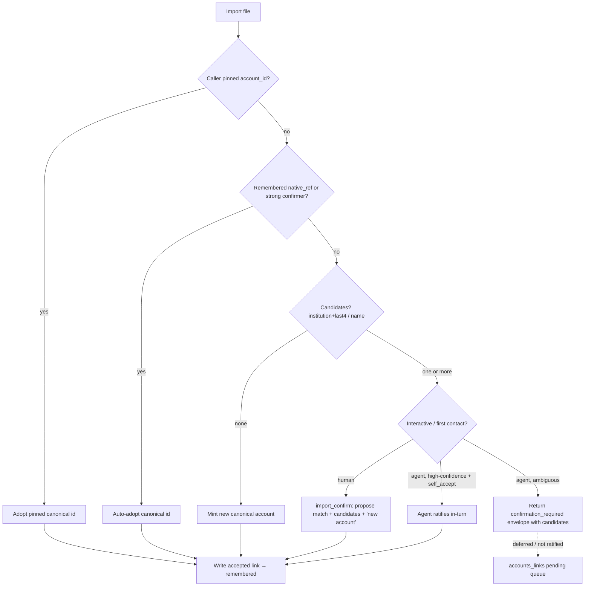

# Cross-Source Account Identity Resolution

> Last updated: 2026-06-13
> Status: draft
> Address: M1S (Ingestion Core)
> Type: Feature
> Owns: the canonical-account-identity contract (`core.dim_accounts.account_id`
> semantics + `app.account_links`)
> Bundles with: [`account-management.md`](account-management.md) (shares the
> `accounts` namespace + `app.account_settings`)
> Unblocks: cross-source transaction dedup
> ([`matching-exact-key-dedup.md`](matching-exact-key-dedup.md)); account
> merge (deferred in `account-management.md` §"Account merge")

## One-line goal

One real-world account = one canonical, opaque, non-PII `account_id`, regardless
of how many sources (OFX/QFX/QBO, CSV/tabular, PDF, Plaid sync) it arrives from —
via a resolution step every import/sync runs through, backed by a durable
`native_ref → canonical_id` link registry.

## Problem statement (verified live 2026-06-13)

Today each loader mints its **own** `account_id`, so one real account becomes one
`account_id` *per source*. There is **no reconciliation layer** (grep finds no
`account_link` / `canonical_account` / account-alias concept anywhere in `src/`,
`sqlmesh/`, or `docs/specs/`).

Live test on real Wells Fargo data: the same 5 WF accounts imported as **both**
`.qfx` (279 txns) and `.csv` (279 exact twins). Expected cross-source dedup to
collapse to 279; got **558**, every row `source_count = 1`. Verified root-cause
chain:

- `core.fct_transactions` carried **10 distinct `account_id`s for 5 real
  accounts** (5 ofx + 5 csv). The cross-source dedup blocking join requires
  `a.account_id = b.account_id` (`src/moneybin/matching/scoring.py`, the
  self-join `ON a.account_id = b.account_id`), so it produced **zero** candidate
  pairs. PR #250's exact-key auto-merge
  ([`matching-exact-key-dedup.md`](matching-exact-key-dedup.md)) is correct but
  **can never fire** on real cross-source data — the pairs never reach scoring.
- `core.dim_accounts` held only the **5 OFX** ids; the **CSV `account_id`s were
  0-of-5 present** in the dimension — the CSV transactions were *orphaned* from
  the account dimension (an independent integrity bug: net-worth / reports
  mis-state the CSV side).
- Account-number masking (`****4267`) collapsed the 10 ids to 5 *displays*, which
  is why this looked like "the same 5 accounts" on every read surface.

The **proximate bug** is `ImportService._resolve_account_via_matcher`
(`src/moneybin/services/import_service.py`): it queries **only
`raw.tabular_accounts`** (`GROUP BY account_id`), so a CSV for an OFX-only account
finds no match → falls back to `slugify(account_name)` → mints a new id. It must
resolve against a **cross-source** registry instead.

So cross-source transaction dedup — and the whole Ingestion-Complete validation
gate — is **blocked on account identity**, not on matching heuristics.

### How each source assigns account identity today (verified)

| Source | native account key | signals it carries | full number? | last4? | institution? |
|---|---|---|---|---|---|
| OFX/QFX/QBO | raw bank account number (`<ACCTID>`, PII) | number, routing (`<BANKID>`), FID | ✅ | `RIGHT(number,4)` | `institution_org` / `institution_fid` |
| Plaid sync | opaque Plaid token | token, `mask`, `official_name`, subtype; `persistent_account_id` at some institutions | ❌ never | `mask` | `institution_name` |
| CSV / tabular | `slugify(account_name)` or prior match | user-supplied name; `account_number`/`account_number_masked` when present | sometimes | `account_number_masked` | `institution_name` |
| PDF | tabular path → same as CSV | last4 if the statement exposes it | sometimes | sometimes | sometimes |

**What the signals can and can't do.** `institution + last4` is the only
identifier a bank file **and** Plaid both expose — but it is a *weak candidate*,
not a reliable key: a `mask` is not always the literal last4 (Plaid's own
warning), two accounts can share a last4, and for a **bare CSV the institution is
frequently unknowable** (only Tiller exports carry an `Institution` column; Mint,
YNAB, and Maybe carry an account *name* and nothing more). A full account number
is a strong *confirmer* when present (OFX↔CSV) but never reaches Plaid. A name is
a last-resort candidate that must require confirmation. **The reliable identity
signals, in order, are: (1) a remembered `native_ref` (idempotent re-import),
(2) a strong confirmer (full number / Plaid `persistent_account_id`), (3) an
explicit user/agent binding ("this file is account X"), (4) a format-carried
account name.** `institution + last4` only ever produces a *review candidate* —
never an auto-merge — and institution itself is treated as best-effort metadata,
not a required identity input (see [§Decision 3](#decision-3--resolution-ladder--confidence-tiers)
and [§Decision 7](#decision-7--import-time-ux--ax-detect--confirm--remember)).

## Prior art

Parallel research across seven well-documented players (GnuCash, Plaid,
SnapTrade, Firefly III, Actual Budget, Maybe, Beancount/hledger) converges hard:

**Every serious tool keeps a canonical account distinct from per-source ids.**
- **Actual Budget** — internal account UUID `id` + the provider's external
  `account_id` / `official_name` / `account_sync_source` stored on the same row;
  a one-time "Link Account" step, then remembered. Transaction dedup is a
  separate layer keyed on `imported_id` (OFX FITID), with a 5-day / exact-amount
  / fuzzy-payee fallback.
- **GnuCash** — canonical Chart-of-Accounts account + an attached **"Online ID"**
  (OFX `BANKID`+`ACCTID`); first import shows an account-selection dialog, then
  re-imports auto-route silently; mappings editable later in an "Import Map
  Editor."
- **Firefly III** — asset account matched by **IBAN / account number**
  auto-match ("if the IBAN matches you have no choice"); only genuinely ambiguous
  rows fall to the manual mapping dropdown; resolution persisted in a reusable
  config.
- **Plaid `persistent_account_id`** / **SnapTrade `institution_account_id`** —
  purpose-built *stable cross-link keys*, distinct from the ephemeral
  connection-scoped id, specifically to trace the same account across re-links.
- **Beancount / hledger** — the cautionary counter-examples: the account *name*
  **is** the identity, with no cross-source layer, so they structurally **cannot**
  auto-collapse the same account across sources.

A second round of research focused on the **import-time interaction** —
how each tool learns *which account/institution a file belongs to* — found an
even stronger convergence: **the account is a binding the user makes, not a fact
detected from the file.**

- **Actual Budget** — you open an account, then import *into* it; the file's own
  identity is irrelevant.
- **GnuCash** — the CSV assistant has a base **"Account" dropdown** (pick the
  target up front); OFX binds bank-id→account once, then remembers it.
- **Firefly III** — auto-matches on IBAN/number, and when the file lacks them
  falls back to a user-picked **"Default import account."**
- **hledger / beancount** — one rules-file / importer **bound to one account**
  (`account1`, `account()`), reused silently.
- **Maybe** — a per-distinct-value account-mapping review (match-by-name or
  **"create new account"**), remembered as a reusable template.

And **institution is not a concept at import time in any of them** — it folds
into "the account." Only Tiller's CSV carries an `Institution` column; only the
aggregator *connect* flows (Plaid Link's institution picker) select it
explicitly.

Lessons that drive this design:

1. **GnuCash's defining limitation is exactly our core requirement.** GnuCash
   stores only **one** Online ID per account, so it can't collapse the same
   account arriving under different source keys. We must support **many native
   refs → one canonical account (1:N)**. This is the single most transferable
   idea: a canonical account + a *set* of attached native identity keys.
2. **Plaid's dedup guidance demotes `institution + last4` to a candidate** — with
   a hard warning: *"Never detect duplicates by matching a mask with an account
   number"* (a `mask` is usually but not always the last 4); treat a
   composite-only match as a **candidate requiring confirmation, not an
   auto-merge**.
3. **The account is bound, not detected — so confirm at first contact, then
   remember.** The reliable path is: auto-resolve on a remembered ref or a strong
   confirmer; otherwise *ask once* (at import, with candidates and a "new account"
   escape) and remember the binding. This is the universal first-contact pattern,
   and it maps directly onto MoneyBin's existing `import_preview`→`import_confirm`
   seam — which today confirms *columns* and must be extended to confirm the
   *account* (see [§Decision 7](#decision-7--import-time-ux--ax-detect--confirm--remember)).

## Decision 1 — Canonical `account_id` is an opaque, minted, non-PII surrogate

`core.dim_accounts.account_id` becomes a **minted `uuid4[:12]`**
(`.claude/rules/identifiers.md` strategy 3). Every source attaches to it as a
**native ref**; no source id is ever the canonical id.

**Rationale.** A canonical account has *no single natural cross-source key* — a
full number reaches OFX/CSV but never Plaid; a token reaches only Plaid; a name
is collision-prone. Strategy 3 (UUID4 truncated) is the doctrinally-correct fit
for "a canonical entity with no natural key," and it is the same surrogate-id +
resolution-chain pattern `core.dim_securities` already uses
([`investments-data-model.md`](investments-data-model.md)). Benefits:

- **Sources can share one `dim_accounts` row** — Plaid and CSV join the same
  canonical account; the orphaning bug disappears.
- **We stop masking a primary key.** Today `account_id` *is* the PII account
  number, so it's masked on every read surface, which is why 10 ids looked like
  5. An opaque id is safe to expose.
- **A stable, non-PII agent handle** (see Decision 5 / AX).

**Cost (one-way door, accepted).** This changes `core.fct_transactions.account_id`
semantics and requires re-pointing `app.*` state keyed on the old source-ids
(migration below). Cheap pre-launch; see [§Migration](#migration). Rejected:
*keep the strongest source's id as canonical* — leaves the canonical id as PII
for OFX-first accounts, inconsistent across accounts (number vs token vs slug),
and still forces masking a PK; no prior-art tool does this.

**Recording the decision:** captured here, not in an ADR — it *applies* the
existing surrogate-id + resolution pattern (`identifiers.md` strategy 3;
`dim_securities` precedent), it does not establish a new one. Promote to an ADR
only if review disagrees (`design-principles.md` ADR bar).

## Decision 2 — `app.account_links`: the native-ref → canonical-id registry

A single new `app.*` table holds the 1:N attachment of native refs to canonical
accounts. It **mirrors the match-decisions pattern** (blocking → score →
accept/review/reject → audited repo → SQL fold) without overloading the
transaction-pair-shaped `app.match_decisions` (different grain). Writes go
through an `AccountLinksRepo` so each mutation emits a paired `app.audit_log` row
in the same transaction (Invariant 10,
[`app-integrity-invariant.md`](app-integrity-invariant.md)).

```sql
-- app.account_links  (one row per (canonical account, native ref))
link_id          TEXT     PRIMARY KEY,   -- uuid4[:12]
account_id       TEXT     NOT NULL,      -- canonical account this ref attaches to
ref_kind         TEXT     NOT NULL,      -- closed vocab (below)
ref_value        TEXT     NOT NULL,      -- the native identifier; CRITICAL tier
                                         --   when number-bearing (encrypted at rest,
                                         --   masked/omitted on read surfaces)
source_type      TEXT     NOT NULL,      -- provenance: ofx | csv | pdf | plaid | ...
                                         --   (routing tag, NOT part of identity)
confidence_score DOUBLE,                 -- resolution confidence [0,1]
match_signals    TEXT,                   -- JSON: signals used; for pending rows,
                                         --   the candidate list [{account_id, conf, signal}]
status           TEXT     NOT NULL,      -- accepted | pending | rejected | reversed
decided_by       TEXT     NOT NULL,      -- auto | user | system
match_reason     TEXT,
decided_at       TIMESTAMP NOT NULL,
reversed_at      TIMESTAMP,
reversed_by      TEXT
```

**`ref_kind` closed vocabulary** (strength-ordered; extensible per the
`source_type`/`match_type` closed-discriminator convention in `identifiers.md`
§"Out of scope"):

| `ref_kind` | strength | source | role |
|---|---|---|---|
| `source_native` | — | every source account | the source's own account key (OFX number, CSV slug, Plaid token); the **translation + idempotency** key staging joins on |
| `persistent_token` | strong | Plaid `persistent_account_id`; SnapTrade `institution_account_id` | cross-re-link / cross-connection auto-adopt |
| `full_number` | strong | OFX always; CSV/PDF when present | cross-source auto-adopt confirmer |
| `institution_last4` | weak | all (OFX `RIGHT(number,4)`, Plaid `mask`, tabular `account_number_masked`) | **candidate only** — never an accepted auto-link key |
| `account_name` | weakest | all | candidate only |

**Contracts:**
- **Strong-ref uniqueness** — `(ref_kind, ref_value)` is unique among
  `status='accepted'` rows where `ref_kind ∈ {full_number, persistent_token}`:
  one strong ref maps to exactly one canonical account.
- **Idempotency** — one accepted `source_native` row per `(source_type,
  ref_value)`: re-importing the same source account resolves to the same
  canonical id (the "remembered mapping" of GnuCash / Actual / Firefly).
- **Weak refs are never accepted auto-link keys.** `institution_last4` and
  `account_name` only ever produce **pending** proposals (Decision 3 / Plaid's
  guidance). They are computed live from source attributes and recorded in a
  pending row's `match_signals.candidates`.

**The links table is the substrate for account *merge* too** (the operation
`account-management.md` deferred precisely because "merge would require
recomputing every consumer's view of `account_id`"). Merging two existing
canonical accounts = re-pointing one's links to the other
(`UPDATE app.account_links SET account_id = <target> WHERE account_id =
<source>`) + transform recompute. This spec ships the substrate; the merge
surface is a later increment.

### Where canonical assignment is applied (raw stays pure)

Resolution is **decided in Python at import time** (it needs fuzzy matching,
minting, and pending-state writes that pure SQL can't express) and **applied in
the transform layer via a JOIN** — keeping `raw.*` "untouched data from loaders"
(AGENTS.md data-layer table):

1. **Loaders** write `raw.*_{accounts,transactions}` with the source's **native
   account key** (OFX number, CSV slug/assigned id, Plaid token) — *not* a
   resolved canonical id. (Today the slugified id is stamped at load; this moves
   the stamping out of raw.)
2. **`AccountResolver`** (Python, import time — replaces
   `_resolve_account_via_matcher`) consults/writes `app.account_links` and mints
   canonical ids.
3. **Staging** (`stg_{ofx,tabular,plaid}__{accounts,transactions}`) **LEFT JOINs
   `app.account_links`** on `(source_type, ref_kind='source_native', ref_value =
   native key)` and projects the canonical `account_id`.
4. **`core.dim_accounts`** is keyed on the canonical id (Decision 4);
   `core.fct_transactions.account_id` is canonical, so cross-source dedup's
   `a.account_id = b.account_id` join finally fires.

Re-pointing on merge/correction is then a pure **`app.*` update + transform
recompute** — no `raw` mutation.

> **Design note (resolve at draft→ready):** while a source account is awaiting
> review it still needs a valid `account_id` FK, so the resolver mints a
> **provisional** canonical account immediately and the review queue is the
> *"is this provisional a duplicate of an existing account?"* question (accept =
> re-point/merge; reject = confirm standalone). This keeps everything in one
> table and never blocks an import. The one modeling subtlety to confirm at the
> `ready` promotion: a `pending` `source_native` row carries a *provisional*
> `account_id` plus `match_signals.candidates`. The alternative — a second
> `app.account_link_decisions` table shaped exactly like `match_decisions` for
> the account↔account proposals — is cleaner-grained but a second table; the
> single-table model is recommended (honors the Decision-2 scope) unless review
> prefers the split.

## Decision 3 — Resolution ladder + confidence tiers

`AccountResolver.resolve(source_account)` runs on every import/sync, mirroring
the transaction matcher's blocking → score → accept/review/reject. The ladder is
ordered by signal reliability (see [§What the signals can and can't do](#problem-statement-verified-live-2026-06-13)):

0. **Explicit binding.** If the caller pinned identity (`--account-id` /
   `import_confirm(account_id=…)` / "import into account X") → **adopt** that
   canonical id directly and write/refresh the `source_native` link. The
   deterministic override above all detection (the agent's deterministic path —
   Decision 6/7).
1. **Strong-confirmer / idempotency pass.** Look up accepted links by
   `source_native` (same source re-import), then `persistent_token`, then
   `full_number`. A hit → **auto-adopt** that canonical `account_id`. Record any
   new strong ref of this source as an accepted link (so future imports
   short-circuit). → `decided_by='auto'`, `status='accepted'`.
2. **Candidate pass** (only if no strong hit). Find existing canonical accounts
   sharing `institution + last4` (when institution is known), then fuzzy
   `account_name`:
   - **0 candidates** → **mint** a new canonical account; write its
     `source_native` (+ any strong refs) as accepted links. Its own `last4` /
     name become future candidate signals.
   - **≥1 candidate** → **mint a provisional** canonical account (so its txns get
     an FK) and surface the candidates for confirmation: at first contact via the
     import-confirm seam (Decision 7) when interactive, else a **pending**
     `source_native` link carrying the candidate list → the `accounts_links`
     review queue. **Never auto-merge on `institution+last4` or name** (Plaid's
     mask≠number warning + last4-collision risk — two distinct WF accounts could
     share `4267`).

| Outcome | signal | action | `status` / `decided_by` |
|---|---|---|---|
| Adopt (pinned) | explicit `account_id` | bind to the named canonical | accepted / user (or agent) |
| Auto-adopt | remembered `source_native`, full number+routing, or persistent token | reuse existing canonical | accepted / auto |
| Mint new | no candidate at all | new canonical account | accepted / auto |
| Confirm / review | `institution+last4` or fuzzy name | candidates → confirm at import, else pending queue | pending / auto |

`institution` is **best-effort metadata**, never a required input: when it's
unknown (a bare CSV), the `institution+last4` candidate rung simply doesn't fire
and resolution falls through to name / mint-new / confirm. Thresholds reuse
`MatchingSettings` (`high_confidence_threshold`, `review_threshold`) rather than
introducing parallel knobs.

## Decision 4 — `core.dim_accounts` keyed on canonical id; COALESCE-across-group merge

`core.dim_accounts` grain stays `account_id`, but `account_id` is now canonical,
so multiple source rows (ofx + csv + plaid) collapse into one. The current
`ROW_NUMBER() OVER (PARTITION BY account_id ORDER BY extracted_at DESC)`
last-write-wins logic would let a later CSV row **null an OFX account's
`routing_number` / `institution_fid`**. Replace it with a **per-field
COALESCE-across-group** that preserves the best non-null value:

- Structured bank fields (`routing_number`, `institution_fid`) — first non-null
  by **source strength** (`ofx > plaid > tabular`) then recency.
- `institution_name`, `account_type` — first non-null by recency.
- `source_type` / `source_file` — record the contributing set (the winning row's
  for display; the union is recoverable from `app.account_links`).

This is the same "golden-record merge across sources" rule
[`matching-same-record-dedup.md`](matching-same-record-dedup.md) applies to
transactions, lifted to the account grain. `display_name`'s
`RIGHT(account_id, 4)` fallback is dropped (the id is now opaque); the default
becomes `institution_name || ' ' || account_type || ' …' || last_four` sourced
from `app.account_settings.last_four` / the `institution_last4` ref.

## Decision 5 — Surfaces: `accounts_links_*` + top-level `review`

The object reviewed is an **account link** (an accounts-domain entity), so it
lives under the `accounts` noun, **mirroring `transactions_matches_*`
one-for-one** so an agent/user transfers the match-review mental model wholesale
(`surface-design.md` coherence; `identifiers.md` Guard-2 free-text resolution on
filters):

| Operation | CLI | MCP |
|---|---|---|
| List pending links (grouped by candidate cluster) | `accounts links pending` | `accounts_links_pending` |
| Accept / reject one by id | `accounts links set <id> --status accepted\|rejected` | `accounts_links_set(link_id, status)` |
| Reverse a decision | `accounts links undo <id>` | (CLI-only, matching today's `matches undo`) |
| Decision history | `accounts links history` | `accounts_links_history` |
| Run resolution over unlinked accounts (backfill) | `accounts links run` | `accounts_links_run` |

- **Decision verb is `set --status`** + `undo`, identical to matches. The
  response envelope, sensitivity tier (low — no PII in the link envelope; the
  PII `ref_value` is masked/omitted), and `actions[]` hints follow `mcp.md`.
- **Inline discovery.** `import_confirm` / sync results report
  *"N account-link(s) need review"* and point at the queue — exactly how
  `matches run` ends with *"Run review when ready."* This is the primary,
  least-astonishing discovery path: you're told the moment links are created.
- **Orientation → promote to a top-level `review`.** Today
  `transactions_review` (MCP) / `transactions review` (CLI) aggregates the two
  *transaction* queues (matches + categorize) via `ReviewService`. Generalize it
  to a domain-neutral **`review`** (CLI `moneybin review`, MCP `review`)
  aggregating **all** queues — matches, categorize, **account-links**, and
  future ones — so a single "what needs my attention?" sweep can't silently miss
  the account-link backlog. Keep `transactions_review` / `transactions review` as
  a **deprecated alias for one minor release** (`design-principles.md` CLI/MCP
  evolution: add new → deprecate old → remove next minor). `ReviewService` gains
  `account_links_pending` in its count.

## Decision 6 — AX: a stable non-PII handle to pin account identity

The opaque canonical `account_id` **is** the agent-reachable, stable, non-PII
handle the masked `****4267` could never be (the session's top AX finding: today
there is no unmasked agent handle, and `****4267` is ambiguous across sources).

- `accounts_resolve` / `accounts_get` return the canonical id; agents pass it to
  filters, `import_confirm`, and sync to pin identity deterministically.
- **`import_confirm` gains an optional `account_id`** to bind an incoming source
  account to a known canonical account explicitly (the deterministic override
  above the resolution ladder — the `explicit_account_id` bypass generalized
  cross-source). Full flow in Decision 7.

## Decision 7 — Import-time UX & AX: detect → confirm → remember

This is the feature's primary surface. Prior art is unanimous: **the account is a
binding the user makes (or confirms) once, then remembered** — not a fact silently
detected. Today MoneyBin's import flow never asks which account a file is, and a
bare CSV that matches nothing silently mints a new id (the root of this whole
finding). The fix reuses the **existing `import_preview`→`import_confirm` seam**
(`resolve_or_confirm`, M1H [`smart-import-confirmation.md`](smart-import-confirmation.md))
— which today confirms **column mapping** — and extends its proposal/confirmation
to also cover **account identity**.



**UX (human, CLI/visual).** First contact with an unresolved account returns a
`confirmation_required` outcome that now includes the **proposed account binding**
— the matched canonical account (or "new account") plus ranked candidates — which
the user ratifies or overrides (`import_confirm`, or `--account-id` /
`--account-name` to pin up front). Auto-resolved accounts (remembered ref, strong
confirmer, exact format-carried name) are **not** surfaced — only genuine
ambiguity interrupts, exactly like Firefly's "blank-means-auto" and GnuCash's
suppressed-on-rematch dialog. After ratification the binding is remembered
(`source_native` link), so re-imports are silent.

**AX (agent).** The same envelope is the agent's structured contract: an
`account_proposal` block (`{proposed_account_id, is_new, candidates:[{account_id,
display_name, confidence, signal}]}`) plus `actions[]` hints. The agent either
(a) passes `account_id` to `import_confirm` to bind deterministically — the
preferred path, using the opaque non-PII handle from Decision 6; (b) self-accepts
a high-confidence proposal when `self_accept` is enabled for its `actor_kind`
(the existing tiered-autonomy mechanism); or (c) leaves it for the
`accounts_links` queue. The agent **never** has to disambiguate a masked
`****4267` — it gets stable ids and explicit candidates.

**Institution determination (best-effort).** Generalize the OFX-only
`institution_resolution` chain (`src/moneybin/extractors/institution_resolution.py`)
to tabular: **format metadata** (Tiller's `Institution` column; a registered
format's `institution_name`) → **filename heuristic** → **`--institution` flag** →
**the confirm-step prompt** → *unknown is allowed*. Institution feeds the
`institution+last4` candidate signal and the `display_name` default; it is never a
hard requirement (Decision 3). This removes the asymmetry where only OFX resolves
an institution.

**Catch-all.** The post-hoc `accounts_links` review queue (Decision 5) handles
everything that bypassed the confirm step — agent-deferred proposals,
non-interactive/inbox imports, and links later found wrong. Confirm-at-import is
the primary path; the queue is the safety net.

**Integration note (M1H).** Extending the `import_confirm` envelope with the
account facet is shared territory with
[`smart-import-confirmation.md`](smart-import-confirmation.md) (in-progress). The
account-binding facet is specified here (M1S); that spec carries a forward
pointer. Keep the confirmation envelope **one shape** — account binding is a new
facet of the existing `confirmation_required`/`import_confirm` contract, not a
second confirmation flow.

## Idempotency, reverse-order imports, correction

Worked through the WF case (`institution="WF"`, checking …4267/…1789/…9940,
savings …5585/…7070):

- **Re-import** the same `.qfx` → `source_native` link hit → same canonical id.
  No new account, no doubled txns.
- **Reverse order (CSV before OFX).** CSV imports first: no strong ref → mint
  `C1`, accepted `source_native`(csv slug)→C1 + `institution_last4`(WF,4267)
  recorded. OFX of the same account imports: its `full_number` has no accepted
  link yet, but OFX and CSV share only `institution+last4` → **candidate, not
  auto-merge** → confirmed either **at import** (the OFX `import_confirm` proposes
  "this looks like your existing WF checking …4267") or later in the
  `accounts_links` queue → on accept, OFX re-points/merges into `C1`; both sources
  now share `C1`; the 279 twins dedup. (If a real last4 collision, the user
  rejects → two distinct accounts, correctly.)
- **Correction** — a wrong link is `accounts links undo`'d (reversible, audited);
  re-resolution re-proposes.

## Migration (pre-launch clean re-mint)

Pre-launch, with only the maintainer's dogfooding data, the durable path is a
clean re-mint (no backward-compat shim — none requested, none built):

1. Create `app.account_links` + `AccountLinksRepo` (+ lint allowlist entry).
2. **Backfill:** for every existing source account in `raw.*_accounts`, mint a
   canonical id, write its `source_native` (+ strong) accepted links, then run
   `AccountResolver` over the set so cross-source twins collapse (5 ofx + 5 csv →
   5 canonical with pending/accepted links per Decision 3).
3. **Re-point `app.*` FKs** keyed on the old source `account_id`, in one
   transaction via the old→new mapping:
   `app.account_settings.account_id`, `app.balance_assertions.account_id`,
   `app.match_decisions.account_id` / `account_id_b`. (Transaction curation —
   notes/tags/splits — keys on `transaction_id`, not `account_id`; budgets key on
   category; both unaffected.)
4. Loaders stop stamping resolved ids on `raw`; staging adds the
   `account_links` translation JOIN; `dim_accounts` switches to the canonical
   grain + COALESCE merge.

Fallback if any FK rewrite is unsafe: re-import from source files (the
maintainer holds them) after the schema change — acceptable pre-launch.

## Observability

Per [`observability.md`](observability.md), mirror the `DEDUP_*` family
(`registry.py`) and supersede the existing `ACCOUNT_MATCH_OUTCOMES_TOTAL`:

- `ACCOUNT_LINK_OUTCOMES_TOTAL` — Counter, labels
  `result ∈ {adopted_strong, minted_new, pending_review, rejected}`.
- `ACCOUNT_LINK_REVIEW_PENDING` — Gauge, current pending-link count.
- `ACCOUNT_LINK_CONFIDENCE` — Histogram of resolution confidence.

## Testing

- **Unit** (`tests/moneybin/`): `AccountResolver` ladder — strong ref →
  auto-adopt; no candidate → mint; `institution+last4` → pending (never
  auto-merge); idempotent re-resolve; reverse-order CSV-before-OFX → pending →
  accept re-points; last4-collision reject keeps two accounts.
  `AccountLinksRepo` audit pairing (Invariant 10). Pyright covers new test files.
- **Import-time UX/AX** (Decision 7): a first-contact ambiguous account returns
  `confirmation_required` with an `account_proposal` (matched/new + candidates);
  `import_confirm(account_id=…)` pins deterministically; a remembered ref / strong
  confirmer imports silently (no prompt); institution-unknown bare CSV falls
  through to name/mint without error. CLI + MCP parity on the envelope.
- **Scenario** (`tests/scenarios/`, `make test-scenarios` — data-shape change):
  `account-identity-cross-source` — the 5-account WF case imported as 5 `.qfx` +
  5 `.csv` twins resolves to **5 canonical accounts** and **279
  `core.fct_transactions` rows at `source_count = 2`** (the import-validation
  live test, now reproducible). Reuse the deidentified WF fixture
  (names faithful; numbers real-but-public) below.

## Phased implementation outline (later increments)

- **M1S.1** — `app.account_links` + `AccountLinksRepo` + metrics + lint
  allowlist. Schema only.
- **M1S.2** — `AccountResolver` (ladder, mint, pending), replacing
  `_resolve_account_via_matcher`; widen `account_matching.match_account`'s
  candidate source from `raw.tabular_accounts` to the cross-source registry;
  generalize `institution_resolution` to tabular (Decision 7).
- **M1S.3** — loaders write native keys; staging translation JOIN;
  `dim_accounts` canonical grain + COALESCE merge; migration + backfill.
- **M1S.4** — **import-time UX/AX (Decision 7):** extend the
  `import_preview`→`import_confirm` envelope with the account-binding facet
  (proposal + candidates + `account_id` pin); human confirm + agent
  self-accept/envelope paths.
- **M1S.5** — surfaces: `accounts_links_*` (CLI + MCP), inline discovery on
  import/sync, `review` orientation promotion (+ `transactions_review`
  deprecation alias).
- **M1S.6** — scenario + the import-validation gate re-run.

(Account *merge* of two pre-existing canonicals — `account-management.md`'s
deferred operation — is a sibling increment built on this substrate, not in
M1S scope.)

## What this unblocks

- **Cross-source transaction dedup** — `scoring.py`'s
  `a.account_id = b.account_id` blocking and PR #250's exact-key auto-merge
  become live the moment identity unifies (noted in
  [`matching-exact-key-dedup.md`](matching-exact-key-dedup.md)).
- **Account merge** — the deferred `account-management.md` operation, now a
  link re-point.
- **The Ingestion-Complete validation gate** — the 5-WF re-import test (279 @
  `source_count = 2`) resumes once M1S lands.

## Out of scope

- Account merge **surface** (the user-facing merge/unmerge commands) — sibling
  increment; this spec ships only the link substrate.
- In-process LLM account matching — the ladder is deterministic; names are
  candidate-only.
- Transaction-level dedup mechanics — unchanged; this spec only makes
  `account_id` correct so they can run.

## Deidentified worked example (fixture seed)

Real WF case — names faithful, numbers real-but-public: 5 accounts — checking
…4267 (244 txns), …1789 (6), …9940 (16); savings …5585 (7), …7070 (6). Each
imported as `.qfx` and `.csv` produced two `account_id`s sharing the same masked
`****<last4>` display. The bridge that should link them: `institution="WF"` +
`last4` (OFX `RIGHT(number,4)` == Plaid `mask` == the `4267` in the CSV's
`"WF CHECKING 4267"` name). **Collision risk to design against:** two distinct WF
accounts could share a last4 → that pair must go to the review queue, never
auto-merge.
