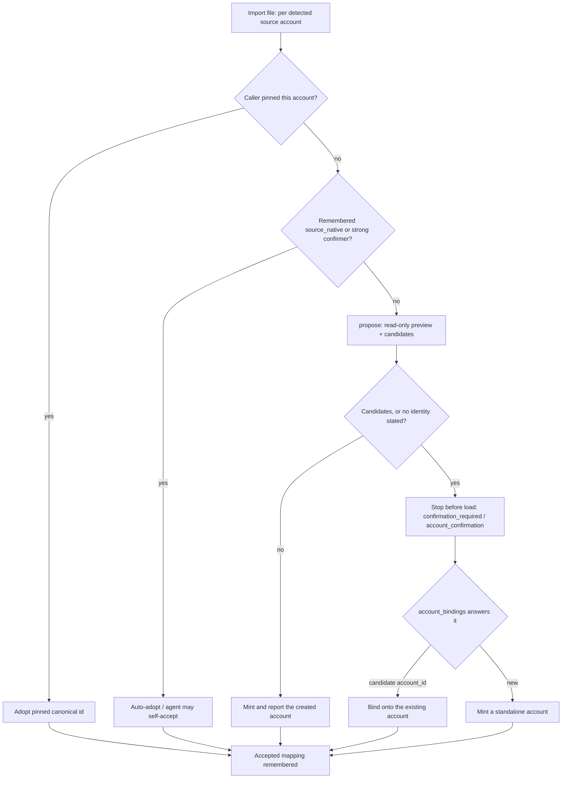

# Cross-Source Account Identity Resolution

> Last updated: 2026-08-29 — last-four rung no longer requires an
> institution; the reissue signal requires sequential ledgers (#450);
> accounts_created reports the stored display name (#446)
> Status: implemented (architecture M1S.1–.6 + the capture/bind-first
> corrections M1S.7–.9, all shipped — see [§Decision 8](#decision-8--capture-mutable-labels-and-the-exporter-axis-m1s7-live-test-reconciliation));
> the full-scale live re-validation this spec was written to unblock (5-account
> / 279-row one-bank persona, [§Testing](#testing)) has not yet been re-run — tracked
> as follow-up enrichment, not a capability gap
> Address: M1S (Ingestion Core)
> Type: Feature
> Owns: the canonical-account-identity contract (`core.dim_accounts.account_id`
> semantics + `app.account_links` + `app.account_link_decisions`)
> Decisions: [ADR-015](../decisions/015-transaction-identity-content-derived.md)
> (transaction-identity model + the account-surrogate asymmetry)
> Bundles with: [`account-management.md`](account-management.md) (shares the
> `accounts` namespace + `app.account_settings`)
> Unblocks: cross-source transaction dedup
> ([`matching-exact-key-dedup.md`](matching-exact-key-dedup.md)); account
> merge (deferred in `account-management.md` §"Account merge")

## One-line goal

One real-world account = one canonical, opaque, non-PII `account_id`, regardless
of how many sources (OFX/QFX/QBO, CSV/tabular, PDF, Plaid sync) it arrives from —
via a resolution step every import/sync runs through, backed by a durable
`native_ref → canonical_id` link registry.

## Problem statement (verified live 2026-06-13)

Today each loader mints its **own** `account_id`, so one real account becomes one
`account_id` *per source*. There is **no reconciliation layer** (grep finds no
`account_link` / `canonical_account` / account-alias concept anywhere in `src/`,
`src/moneybin/sqlmesh/`, or `docs/specs/`).

Live test: one bank's accounts imported as **both**
`.qfx` and `.csv` exact twins. Expected cross-source dedup to collapse to the
single-source count; got **double**, every row `source_count = 1`. Verified root-cause
chain:

- `core.fct_transactions` carried **two distinct `account_id`s per real
  account** (one ofx + one csv). The cross-source dedup blocking join requires
  `a.account_id = b.account_id` (`src/moneybin/matching/scoring.py`, the
  self-join `ON a.account_id = b.account_id`), so it produced **zero** candidate
  pairs. PR #250's exact-key auto-merge
  ([`matching-exact-key-dedup.md`](matching-exact-key-dedup.md)) is correct but
  **can never fire** on real cross-source data — the pairs never reach scoring.
- `core.dim_accounts` held only the **OFX** ids; the **CSV `account_id`s were
  wholly absent** in the dimension — the CSV transactions were *orphaned* from
  the account dimension (an independent integrity bug: net-worth / reports
  mis-state the CSV side).
- Account-number masking (`****1212`) collapsed the 10 ids to 5 *displays*, which
  is why this looked like "the same 5 accounts" on every read surface.

The **proximate bug** is `ImportService._resolve_account_via_matcher`
(`src/moneybin/services/import_service.py`): it queries **only
`raw.tabular_accounts`** (`GROUP BY account_id`), so a CSV for an OFX-only account
finds no match → falls back to `slugify(account_name)` → mints a new id. It must
resolve against a **cross-source** registry instead.

So cross-source transaction dedup — and the whole Ingestion-Complete validation
gate — is **blocked on account identity**, not on matching heuristics.

### How each source assigns account identity today (verified)

| Source | native account key | signals it carries | full number? | last4? | institution? |
|---|---|---|---|---|---|
| OFX/QFX/QBO | raw bank account number (`<ACCTID>`, PII) | number, routing (`<BANKID>`), FID | ✅ | `RIGHT(number,4)` | `institution_org` / `institution_fid` |
| Plaid sync | opaque Plaid token | token, `mask`, `official_name`, subtype; `persistent_account_id` at some institutions | ❌ never | `mask` | `institution_name` |
| CSV / tabular | `slugify(account_name)` or prior match | user-supplied name; `account_number`/`account_number_masked` when present | sometimes | `account_number_masked` | `institution_name` |
| PDF | opaque document-content key | proven-complete scoped identifier; last4 and label/product as candidate signals; currency-aware ledger overlap; balances for reconciliation | sometimes | sometimes | issuer fingerprint; validated routing fallback |

**What the signals can and can't do.** `institution + last4` is the only
identifier a bank file **and** Plaid both expose — but it is a *weak candidate*,
not a reliable key: a `mask` is not always the literal last4 (Plaid's own
warning), two accounts can share a last4, and for a **bare CSV the institution is
frequently unknowable** (only Tiller exports carry an `Institution` column; Mint,
YNAB, and Maybe carry an account *name* and nothing more). A full account number
is a strong *confirmer* when present (OFX↔CSV) but never reaches Plaid. A name is
a last-resort candidate that must require confirmation. **The reliable identity
signals, in order, are: (1) a remembered `native_ref` (idempotent re-import),
(2) a strong confirmer (full number / Plaid `persistent_account_id`), (3) an
explicit user/agent binding ("this file is account X"), (4) a format-carried
account name.** `institution + last4` only ever produces a *review candidate* —
never an auto-merge — and institution itself is treated as best-effort metadata,
not a required identity input (see [§Decision 3](#decision-3--resolution-ladder--confidence-tiers)
and [§Decision 7](#decision-7--import-time-ux--ax-detect--confirm--remember)).

**⚠ Reconciled (Decision 8):** signal #1 holds only for an upstream-*stable*
`native_ref` (OFX `ACCTID`, Plaid token); a *mutable* CSV/aggregator account
label is not a reliable remembered key — a rename mints a duplicate — so
Decision 8 demotes it to a Tier-B suggestion anchored on last4. The per-format
note above also understates aggregator exports: Monarch/Tiller account labels
often embed the last4 (`Everyday Spending (...7777)`). Decision 8's capture table is
authoritative.

## Identity evidence

The source data establishes the constraints directly:

1. **A canonical account has no universal natural key.** A full number reaches
   some file imports but not every provider; a provider token is source-specific;
   and a display name is mutable and collision-prone. One real account can arrive
   under many native references, so MoneyBin needs **many native refs → one
   canonical account (1:N)**.
2. **`institution + last4` is evidence, not identity.** A mask is often—but not
   always—the last four digits, and the same combination can describe more than
   one account. A composite-only match therefore creates a review candidate; it
   never auto-merges accounts.
3. **The account is bound, not detected.** Auto-resolve only on a remembered ref
   or a strong confirmer. Ask once — with candidates and a "new account" escape —
   whenever the import is about to *adopt* an account that already exists on a
   weak signal, or the source stated no identity at all; then remember the
   accepted binding. A source that states an identity nothing else matches has
   one legal answer, so it mints and the import reports what it created rather
   than asking. This extends the existing `import_preview`→`import_confirm` seam
   from column confirmation to account confirmation (see
   [§Decision 7](#decision-7--import-time-ux--ax-detect--confirm--remember)).

## Decision 1 — Canonical `account_id` is an opaque, minted, non-PII surrogate

`core.dim_accounts.account_id` becomes a **minted `uuid4[:12]`**
(`.claude/rules/identifiers.md` strategy 3). Every source attaches to it as a
**native ref**; no source id is ever the canonical id.

**Rationale.** A canonical account has *no single natural cross-source key* — a
full number reaches OFX/CSV but never Plaid; a token reaches only Plaid; a name
is collision-prone. Strategy 3 (UUID4 truncated) is the doctrinally-correct fit
for "a canonical entity with no natural key," and it is the same surrogate-id +
resolution-chain pattern `core.dim_securities` already uses
([`investments-data-model.md`](investments-data-model.md)). Benefits:

- **Sources can share one `dim_accounts` row** — Plaid and CSV join the same
  canonical account; the orphaning bug disappears.
- **We stop masking a primary key.** Today `account_id` *is* the PII account
  number, so it's masked on every read surface, which is why 10 ids looked like
  5. An opaque id is safe to expose.
- **A stable, non-PII agent handle** (see Decision 6 / AX).

**Cost (one-way door, accepted).** This changes `core.fct_transactions.account_id`
semantics. Pre-launch, existing dogfood data is re-imported into a clean database
rather than migrated in place (see [§Migration](#migration-re-import-to-adopt)).
Rejected: *keep the strongest source's id as canonical* — leaves the canonical id
as PII for OFX-first accounts, inconsistent across accounts (number vs token vs
slug), and still forces masking a PK; no prior-art tool does this.

The account *surrogate* and the transaction *content-derived* identity are
deliberately asymmetric; the rule and its rationale are recorded in
[ADR-015](../decisions/015-transaction-identity-content-derived.md).

## Decision 2 — Two tables: `account_links` (mapping) + `account_link_decisions` (proposals)

Account identity uses **two** new `app.*` tables, splitting the two genuinely
different grains rather than conflating them in one (resolved at `draft→ready`;
the single-table alternative carried provisional/pending state and candidates-in-
JSON on the mapping row, which forced an awkward active-predicate + status
machine — see the review history). The split **mirrors the transaction matcher
wholesale**: a durable mapping plus a `match_decisions`-shaped proposal queue.

Both tables are written through repos (`AccountLinksRepo`,
`AccountLinkDecisionsRepo`) so every mutation emits a paired `app.audit_log` row
in the same transaction (Invariant 10,
[`app-integrity-invariant.md`](app-integrity-invariant.md)).

### `app.account_links` — the native-ref → canonical mapping

The durable translation + idempotency substrate. One row per (canonical account,
native ref). Status is binary: a mapping is `accepted` (live) or `reversed`
(undone) — **no pending/provisional state lives here**; every source account
*always* has an accepted `source_native` mapping, so it is always present in
`dim_accounts`.

```sql
-- app.account_links
link_id          TEXT     PRIMARY KEY,   -- uuid4[:12]
account_id       TEXT     NOT NULL,      -- canonical account this ref maps to
ref_kind         TEXT     NOT NULL,      -- source_native | persistent_token | full_number
ref_value        TEXT     NOT NULL,      -- the native identifier; read-surface
                                         --   sensitivity is per-ref_kind (see note)
source_type      TEXT     NOT NULL,      -- provenance: ofx | csv | pdf | plaid | ...
source_origin    TEXT     NOT NULL,      -- institution/connection/format (scopes source_native)
status           TEXT     NOT NULL,      -- accepted | reversed
decided_by       TEXT     NOT NULL,      -- auto | user | system
                                         --   ('user' = human OR agent ratification;
                                         --    actor_kind is runtime-only, not a value)
decided_at       TIMESTAMP NOT NULL,
reversed_at      TIMESTAMP,
reversed_by      TEXT
```

**Stored `ref_kind` vocabulary** (closed; extensible per the `source_type` /
`match_type` closed-discriminator convention in `identifiers.md` §"Out of scope"):

| `ref_kind` | strength | source | role |
|---|---|---|---|
| `source_native` | — | every source account | the source's own account key (OFX number, CSV slug, Plaid token); the **translation + idempotency** key staging joins on |
| `persistent_token` | strong | Plaid `persistent_account_id`; SnapTrade `institution_account_id` | cross-re-link / cross-connection auto-adopt |
| `full_number` | strong **only when scoped** | OFX always (`BANKID`+`ACCTID`); CSV/PDF when present | cross-source auto-adopt confirmer — `ref_value` MUST be institution/routing-scoped (below) |

**Mapping contracts (enforced as `AccountLinksRepo` guards — DuckDB has no
partial/filtered unique indexes, so these are application-layer, consistent with
the existing repo-enforced-invariant pattern):**

- **One active `source_native` mapping per account** — `(source_type,
  source_origin, ref_value)` is unique among `accepted` rows where
  `ref_kind='source_native'`. Scoping by `source_origin` prevents cross-
  institution slug collisions (two banks each with a "checking" CSV → distinct
  `source_origin` → distinct keys). This is what makes re-import idempotent.
- **Strong-ref uniqueness** — `(ref_kind, ref_value)` is unique among `accepted`
  rows where `ref_kind ∈ {full_number, persistent_token}`: one strong ref → one
  canonical account.
- **`full_number` is institution/routing-scoped.** Bank account numbers are
  unique only *within* an institution, so a `full_number` `ref_value` MUST be the
  scoped composite (OFX `BANKID`+`ACCTID`; otherwise `institution_slug`+number) —
  never the bare number. A number arriving without a routing/institution scope
  (e.g. a CSV number column, unknown institution) is **demoted to a candidate**
  signal (below), never a global auto-adopt key. `persistent_token` is globally
  unique by construction.
- **PDF document identity is not account identity.** A PDF `source_native` value
  is `pdf_doc_<document digest>` under an issuer-independent origin, which makes
  exact-file re-import idempotent even if issuer detection changes.
  Cross-document adoption requires a proven-complete `full_number` scoped by a
  validated routing number, matching the scope emitted by OFX. Issuer-only,
  masked, suffix-only, bridge-authored, and otherwise unproven captures never
  produce that ref. A digit-free mask such as `XXXX`, `****`, or grouped
  equivalents is not account-identity evidence at all. The PDF identity
  derivation primitive owns that classification and returns no usable identity
  evidence; import orchestration consumes its verdict without re-parsing the
  captured token, then stops for explicit account binding before loading the
  statement. The former
  issuer-plus-last-four PDF derivation is consulted only as
  `legacy_pdf_identity` review evidence and does not suppress current candidates.

### `app.account_link_decisions` — the merge-proposal review queue

`match_decisions`-shaped. One row per (provisional account, candidate account)
proposal — so **candidates are relational rows, queryable, not JSON**. The
review queue reads `pending` rows. This is the *only* place pending/ambiguous
state lives.

```sql
-- app.account_link_decisions
decision_id            TEXT  PRIMARY KEY,  -- uuid4[:12]
provisional_account_id TEXT  NOT NULL,     -- the just-minted source account under review
candidate_account_id   TEXT  NOT NULL,     -- an existing canonical account proposed as the same
confidence_score       DECIMAL(5, 4),
match_signals          TEXT,               -- JSON-encoded (per match_decisions convention):
                                           --   which weak signal matched + its value
                                           --   (institution_last4 / last_four / name /
                                           --    institution_reissue / manual)
status                 TEXT  NOT NULL,     -- pending | accepted | rejected | reversed
decided_by             TEXT  NOT NULL,     -- auto | user
match_reason           TEXT,
provisional_display_name TEXT,             -- both names as they stood when the decision was made;
candidate_display_name   TEXT,             --   NULL while pending, when they resolve live
decided_at             TIMESTAMP NOT NULL,
reversed_at            TIMESTAMP,
reversed_by            TEXT
```

- **Both display names are frozen onto the row when the decision is made**
  (V051). Accepting re-points *every* accepted link off the provisional account
  onto the candidate, so the next transform drops the provisional from the
  `core.dim_accounts` grain — and the raw fallback joins through an accepted
  link too, so both live lookups go dark in the same stroke. Without the frozen
  pair, the record of a merge that *succeeded* was the one record that could not
  name its own accounts. A pending row stores NULL and resolves live; there is
  nothing to freeze until it is decided, and the live answer is the fresher one.

- **Candidate signals are not stored on `account_links`.** `institution_last4`
  (OFX `RIGHT(number,4)`, Plaid `mask`, tabular `account_number_masked`),
  `last_four` (the same match where either side names no institution),
  `account_name`, and `institution_reissue` (same institution, both sides carry
  a last-four and they differ) are *weak signals* the resolver computes live and matches
  against **existing accounts' `last_four` / `institution_slug` / `display_name`
  on `core.dim_accounts`** (durably present there — captured at mint, Decision 7).
  The institution comparison is slug-to-slug, never against `institution_name`:
  the display name doesn't slugify back to the registry value (`U.S. Bank` →
  `u-s-bank`, not `us_bank`), and an OFX `<ORG>` is a routing code at some
  issuers (Chase publishes `B1`), so a name-side comparison drops candidates
  on both ends. The `account_name` signal additionally requires
  `display_name_is_user_set` on both the candidate row and the account being
  resolved: `display_name` is a fallback ladder that can land on a *generated*
  descriptor (institution + subtype + last four, or subtype alone) when no
  person or source ever named the account, and two such descriptors coinciding
  is a coincidence of already-compared attributes, not name evidence.
  A match produces a `pending` decision row recording which signal fired. Weak
  signals are never an accepted `ref_kind` and never auto-merge. **⚠ Reconciled
  (Decision 8):** "durably present, captured at mint" was the gap — last4 was
  never *derived* into `dim_accounts` (only the user-set value landed), so this
  rung was dead in the wild. Decision 8 builds the capture layer.
- **Resolving a decision** (Decision 5): **accept(target=candidate)** re-points
  the provisional's `account_links` to the candidate (`UPDATE … SET account_id`)
  and marks the decision `accepted`; sibling decisions for the same provisional
  are auto-`rejected`. **reject** records the declined pairing (so the resolver
  won't re-propose it, cf. `get_rejected_pairs`) and leaves the provisional
  standalone. **undo** sets `reversed`.

**`ref_value` sensitivity is per-`ref_kind`, a read-surface concern, not a storage
one.** DB-level AES-256-GCM covers every column uniformly (not a per-field
decision — see [`privacy-data-protection.md`](privacy-data-protection.md)), so no
extra at-rest encryption. **Read-surface masking** (`mcp.md` tiers) is
per-`ref_kind`: a number-bearing `full_number` / `source_native` `ref_value` is
CRITICAL → masked; a Plaid `persistent_token` is an opaque non-PII token → low.
The middleware masks by `ref_kind`; do not mask already-safe values.

**The mapping table is the substrate for account *merge* too** (the operation
`account-management.md` deferred because "merge would require recomputing every
consumer's view of `account_id`"): merging two existing canonical accounts =
re-pointing one's `account_links` to the other + transform recompute. This spec
ships the substrate; the merge *surface* is a later increment.

### Where canonical assignment is applied (raw stays pure)

Resolution is **decided in Python at import time** (fuzzy matching, minting, and
proposal writes that pure SQL can't express) and **applied in the transform layer
via a JOIN** — keeping `raw.*` "untouched data from loaders":

1. **Loaders** write `raw.*_{accounts,transactions}` with the source's **native
   account key** (OFX number, CSV slug, Plaid token) — *not* a resolved canonical
   id. (Today the slug is stamped at load; this moves the stamping out of raw.)
2. **`AccountResolver`** (Python, import time — replaces
   `_resolve_account_via_matcher`) consults/writes `app.account_links`, mints
   canonical ids, and writes any `app.account_link_decisions` proposals.
3. **Staging** (`stg_{ofx,tabular,plaid}__{accounts,transactions}`) **LEFT JOINs
   the `accepted` `app.account_links`** on `(source_type, source_origin,
   ref_kind='source_native', ref_value = native key)` and projects the canonical
   `account_id`. Because every source account has exactly one *accepted*
   `source_native` mapping (guard above), this is an unambiguous 1:1 translation —
   no status/active predicate needed (the pending/provisional complexity lives in
   `account_link_decisions`, not here).
4. **`core.dim_accounts`** is keyed on the canonical id (Decision 4);
   `core.fct_transactions.account_id` is canonical, so cross-source dedup's
   `a.account_id = b.account_id` join finally fires.

Re-pointing on merge/correction is then a pure **`app.*` update + transform
recompute** — no `raw` mutation. A provisional account always has an accepted
`source_native` mapping, so its transactions are **never orphaned** while its
merge proposal is pending; on accept its mapping re-points and the provisional
drops from the dimension on the next recompute (no ghost row); history survives
in the two `app.*` tables + `app.audit_log`.

## Decision 3 — Resolution ladder + confidence tiers

`AccountResolver.resolve(source_account)` runs on every import/sync, mirroring
the transaction matcher's blocking → score → accept/review/reject. Ordered by
signal reliability:

0. **Explicit binding.** Caller pinned identity (`--account-id` /
   `import_confirm(preview_id=..., account_bindings=...)` / "import into account X") → **adopt** that
   canonical id, write/refresh the accepted `source_native` mapping. Deterministic
   override above all detection (Decision 6/7).
1. **Strong-confirmer / idempotency pass.** Look up `accepted` `account_links` by
   `source_native` (same-source re-import), then `persistent_token`, then scoped
   `full_number`. Hit → **auto-adopt** that canonical id; record any new strong
   ref of this source as an accepted mapping. `decided_by='auto'`.
2. **Candidate pass** (only if no strong hit). Mint a canonical account and write
   its accepted `source_native` mapping (so it is in the dimension immediately)
   **plus an accepted strong ref for every scoped confirmer this source carries
   (`persistent_token`, scoped `full_number`)** — safe because step 1 just proved
   no existing account holds them, and it lets a later source bearing the same
   token / scoped number auto-adopt via step 1 instead of minting a duplicate.
   Then look for existing accounts sharing a **last four** — under
   `institution_last4` (0.5) when both sides name the same institution, under
   `last_four` (0.45) when either names none — then fuzzy `account_name`, then
   the **reissue signal** — same
   institution where both sides carry a last-four and the two *differ*
   (`institution_reissue`, confidence 0.3) — querying `core.dim_accounts`. The
   reissue signal exists because a replacement card changes its last four by
   definition, so signal 1 cannot fire; and on the PDF path `account_name` is a
   per-file filename alias, so signal 2 misses too. Requiring a last-four on both
   sides, and requiring them to differ, keeps it the reissue shape rather than a
   general "any account at this institution" list. The same disagreement is a
   **veto** one rung up: the fuzzy-name pass skips any pair where both sides
   state a last four and the two differ, because a name match across a stated
   contradiction is evidence of two *different* accounts. Append any legacy
   PDF-link candidate after these current signals so it remains migration
   evidence without outranking them. Silence is not
   disagreement — an account with no known last four still reaches the name
   rung, since vetoing there would drop a proposal nothing else surfaces. Where
   the pair also shares an institution, the veto **retypes** rather than
   discards: that exact pair re-emerges under `institution_reissue`, the signal
   a replacement card actually carries. The retype runs on every path, because
   it is bounded by what the name matcher already matched — and it runs
   *unconditionally*, beside the name pass rather than only when that pass came
   up empty. The two read disjoint halves of the same rows: the veto keeps the
   pairs whose last fours agree or are silent, the retype keeps the ones that
   disagree. Gating the retype on an empty name pass therefore let an unrelated
   account that shared the name and stated no last four populate the list and
   hide the genuine reissue behind it — the coincidental-namesake case the
   retype exists for. Both are weak signals bound for the same review queue, so
   both surface and the human picks. That is distinct from
   the unconditional same-institution *sweep*, which surfaces every account whose
   last four differs whether or not any signal fired: the sweep is on for
   `resolve()` and its `propose()` preview, which must agree, and off for
   `propose_existing()` backfill, where it would propose every same-issuer card
   against every other. Keeping the two separate is what lets backfill see a
   vetoed duplicate without drowning in pairwise noise — conflating them made a
   duplicate the backfill queue used to surface silently invisible.
   Institution is **evidence on the last-four rung, never a precondition for
   it.** Two accounts that state different banks are still vetoed, but a pair
   where either side names none is proposed under `last_four` rather than
   dropped. Requiring a resolved institution silently excluded the tabular path,
   which names its account only inside a label (`Everyday Spending (...7777)`) and
   parses no institution from it: the twin it minted carried an exact last four,
   matched nothing, and both copies counted toward spending and net worth with
   no proposal to merge them. The two signals stay distinct so the queue can
   tell "both sides named this bank" from "one side named nothing".

   The reissue signal additionally requires the two ledgers to be
   **sequential**, which is what a reissue means. Shared institution plus a
   differing last four is, in an established book, every pair of cards at one
   bank; without a sequence check the signal proposed pairs that ran
   concurrently for months, each carrying its own refutation in zero matched
   transactions over a shared period. A proposal is dropped only when **both**
   halves of that refutation hold: the ledgers overlap by more than
   `_REISSUE_MAX_CONCURRENT_DAYS` (30, roughly one statement cycle), *and*
   `probe_ledger_overlap` finds zero matched transactions across a period both
   ledgers populated. Only *positive* concurrency drops it — an account with
   no published ledger keeps its proposal, which is the import-time state the
   signal was written for.

   The transaction half is not redundant with the date half, and dropping on
   the dates alone inverts the signal on the case that matters most. A true
   cross-source twin — one account arriving from two sources — overlaps by
   construction and holds the same rows, so a date-only drop would withhold
   exactly the duplicate this queue exists to surface and leave it
   double-counting. `LedgerOverlap.measurable` carries the other edge: a
   `comparable` count of zero means no shared period was available to compare,
   which is absence of evidence rather than evidence of absence, and keeps the
   proposal.

   The same reading governs an unstated **currency**, which is why this drop
   passes `unstated_currency_matches=True` to the probe. The probe's default is
   to treat a one-sided silence as a mismatch, and that default is priced for
   the caller that *shows* the count: an undercount there weakens the evidence
   printed beside a proposal that still appears. A caller that suppresses on
   zero matches inverts the price — the same undercount becomes proof of a
   disagreement that never happened. A tabular export leaving the column blank
   beside a feed that states `USD` is precisely the cross-source pair this
   queue exists to surface, so silence must not refute it. Two *stated* and
   differing currencies still do: a nominal amount is not a sum of money until
   a currency names it.

   The pass then branches on how many candidates survived:

   - **0 candidates** → done: a new standalone account. Its `last_four` /
     institution / name (captured per Decision 7) become candidate signals for
     *future* imports.
   - **≥1 candidate** → write one `pending` `account_link_decisions` row per
     candidate, surfaced for confirmation on the account-link review queue.
     Imports never reach this rung: the Decision 7 gate answers every candidate
     before `resolve()` runs, so the queue's producers are the backfill link
     service and sync. **Never auto-merge on `institution+last4` or name**
     (Plaid's mask≠number warning + last4-collision risk — two distinct
     accounts at one institution could share `1212`).

| Outcome | signal | action | resulting state |
|---|---|---|---|
| Adopt (pinned) | explicit `account_id` | bind to the named canonical | accepted mapping (`decided_by=user`¹) |
| Auto-adopt | remembered `source_native`, scoped full number, or persistent token | reuse existing canonical | accepted mapping (`auto`) |
| Mint new | no candidate at all | new standalone canonical account | accepted `source_native` + any scoped strong ref (`auto`) |
| Propose / review | legacy PDF link, `institution+last4`, fuzzy name, or reissue evidence | new account + `pending` decision(s) | accepted `source_native` + any scoped strong ref **plus** pending decision(s) |

¹ `decided_by` is `auto | user | system`; **agent ratification maps to `user`**
(consistent with `match_decisions_repo`) — `actor_kind` is a runtime distinction,
not a `decided_by` value.

**Known gap — the candidate universe is `core.dim_accounts`, so every weak
signal is blind to an account the refresh has not yet published.** An account
minted earlier in the same `import_files` batch (which refreshes once at the
end), or by any import run with `refresh=False`, is invisible to all four
passes: `institution_last4`, fuzzy `name`, `institution_reissue`, and the
gate's fallback pick-list alike. Importing an original and its replacement card
in one batch therefore mints two accounts and files no proposal — and the
`propose_existing()` backfill cannot recover it, because the reissue signal is
deliberately off there. Verified by probe, not by reading: with one fixture
pair, the `institution_last4` proposal appears when a transform runs between
the two imports and is empty when it does not. This is a property of where
candidates are read from, not of any one signal, so the fix belongs with the
propose-then-bind inversion — which has to settle the candidate universe anyway,
since it must compute candidates *before* an account exists to compare against.
Fixing it for the reissue pass alone would leave two candidate-source semantics
inside one function.

**Manual recovery, until then.** `AccountLinksService.propose_pair` — the
two-id form of `accounts links run` / `accounts_links_run` — queues the pair
under signal `manual`, and its existence check reads `app.account_links` as
well as `core.dim_accounts` (`AccountResolver.knows_account_id`), the same rule
the binding ladder applies for the same reason. So both halves of the
one-batch reissue above are nameable the moment the batch ends, without waiting
for a refresh. This does not close the gap: nothing *proposes* the pair, and a
duplicate nobody notices stays unnoticed. It only means the recovery exists
once someone does notice, which is why the surfaces that announce a created
account or flag a mirrored pair (the import hint, the
`duplicate_account_overlap` doctor finding) name this form rather than the
sweep alone.

`institution` is **best-effort metadata**, never a required input: when unknown
(a bare CSV), the last-four rung above still fires and the pair surfaces under
`last_four` rather than `institution_last4`. Silence is not contradiction —
only two *stated* and differing institutions drop a pair. Thresholds reuse
`MatchingSettings` (`high_confidence_threshold`, `review_threshold`) — no
parallel knobs.

**⚠ Reconciled (Decision 8): the strong-ref auto-adopt (step 1) is valid only
for an upstream-*stable* native key** (OFX `ACCTID`, Plaid token). A CSV/aggregator
`source_native` is `slugify(account_name)` — *mutable* upstream — so it must not
be a hard auto-adopt key; a rename otherwise mints a duplicate. Decision 8 demotes
the mutable CSV label to a Tier-B suggestion and anchors re-association on last4.

## Decision 4 — `core.dim_accounts` keyed on canonical id; COALESCE-across-group merge

`core.dim_accounts` grain stays `account_id`, but `account_id` is now canonical,
so multiple source rows (ofx + csv + plaid) collapse into one. The current
`ROW_NUMBER() OVER (PARTITION BY account_id ORDER BY extracted_at DESC)`
last-write-wins logic would let a later CSV row **null an OFX account's
`routing_number` / `institution_fid`**. Replace it with a **per-field
COALESCE-across-group** that preserves the best non-null value:

- Structured bank fields (`routing_number`, `institution_fid`) — first non-null
  by **source strength** (`ofx > plaid > tabular` — the `MatchingSettings.source_priority`
  ordering, which governs field merging only and is decoupled from transaction
  identity; see the `transaction_id` stability section above) then recency.
- `institution_name`, `account_type` — first non-null by recency. `account_type` is normalized to one canonical vocabulary by the staging views (`seeds.account_type_map`) before it reaches this merge, so the comparison is like-for-like; before that normalization a later `depository` could out-rank an earlier `CHECKING` for the same account and silently rename it.
- `source_type` / `source_file` — record the contributing set (the winning row's
  for display; the union is recoverable from `app.account_links`).

This is the same "golden-record merge across sources" rule
[`matching-same-record-dedup.md`](matching-same-record-dedup.md) applies to
transactions, lifted to the account grain. `display_name`'s
`RIGHT(account_id, 4)` fallback is dropped (the id is now opaque); the default
becomes `institution_name || ' ' || account_subtype || ' …' || last_four`, where
`last_four` is `COALESCE(`user-set `app.account_settings.last_four`, per-source
**derived** last4`)` — **not user-set only** (corrected in Decision 8; the
user-set-only reading is the live display + bridge bug).

## `transaction_id` stability under a mutable `account_id` (ADR-015)

Making `account_id` a *mutable* canonical surrogate collides with how
`transaction_id` is minted today: `prep.int_transactions__matched` hashes
`SHA256(source_type | source_transaction_id | account_id)` for both the matched
gold key and the unmatched fallback. If `transaction_id` keeps depending on
`account_id`, every account re-mint or merge re-hashes every affected
`transaction_id`, orphaning all `app.*` curation keyed on it.

A bare content hash cannot provide stable references when source identity is
enriched or observations merge. But MoneyBin *derives* `core`; a true stable
surrogate would need a per-transaction identity registry that survives every
rebuild—hot app-state at transaction volume, weakening derive-from-raw where it
matters most. The required contract is a **forwarding pointer** when an id
changes. Full analysis and the account-vs-transaction asymmetry are in
[ADR-015](../decisions/015-transaction-identity-content-derived.md).

**Decision: content-derived id + alias forwarding (not a surrogate).**

1. **Re-key the hash to the immutable source identity** — drop the mutable
   `account_id`; key on `source_type | source_origin | source_account_key |
   source_transaction_id`, and **exclude descriptive text** (`description` /
   `memo` — the brittle field belongs to the fuzzy matcher, never to identity).
   (`source_origin` is the existing `raw.*` column.)
2. **Stability-class anchor, not whole-set-hash.** A merged group's `transaction_id`
   derives from its **anchor member** — chosen by an intrinsic stability class, not
   the mutable `source_priority` list (which governs field merging only; see
   Decision 4). The anchor is `argmin` over group members of
   `(stability_class_rank, loaded_at, source_identity_tuple)`:

   | Class | Rank | Sources | Id basis | Drifts? |
   |---|---|---|---|---|
   | native | 0 | OFX (FITID), Plaid (txn id) | upstream-assigned | never |
   | minted | 1 | manual (`manual_` + uuid4, persisted PK) | minted once | never |
   | hash | 2 | CSV / tabular family; gsheet-live (future) | content hash | yes (re-export) |

   `account_id` is excluded from the hash — keyed on
   `source_type | source_origin | source_account_key | source_transaction_id`
   only. M1S makes `account_id` a mutable canonical surrogate; keeping it in the
   hash would re-key every affected transaction on every account re-mint or merge.

   **Why intrinsic class, not the list.** Reusing `source_priority` for identity
   is fragile: reordering it (a legitimate field-merge tuning operation) would
   re-key merged `transaction_id`s. And `gsheet` (field-authoritative in that list)
   is a future content-hash source — an unstable anchor — while `ofx` is a
   native-id source and the naturally stable choice regardless of field priority
   ordering. The intrinsic 3-class rank is a fact about how an id is derived; it
   does not drift as sources are added or priorities are retuned. Properties:
   a lower-stability twin joining leaves the id **unchanged**; a more-stable source
   backfilling history re-anchors the group **once** (alias-forwarded via
   `app.transaction_id_aliases`), then stays stable; single and unmatched
   transactions hash their own identity.
3. **Alias map for reference durability.** A new `app.transaction_id_aliases`
   (`old_id → new_id`, append-only, written only on id-changing merges) lets SQL,
   agent, external, and curation-FK references resolve old→new.
   `transaction_id` is exposed via `sql_query` / `moneybin://schema`, so this
   resolution contract is documented there: a held id stays *resolvable*, not
   necessarily byte-stable.

Brittleness in any one source key (a mutated FITID; CSV's description-bearing
per-source hash) thus degrades to a forwarding pointer, never an orphan. Two
follow-ups (not blocking): hardening the CSV per-source content hash (drop
`description`; `identifiers.md` territory) and the alias-chain-collapse rule
across successive merges.

## Decision 5 — Surfaces: account-link review + the standard review projection

The review queue reads `app.account_link_decisions` (the proposals); the object
the user reviews is "a proposed account link," so it lives under the `accounts`
noun. The standard review projection keeps that same match-review mental model
without adding a domain-specific MCP identity (`surface-design.md`; `identifiers.md`
Guard-2 free-text resolution):

| Operation | CLI | MCP |
|---|---|---|
| List pending link proposals (grouped by provisional account) | `accounts links pending` | `reviews(kind="account_links", status="pending")` |
| Resolve one — **merge** into a candidate, or keep **standalone** | `accounts links set <id> --into <account_id>` / `--standalone` | Accept with `identity_links_decide(decisions=[{"kind":"account_link","decision_id":"<id>","decision":"accept","target_id":"<account_id>"}])`; reject omits `target_id`. An accepted merge is gated on both surfaces — MCP elicits, the CLI prints what moves and asks (`--yes` answers in advance). Reject decisions do not prompt on either. |
| Reverse a prior decision | `accounts links undo <id>` | Find the operation with `system_audit(view="history", limit=50)`, optionally inspect it with `system_audit(view="detail", operation_id=...)`, then call `system_audit_undo(operation_id=...)`. |
| Decision history | `accounts links history` | `reviews(kind="account_links", status="history")` |
| Run resolution over unlinked accounts (backfill) | `accounts links run` | `refresh_run(steps=["identity"])` |

- **Decide step takes a merge target.** A provisional account has *N* candidate
  proposals, where a transaction match is pairwise. Each
  `identity_links_decide` item is
  `{kind: "account_link", decision_id, decision, target_id}`: `decision="accept"`
  requires `target_id` and re-points the provisional mapping onto that candidate,
  auto-rejecting siblings; `decision="reject"` forbids `target_id`. The envelope,
  sensitivity tier (low — `ref_value` masked/omitted), and `actions[]` follow
  `mcp.md`.
- **An accepted merge re-runs matching, and says what it found.** The merge is
  what makes the two sources' rows comparable at all: the transaction matcher
  blocks candidate pairs on `account_id` (`matching/scoring.py`), so while the
  provisional and the candidate are separate accounts it is structurally unable
  to pair their duplicates — it does not decline them, it never sees them. But
  `CANONICAL_STEPS` runs `match` three stages before `identity`, so no refresh
  ever observes its own accepts. Before this behavior shipped, an accept
  repointed the links and stopped; on 2026-08-08 that left 377 duplicated rows
  with zero proposals raised, and both `dedup_reconciliation` and
  `duplicate_account_overlap` green throughout (`moneybin-doctor.md`,
  `unproposed_cross_source_duplicates`, is the invariant that now catches it).

  **The merge carries existing match decisions with it.** A decision row stores
  the `account_id` it was made under, and both the rejected-pair key
  (`get_rejected_pairs`) and the active-edge `NodeKey`
  (`_fetch_active_dedup_decisions`) are built from that column — while
  `AccountLinksRepo.repoint()` moves only `app.account_links`. A decision left
  on the merged-away provisional therefore stops describing any live pair. The
  sharp end is a **rejection**: it stops matching itself, so the re-match below
  sees the pair as brand new and, above `high_confidence_threshold` with
  agreeing descriptions, auto-accepts the two rows the user explicitly said were
  not duplicates. `MatchDecisionsRepo.repoint_account()` re-keys both
  `account_id` and `account_id_b` onto the survivor inside the merge
  transaction, one audit per row so undo can replay them individually. The
  ordering is load-bearing: it precedes the commit the re-match reads.

  So `AccountLinksService.set()` calls `rematch_after_merge()` after its commit,
  running `refresh(steps=["match", "transform"])`. The batched review path has
  its own seam in `apply_identity()`: its inner `set()` calls run with
  `in_outer_txn=True` and return before their own post-commit tail, so the
  single-accept trigger does not cover it. `identity` is deliberately excluded —
  not for recursion, since `_run_identity_step` calls `run()` (propose) and
  never `set()`, but because proposing new links is not this trigger's job and
  would re-examine the accounts the merge just collapsed.

  **The pass carries the accepting surface's actor.** `refresh` takes an `actor`
  and hands it to `MatchingService.run()`; `rematch_after_merge()` passes
  `AccountLinksService`'s own, so decisions written because a user accepted a
  merge audit as `cli`/`mcp`. `app-integrity-invariant.md` binds matcher-created
  decisions to the surface that caused them and reserves `system` for the
  automated callers it names — `moneybin refresh`, `refresh_run`, the scenario
  runner — which keep `refresh`'s default. Without this the re-match is the one
  matcher path where a user's decision records as the pipeline's own.

  `transform` is included even though `prep.int_transactions__{unioned,matched,
  merged}` and `core.fct_transactions` are all `kind VIEW` and collapse on the
  next read. `core.dim_accounts` is `kind FULL`, and the staging models it is
  built from `LEFT JOIN app.account_links` — so without the transform the
  transactions merge while the accounts dimension still lists both accounts,
  which reads to the user as a merge that did not happen. The cost is a SQLMesh
  apply on the accept path.

  Because the pass can auto-accept without asking (`engine._classify_pair`
  returns `("accepted", "auto")` above `high_confidence_threshold` with agreeing
  descriptions), it reports what it did rather than merging rows silently —
  "magic stays visible" (`design-principles.md`). `RefreshResult` carries
  `matches_auto_merged` / `matches_pending_review` / `matches_pending_transfers`;
  the CLI prints them and MCP returns `rematch_auto_merged` /
  `rematch_pending_review` on the payload. Both are **null on a reject**, which
  runs no pass at all — distinct from a pass that ran and found nothing (`0`).
  On the CLI the report is outside the confirmation branch, so `--yes` waives
  the prompt but never the disclosure.

  **Both accept surfaces disclose, not only the direct one.** The batched path
  returns just its `IdentityDecisionPlan`, so that plan carries the
  `RefreshResult` out — `apply_identity` attaches it after its commit — and
  `IdentityLinksDecidePayload` exposes the same two fields as
  `AccountLinksSetPayload`. Without that, the identical merge driven through
  `identity_links_decide` returns an apparently clean result over a silent
  auto-merge: the same invisibility, on the other seam.

  **The pass retires transfers it invalidates.** Dedup blocking requires
  `a.account_id = b.account_id`, so two rows each already claimed as a transfer
  leg by a *different* account can never be dedup candidates of each other —
  until this merge makes those accounts one. Neither dedup tier declines a row
  because a transfer claims it (`engine.run` passes `excluded_ids=None` to
  both), and `core.bridge_transfers` resolves every leg through the dedup
  mapping (`MAX(transaction_id)` per group). Two decisions whose legs collapsed
  would therefore name the same physical transaction, double-counting it in
  anything joining `fct_transactions` to `bridge_transfers`. Tier 4 already
  refuses to *propose* that shape — it excludes rows in active transfers and
  every non-primary dedup member — but nothing revisited decisions made before
  the collapse, so the match pass itself enforces the same rule in the missing
  direction: **a dedup component is a leg of at most one accepted transfer**,
  walked earliest-decided first so the first claimant keeps it. A transfer whose
  own two legs share a component always goes; it is the transaction-level form
  of the collapse `repoint_account` already retires at account level.

  **The reconciliation belongs to no single trigger.** A merge is one way a
  component grows past a transfer's legs; accepting a queued duplicate one at a
  time is another, a batch of them through `reviews_decide` a third, and a bulk
  `--confirm-all` a fourth. They share no chokepoint, so the rule lives in
  `moneybin/matching/reconciliation.py::retire_transfers_invalidated_by_dedup`
  and each calls it:

  | Trigger | Caller | Where it runs |
  |---|---|---|
  | Matcher pass (auto-merge, post-merge re-match, any `refresh`) | `TransactionMatcher.run` | Between the dedup tiers and Tier 4 |
  | Single accept (`transactions_matches_set`, `review --confirm`) | `MatchingService.set_status` | Inside the accept's own transaction |
  | Batch review accept (`reviews_decide`) | `ReviewDecisionsService.apply_ordinary` | Once after the batch's writes, inside its transaction |
  | Bulk accept (`review --confirm-all`) | `MatchingService.accept_all_pending` | Inside the batch transaction |

  The batch row is the one that reads as a duplicate of the single accept and
  is not: `reviews_decide` never reaches `set_status`. It writes match rows
  through `MatchDecisionsRepo.update_status` directly, so for three rounds it
  was the one accept path that folded duplicates without reconciling. Once per
  batch rather than once per row — the pass walks every accepted transfer
  whatever triggered it, so a per-row call repeats one scan to the same
  fixpoint.

  The matcher's position is the load-bearing one: it is the only point where the
  components already include the edges that run just wrote *and* Tier 4 has not
  yet built its exclusion set, so a leg the reversal frees is a transfer
  candidate in that same run rather than the next one — and the reversal
  precedes `transform`, so a corrupt `bridge_transfers` is never built rather
  than rebuilt correctly one refresh later.

  The three accept paths need their own call because they re-derive nothing:
  each writes the decision and returns. **That is not a deferral.**
  `prep.int_transactions__matched`, `core.fct_transactions` and
  `core.bridge_transfers` are all `kind VIEW`, so a component that now holds two
  accepted transfers' legs double-counts on the next read whether or not a
  refresh ever follows. Each folds the reversals into the transaction that
  accepted the duplicate, so the accept and the retirements it forces commit
  together or not at all.

  `refresh` reports the count on `RefreshResult.transfers_retired`, which
  `refresh_run` and `moneybin refresh` both disclose alongside
  `matches_auto_merged`, `matches_pending_review`, `matches_pending_transfers`,
  and `matching_skipped` — an ordinary refresh reaches the match step, so it can
  auto-merge or reverse without a merge anywhere in sight.

  No accept path is scoped to `match_type = 'dedup'`. Accepting a duplicate
  is the usual way to collide two transfers' legs, but a *transfer* proposed
  before the edge that invalidated it survives in the queue — Tier 4 refuses to
  raise that shape and never revisits what it already raised — so accepting it
  claims a component another transfer holds. Earliest-decided-first means the
  standing decision wins and the stale accept is the one reversed.

  **So an accept can reverse itself, and the surfaces report the committed
  status rather than the requested one.** The reconciliation walks every
  accepted transfer including the row `set_status` just wrote, inside the same
  transaction; when that row loses the tiebreak it commits as `reversed`. The
  requested status is therefore the one value that cannot describe the outcome,
  so `set_status` re-reads the row and returns `MatchDecisionOutcome`
  (`match_status`, `transfers_retired`). `transactions_matches_set` puts that
  field in `data.match_status`; `transactions matches set` and
  `review --confirm` print a refusal instead of a success mark. A count-shaped
  warning alone does not correct a "✅ accepted" line printed above it.

  The bulk path owes the same correction and cannot get it from one row.
  `review --confirm-all` folds every queued edge at once, so a batch holding a
  dedup edge *and* a transfer that edge invalidates reverses one of its own rows
  inside its own transaction. `accept_all_pending` therefore returns
  `BulkAcceptOutcome` (`accepted`, `reversed_by_reconciliation`,
  `transfers_retired`): `accept_pending` hands back the ids it flipped, and the
  accepted count is re-read over exactly those after the reconciliation.
  `transfers_retired` cannot stand in for the subtraction — it also counts
  transfers accepted in earlier sessions, so netting it against the batch would
  under-report an ordinary bulk accept.

  `reviews_decide` owes the correction per decision, not in aggregate: it
  returns one outcome per row, so `apply_ordinary` re-reads the committed
  status of every match it accepted and reports that instead of the requested
  one. Its `transfers_retired` discounts the rows the batch itself flipped, for
  the reason the other two do, and is `null` rather than `0` when the batch
  accepted no match at all — no pass ran, which is not the same as a pass that
  reversed nothing.

  Components here are built from **accepted dedup edges only**, which is
  narrower than the accepted+pending graph the matcher seeds union-find with
  and the review queue clusters by. Those two want the *prospective* shape —
  what has been proposed. This one is the only caller acting on what actually
  collapsed: `prep.int_transactions__matched` folds accepted rows alone, so a
  pending edge leaves both source rows distinct in `core` and neither transfer
  invalid yet. Reading the wider graph here would reverse a decision the user
  made on the strength of a merge that has not happened, and may never — the
  same unreviewed action this trigger exists to prevent. `get_active_dedup_edges`
  therefore takes `statuses` with no default, so each caller states which graph
  it means.

  The retirement is a **reversal, not a delete**, so the audit row survives and
  `system audit undo` restores it — and it is reported as
  `rematch_transfers_retired` in `data` on both tools, plus a CLI warning
  naming the undo path. That disclosure is not optional: every other counter
  reports what the pass *found*, while this one reports a decision of the
  user's that it *undid*.

  **The disclosure is owed by every trigger, including the ones that report no
  matches.** The reconciliation runs inside `TransactionMatcher.run` between the
  dedup tiers and Tier 4, so it fires whatever the tiers return — a run that
  finds nothing can still reverse an accepted transfer. `matches run`,
  `matches backfill`, and `transactions_matches_run` therefore report
  `transfers_retired` beside the match counts rather than inside the
  has-matches branch, where "No new matches found" would otherwise be the whole
  output of a run that undid a decision.

  **A run that fails owes the same disclosure for whatever it already
  committed.** `TransactionMatcher.run` opens no transaction: each dedup tier
  persists one decision per pair, and the reconciliation commits each reversal as
  it goes, so everything written before the failing step is durable while the
  `MatchResult` dies with the exception. `MatchRunError` carries that partial
  result — all three match counts and `transfers_retired` — and `refresh`,
  `matches run`, `matches backfill`, and `transactions_matches_run` each report
  it before failing. The guard spans every step that writes, starting at the
  first dedup tier rather than at the reconciliation: a tier crash strands
  committed merges exactly the way a Tier 4 crash strands committed reversals.
  Two consequences fall out. A run that committed **nothing** raises its own
  exception unwrapped, because `refresh` reads a bare `CatalogException` from the
  tiers as the first-load "views not built yet" precondition and stays quiet —
  wrapping every failure would report that expected first run as an error, while
  wrapping a *late* one would claim nothing was examined after decisions were
  written. And the tier counters increment after each write rather than before,
  so a carried count names what committed rather than what the loop reached.

  **The notices say what was reversed, never what caused it.** The pass walks
  every accepted transfer, not only the ones this call invalidated, so a count
  can include a transfer that an unrelated earlier decision broke and this run
  merely reached first — most likely on the first pass over a ledger carrying
  historical corruption. Wording of the form "this decision invalidated"
  asserted a cause the counter does not carry. What the sentence may claim is
  that this call did the reversing, which is always true, and what collapsed:
  two sides into one transaction, or — only after a merge, the one trigger that
  can fold accounts — two accounts into one. That distinction is the reason two
  cause clauses survive where three trigger-named ones did not.

  **One counter covers both ways a merge invalidates an accepted transfer.**
  The transaction-level form above is the dedup pass's; the account-level form
  is `repoint_account`'s, which retires a transfer whose two endpoints just
  became one account and does so *inside* the accept transaction, before the
  disclosure is assembled. `MatchDecisionsRepo.repoint_account` therefore
  returns that count — accepted rows only, since a pending proposal was never
  the user's decision and a reversed rejection removes nothing — and
  `AccountLinksService` carries it to `rematch_after_merge()`, which sums the
  two. Splitting them into two counters would ask the user to learn a
  distinction that changes nothing they do: either way a transfer they
  accepted is gone, and either way `system audit undo` is the way back. The
  transaction-level form is deliberately global rather than scoped to the merged
  account, because the invariant is global, the batched path merges several
  accounts at once, and a pre-existing violation is corrupt whichever run
  exposed it. The account-level form is the one piece `rematch_after_merge()`
  still adds itself: it happens inside `set`'s transaction and reaches no
  matcher, so `refresh`'s count would omit it.

  **`moneybin_transfer_retirements_total` is emitted after the commit, by
  whoever owns it.** A reversal written inside a caller's transaction is not
  durable until that caller commits, and a counter cannot be rolled back — an
  increment taken as the row is written outlives the rollback that takes the
  reversal away, leaving a permanent claim that a transfer the user accepted is
  gone while the row still stands. So the reconciliation increments per reversal
  only when it owns the transaction itself (the matcher's run, where each
  reversal commits alone and the count must survive `ReconciliationError`);
  under `in_outer_txn` it stays silent and each accept path calls
  `record_dedup_retirements` once its own commit lands. `repoint_account`
  likewise returns its count rather than emitting, and `rematch_after_merge()`
  — the one seam both the direct and batched paths reach only after their
  commit — feeds the `account_merge` cause. What the metric receives is the
  **raw** reversal count, not the disclosed one: `transfers_retired` discounts a
  row the same call flipped moments earlier because that was never a *standing*
  decision to undo, while the metric measures reversals, and that one committed.

  A **partially failed pass reports as partial**, and the two halves fail
  independently. `RefreshResult.matching_error` means the proposals are
  incomplete — but not that nothing happened. The matcher wraps no transaction
  around the run and the reconciliation commits each reversal as it goes, so a
  failure anywhere after it — or *inside* it — leaves those reversals durable.
  The guard therefore starts at the reconciliation, not after it: a crash
  partway through its own loop leaves the same committed reversals behind, and
  its running total lives in a local the exception never lets it return. It
  raises `ReconciliationError` carrying that total, `TransactionMatcher` maps
  that to `MatchRunError`, and `refresh` takes the count off the exception: a
  dropped count would report a decision the user made as untouched when it has
  in fact been undone. The carrier is raised only when the caller holds no
  transaction — an accept path folds the reversals into its own, so its rollback
  restores every one of them and a count there would be the same over-report in
  the opposite direction. Catching it before the
  first-load `CatalogException` branch is part of the same rule — a *late*
  catalog failure is not a skipped match step, and calling it one claims nothing
  was examined after the tiers had already written decisions.
  `RefreshResult.error` means matching succeeded — the
  decisions are written and the counts are true — but the SQLMesh apply did
  not, so `core.dim_accounts` was never rebuilt and still lists both accounts.
  Reporting the counts alone there would describe a collapse the user cannot
  find anywhere in their ledger, which is the same invisibility this whole
  behavior exists to remove. The CLI warns and names `moneybin refresh`; MCP
  prepends an `actions[]` entry naming the narrower retry
  (`refresh_run(steps=['transform'])`).
- **What a queue row carries — measured overlap, not a stored score.** Each
  candidate reports the **ledger overlap**: how many of the provisional
  account's transactions already appear in the candidate's, matched on equal
  amount within a ±3-day posting-lag window (`services/ledger_overlap.py`).
  Exact date+amount alone is not the right predicate — a statement carries the
  transaction date and an OFX feed the posting date, which scores a true twin at
  roughly a quarter of its rows. That window is a calibration rather than a
  preference, so it is a module constant and not `matching.date_window_days`
  (which `system doctor`'s `duplicate_account_overlap` does reuse): the control
  result that makes the ratio discriminating was measured at this width, and a
  user who widened it would get a larger number that means less. Each group states how many transactions an
  accepted merge would move, so the magnitude and the evidence are both present
  at browse time rather than only inside the confirm.
  The PDF import gate uses the same probe before loading: normalized incoming
  statement rows are compared directly with each candidate account, and the
  confirmation carries matched/comparable counts and the comparable date window.
  This ranks human evidence; it never answers the gate or creates an auto-merge
  threshold.
  Three properties are load-bearing:
  - **Keyed on two account ids, not a decision id.** The matcher excludes
    same-`account_id` pairs, so the overlap cannot be computed *after* the merge
    it justifies; and the two-id shape leaves the probe reachable for
    `system doctor`'s `duplicate_account_overlap` pairs, which carry no proposal.
  - **Scoped to the comparable period.** The denominator counts only the
    provisional's transactions falling inside the candidate's own span, widened
    by the lag. Otherwise a statement archive predating a feed's download window
    renders as "0 of 400", which reads as evidence *against* a correct merge. A
    probe with no comparable period says so; it never renders as `0 of 0`.
  - **Amount-equal means same currency.** A nominal amount is not a sum of
    money until a currency names it, and `fct_transactions.currency_code`
    exists precisely because two accounts can differ on it. Without the
    predicate a multi-currency institution's USD checking and EUR savings —
    a pair the name rung will happily propose — measure as a perfect twin. The
    comparison is NULL-safe on purpose: only a *stated* disagreement vetoes a
    match, because a plain `=` would score every pair of unknown-currency
    ledgers at zero and switch the evidence off silently for exactly the
    accounts whose sources never reported one. The same asymmetry the name
    rung's last-four veto uses — silence is not disagreement. Both sides are
    folded to a bare upper-case code before comparing, so the veto fires on the
    currency rather than on its spelling: the tabular extractor copies
    `currency` out of the source cell verbatim while OFX and Plaid carry ISO
    codes, which puts `usd` opposite `USD` in precisely the cross-source pair
    this probe is asked to judge. A blank cell reads as unstated for the same
    reason silence does — a statement that fills its currency column only on
    foreign rows leaves the domestic ones empty, not NULL.
  - **`confidence_score` is not a review surface.** Its value is fixed per
    signal — 0.5 `institution_last4` and `legacy_pdf_identity`, 0.45
    `last_four`, 0.4 `name`, 0.3 `institution_reissue`, 0.2 `institution`, 0.1
    `fallback` — so it restates `signal` in a less legible form; no input moves
    it. The corroborated and bare last-four rungs are the pair that shows why
    the number adds nothing a reader wants: 0.5 against 0.45 is the whole
    difference between "both sides named this bank" and "one side named
    nothing", which `signal` says outright. A `manual` proposal carries no
    score at all — `propose_pair` writes NULL because nothing was measured, and
    any number there would read as a measurement that never happened. The
    column remains as the audit record of what was written when the proposal
    was created, and is no longer projected onto any surface — the review
    queue, the decision history, and the import gate's `account_proposals` all
    carry `signal` plus the measured overlap instead.
- **Status lifecycle.** `account_links`: `accepted` (live) / `reversed` (undone).
  `account_link_decisions`: `pending` (awaiting review) → `accepted` (merged onto
  the named candidate) / `rejected` (declined pairing — not re-proposed) /
  `reversed` (a prior decision undone; re-resolution re-proposes).

  "Not re-proposed" binds the *proposer*, not the user. A rejection is the
  answer to a signal the resolver raised, so the resolver must not raise it
  again — that is what stops a queue from re-asking a question already
  answered. `propose_pair` is the user asking, and it re-proposes a rejected
  pair deliberately: the named-pair form exists for the duplicate no signal
  reaches, and a past "no" to the resolver's guess is not a standing veto on
  the user's own knowledge. Treating it as one would leave a real duplicate
  with no recovery at all, since nothing else can name that pair. Only a
  `pending` or `accepted` decision blocks, because those are live rather than
  answered.
- **Inline discovery.** `import_confirm` / sync results report *"N account-link(s)
  need review"* and point at the queue — exactly how `matches run` ends with *"Run
  review when ready."* The primary, least-astonishing discovery path: you're told
  the moment proposals are created.
- **Orientation → promote to a top-level review surface.** The former
  transaction-only CLI command `moneybin transactions review` aggregates the two
  *transaction* queues (matches + categorize) via `ReviewService`. Generalize it
  to a domain-neutral CLI `moneybin review` plus MCP
  `reviews(kind="summary")`, aggregating **all**
  queues — matches, categorize, **account-links**, future — so a single "what needs my
  attention?" sweep can't silently miss the account-link backlog. Keep
  `moneybin transactions review` as a **deprecated CLI alias for one minor
  release** (`design-principles-depth.md` CLI/MCP evolution).
  `ReviewService`
  gains `account_links_pending` in its count.

## Decision 6 — AX: a stable non-PII handle to pin account identity

The opaque canonical `account_id` **is** the agent-reachable, stable, non-PII
handle the masked `****1212` could never be (the session's top AX finding: today
there is no unmasked agent handle, and `****1212` is ambiguous across sources).

- `accounts(view="resolve", query=...)` / `accounts(view="detail", reference=...)`
  return the canonical id; agents pass it to
  filters, `import_confirm`, and sync to pin identity deterministically.
- **Privacy-taxonomy reclassification (required).** The opaque `account_id` must
  move from the PII-masked `ACCOUNT_IDENTIFIER` class to a **record-id tier** in
  the privacy taxonomy (`src/moneybin/privacy/taxonomy.py`) — otherwise the
  redaction middleware would mask the very handle Decision 1 promises to expose.
  The PII now lives in `app.account_links.ref_value` (masked per-`ref_kind`,
  Decision 2), not in `account_id`.
- **`import_confirm` gains a per-account binding map** (not a single scalar):
  `account_bindings = {proposal_ref | source_account_key: canonical_account_id |
  "new"}`. Tiller/Mint-style files carry N accounts; the confirm envelope
  enumerates the detected source accounts each with a proposal, and the caller
  returns a map of resolutions (the single-account file is the 1-entry case).
  Key by `proposal_ref` — `source_account_key` masks on the MCP surface, so a
  key-only contract is unanswerable there. Full flow in Decision 7.

## Decision 7 — Import-time UX & AX: detect → confirm → remember

This is the feature's primary surface. Prior art is unanimous: **the account is a
binding the user makes (or confirms) once, then remembered** — not silently
detected. Today MoneyBin's import flow never asks which account a file is, and a
bare CSV that matches nothing silently mints a new id (the root of this finding).
The fix reuses the **existing `import_preview`→`import_confirm` seam**
(`resolve_or_confirm`, M1H [`smart-import-confirmation.md`](smart-import-confirmation.md))
— which today confirms **column mapping** — and extends its proposal/confirmation
to also cover **account identity** (per detected account, Decision 6).


```mermaid
flowchart TD
    A[Import file: per detected source account] --> B{Caller pinned this account?}
    B -->|yes| ADOPT[Adopt pinned canonical id]
    B -->|no| C{Remembered source_native or strong confirmer?}
    C -->|yes| AUTO[Auto-adopt / agent may self-accept]
    C -->|no| PROPOSE[propose: read-only preview + candidates]
    PROPOSE --> ASK{Candidates, or no identity stated?}
    ASK -->|no| MINT[Mint and report the created account]
    ASK -->|yes| GATE[Stop before load: confirmation_required / account_confirmation]
    GATE --> CONFIRM{account_bindings answers it}
    CONFIRM -->|candidate account_id| MERGE[Bind onto the existing account]
    CONFIRM -->|"new"| STANDALONE[Mint a standalone account]
    ADOPT --> REMEMBER[Accepted mapping remembered]
    AUTO --> REMEMBER
    MINT --> REMEMBER
    MERGE --> REMEMBER
    STANDALONE --> REMEMBER
```

**Propose, then bind — nothing is written before the answer.** The gate runs on
`AccountResolver.propose()`, which is read-only, and it fires whenever
`AccountProposal.requires_confirm` holds: a proposal carrying merge candidates,
**or** one whose source stated no account identity at all (`identity_unknown` —
a bare Date/Description/Amount CSV, which would mint under its own filename).
Resolution — the mint, the `source_native` link, any decision row — happens only
on the re-entry that carries the answer. An unanswered import therefore leaves no
provisional account and no pending row to reconcile, only an unanswered question.

**Gate the merge, not the mint.** A proposal that states an identity and matches
nothing is not a question: on a fresh book there is no second answer available,
and gating it made a first import of N files cost N confirms that each had one
legal answer — confirm volume scaling with items instead of with uncertainty.
Those imports proceed, and every surface names the accounts they created
(`accounts_created`: the opaque id plus the label `core.dim_accounts` stores for
that account, on the CLI, in the `import_files` per-file rows, and in the
`import_confirm` result). This is
what keeps "magic stays visible" true: the two recoveries — rename with
`accounts set`, merge with `accounts links run` — are named alongside it. Both
are reachable from either surface; the agent proposes a merge through
`refresh_run(steps=["identity"])`, which runs the same `AccountLinksService`
backfill, then decides it with `identity_links_decide`.
Calibration is by cost of a wrong silent action: a surprise account is visible
in the account list and cheap to correct, unlike the silent merge onto an
existing account that this gate exists to prevent.

Two consequences worth stating outright, because both contradict an earlier
design that shipped:

- **The gate is actor-independent.** An agent was previously allowed past it,
  minting a provisional and queueing a pending decision for later review. That
  put the resolver's weakest signal into effect unseen on the surface where
  nobody is watching, so it is gone. Agent self-accept survives only on the
  strong-confirmer `AUTO` branch.
- **Imports no longer write to the account-link pending queue.** `resolve()`'s
  candidate pass is unreachable from every import channel: the gate answers
  every weak proposal first, and an answered binding resolves above it. That
  queue is still fed by the backfill link service and by sync — it is not
  dead, it is simply no longer an import outcome.

**UX (human).** An account the import could plausibly merge onto, or a source
that named no account, returns a `confirmation_required` outcome including the
**proposed account binding** (matched candidate(s) or "new account") which the
user ratifies or overrides (`import_confirm`, or `--account-id`/`--account-name`
to pin up front). Two things pass without a confirm, and only two: **remembered
`source_native` mappings and strong scoped refs**, which are silent; and a
**stated identity with no candidates**, which loads and then names the account it
created. A **name match never auto-resolves** ("Checking"/"Savings" would bind
wrong); genuine ambiguity always interrupts. After ratification the binding is
remembered, so re-imports are silent.

**AX (agent).** The same envelope is the agent's structured contract: per detected
account an `account_proposal` (`{proposal_ref, proposed_account_id, is_new,
candidates:[{account_id, display_name, signal, overlap_matched?,
overlap_comparable?, overlap_window_start?, overlap_window_end?}]}`) plus
`actions[]`. `legacy_pdf_identity` is a review-only signal; overlap fields are
aggregate/date-window evidence and never change the confirmation requirement.
There is no `confidence` field: it was a per-signal constant, so ranking on it
tied a candidate sharing every transaction with one sharing none. Rank on
`overlap_matched` / `overlap_comparable`, and treat an absent pair as absence of
evidence rather than a zero.
The agent (a) returns an `account_bindings` map to `import_files` or
`import_confirm` to bind deterministically — preferred, keyed by `proposal_ref`;
or (b) self-accepts **only a strong-confirmer adoption** when `self_accept` is
enabled for its `actor_kind` (both defined in M1H,
[`smart-import-confirmation.md`](smart-import-confirmation.md) §"Agent autonomy &
recovery"). Leaving the proposal for the account-link queue is no longer an
option: the import stops until it is answered. The agent
never disambiguates a masked `****1212` — it names the account positionally instead.

An import that minted returns `accounts_created` on the result — per file in
`import_files`, top-level in `import_confirm` — plus one `actions[]` entry naming
the recoveries. The rows carry `{account_id, display_name}` and never the
`source_account_key`, so nothing there is masked; the action names no account,
because `actions[]` is prose the redaction pass does not classify. The agent's
obligation is to tell the user an account came into existence.

**`display_name` is the stored name, derived, not read back.** The label is the
one `core.dim_accounts.display_name` will carry — the source's own account
label, then institution, then subtype-or-type, then last four, in the model's
own COALESCE order — built at mint time by
`services/account_display_name.py` from the same `seeds.institutions` and
`seeds.account_type_map` CSVs the model joins. Derived rather than queried
because nothing has refreshed when the report is built, and `import_confirm`
never refreshes at all; agreement between the two derivations is pinned by an
integration test that imports on all three channels with a real refresh. Four
consequences follow, and each replaces an earlier design that shipped (#446):

- **Not the source's raw identity fields.** `<ORG>` is a routing code for
  issuers that publish one (`B1` = Chase), and the file's account-type spelling
  is the raw vocabulary the type map normalizes. A label built from those named
  an account the user could not then find, and — carrying no per-account
  discriminator — two distinct accounts returned one identical string.
- **The file's own account name is the top derived rung.** A sheet's Account
  column, `--account-name`, and Plaid's per-account `name` are the only names a
  person authored, and `moneybin accounts` already prints institution and type
  in their own columns beside the name — so they outrank the institution and
  type an assembled label would spend itself on. A label with no digits of its
  own still appends the last four, exactly as every arm below it does: a chosen
  name is not a unique one, Plaid sends the institution's own per-account name,
  and a household's two checking accounts routinely carry the same product name
  from their bank. Naming both of them that would reinstate the collision above,
  and `AccountService.resolve_strict` then raises `AmbiguousAccountError` for a
  name reference that resolved before. A label already holding a four-digit run
  takes nothing more: four digits is the last-four unit, so such a label either
  states the account's own or is what the masker left of a longer number, and
  `Checking ****5678` joined with `…9012` publishes eight digits of a
  twelve-digit one. A year inside a name cannot be told from a number's tail,
  so neither is joined.
  The importer writes the display-safe form to `raw.tabular_accounts.
  account_label` (trailing last-four token stripped, embedded account numbers
  masked) and the model reads that column; nothing masks in SQL. A label
  carrying no letter is the account number under the name column's heading, and
  the rung stands down for it.
- **A synthesized name never earns that rung.** An import with no authored name
  still needs a key and builds a placeholder from the filename. That names the
  upload, so `account_label` stays NULL and the account is named from its bank
  fields — otherwise renaming a file would rename the account.
- **A caller's `account_metadata` refines the rest.** `last_four` and
  `account_subtype` reach `app.account_settings`, which the model COALESCEs
  ahead of everything derived, so the report folds them in rather than
  announcing the pre-override label. `display_name` there is the explicit user
  override and outranks even the source's label.

**`proposal_ref` — the referent that survives the mask.** `source_account_key`
is an `ACCOUNT_IDENTIFIER` (CRITICAL), so the MCP envelope masks it: the caller
reads `****1234` where the binding once needed `chase_1234`. Every proposal
therefore carries `proposal_ref`, a positional referent for the file being
imported — `@0` is its first source account, `@1` the second — classified
`RECORD_ID` and left readable. `account_bindings` accepts either form; supplying
two different answers for one account is an error rather than a precedence rule,
and a ref past the end of the file is rejected by name.

Four properties are load-bearing:

- **A key that reads as both forms is refused, not resolved.** `<ACCTID>` is
  untrusted file content, so a source key can spell `@1` verbatim. Where the two
  readings name the *same* account there is nothing to decide and the binding
  applies. Where they name different accounts, neither reading is safe: letting
  the key bind both accounts is the silent merge the gate exists to prevent, and
  letting the source key win silently delivers the answer to the account the
  caller was not looking at while the intended one stays gated behind a ref that
  no longer reaches it. The ambiguity is raised by name instead.
- **Positions index the file's full account list, not the surfaced subset.**
  The answering call applies bindings *before* the gate re-runs, so it can only
  index the accounts the file itself declares. Numbering what got surfaced would
  shift every ref the moment one account resolved strongly — silently moving an
  answer onto a different account.
- **It is a referent for one exchange, not an identifier.** Nothing persists it;
  it means nothing on a later import, and it is not a handle to store.
  `proposed_account_id` cannot serve this role: on the mint path it is a preview
  id that `resolve()` discards.
- **`@`, not `#`.** A binding is typed at a shell prompt, where
  `--account-binding #0=new` opens a comment and drops the rest of the line.
- **The recovery command the gate prints answers in refs.** `actions[]` sits
  outside the envelope's redaction walk — `render_or_json` applies
  `redact_typed` to `data` alone — so a recovery keyed by `source_account_key`
  hands an OFX `<ACCTID>` to whatever reads the JSON, on the surface designed to
  be machine-read. Carried bindings are re-keyed alongside the generated ones:
  the replay exists for the two-account file answered one at a time, so leaving
  the caller's own key raw restores the disclosure through the other door, and a
  ref beside its own source key is refused as a double binding anyway. A key
  naming no proposal in the outcome is echoed as sent — it cannot be re-keyed,
  and the resolver refuses it upstream.

**The value side is closed, and checked before anything loads.** A binding
value is either the exact token `new` or an account id this database already
has. The ladder verifies neither — Step 0 adopts an `explicit_account_id`
verbatim and reports `is_new=false`, so an unrecognized id would become a
canonical account with no mint announced and no `accounts_created` row naming
it, and the statement would land under an account the caller created by typo.
Existence is read from `app.account_links` as well as `core.dim_accounts`: the
latter is SQLMesh-materialized, so an account minted by the previous import is
absent from it until a refresh runs, which is exactly the id a caller binds a
sibling file to. A near miss on the keyword (`New`, `new `) is named rather
than folded in — an account id is opaque, so case and whitespace cannot be
normalized away without guessing which of the two the caller meant.

The check is scoped to `account_bindings` and deliberately does not extend to
the `account_id` parameter, which is a different contract: a binding answers a
confirmation that just enumerated the ids worth naming, so one matching none of
them is a typo by construction, while `account_id` *names* the account the file
becomes and mints under that id when it is unknown.

**Fallback candidates at the gate (decision support, not auto-merge).** The
auto-resolve ladder above is unchanged: a bare single-account source with no
account number and no institution match still mints (or, when interactive,
*gates* for `account_confirmation`) — it never silently merges. But a gate whose
`candidates: []` is a dead end: the human/agent is told "confirm the account"
with nothing to pick. So `AccountResolver.propose()` (the **preview** that fills
the gate envelope, not `resolve()`) supplies a **fallback** candidate list when
the real matchers return nothing — the institution-scoped accounts if any match
the source's institution, else *all* accounts (capped at `_FALLBACK_CANDIDATE_CAP`),
tagged `signal="institution"` / `signal="fallback"` — the ladder's two weakest
rungs, and, like every candidate, surfaced with no confidence number.
These are gate-only decision support: they widen what the confirmer can pick, and
are **never eligible for silent auto-adopt** (only `explicit` / strong-ref signals
are). `resolve()` is untouched — confirming "new" still mints with zero candidates.

**Surfacing rule — magic stays visible.** A live-testing finding drove this: the
column-mapping confirm M1H built went *unseen* because the agent path self-accepted
high-confidence layouts silently. Account identity must not repeat that. **Silent
adoption (auto / agent self-accept) is allowed only on a strong confirmer**
(scoped full number, persistent token, remembered `source_native`). **A
weak-signal proposal (`institution+last4` or name) ALWAYS surfaces** and is
**never** eligible for agent self-accept, regardless of confidence tier — a silent
account *merge* is unrecoverable-by-surprise in a way a silent column guess is
not. This applies the project rule *match every increment of magic with a visible,
dismissible confirm* (`design-principles.md` → "Magic stays visible").

**Institution determination (best-effort).** Generalize the OFX-only
`institution_resolution` chain (`src/moneybin/extractors/institution_resolution.py`)
to tabular: **format metadata** (Tiller's `Institution`; a registered format's
`institution_name`) → **filename heuristic** → **`--institution` flag** → **the
confirm-step prompt** → *unknown is allowed*. Institution feeds the
`institution+last4` candidate signal and the `display_name` default; it is never a
hard requirement (Decision 3).

**New-account metadata capture.** Minting a new account is the one moment to
collect what a file-imported account otherwise never gets — today a minted account
is a bare slug. When the confirm outcome is **"new account,"** capture alongside
the binding: **display name**, **account subtype** (checking/savings/**credit** —
drives sign convention + net-worth inclusion), **last_four**, and **currency**.
All four are **existing `app.account_settings` fields** (`display_name`,
`account_subtype`, `last_four`, `currency_code`), so this needs no new schema
and isn't blocked on `account-subtype-detail.md` / `multi-currency.md` (those
refine validation/semantics later). Inferred defaults (subtype from the account
name, currency from a Tiller column / OFX `CURDEF`) pre-fill the confirm; the user
adjusts. Capturing `last_four` + institution here is also what makes the
candidate pass (Decision 3) able to find this account on a *later* import.

**Catch-all.** The post-hoc account-link review queue (Decision 5) handles
everything that bypassed the confirm — agent-deferred proposals, non-interactive/
inbox imports, links later found wrong. Confirm-at-import is primary; the queue is
the safety net.

**Integration note (M1H).** Extending the `import_confirm` envelope with the
per-account binding facet is shared territory with
[`smart-import-confirmation.md`](smart-import-confirmation.md) (in-progress): the
facet is **specified here (M1S), implemented in M1S.4** extending that envelope;
that spec carries a forward pointer. Keep the confirmation envelope **one shape**
— account binding is a new facet of the existing
`confirmation_required`/`import_confirm` contract, not a second flow.

## Decision 8 — Capture, mutable labels, and the exporter axis (M1S.7+ live-test reconciliation)

Live dogfooding (2026-06-17) of the shipped M1S work found cross-source linking
fails in the wild despite green scenario tests. Three failure modes share one
root cause — **assuming an identity signal is present, stable, or singular when
it isn't.** The corrections below refine Decisions 3, 4, and 7; they do not
change the architecture (canonical surrogate + two tables + ladder).

### The three failure modes (post-mortem — recorded so they aren't reintroduced)

1. **last4 never reaches `dim_accounts`.** Decisions 4 and 7 assert last4 is
   "captured at mint, durably present on `dim_accounts`." In fact
   `dim_accounts.last_four` is `s.last_four` only — the *user-set*
   `app.account_settings` value. No source's natively-carried last4 (OFX
   `RIGHT(<ACCTID>,4)`, Plaid `mask`, a CSV number column) is ever *derived*
   into the column the candidate pass reads, so the `institution+last4` rung is
   dead for 100% of file/sync-imported accounts and everything degrades to name.
   The scenario test passed only because it force-binds the twins via
   `account_bindings`, never exercising the bridge.
2. **A mutable CSV label is treated as a hard key.** The CSV `source_native` ref
   is `slugify(account_name)`. An aggregator account label is user-mutable
   upstream (renaming "Everyday Spending" → "Fun Money" in Monarch); the slug then
   misses and the resolver **mints a duplicate** instead of re-associating.
3. **The exporter name masquerades as the institution.** For a tabular import
   the per-account `institution` is resolved from `matched_format.
   institution_name`, which for an aggregator format *is the tool name*
   ("Monarch"/"Tiller"). Every account in a Monarch file gets
   `institution="monarch"`, so even with last4 present the bridge to a real
   Wells Fargo OFX/Plaid account never fires (`"monarch" ≠ "wells fargo"`).

The unifying fix is an **executable capture contract** (below): reconcile "what
each format carries" with "what the matcher requires" in CI, not in prose.

### Signal tiers (refines Decision 3's ladder + the reliable-signals list)

All identity signals collapse into three tiers by how much trust each earns:

- **Tier A — stable native key → silent auto-adopt.** OFX `BANKID+ACCTID`,
  Plaid `persistent_account_id`, or a *remembered* binding whose key is stable
  upstream. **Only an upstream-stable native key qualifies.** A mutable native
  key (a CSV/aggregator account label) is **explicitly excluded** — it never
  auto-adopts (failure mode 2).
- **Tier B — weak signals, one review bar.** Filename-parsed name/last4, the
  account-column value (`Everyday Spending (...7777)`), a user-typed `account_name`,
  a masked-number column. **All parsed uniformly, all feed candidates into one
  confirm/mapping step, none auto-binds.** last4 corroborates and makes a
  candidate recognizable; it is never a key (Plaid's mask≠number rule).
- **Tier C — nothing → explicit account required.** A bare bank CSV
  (`<date>.csv`, Date/Description/Amount only) carries no identity; the account
  is supplied per-import (`--account-id`, folder routing), never inferred from a
  non-distinguishing signal (filename/fingerprint).

**CSV account binding is therefore always explicit** — resolved from Tier-B
candidates (confirmed) or Tier-C input — and **remembered on a stable,
distinguishing, in-file signal** (the account-label value), never on the format
fingerprint or filename. N bare same-fingerprint files then have nothing to
collapse onto, by construction.

### Capture: derive last4 (+ institution) into `dim_accounts` (corrects Decisions 4 + 7)

`core.dim_accounts.last_four` becomes `COALESCE(s.last_four, <derived>)`, where
`<derived>` is the per-source identity merged across the canonical group:

| Source | derived last4 | derived institution |
|---|---|---|
| OFX/QFX/QBO | `RIGHT(<ACCTID>,4)` from the source key | registry slug for `<FID>`, else `<ORG>` — **not** `<ORG>` first, which is a routing code at some issuers |
| Plaid | `mask` | `institution_name` (already) |
| tabular — aggregator | last4 parsed from the account-label value / `Account #` column | per-row `Institution` column or parsed from the label — **never the exporter/tool name** |
| tabular — bare | none (Tier C) | filename heuristic / explicit / unknown |

The full number / `full_number` `ref_value` is CRITICAL/PII: derive `RIGHT(·,4)`
inside the model and expose only the last 4; never surface the full number in
`dim`. `display_name`'s last4 fragment reads the same derived value (fixes the
bare-"TESTBANK CHECKING" display regression).

### The account-label parser (Tier B)

One parser extracts `(name, last_four)` from every Tier-B string — the
account-column value, the filename, a typed name — tolerant of the common last4
forms (`(...7777)`, `····7777`, `x7777`, "ending 7777"). Its output feeds the
candidate pass (name + last4) and the new-account capture. Filename seeds a
*proposal* but is never a *remember* key (timestamped exports drift).

### Mutable-label re-association (the Tier-A exclusion, mechanics)

Because a CSV label is mutable, CSV remember-and-rematch keys on
`(exporter scope + last_four)` as the durable anchor, with the label as
suggestion + display:

- exact (label + last4) → idempotent silent re-adopt.
- last4 same, label changed → **re-association suggestion** (the rename case:
  "Fun Money (...7777)" ↔ "Everyday Spending (...7777)"); confirm updates the
  remembered label. Never a silent merge, never a new mint.
- label same, last4 changed → surface as suspicious (a reused name pointing at a
  different account).
- neither → new-account proposal.

### Exporter axis ≠ institution (corrects Decision 7's institution chain)

The **exporter** (Monarch / Tiller / a specific bank's web export) is a property
of the **format/fingerprint** (≈ today's `source_origin = matched_format.name`),
orthogonal to **institution** (a per-account property). The exporter selects the
label parser, is provenance, and scopes remembered bindings. The **per-account
institution must come from row data** (Tiller `Institution`, OFX `<ORG>`, Plaid
`institution_name`) or be unknown — **never the exporter/tool name.** For a
`multi_account` format a format-level `institution_name` must not leak onto
accounts; for a single-institution bank format the two legitimately coincide.

### Saved format = columns only (the format/account-binding decoupling)

`app.tabular_formats` remembers **column mapping** (shared by header
fingerprint) and may carry an institution *hint* for single-institution
formats. It **never carries an authoritative account binding** — an explicit
`account_name`/`account_id` always wins, and a saved format never silently
re-binds a structurally-identical file's account (the documented
wrong-account footgun: pre-selecting a last-used account across same-shape
files). Account resolution always runs.

### Capture contract (the anti-recurrence guarantee)

A per-source executable contract asserts, for each format/source, that an import
lands the matcher's required identity inputs (`dim_accounts.last_four` +
`institution_name` for detect-capable sources) **or** is explicitly declared
*binding-only* (name is the only signal). A source that silently lands nothing
fails CI. This is the durable reconciliation of "what we know per format" with
"what the matcher requires" — the gap all three failure modes fell through.

### Decision 8 corollary — bare-file identity is content-keyed

A single-account file with no caller-supplied identity (no `--account-name`/`--account-id`, no account-name column) has no real source identity. Its synthetic `source_account_key` is therefore `slugify(stem)-sha256(bytes)[:12]` — unique per file content, stable across the elicit→confirm round-trip, and idempotent on an exact re-import. A filename stem is never a strong same-source key (it is even more incidental than the mutable label of Decision 8); two different-account files that share a name resolve to distinct accounts, and an explicit `=new` is always honored. The bare path never auto-links on a filename — it elicits `account_confirmation` unless the exact content was already imported.

**Idempotency caveat — `source_origin` stability.** The exact-re-import short-circuit (the resolver's Step-1 `source_native` lookup) keys on `(source_type, source_origin, source_account_key)`. For a bare file `source_origin = matched_format.name if matched_format else slugify(account_name or "unknown")`, so it can shift from `"unknown"` to a saved format's name once `save_format` persists a format. When that happens between the first import and a later exact re-import, the lookup misses the link written under the old `source_origin` and the file **re-elicits `account_confirmation`** rather than adopting silently. This is intentional within the constraints: `source_origin` is the staging-JOIN key and must not be changed (it is computed identically for `raw.*` and `app.account_links`). The cost is a safe, visible extra confirmation — no data loss, and the primary guarantee (no *silent* cross-account merge) is unaffected. Silent idempotency holds whenever `source_origin` is stable across the re-import (the common case).

## Idempotency, reverse-order imports, correction

Worked through a one-bank case (`institution="TESTBANK"`, three checking
accounts and two savings):

- **Re-import** the same `.qfx` → `source_native` mapping hit → same canonical id.
  No new account, no doubled txns.
- **Reverse order (CSV before OFX).** CSV imports first: no strong ref → mint
  `C1` + accepted `source_native`(csv)→C1; `last_four`(1212)/institution captured
  on `C1`. OFX of the same account imports: its scoped `full_number` has no
  accepted mapping yet, but OFX's last4 matches `C1`'s captured `last_four` →
  **pending decision** (last4-only, never auto-merge) → confirmed **at import**
  (the OFX `import_confirm` proposes "this looks like your existing checking
  …1212") or later in the queue → on accept, OFX's mapping re-points to `C1`; both
  sources share `C1`; the 279 twins dedup. (Real last4 collision → user rejects →
  two distinct accounts.)
- **Correction** — `accounts links undo` reverses a decision (audited);
  re-resolution re-proposes.

## Migration (re-import to adopt)

Pre-launch, with only the maintainer's dogfooding data and no external users,
the durable path is **no data migration**: the feature is canonical from the
first import, and existing data is re-imported into a clean database. A re-mint
migration that walked legacy `raw.*` to canonical ids was prototyped and
deliberately removed — every failure mode it carried (NULL-`source_origin`
legacy rows the staging JOIN couldn't match, manual transactions it didn't
re-key, ambiguous source-native keys it had to skip, and the PII-bearing native
keys those skips left behind in the now-unmasked `account_id` columns) existed
*only* to preserve data nobody has. Re-import sidesteps all of it.

1. Create `app.account_links` + `app.account_link_decisions` + their repos +
   `app.transaction_id_aliases` (+ lint allowlist entries). `source_origin` is
   added to the OFX raw tables by additive migrations (V028/V029); fresh installs
   get it from the schema DDL.
2. **New imports are canonical from the first row.** Every import/sync runs
   through `AccountResolver`, which mints (or binds) an `app.account_links` row
   *before* staging runs, so `dim_accounts` / `fct_transactions` project the
   canonical id directly. There is no legacy walk and no `transaction_id` re-key:
   fresh transactions are hashed with the immutable source identity (ADR-015)
   from the start, and `app.transaction_id_aliases` carries only the incremental
   aliases a future cross-source merge produces.
3. **Adopting existing data = re-import into a clean database.** The maintainer
   holds the source files; re-importing routes them through the resolver and
   yields canonical ids with no archaeology. This keeps `account_id` opaque **by
   construction**, which is what makes the privacy reclassification
   (`ACCOUNT_IDENTIFIER` → `RECORD_ID`, unmasked) safe — a native source key can
   never reach an unmasked column.
4. Loaders stop stamping resolved ids on `raw`; staging adds the `account_links`
   translation JOIN; `dim_accounts` switches to the canonical grain + COALESCE
   merge.

## Observability

Per [`observability.md`](observability.md), mirror the `DEDUP_*` family
(`registry.py`) and supersede the existing `ACCOUNT_MATCH_OUTCOMES_TOTAL`:

- `ACCOUNT_LINK_OUTCOMES_TOTAL` — Counter, labels
  `result ∈ {adopted_strong, minted_new, pending_review, merged, rejected}`.
- `ACCOUNT_LINK_REVIEW_PENDING` — Gauge, current pending-decision count.
- `ACCOUNT_LINK_CONFIDENCE` — Histogram of resolution confidence. Records the
  score written with a proposal, which is where that number is still meaningful;
  it is deliberately not the review surfaces' evidence (Decision 5). Because the
  score is a per-signal constant, this describes which rungs fire rather than how
  strong any one proposal is.
- `ACCOUNT_LINK_OVERLAP_RATIO` — Histogram of `overlap_matched /
  overlap_comparable` for every candidate an import gate surfaces with a
  comparable period. The counterpart to the constant above: it varies with the
  two accounts in front of the reviewer, so it is the one that says whether the
  gate is asking real questions — mass near 1.0 is genuine twins found, mass near
  0.0 is a confirmation spent on pairs the evidence already separates. Candidates
  with no comparable period are absent rather than recorded as 0.0, since that is
  absence of evidence; `ACCOUNT_LINK_OVERLAP_PROBES_TOTAL` counts those.

- `ACCOUNT_LINK_OVERLAP_PROBES_TOTAL` — Counter,
  `result ∈ {measurable, unmeasurable}`, incremented inside
  `probe_ledger_overlap` so no call site can forget it. A deployment where
  schema or source drift makes every probe return "no comparable period" has an
  evidence surface that renders prose and no number, and nothing else on any
  surface changes when that happens. `unmeasurable` climbing while `measurable`
  stays flat is the alarm. Note the flush boundary: the probe runs on the
  read-only browse and confirm paths, and `flush_metrics()` skips a session that
  opened no write connection, so a browse-only session's counts are accumulated
  in-process and discarded at exit. The confirm path that precedes a merge does
  open a write connection, which is the path where the signal has to survive.

**Known gap — the displayed ledger evidence is not re-verified at commit.** The
merge sentence renders two facts that neither confirm path holds the commit to.
The CLI's `_drift_check` compares the blast radius and the link and decision row
identities; the MCP grant digests resolved ids and blast radius.

- **The empty-survivor warning.** "The surviving account has no transactions of
  its own — check the direction before accepting" appends when
  `facts.survivor.transactions == 0`, the cheap tell for a reversed proposal. A
  second accept landing while the prompt is open can absorb the survivor's own
  history elsewhere, so the warning that should have fired never does.
- **The overlap ratio.** The probe's comparison window is `MIN`/`MAX` over the
  *survivor's* dates, so one survivor-side row arriving outside it widens the
  window and admits absorbed rows that match nothing: `matched` holds while
  `comparable` grows. A ratified "40 of 40" can commit as "40 of 400" with the
  sentence unchanged. `test_a_wider_survivor_span_pulls_more_rows_into_comparable`
  pins the mechanism.

Both want the same missing check, and it is **asymmetric** rather than another
field in the digest: refuse when the evidence got worse, never when it got
better — a survivor that gained its first transactions, or an import that
strengthened the overlap, are both harmless and a digest would refuse them. Both
surfaces have to gain it together, and on MCP it must survive the opaque-token
round trip where the proposal is never reloaded — `ConfirmationBinding` is
frozen and hashed over every field, so carrying the approved baseline there
means a transported-but-undigested field on a primitive every destructive tool
shares. That blast radius is why this lands as its own change rather than
half-done on one surface.

An account merge no longer takes that round trip: it is confirmed only by a
prompt, and a client that cannot prompt is refused rather than issued a token
(#414). The baseline therefore stays in process for `account_link`, and the
transport problem above is now merchant- and security-link only. It is still
the reason the check lands as one change across both surfaces.

**The merge prompt is what makes `identity_links_decide` a medium-tier tool.**
Its response payload carries record ids, a status, and counts — all `low`. The
elicitation carries each ledger's first and last transaction dates and the
account labels the user wrote, which the tier table puts at `medium`. Static
classification walks only the payload, so the tool declares the difference with
`discloses=Tier.MEDIUM` and the decorator folds it in as a floor. Without it the
privacy audit event would record `low` for a call that showed the caller
medium-tier data, and a future consent gate would admit the call on the wrong
tier. `accounts_links_set` renders the same evidence and needs no declaration:
it is an unregistered internal callback with no caller, so its prompt reaches
nobody. Registering it means declaring the tier in the same change.

## Testing

- **Unit** (`tests/moneybin/`): `AccountResolver` ladder — strong/remembered ref
  → auto-adopt; no candidate → mint standalone; `institution+last4` → pending
  decision (never auto-merge); idempotent re-resolve; reverse-order CSV-before-OFX
  → pending → accept re-points to one canonical; last4-collision reject keeps two
  accounts; cross-institution slug collision stays distinct (source_origin scope).
  `AccountLinksRepo` / `AccountLinkDecisionsRepo` audit pairing + uniqueness
  guards (Invariant 10). Pyright covers new test files.
- **Import-time UX/AX** (Decision 7): a first-contact ambiguous account returns
  `confirmation_required` with per-account `account_proposal`s; `import_confirm`
  with an `account_bindings` map pins N accounts; a remembered/strong ref imports
  silently (no prompt); a weak-signal proposal never agent-self-accepts; a stated
  identity matching nothing loads and reports `accounts_created`; a bare CSV
  states no identity and still asks. CLI + MCP parity.
- **Scenario** (`tests/scenarios/test_account_identity_cross_source.py`,
  `make test-scenarios` — data-shape change): `account-identity-cross-source`
  proves the regression fix with a representative 2-account fixture — 2
  same-institution accounts imported as 2 `.qfx` + 2 `.csv` twins (12 raw rows
  across 4 source accounts), bound onto the qfx-minted canonical accounts,
  resolve to **2
  canonical accounts** and **6 `core.fct_transactions` rows at
  `source_count = 2`** (the import-validation live test, now reproducible). The
  hand-derived counts make over/under-merge detectable per the
  scenario-expectations rule. Scaling this to the full 5-account / 279-row
  one-bank persona (which needs a twin generator) is tracked as follow-up
  enrichment, not a capability gap — the collapse mechanism is identical at
  any N.
- **Scenario** (reissue + document identity): the same file proves a reissued
  card reaches the review queue through a real import — the fixture's last four
  differs from the original, so `institution_last4` is structurally unable to
  fire and the name is deliberately unlike, leaving the reissue signal as the
  only guard that can catch it. `test_ofx_reimport_identity.py` proves document
  identity follows content in **both** directions: identical bytes at a new path
  (`statement (1).qfx`) are refused as already-imported, and different bytes at a
  reused path import as new. Both were validated by restoring the defect —
  `reissue=False` empties the proposal list, and the unscoped path predicate
  refuses the third import — because a scenario that has never failed is an
  assertion about nothing.

## Phased implementation outline (later increments)

- **M1S.1** — `app.account_links` + `app.account_link_decisions` +
  `app.transaction_id_aliases` + repos + metrics + lint allowlist. Schema only.
- **M1S.2** — `AccountResolver` (ladder, mint, propose), replacing
  `_resolve_account_via_matcher`; widen `account_matching.match_account`'s
  candidate source to `core.dim_accounts`; generalize `institution_resolution` to
  tabular.
- **M1S.3** — loaders write native keys; staging translation JOIN; `dim_accounts`
  canonical grain + COALESCE merge; `transaction_id` re-key (ADR-015) + privacy-
  taxonomy reclassification; no migration (re-import to adopt).
- **M1S.4** — **import-time UX/AX (Decision 7):** extend `import_preview`→
  `import_confirm` with the per-account binding facet (proposals + candidates +
  `account_bindings`); human confirm + agent self-accept/envelope paths; new-
  account metadata capture.
- **M1S.5** — surfaces: account-link CLI commands plus `reviews`,
  `identity_links_decide`, and `refresh_run` for MCP; inline discovery on
  import/sync, `moneybin review` orientation promotion (+ the deprecated CLI
  `moneybin transactions review` alias).
- **M1S.6** — scenario + the import-validation gate re-run.
- **M1S.7** — **capture layer + capture contract (Decision 8):** derive
  `dim_accounts.last_four` (+ institution) per source (OFX `RIGHT(number,4)`,
  Plaid `mask`, tabular label/`Account #`); the Tier-B account-label parser;
  `display_name` fix; per-source capture-contract test. Unblocks OFX↔Plaid and
  aggregator-label detection. (The original M1S.7 last4-bridge fix, widened.)
- **M1S.8** — **CSV bind-first + format/account decoupling (Decision 8):**
  `app.tabular_formats` = columns only (explicit `account_name`/`account_id`
  always wins); CSV account binding always explicit; mutable-label
  re-association anchored on last4 (the Tier-A exclusion).
- **M1S.9** — **exporter/institution split (Decision 8):** per-account
  institution from row data, never the exporter/tool name; `multi_account`
  formats don't leak a format-level institution onto accounts; name the
  exporter axis distinctly from `source_origin`'s overloaded uses.

(Account *merge* of two pre-existing canonicals — `account-management.md`'s
deferred operation — is a sibling increment built on this substrate, not in M1S
scope.)

## What this unblocks

- **Cross-source transaction dedup** — `scoring.py`'s `a.account_id = b.account_id`
  blocking and PR #250's exact-key auto-merge become live the moment identity
  unifies (noted in [`matching-exact-key-dedup.md`](matching-exact-key-dedup.md)).
- **Account merge** — the deferred `account-management.md` operation, now a link
  re-point.
- **The Ingestion-Complete validation gate** — the 5-account re-import test
  (279 @ `source_count = 2`) resumes once M1S lands.

## Out of scope

- Account merge **surface** (user-facing merge/unmerge commands) — sibling
  increment; this spec ships only the link substrate.
- In-process LLM account matching — the ladder is deterministic; names are
  candidate-only.
- Transaction-level dedup mechanics — unchanged; this spec only makes `account_id`
  correct so they can run.
- Hardening the CSV per-source content hash (drop `description`) and the alias-
  chain-collapse rule — follow-ups noted in ADR-015, not blocking.

## Deidentified worked example (fixture seed)

Synthetic one-bank case — 5 accounts: checking …1212, …7777, …3030; savings
…4040, …5050. Each
imported as `.qfx` and `.csv` produced two `account_id`s sharing the same masked
`****<last4>` display. The bridge that should link them:
`institution="TESTBANK"` + `last4` (OFX `RIGHT(number,4)` == Plaid `mask` ==
the `1212` in the CSV's `"TESTBANK CHECKING 1212"` name). **Collision risk to
design against:** two distinct accounts at one institution could share a last4
→ that pair must go to the review queue, never auto-merge.
