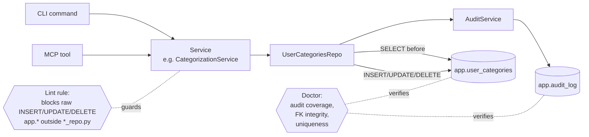

# Feature: `app.*` Integrity Invariant — Repository + Audit Routing

## Status

ready

> **Drift note (2026-05-17).** Bypass-map line numbers below reference the single-file `services/categorization_service.py` at HEAD `f13f3c7`. PR #155 (post-spec) split that module into a facade + collaborators under `src/moneybin/services/categorization/` (`__init__.py`, `_shared.py`, `applier.py`, `assist.py`, `matcher.py`, `orchestrator.py`, `queries.py`). The protected-tables list (Req 6), repository contract (Req 2–5), lint rule (Req 8), doctor invariants (Req 9), and PR ordering (Req 10) are unaffected — only the source file the implementation PRs will edit changes. Each PR-by-PR mutation-site call-out below should be re-located against the post-split files at implementation time; the mutations themselves (and their target tables) are unchanged. PR #166 (`categories_delete` cascade) and PR #174 (`category_id` FK migration) also landed post-spec; both touch the same `categorization_service` paths but do not change the bypass-map shape.

> **Batch B reconciliation (2026-05-22).** Implementing PRs 3–5 (`UserMerchantsRepo`, `CategorizationRulesRepo`, `ProposedRulesRepo`, `TransactionCategoriesRepo`) surfaced four spec↔code drifts, resolved as follows:
> - **`app.rule_deactivations` was dropped in migration V018** (post-spec). `RuleDeactivationsRepo` and its FK check are obsolete and removed from scope; the override-driven deactivation already emits an audit row via the `categorization_rules` repo (see below). Req 6's row and PR 4's bullet are struck through.
> - **The PR 4 FK doctor check direction was backwards.** `categorization_rules` has no `proposed_rule_id` column; the real link is `proposed_rules.rule_id → categorization_rules.rule_id` (added by V016). The shipped check (`app_proposed_rules_rule_fk`) follows the real direction.
> - **The "`categorization_rules.priority` uniqueness" check (Req 9 / PR 4) does not correspond to a real invariant.** Priority is intentionally non-unique — user rules default to 100, auto-rules to 200, with deterministic tie-breaking by `created_at` (`categorization-auto-rules.md` §16). A strict uniqueness check would fail on every real database, so it is not implemented.
> - **The doctor audit-coverage helper was generalized with an `updated_col` parameter.** Req 9 assumed every protected table carries `updated_at`; `proposed_rules` (keys on `proposed_at`) and `transaction_categories` (keys on `categorized_at`) do not. Bypass UPDATEs that don't advance the watermark remain the lint rule's job (the heuristic's documented limitation).
> - **Rule deactivation unified on the `categorization_rule.deactivate` audit action** (taxonomy-conformant `<entity>.<verb>`), replacing the legacy non-conformant `rule_deactivated`. Override forensics (`reason`, `override_count`, `sample_ids`) moved to the audit `context`. The set/clear categorization paths kept their established `category.set` / `category.clear` actions but now capture the **full** row (Req 4), superseding their prior column-subset payload.
> - **`delete_category`'s 6-table cascade stays raw** until `budgets` + `transaction_splits` get repos (AI-PR12), so it can thread `parent_audit_id` through all six in one coherent pass rather than a half-threaded mix. The lint rule (PR 13) lands after that.

> **Batch C reconciliation (2026-05-22).** Implementing PRs 6, 9, 10 (`AccountSettingsRepo`, `BalanceAssertionsRepo`, `BudgetsRepo`) surfaced five spec↔code drifts, resolved as follows:
> - **`account_service` already had a non-audited `AccountSettingsRepository` data-access class** (load/upsert/delete) — a near-namesake of the new `AccountSettingsRepo`. Two repository-shaped classes for one table is the coherence smell Invariant 10 exists to retire, so the old class was removed: its `load` (a read) folded into `AccountService` directly (matching how `list_accounts`/`get_account`/`summary` already read), and its `upsert`/`delete` migrated to the audited `AccountSettingsRepo`. Its `delete` had **zero production callers** (test-only) but is retained on the repo per Req 6's protected-mutation contract.
> - **`app.balance_assertions` has a composite primary key** `(account_id, assertion_date)`, but `audit_log.target_id` and the `_run_app_audit_coverage` helper assume a single key. The repo emits a composite `target_id` of `"{account_id}|{assertion_date ISO}"`; the coverage helper gained an optional `pk_expr` parameter (same generalize-the-helper precedent as Batch B's `updated_col`) so the doctor projects the matching composite key.
> - **`app.budgets.category_id` is nullable** (NULL for orphaned legacy rows from V014's dual-write backfill), so the FK doctor check skips NULLs (`IS NOT NULL` guard, mirroring `_run_proposed_rules_rule_fk`).
> - **The CLI `budget set` command is a stub** (`_not_implemented`); only the MCP `budget_set` tool calls `BudgetService.set_budget`, so `actor` is threaded from MCP only. The deprecated `AccountService` delegates (`rename`/`archive`/`unarchive`/`set_include_in_net_worth`) are test-only; they default `actor="system"` (the `MatchApplier.add_merchant` precedent for programmatic callers) while the canonical `settings_update` requires an explicit `actor`.
> - **Audit actions follow the upsert `.set` verb, not `.insert`.** `account_settings.set`, `balance_assertion.set`, and `budget.set` (insert + update branches) all use `.set` — matching the existing `category.set` upsert taxonomy — with `.delete` for removals. (The earlier `balance_assertion.insert` working-name was dropped: the write is an `ON CONFLICT DO UPDATE` upsert, so `.set` is the accurate, coherent verb.)

## Goal

`app.*` holds the only non-reconstructible state in MoneyBin — user categories, merchant patterns, categorization rules, account settings, balance assertions, budgets, curation notes/tags/splits, match decisions, tabular-format profiles. A bad service mutation today can silently corrupt any of those tables: audit routing is enforced by convention, not structure, and `audit_service.record_audit_event()` is called at only a fraction of the mutation sites. The doctor has no `app.*` invariants — only pipeline ones. The hosted tier (M3D/M3E) cannot ship without per-user `app.*` integrity, and the agent-first thesis means bulk LLM-driven mutations need recoverability to be trustworthy. This spec adds **Invariant 10** to the architecture, introduces a `*Repo` layer that owns every protected `app.*` write, bakes in the data captured for a future undo surface, and enforces the contract via a lint rule and doctor checks. The undo *consumer* (CLI/MCP/UndoService) is deliberately deferred to Phase 2.

## Background

### Verified bypass map

Source: 2026-05-16 CTO architecture review §2.2 + §3 leverage point #3, re-verified against the tree at HEAD (`f13f3c7`).

| Module | Status | Notes |
|---|---|---|
| `services/transaction_service.py` | ✅ routed (subset shape) | ~18 mutations, all audited via `AuditService`. Reference implementation for *routing* and *cascade threading* (parent event at L977, per-row child emissions at L994 — the `tag.rename` / `tag.rename_row` chain). Today's writes capture **column subsets** in `before`/`after` per `transaction-curation.md` Req 29 — this is the shape Req 4 supersedes; see Req 4 notes and PR 1 / PR 12 in the Implementation Plan. |
| `services/import_service.py` | ✅ routed (lifecycle) | Audit emitted at import lifecycle boundaries; `app.imports` *labels* row written directly at L1484 (see [Resolved Design Decisions](#resolved-design-decisions) §2). |
| `services/categorization_service.py` (post-PR #155: `services/categorization/` package) | ⚠️ partial | ~12 mutation sites against `app.transaction_categories`, `app.user_merchants`, `app.categorization_rules`, `app.user_categories`, `app.category_overrides`. Only the two `set_category` / `clear_category` paths (L758/795 in the pre-split file) emit audit. Imports `AuditService` but ignores it elsewhere. Mutations now live across `applier.py` (write_categorization), `matcher.py` (rule + merchant CRUD), and `__init__.py` (category CRUD); see drift note above. |
| `services/auto_rule_service.py` | ❌ bypassed | 10 mutations on `app.proposed_rules` (L278, 287, 295, 408, 445, 575, 583), `app.categorization_rules` (L391 promotion INSERT, L570 deactivation UPDATE), `app.rule_deactivations` (L601) across rule proposal / promotion / deactivation. Highest-value forensics gap. |
| `services/account_service.py` | ❌ bypassed | `app.account_settings` INSERT + DELETE (L259, L294), no audit. |
| `services/balance_service.py` | ❌ bypassed | `app.balance_assertions` INSERT + DELETE (L151, L170). Not in the plan; identified during spec drafting. |
| `services/budget_service.py` | ❌ bypassed | `app.budgets` UPDATE + INSERT (L142, L153). Not in the plan; identified during spec drafting. |
| `matching/persistence.py` | ❌ bypassed | `app.match_decisions` INSERT + UPDATE (L70, L154, L172). |
| `extractors/tabular/formats.py` | ❌ bypassed | `app.tabular_formats` DELETE (L312). |
| `metrics/persistence.py` | ✅ correctly skipped | `app.metrics` is observability data, not user state. Exempt. |
| `matching/priority.py` | ✅ correctly skipped | `app.seed_source_priority` is seed-loaded config, written only at install/migration time. Exempt. |
| `migrations.py` | ✅ correctly skipped | `app.schema_migrations`, `app.versions` are migration system state, not user state. Exempt. |

### Why this design

**Repository over decorator.** DuckDB has no triggers; MoneyBin has no ORM, so audit must live in the application layer. A `@audited` decorator on service methods still requires per-method discipline, breaks on multi-row or multi-table mutations, and is invisible at SQL-grep time. The repository pattern makes audit **structural, not disciplinary**: each protected `app.*` table has a tiny `*Repo` class whose mutation methods (`upsert`, `delete`, …) emit audit unconditionally in the same DuckDB transaction. Services compose repositories instead of executing raw SQL. A lint rule rejects `INSERT/UPDATE/DELETE app.<protected>` outside `*_repo.py` and `audit_service.py`.

**Repository over event sourcing.** Event sourcing has the right pattern but the wrong cost profile for a single-user local app — write amplification, projection maintenance, operational complexity. The repository pattern preserves today's read performance (only +1 INSERT per mutation) while achieving the same forensic property: every state change is recorded with full pre-image.

**Reversibility contract baked in now.** Phase 2 (the undo *consumer*) is deferred (see [Out of Scope](#out-of-scope)), but the data captured in Phase 1 must be sufficient to support undo without re-instrumenting. Concretely: every mutation captures the **complete pre-mutation row** in `before_value` (not a diff or just the changed columns), and cascading mutations within one user action share a `parent_audit_id` pointing at the originating audit row. This is the part that's prohibitive to add later — once mutations write partial `before_value` rows, retrofitting full-state capture is a 3–4 week refactor. The forward-compat cost now is ~10% extra discipline per repository method; the retrofit cost is the bulk of Phase 2.

**Phased delivery.** The undo UX (granularity, confirmation thresholds, discoverability) is best designed against real agent-usage data — building the consumer now means guessing those answers. Phase 1 ships the contract + plumbing; Phase 2 ships the consumer once a real trigger appears (agent-driven bulk mutations in M3A+ flows).

### Related specs

- [`architecture-shared-primitives.md`](architecture-shared-primitives.md) — Invariant 8 ("derivations live in SQLMesh, not in services") is a sibling architecture invariant. This spec appends Invariant 10 (`app.*` mutation routing) to that document.
- [`transaction-curation.md`](transaction-curation.md) §Audit log Req 25–31 — the spec that introduced `AuditService` and the `app.audit_log` schema. This spec extends that infrastructure to cover every protected `app.*` table.
- [`categorization-overview.md`](categorization-overview.md) / [`categorization-auto-rules.md`](categorization-auto-rules.md) — the categorization writers that this spec migrates onto repositories.
- [`account-management.md`](account-management.md) / [`net-worth.md`](net-worth.md) — owners of `app.account_settings` and `app.balance_assertions` respectively.
- [`matching-same-record-dedup.md`](matching-same-record-dedup.md) — owns `app.match_decisions`; routing decision recorded in [Resolved Design Decisions](#resolved-design-decisions) §1.
- [`moneybin-doctor.md`](moneybin-doctor.md) — adds new `app.*` invariants per [Requirement 9](#requirements).

## Requirements

1. **Invariant 10** is appended to `architecture-shared-primitives.md` verbatim as:

   > **Invariant 10 — `app.*` mutation routing.** All mutations of `app.*` tables MUST emit a paired `app.audit_log` row via `audit_service.record_audit_event()` inside the same DuckDB transaction, except for: (a) `app.audit_log` itself, (b) `app.metrics` (observability data, not user state), (c) seed-loaded configuration tables written only at install/migration time (currently `app.seed_source_priority`), and (d) migration-system tables (`app.schema_migrations`, `app.versions`). Direct `INSERT`/`UPDATE`/`DELETE` against `app.*` from outside `audit_service.py` or `*_repo.py` modules is a contract violation. The doctor MUST verify routing via per-table invariants.

2. **Repository contract.** Each protected `app.*` table has a dedicated `*Repo` class in `src/moneybin/repositories/`. Repositories own all mutation SQL for their table. Services compose repositories; services do not execute mutation SQL against protected tables. Reads remain free — services may continue to SELECT directly from `app.*`.

3. **Repository surface.** Every repository follows the same shape:

   ```python
   class WhateverRepo:
       def __init__(self, db: Database, audit: AuditService) -> None: ...

       def upsert(self, *, ..., actor: str, parent_audit_id: str | None = None) -> AuditEvent:
           """Captures full pre-mutation row → writes → emits audit, all in one txn."""

       def delete(self, key: ..., *, actor: str, parent_audit_id: str | None = None) -> AuditEvent: ...
   ```

   `actor` is required; `parent_audit_id` is optional and threaded by callers that originate cascades. Repository methods own their own `db.begin() / commit() / rollback()` only when called outside an existing transaction; when called within a service-managed transaction, they participate in the caller's transaction. The returned `AuditEvent` lets callers thread its `audit_id` as `parent_audit_id` on subsequent mutations in the same user action.

4. **Reversibility contract.** Every repository mutation MUST capture the complete pre-mutation row in `before_value` (full row state, not a diff or changed-columns subset). For INSERT, `before_value=None`; for UPDATE, the full prior row read in the same transaction immediately before the write; for DELETE, the full prior row read in the same transaction immediately before the write. `after_value` is the resulting row state for INSERT/UPDATE and `None` for DELETE. This is non-negotiable and not subject to "optimize to diffs" feedback in review — it is the data foundation for Phase 2 undo.

   **This Req supersedes `transaction-curation.md` Req 29** ("`before_value` and `after_value` capture the relevant column subset of the affected row, not the entire table row") and the corresponding column comments on `app.audit_log` (currently "Prior column subset" / "New column subset"). The reference implementation in `TransactionService` writes column subsets today; PR 1 amends `transaction-curation.md` Req 29 + the schema column comments, and PR 12 backfills the existing `TransactionService` audited writes to full-row capture (so PR 12 is *not* "behavior unchanged" — the audit payload shape changes for already-audited paths). The cascade-threading semantics from Req 29 (parent event + `parent_audit_id` on per-row children) are unchanged.

5. **Cascade threading.** When a single user action triggers multiple `app.*` mutations (e.g., deleting a category cascades to recategorizing every transaction that referenced it), the cascaded mutations MUST share a `parent_audit_id` pointing at the originating audit row. `TransactionService`'s `tag.rename` / `tag.rename_row` chain is the reference implementation: parent event at `transaction_service.py:977-983`, per-row child emissions at `transaction_service.py:993-1000` with `parent_audit_id=parent.audit_id`.

6. **Protected table list (Phase 1).** The following tables are protected by Invariant 10 and have repository coverage:

   | Repository | Table(s) | Current writer to migrate |
   |---|---|---|
   | `UserCategoriesRepo` | `app.user_categories` | `categorization_service` |
   | `CategoryOverridesRepo` | `app.category_overrides` | `categorization_service` |
   | `UserMerchantsRepo` | `app.user_merchants` | `categorization_service` |
   | `CategorizationRulesRepo` | `app.categorization_rules` | `categorization_service`, `auto_rule_service` |
   | `ProposedRulesRepo` | `app.proposed_rules` | `auto_rule_service` |
   | ~~`RuleDeactivationsRepo`~~ | ~~`app.rule_deactivations`~~ | — table dropped in V018; obsolete (see Batch B reconciliation) |
   | `TransactionCategoriesRepo` | `app.transaction_categories` | `categorization_service` |
   | `AccountSettingsRepo` | `app.account_settings` | `account_service` |
   | `TabularFormatsRepo` | `app.tabular_formats` | `extractors/tabular/formats.py` |
   | `MatchDecisionsRepo` | `app.match_decisions` | `matching/persistence.py` |
   | `BalanceAssertionsRepo` | `app.balance_assertions` | `balance_service` |
   | `BudgetsRepo` | `app.budgets` | `budget_service` |
   | `ImportLabelsRepo` | `app.imports` (labels payload) | `import_service` (the lifecycle write at L1484; lifecycle audit elsewhere stays) |

   `app.transaction_notes`, `app.transaction_tags`, `app.transaction_splits` are written by `transaction_service.py` which already routes through `AuditService` correctly; per Invariant 10 they require a `*_repo.py` home for lint-rule symmetry — wrapping the existing audited writes is mechanical and is included in Phase 1 (see [Implementation Plan](#implementation-plan)).

7. **Exempt tables and callers.** Two parallel exemptions:
   - **Tables:** `app.audit_log`, `app.metrics`, `app.seed_source_priority`, `app.schema_migrations`, `app.versions`. Named in Invariant 10 and allowlisted in the lint rule.
   - **Callers:** files under `src/moneybin/sql/migrations/V*.py`. Migration scripts are historical, immutable (their content hashes are recorded and re-runs would break if the SQL changed), and several existing migrations write to protected tables — e.g., `V006:34` (`app.user_merchants`), `V007:107` (`app.transaction_notes`), `V012:55` (`app.transaction_categories`). Forcing migrations through repositories would break migration discipline; the boundary the spec actually cares about is "runtime writer modules," and migrations sit on the other side of it. This exemption is parallel in spirit to the migration-tables exemption above — both treat migration-system state and code as system-managed rather than runtime user state.

8. **Lint rule.** A static check rejects `execute(...)` calls whose effective first argument resolves to SQL matching `INSERT INTO app\.X|UPDATE app\.X|DELETE FROM app\.X` for any protected `X`, unless the enclosing module is `*_repo.py`, `audit_service.py`, or a migration script under `src/moneybin/sql/migrations/V*.py` per Req 7. The check MUST handle **both** SQL shapes used in the codebase today:
   - **Inline literal** at the call site — `self._db.execute(f"INSERT INTO {TABLEREF.full_name} …", […])`.
   - **Local-variable assignment** — `sql = f"UPDATE {TABLEREF.full_name} …"; self._db.execute(sql, […])`. The check MUST resolve `sql` back to its assignment within the enclosing function and match against the resolved string. `services/budget_service.py:141-147` (`update_sql`) and `:152-160` (`insert_sql`) are concrete examples in-tree; any literal-only matcher would silently miss them.

   TableRef constants are statically resolvable; the f-string interpolation MUST be constant-folded against the imported `TableRef.full_name` value so the matcher sees the resolved schema-qualified name. Implementation approach (ruff plugin vs pytest) is decided during a one-day spike at the start of Phase 1 (see [Resolved Design Decisions](#resolved-design-decisions) §4) — the spike's exit criteria MUST include covering both shapes above, not just inline literals.

9. **Doctor invariants.** `moneybin doctor` adds per-table checks for each protected table:

   - **Audit coverage** — every row mutated in the last `MoneyBinSettings.doctor.audit_coverage_lookback_days` (new setting, added in the doctor-invariant PR per the migration order in Req 10; default: 7) has at least one `app.audit_log` row whose `target_table` matches and whose `target_id` (when applicable) references the row's primary key. Sampled at a configurable cap (default: 1,000 rows per table); full-table scan is opt-in via `moneybin doctor --full`.
   - **Foreign-key integrity** — where applicable, FK references resolve. Examples: `app.account_settings.account_id` resolves in `core.dim_accounts`; `app.transaction_categories.transaction_id` resolves in `core.fct_transactions`; `app.balance_assertions.account_id` resolves in `core.dim_accounts`.
   - **Orphan detection** — where applicable, no `app.*` rows reference soft-deleted or absent parents (e.g., `app.user_merchants` rows with no `app.transaction_categories` referencing them after an extended idle period — this is a warning, not a failure).
   - **`app.categorization_rules.priority` uniqueness** — pre-existing concern from `categorization-auto-rules.md`; lift it here so it sits alongside the rest of the rule-table integrity checks.

10. **Migration order.** Repositories land per-table in small reviewable PRs; each PR migrates one writer to the new repository and includes the doctor invariant for that table. The lint rule lands last, after every protected table has repository coverage, otherwise the rule would block the very migration PRs that implement it. Concretely (see [Implementation Plan](#implementation-plan) for the full ordering):

    1. Spec + Invariant 10 append (no code).
    2. `repositories/` skeleton + `BaseRepo` + first concrete repo (`UserCategoriesRepo` — most contained) + migrate one `categorization_service` call site.
    3. … one repo + one migration per PR …
    4. Final PR: lint rule + remaining doctor invariants + spec status → `implemented`.

11. **Metrics.** Phase 1 adds an `app_mutation_audit_emitted_total` counter labeled by `repository` and `action`. The existing `audit_events_emitted_total` (already declared in `metrics/registry.py`) stays — it counts at the `AuditService` boundary; the new counter counts at the `*Repo` boundary so we can detect repositories that issue mutations without going through audit (should always be zero by contract; the metric catches contract violations introduced by future refactors).

12. **No schema changes in Phase 1.** `app.audit_log` already has `before_value`, `after_value`, and `parent_audit_id` columns. The reversibility contract uses what's there. Phase 2 will add `revert_of_audit_id`; that schema migration ships with Phase 2. See [Data Model](#data-model).

13. **Phase 2 (out of scope for this spec).** The `UndoService`, `revert(audit_event)` methods on each repository, the `moneybin undo` CLI group, and the `undo_*` MCP surface are explicitly deferred. The spec calls out the forward-compat contract Phase 1 must honor so that Phase 2 is a strictly additive feature.

## Data Model

No schema changes. `app.audit_log` (defined in `src/moneybin/sql/schema/app_audit_log.sql`) already carries every field this spec requires:

- `before_value JSON` — full prior row state. Populated by every UPDATE and DELETE repository call.
- `after_value JSON` — resulting row state. Populated by every INSERT and UPDATE repository call.
- `parent_audit_id VARCHAR` — self-FK. Threaded on cascades.
- `target_schema`, `target_table`, `target_id` — already used by `AuditService`; repositories supply these from the table's `TableRef` and the row's primary key.

Phase 2 will likely add a `revert_of_audit_id VARCHAR` self-FK so reverts are themselves recorded and visible in `chain_for()` queries. Phase 1 does not write that column; the schema migration that adds it ships with Phase 2.

## Architectural Pattern



Every mutation path on the left funnels through the repository in the middle. The lint rule guards the structural boundary (no raw SQL bypass); the doctor verifies the runtime invariant (every recent mutation has an audit row).

## Implementation Plan

Phase 1 lands as a sequence of small reviewable PRs. Each PR after PR 1 adds one repository, migrates one writer, and adds that table's doctor invariant — keeping diffs reviewable and reverts surgical.

### PR 1 — Spec + Invariant 10 append + Req 29 supersession (no service code)

- Spec status stays `ready` (already promoted on this spec-only PR). PR 1 is the first *implementation* PR in the sequence; no status change here.
- Append Invariant 10 (Req 1 wording) to `architecture-shared-primitives.md` §Architecture Invariants. Update its [§Service-Layer Contract](architecture-shared-primitives.md#service-layer-contract) note: "Transactional services compose `*Repo` classes for protected `app.*` writes; raw mutation SQL inside services is a contract violation under Invariant 10."
- Update `AGENTS.md` "Key Abstractions" table: add `Protected app.* mutation` → `*Repo` (compose; never raw SQL).
- **Amend `transaction-curation.md` Req 29** to align with Req 4's full-row capture (replace "the relevant column subset of the affected row, not the entire table row" with full-row semantics; cascade-threading wording stays). **Update the `app.audit_log` schema column comments** in `src/moneybin/sql/schema/app_audit_log.sql` ("Prior column subset" → "Full prior row state"; "New column subset" → "Full resulting row state"). **Update `transaction-curation.md` §Data Model** prose on `before_value` / `after_value` snapshots (currently "snapshots of the relevant *column subset*"). No `TransactionService` code changes in PR 1 — the existing column-subset writes keep working under the new contract until PR 12 backfills them.

### PR 2 — Repository scaffolding + first concrete repo + first migration

- Create `src/moneybin/repositories/__init__.py` and `base.py`. `BaseRepo` documents the contract; not abstract — repositories don't need a common base class for runtime behavior, but the file is the single docstring source.
- Create `src/moneybin/repositories/user_categories_repo.py` with `UserCategoriesRepo.upsert()`, `.update_active()`, `.delete()`.
- Migrate the three `categorization_service` mutation sites that touch `app.user_categories` and `app.category_overrides` (L1191 `INSERT INTO user_categories` in `create_category`; L1229 `INSERT INTO category_overrides … ON CONFLICT DO UPDATE` and L1240 `UPDATE user_categories` in the two `toggle_category` branches) onto the repo. The existence-check `SELECT` at L1175 stays in the service — reads remain free per Req 2. Pair `CategoryOverridesRepo` lands in this PR — the two tables are tightly coupled at the service layer (`toggle_category()` branches on `is_default` and writes to one table or the other; see `categorization_service.py:1206-1244`).
- Doctor invariant: `app.user_categories` audit coverage + uniqueness on `(category, subcategory)`.
- Metrics: introduce `app_mutation_audit_emitted_total` and increment from `BaseRepo._emit_audit()` (or each method, depending on what the spike concludes).
- Tests per [Test Coverage](#test-coverage).

### PR 3 — `UserMerchantsRepo`

- `categorization_service.py:898, 983` → `UserMerchantsRepo`.
- Doctor invariant: audit coverage + orphan warning (warn-only; deletion of a categorization referencing a merchant doesn't currently delete the merchant — that's by design).

### PR 4 — `CategorizationRulesRepo` + `ProposedRulesRepo`

> Shipped without `RuleDeactivationsRepo` (its table was dropped in V018). FK direction and the priority-uniqueness check were corrected per the Batch B reconciliation note above. Mutation-site line numbers below drifted; they were re-located against the post-#155 split at implementation time.

- Applier rule INSERT/UPDATE + `auto_rule_service` rule promotion INSERT + override deactivation UPDATE → `CategorizationRulesRepo` (`insert` / `deactivate`).
- `auto_rule_service` proposal insert / reinforce / supersede / approve / reject → `ProposedRulesRepo`.
- Rule promotion (`CategorizationRulesRepo.insert`) shares its `audit_id` as the `parent_audit_id` on the paired `ProposedRulesRepo.mark_approved` UPDATE — exercises the cascade-threading contract from Req 5 (proven by a `chain_for` test).
- Doctor invariants: audit coverage for both tables; FK `proposed_rules.rule_id → categorization_rules.rule_id` (the real direction; `categorization_rules` has no `proposed_rule_id`). Priority uniqueness is **not** checked — priority is intentionally non-unique with deterministic tie-breaking (see reconciliation note).

### PR 5 — `TransactionCategoriesRepo`

- `categorization_service.py:758, 795, 1139, 1292` → `TransactionCategoriesRepo`. The L758/795 paths *already* audit (the reference cases); migrating them to the repo is mechanical and proves the routing equivalence on a hot path.
- Doctor invariant: audit coverage; FK from `transaction_id` to `core.fct_transactions`.

### PR 6 — `AccountSettingsRepo`

- `account_service.py:259, 294` → `AccountSettingsRepo`.
- Doctor invariant: audit coverage; FK from `account_id` to `core.dim_accounts`.

> Shipped in Batch C. The pre-existing `AccountSettingsRepository` data-access class was removed (its `load` folded into `AccountService`; its writes migrated to the audited repo) — see the Batch C reconciliation note above. Actions: `account_settings.set` (upsert) / `account_settings.delete`.

### PR 7 — `TabularFormatsRepo`

- `extractors/tabular/formats.py:178` (`INSERT OR REPLACE INTO app.tabular_formats …` — verified at HEAD) and `extractors/tabular/formats.py:312` (`DELETE FROM app.tabular_formats WHERE name = ?`) → `TabularFormatsRepo`. The existence-check `SELECT` at L306 stays in the extractor module (reads remain free per Req 2). Repository surface: `upsert(name, …, actor, parent_audit_id=None)` (mirroring the INSERT-OR-REPLACE shape — the writer needs idempotency on `name` since it's the natural key) and `delete(name, …, actor, parent_audit_id=None)`. This is the awkward case where the writer lives outside `services/`; the spec confirms repositories may be invoked from non-service callers (extractors are loaders, not services, but the protection boundary is the `app.*` table, not the caller).
- Doctor invariant: audit coverage.

### PR 8 — `MatchDecisionsRepo`

- `matching/persistence.py:70, 154, 172` → `MatchDecisionsRepo`. Routing decision confirmed in [Resolved Design Decisions](#resolved-design-decisions) §1.
- Doctor invariant: audit coverage; FK on transaction-id columns where applicable.

### PR 9 — `BalanceAssertionsRepo`

- `balance_service.py:151, 170` → `BalanceAssertionsRepo`. Not in the original plan; identified during spec drafting (see [Resolved Design Decisions](#resolved-design-decisions) §3).
- Doctor invariant: audit coverage; FK from `account_id` to `core.dim_accounts`.

> Shipped in Batch C. Composite PK `(account_id, assertion_date)` → composite `target_id`; coverage helper gained `pk_expr` — see the Batch C reconciliation note above. Actions: `balance_assertion.set` (upsert) / `balance_assertion.delete`.

### PR 10 — `BudgetsRepo`

- `budget_service.py:142, 153` → `BudgetsRepo`. Not in the original plan; identified during spec drafting.
- Doctor invariant: audit coverage; FK from category fields where applicable.

> Shipped in Batch C. The assignment-then-execute `update_sql`/`insert_sql` locals migrated to `BudgetsRepo.update` / `.insert`; FK `category_id → core.dim_categories` skips NULLs — see the Batch C reconciliation note above. Action: `budget.set` (both branches). The lint rule that must parse the assignment-then-execute shape is AI-PR13, not this batch.

### PR 11 — `ImportLabelsRepo`

- `import_service.py:1484` (`INSERT INTO app.imports (import_id, labels, …)`) → `ImportLabelsRepo`. The import lifecycle audit emissions in `import_service.py` (L1430, L1438, L1467) stay; this PR adds explicit audit for the *labels* mutation, which today bypasses the lifecycle audit chain.

### PR 12 — Wrap existing audited writers in repos + backfill full-row capture

- `transaction_service.py` — wrap the existing audited writes against `app.transaction_notes`, `app.transaction_tags`, `app.transaction_splits` in `TransactionNotesRepo`, `TransactionTagsRepo`, `TransactionSplitsRepo`.
- **Backfill full-row capture for already-audited paths.** Per Req 4 (which supersedes `transaction-curation.md` Req 29), the existing `TransactionService` emissions capture column subsets today; this PR migrates them to full-row capture as part of the repo wrap. The audit payload shape changes for already-audited paths — *this is not "behavior unchanged"*, despite the structural-refactor framing. Cascade threading (`tag.rename` parent + `tag.rename_row` children) is preserved; only the `before_value` / `after_value` shape changes.
- Doctor invariant audit-coverage check from Req 9 already covers these tables once they're wrapped.

### PR 13 — Lint rule + final doctor invariants + spec → `implemented`

- Lint rule per Req 8. Implementation chosen during PR 2's spike (ruff plugin if feasible, pytest as fallback). Allowlist:
  - Path: `**/repositories/*_repo.py`, `services/audit_service.py`, `src/moneybin/sql/migrations/V*.py` (historical migrations — per Req 7).
  - Tables: `app.audit_log`, `app.metrics`, `app.seed_source_priority`, `app.schema_migrations`, `app.versions`.
- Backfill any doctor invariants not yet added (audit coverage check is reusable; per-table FK/orphan checks land per-PR).
- Spec status → `implemented`; `INDEX.md` updated; CHANGELOG entry under `Unreleased` per `.claude/rules/shipping.md`.

## Test Coverage

Per `.claude/rules/testing.md` test layers.

| Layer | Test file(s) | Verifies |
|---|---|---|
| Unit | `tests/moneybin/test_repositories/test_<table>_repo.py` (per repo) | `upsert`/`delete` happy path; `before_value` captures the full prior row (not a diff); `parent_audit_id` is recorded when supplied; audit emission and DB write are atomic (rollback test: simulate a failure between write and audit, assert the row is not present) |
| Unit | `tests/moneybin/test_repositories/test_base.py` | Repository contract: methods return `AuditEvent`; `_emit_audit()` is the single emission point; metric `app_mutation_audit_emitted_total` increments per call |
| Integration | `tests/integration/test_app_integrity_lint.py` | Lint rule rejects `execute("INSERT INTO app.user_categories …")` in a service-shaped fixture file; allows the same SQL in a `*_repo.py`-shaped fixture file; honors the allowlist for exempt tables |
| Integration | `tests/integration/test_app_integrity_cascade.py` | A single user action that triggers a cascade (deletes a `user_category` and rewrites referencing `transaction_categories`) produces one parent audit row + N children sharing the parent's `audit_id` as `parent_audit_id`; `AuditService.chain_for(parent_audit_id)` returns the full set |
| Integration | `tests/integration/test_doctor_app_integrity.py` | Doctor audit-coverage check flags a manually inserted bypass row; passes for normally-mutated rows; respects sampling cap and the `--full` opt-in |
| Scenario | `tests/scenarios/test_scenario_app_integrity.py` | End-to-end: import + categorize + rule-promote + budget-set; assert (a) every `app.*` row touched has a `target_table`-matching `app.audit_log` row, (b) cascades thread `parent_audit_id` correctly, (c) `before_value` for every UPDATE/DELETE matches the full prior row |
| Migration regression | covered by existing per-service tests | Per-service tests that already exist (`test_services/test_categorization_service.py`, etc.) must pass unchanged after migration. Repository migration is mechanical — public service surface is preserved, audit emission is added (not changed). New asserts added where existing tests would otherwise silently accept a missing audit row. |

`tests/moneybin/test_db_helpers_parity.py` (introduced by `smart-import-transform.md`) gains a new parity assertion: the protected-tables list in the lint rule MUST equal the union of `*Repo` table coverage. Drift between the two is a doctor-of-the-doctor bug.

## Out of Scope

- **Phase 2 — the undo consumer.** No `UndoService`, no `repository.revert(audit_event)`, no `moneybin undo {list,apply,session}` CLI surface, no `undo_*` MCP tools. The forward-compat data (full `before_value`, threaded `parent_audit_id`) is the entire Phase 1 contribution toward Phase 2.
- **Cross-database / multi-tenant variants.** Phase 1 assumes the single-process, single-profile model documented in `architecture-shared-primitives.md` §Connection Lifecycle. Multi-tenant `app.*` integrity is an M3E concern and will revisit the contract then.
- **Schema migration to add `revert_of_audit_id`.** Phase 2's schema change. Phase 1 does not write the column.
- **Performance optimization of the doctor coverage check.** A sampled scan is fine for personal-volume profiles; if a future hosted-tier per-user check needs incremental verification, that's an M3E follow-up.
- **Retroactive audit synthesis for pre-Phase-1 rows.** Existing rows in `app.*` have no audit history. The doctor sampling window is configurable; users can set it after the migration date if they want to suppress noise.
- **`app.transaction_notes` / `tags` / `splits` repository surface beyond a mechanical wrap.** These writes are already audited correctly via `TransactionService`. PR 12 wraps them in repos for lint-rule symmetry without changing semantics.
- **Decorator-based audit.** Considered and rejected (see [Background](#background)).
- **Event sourcing.** Considered and rejected (see [Background](#background)).
- **Migration tables (`app.schema_migrations`, `app.versions`) routing.** Migration system state; exempt by design.
- **Service-layer reshape for non-service writers.** `extractors/tabular/formats.py` mixes a read-during-extract loader with CRUD on saved format profiles; `matching/persistence.py` is hand-rolled CRUD on `app.match_decisions` that arguably belongs as a method on `matching_service.py`. Both are real follow-ups but are architecturally distinct from audit-routing — bundling them muddies review and inflates Phase 1 by ~5–8 days. Tracked as follow-ups: `tabular-format-service.md` (split loader from profile CRUD) and a `matching/persistence → matching_service` consolidation. Both run against a stable Invariant 10 baseline.

## Resolved Design Decisions

Resolved 2026-05-16. The five items below were open at draft; user-confirmed before promotion to `ready`. Kept here so future readers can see the path taken and the alternatives weighed against it.

1. **`app.match_decisions` — routed under Invariant 10.** Match decisions are user-affecting state (`moneybin matches confirm`/`undo` exist today), written outside SQLMesh by `matching/persistence.py`. Exempting them would leave a silent class of `app.*` mutations uncovered — the exact failure mode this spec exists to prevent. Invariant 8's carve-out describes *where the derivation lives* (SQLMesh vs service), not whether the resulting writes need audit routing. `MatchDecisionsRepo` is in the Phase 1 protected list (Req 6, PR 8).

2. **`app.imports` (labels) is protected; `raw.import_log` is out of scope.** `app.imports` holds user-applied labels per import — user state, written by `import_service.py:1484`, belongs under Invariant 10. The existing import lifecycle audit emissions (L1430/L1438/L1467) stay. `raw.import_log` is in `raw.*` and outside Invariant 10 by design (the schema boundary is load-bearing). `ImportLabelsRepo` lands as PR 11.

3. **Scope expansion accepted: include `balance_assertions`, `budgets`, and `imports`-labels in Phase 1.** All three were bypass sites the original plan missed; partial coverage would block the lint rule from landing at end of Phase 1 (it would have three table-shaped holes) and require a Phase 1.5 follow-up that costs more to schedule than to bundle. Phase 1 estimate moves from ~3 weeks to ~3.5 weeks. PRs 9 (`BalanceAssertionsRepo`), 10 (`BudgetsRepo`), 11 (`ImportLabelsRepo`) are in Phase 1.

4. **Lint rule: ruff plugin spike in PR 2, pytest fallback if >1 day.** PR 2 includes a time-boxed (1-day) spike on a ruff plugin that matches `execute(...)` calls against the protected-tables list. If the plugin needs custom AST + import-resolution work beyond the box, fall back to a pytest in `tests/integration/test_app_integrity_invariant_lint.py` that walks the source tree with `ast`. Contract identical either way; ruff runs in `make lint` (better feedback), pytest runs in CI (acceptable fallback). **Spike exit criteria (per Req 8):** the prototype MUST detect both inline-literal calls and the assignment-then-execute pattern (`sql = f"…"; self._db.execute(sql, …)`) — `budget_service.py:141-147` and `:152-160` are the in-tree exemplars. A literal-only matcher is not sufficient.

   **Spike outcome (2026-05-22, AI-PR2): pytest AST walker chosen; ruff plugin ruled out.** Ruff (0.15.12) is a compiled-Rust linter with no public custom/external-rule plugin API (unlike flake8) — confirmed against `ruff check --help` and the absence of any plugin-registration surface. A custom "raw mutation against `app.<protected>` outside `*_repo.py`" rule therefore cannot ship as a ruff plugin. A ~60-line `ast`-walker prototype cleared every exit criterion: it resolves the inline-literal shape, resolves the assignment-then-execute shape by walking the enclosing function's `Assign` nodes, constant-folds `{TABLEREF.full_name}` → `app.<table>` from the imported `TableRef` constants, matches `INSERT INTO|UPDATE|DELETE FROM` against the protected set, and does **not** flag `SELECT`. AI-PR13 implements this as `tests/integration/test_app_integrity_invariant_lint.py` (runs in CI; `make lint` keeps ruff for everything else). Trade-off accepted: feedback is at test-time, not `make lint`-time — acceptable per the fallback clause, and the contract is identical.

5. **All repositories live under `src/moneybin/repositories/`.** Non-service writers (`extractors/tabular/formats.py`, `matching/persistence.py`) import their repo across packages. Single directory = single lint allowlist glob (`**/repositories/*_repo.py`); cross-package imports are cheap; repository location is a two-way door per `.claude/rules/design-principles.md` and refactoring later is mechanical. The arguably-cleaner refactor (split `extractors/tabular/formats.py` into a loader plus a `TabularFormatService` that owns CRUD; consolidate `matching/persistence.py` into `matching_service.py`) is real but architecturally distinct from audit-routing — tracked in [Out of Scope](#out-of-scope).

## Related Work

- `transaction-curation.md` §Audit log Req 25–31 — the spec that introduced the `AuditService` and `app.audit_log` schema this work extends.
- ADR ([ADR-012](../decisions/012-app-integrity-invariant.md), lands with PR 1): `docs/decisions/012-app-integrity-invariant.md` — captures the repository-over-decorator and Phase 1/Phase 2 split decisions for posterity. Origin of this spec was a 2026-05-16 architecture review; substance of the bypass map is reflected in [Background](#background).
