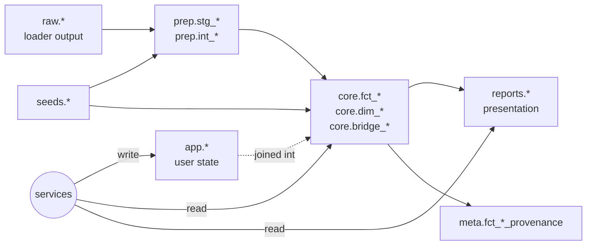

# Architecture: Shared Primitives

## Status

- **Type:** Architecture
- **Status:** implemented
- **Authority:** Reference doc cited by every M2+ spec rather than re-derived. Documents what is true in the code today, plus two narrowly-scoped naming changes that land with this spec (see [Cascading edits](#cascading-edits)).

## Goal

Twelve cross-cutting primitives have crystallized through Levels 0–1 — a connection factory, a secret store, a service-layer contract, a table registry, a response envelope, an MCP decorator and privacy middleware, observability hooks, a sanitized log formatter, an ingestion primitive, a settings model, SQLMesh layer conventions, and a scenario fixture format. Each is referenced by ≥3 callers across the codebase and is implicitly assumed by every new feature spec.

This spec names the primitives, their invariants, and the layer conventions they live within. It does not introduce new behavior. Its job is to remove ambiguity from every subsequent spec — `transaction-curation.md`, `investment-tracking.md`, `multi-currency.md`, `sync-plaid.md` rewrite — so authors cite the contract instead of re-deriving it.

It is **not** a feature spec. There is no implementation plan. The two narrow naming changes called out below ride along with this spec landing.

## Background

The strategic review of 2026-05-04 (`private/strategy/2026-05-04-strategic-review-engineering.md` §(b)) catalogued the convergence and recommended writing this doc before the next domain spec. The data-layer table in `AGENTS.md` is now a partial map of the schemas that actually exist (three rows; the codebase uses seven going on eight). The service-layer contract is consistent across ~18 services but never written down. The sensitivity decorator and response envelope have hardened but don't have a single-page reference.

### Related specs

- [`mcp-architecture.md`](mcp-architecture.md) — authoritative on MCP design philosophy, tool taxonomy, sensitivity tiers, response envelope. This spec cites it; does not duplicate.
- [`moneybin-mcp.md`](moneybin-mcp.md) — concrete tool/prompt enumeration. Cited for naming examples.
- [`moneybin-cli.md`](moneybin-cli.md) — CLI v2 taxonomy and the cross-protocol naming rule (CLI ↔ MCP ↔ HTTP). Cited for the symmetry contract.
- [`privacy-data-protection.md`](privacy-data-protection.md) — encryption-at-rest, key management, file permissions. Cited for security baseline.
- [`observability.md`](observability.md) — logging consolidation, metrics persistence, instrumentation API. Cited for the observability contract.
- [`database-migration.md`](database-migration.md) — versioned migrations and rebaseline. Cited for connection lifecycle.
- [`testing-scenario-comprehensive.md`](testing-scenario-comprehensive.md) — five-tier assertion taxonomy and bug-report recipe. Cited for scenario fixture conventions.
- [`transaction-curation.md`](transaction-curation.md) — sibling M2A entry spec; populates `app.*` heavily and defines the curation-presentation pattern (flat `app.*` tables surfaced as nested `LIST(STRUCT(...))` columns on `core.fct_*`).

## Architecture Invariants

Every service, MCP tool, and CLI command in MoneyBin obeys these. Reviewers should reject changes that violate them.

1. **`Database` injection.** Every service constructor takes `db: Database` as the first positional argument. Services never call `duckdb.connect()` and never call `get_database()` from inside their own methods — the caller (CLI command, MCP tool, test) is responsible for connection lifecycle.
2. **Typed returns.** Service methods return Python dataclasses (`@dataclass(slots=True)`) or Pydantic models, never raw tuples or `dict[str, Any]`. The dataclass owns serialization (`to_dict()`) so response shape is testable independently of transport.
3. **Classified domain exceptions.** Services raise project exceptions defined in `moneybin.errors` (e.g., `UserError` with a `code`). The MCP decorator (`@mcp_tool`) and CLI error handlers convert these into `ResponseEnvelope`s with structured `error` fields. Internal-only exceptions (`AssertionError`, `KeyError`) propagate as 500-class failures — never returned as user-facing text.
4. **No `os.getenv()` in feature code.** Configuration reads go through `get_settings()` → `MoneyBinSettings`. The only legitimate `os.getenv()` call sites are in `config.py` itself (resolving `MONEYBIN_HOME` before settings can load) and in `secrets.py` (env-var fallback for headless secret retrieval).
5. **No hardcoded paths, credentials, or tunable parameters.** Every tunable lives in a Pydantic Settings field with a description and validator. Security-critical parameters (Argon2 cost factors, key lengths, salt sizes) are defined exactly once.
6. **Parameterized SQL.** All values are bound with `?` placeholders; identifiers are validated against a `TableRef` allowlist or quoted with `sqlglot`. Inline f-string SQL is reserved for `noqa: S608`-annotated cases with a justification (test fixtures, sqlglot-quoted identifiers from trusted callers). See `.claude/rules/security.md`.
7. **No PII in logs.** Log record counts, IDs, and status codes; never amounts, descriptions, or account numbers. `SanitizedLogFormatter` is a runtime safety net, not a license to be careless. See `.claude/rules/security.md` "PII in Logs and Errors".
8. **Derivations live in SQLMesh, not in services.** Every conceptual aggregation, rollup, or alternate grain that callers need is a first-class SQLMesh model named for the concept (`core.fct_balances_daily`, `reports.net_worth`, future `core.fct_holdings_daily`). Services read from those models — or, when transient, compute on demand by querying them. **Services never snapshot derived state into `app.*` and re-read it.** The narrow exception is decision audit rows: `app.match_decisions` records *what was decided* (and by whom, when, against which candidates) — not *what the matcher would compute now*. Services that violate this invariant turn cache invalidation into a bug class and silently diverge from the source of truth in `core`. This is what makes SQLMesh a first-class surface in MoneyBin (see [§MCP/CLI/SQL Symmetry](#mcpclisql-symmetry) and [§SQLMesh Layer Conventions](#sqlmesh-layer-conventions)).

## Data Layer

MoneyBin uses eight schemas under this spec — seven that exist today plus `reports`, introduced as a [cascading edit](#cascading-edits). Each has a single owner, a single mutator, and a fixed set of allowed prefixes. Consumers read from `core` and `reports`; everything else is implementation detail.

| Schema | Materialization | Mutated by | Read by | Allowed prefixes | Purpose |
|---|---|---|---|---|---|
| `raw` | Tables | Python loaders (`src/moneybin/loaders/`); managed-write MCP tools | SQLMesh staging models | source-named (`tabular_*`, `ofx_*`, `w2_*`, `manual_transactions`) | Untouched data from each source. Re-importable from the original file. |
| `prep` | Views | SQLMesh transforms | SQLMesh core models | `stg_<source>__<entity>`, `int_<entity>__<transformation>` | Light cleaning, type casting, source-system unioning. Internal to the pipeline; not exposed to consumers. |
| `core` | Tables (canonical) and Views (derived-grain) | SQLMesh transforms | All consumers (services, MCP, CLI, reports) | `fct_<entity>` (event grain or alternate event grain), `dim_<entity>` (slowly-changing entity), `bridge_<entity>` (M:N relationship) | Canonical, deduplicated, multi-source. **One canonical table per real-world entity at its primary grain.** Alternate-grain facts use `fct_*` with a disambiguating name (`fct_transactions` header grain, `fct_transaction_lines` line grain). |
| `app` | Tables | Services (write); migrations (DDL); managed-write MCP tools | SQLMesh `dim_*` models (joins for resolved views); services (reads) | flat tables named for the entity: `account_settings`, `transaction_notes`, `transaction_tags`, `match_decisions`, `categorization_rules`, `versions`, `schema_migrations`, `audit_log`, etc. | User-state and application-managed metadata. **Mutable. Not derivable from raw.** Recovery is the responsibility of the `db backup` CLI surface, not the pipeline. |
| `reports` | Views (typically) | SQLMesh transforms | CLI `reports *` commands; MCP `reports_*` tools; future HTTP `/reports/*` | `<entity>` matching the CLI report name (`networth`, `spending`, `budget`, future `portfolio`, `cashflow`) | Curated presentation models, one per report surface. **Read-only by design.** Symmetric with the CLI/MCP `reports` namespace per `moneybin-cli.md` v2. |
| `meta` | Tables / Views | SQLMesh transforms | Reconciliation tooling; provenance queries; freshness probes | `fct_<entity>_provenance` (today: `fct_transaction_provenance`); `fct_<entity>_lineage` reserved; `model_freshness` | Provenance and pipeline metadata. Cross-source row lineage (`fct_*_provenance`) and model-level freshness (`model_freshness`, wrapping SQLMesh state). |
| `seeds` | Tables | SQLMesh seeds (from CSV) | SQLMesh transforms; services (read-only reference data) | `<entity>` (e.g., `categories`) | Reference data shipped in-repo. Rebuilt from CSV on `sqlmesh seed`. |
| `synthetic` | Tables | Synthetic data generator (`moneybin synthetic generate`) | Scenario tests | `ground_truth`, persona-named tables | Test scenario tables created on demand. Excluded from production builds. |

### Layer Rules

1. **Direction of data flow:** `raw → prep → core → reports`. `app` is read by `core` (joined into `dim_*`), written by services. `meta` is computed alongside `core`. `seeds` is read by `prep` and `core`. `synthetic` is read only by tests.
2. **Consumers read from `core` and `reports`, never from `prep`, `app`, `meta`, `seeds`, `raw` directly.** The exceptions:
   - Services that own an `app.*` table read it directly (e.g., `CategorizationService` ↔ `app.categorization_rules`).
   - The `import` family writes to `raw.*`.
   - Reconciliation tooling reads `meta.*`.
3. **Core dimensions are the single source of truth.** When `app.*` metadata refines or overrides a `core.dim_*` entity (e.g., `app.account_settings.display_name` overriding `dim_accounts`-derived display), the join lives in the dim model itself — consumers read the resolved view. Per `.claude/rules/database.md` "Core Dimensions Are the Single Source of Truth".
4. **`app.*` may surface as nested-type columns on `core.fct_*`.** The pattern is owned by [`transaction-curation.md`](transaction-curation.md): flat `app.*` tables for write ergonomics, presented as `LIST(VARCHAR)` or `LIST(STRUCT(...))` columns inline on `core.fct_*` so consumers never join `app.*` directly. This generalizes the dimension rule above to nested-type aggregates.
5. **Multi-source unioning happens in `core`.** Core models `UNION ALL` from every staging source with a `source_type` column. Per `.claude/rules/database.md` "Column Name Consistency Across Layers".
6. **Sign convention:** negative = expense, positive = income. `DECIMAL(18,2)` for money amounts, `DECIMAL(18,8)` for quantities and unit prices, `DATE` for dates. Per `.claude/rules/database.md` "Anti-Patterns".
7. **Money convention.** Every monetary column carries a currency column at the same grain. The pair is inseparable: no consumer should read an amount without its currency. When a row carries multiple monetary perspectives (e.g., transaction-currency + account-currency + display-currency post-multi-currency landing), each amount has its own currency column. Service-layer return types follow the same rule — a `Decimal` field representing money is paired with an explicit currency field on the same dataclass, never inferred from context.



### Schema reference: `TableRef`

All schema-qualified names live in `src/moneybin/tables.py` as `TableRef` constants. Consumers import `TableRef.FCT_TRANSACTIONS` (etc.) rather than hardcoding `"core.fct_transactions"`. Each constant carries an `audience` field (`"interface"` or `"internal"`) — interface tables are exposed via the `moneybin://schema` MCP resource for AI consumers; internal tables are not.

When adding a table, add a `TableRef` constant in the same change. Without one, the table is invisible to the curated schema resource and to any consumer that follows the allowlist convention.

## Connection Lifecycle

`Database` (`src/moneybin/database.py`) is the sole connection factory. It wraps DuckDB, owns encryption, runs initialization and migrations, and manages the singleton lifecycle.

### Single read-write process per profile

DuckDB allows one read-write connection per file. MoneyBin enforces this with a module-level singleton (`_database_instance`) returned by `get_database()`. Within one OS process, every caller shares one `Database`, one DuckDB connection, one writer.

**Concurrency consequences (honest list):**

- **MCP tool timeouts (`docs/specs/mcp-tool-timeouts.md`) exist *because* of the lock.** A hung tool would otherwise wedge the writer for every other client. The 30s cap interrupts the active statement and force-resets the connection so the lock drops. This is a bulkhead, not a long-term concurrency story.
- **The `db ps` / `db kill` CLI exist *because* of the lock** — explicit lock-management surface for users.
- **Cross-process write contention is not supported.** Two processes both opening `Database()` against the same `.duckdb` file race for the file's write lock. Today this only happens accidentally (e.g., a stuck CLI plus an MCP server). M2 features that would intentionally introduce a second writer (out-of-process Plaid background sync, multi-process FastAPI) are deferred until a real trigger appears — see [Open question (a)](#a-when-does-an-out-of-process-writer-become-unavoidable).
- **Read-only attach is not yet implemented but is the obvious extension.** A separate-process read-only consumer (e.g., a `streamlit run` dashboard that opens its own `Database()`) currently fails because the encrypted `ATTACH` defaults to read-write. Adding a `read_only=True` option that emits `ATTACH ... (TYPE DUCKDB, ENCRYPTION_KEY '...', READ_ONLY)` would let multiple readers coexist with one writer. Land this when the first separate-process read-only surface needs it — `moneybin ui`-style in-process surfaces don't need it.

### Initialization sequence

`Database.__init__()` runs, in order:

1. Retrieve encryption key via `SecretStore` (keychain → env-var fallback). Failure raises `DatabaseKeyError` with a hint pointing to `db init` or `db unlock`.
2. Open in-memory DuckDB connection.
3. Attach the encrypted database file: `ATTACH '...path...' AS moneybin (TYPE DUCKDB, ENCRYPTION_KEY '...')`.
4. `USE moneybin` so the attached database is the default catalog.
5. Set 0600 file permissions on new files (Unix); warn on existing files with looser permissions.
6. Run `init_schemas()` — idempotent baseline DDL applied on every open.
7. Run pending versioned migrations via `MigrationRunner`, gated by `no_auto_upgrade`. See [`database-migration.md`](database-migration.md).
8. Run `sqlmesh migrate` if the installed SQLMesh version differs from the recorded version.
9. Record component versions in `app.versions`.

The migration auto-apply gate (`MoneyBinSettings.database.no_auto_upgrade`) is honored. Tests pass `no_auto_upgrade=True` to skip migrations and SQLMesh — without it each test would spawn a SQLMesh `Context` and pay ~1.5s. See `.claude/rules/testing.md` "Database Fixtures".

### Lock release on tool timeout

When the MCP decorator fires its 30s timeout, it calls `interrupt_and_reset_database()`. That:

1. Calls `_conn.interrupt()` (best-effort; some statement types ignore it).
2. Calls `_conn.close()` to guarantee the lock drops.
3. Clears the `_database_instance` singleton so the next `get_database()` opens a fresh connection.

Surviving sync-tool threads (cancelled by `asyncio.timeout()` but still running on the OS thread) will see the closed connection on their next operation and raise. That exception surfaces via the thread pool's unhandled-exception path (stderr), not the MCP envelope. Occasional stderr noise after a timeout is expected; forcing termination would require cooperative cancellation in tool bodies and is out of scope.

### SQLMesh invocation

SQLMesh runs in-process via `sqlmesh_context()` (`src/moneybin/database.py`). The function injects MoneyBin's encrypted DuckDB adapter into SQLMesh's internal adapter cache (`BaseDuckDBConnectionConfig._data_file_to_adapter`) so SQLMesh reuses the encrypted connection instead of opening its own unencrypted one — DuckDB's SQLMesh config doesn't accept `ENCRYPTION_KEY`.

**Never invoke SQLMesh as a subprocess.** Subprocess invocations break profile isolation: the child process reads `~/.moneybin/config.yaml` and connects to the wrong database. Per `.claude/rules/database.md` "SQLMesh Invocation".

## Service-Layer Contract

A service is a Python class in `src/moneybin/services/` that owns a domain (transactions, balances, networth, categorization, …). Eighteen services follow this shape today.

### What every service provides

```python
class WhateverService:
    def __init__(self, db: Database) -> None:
        self._db = db

    def some_query(self, ...) -> SomeResult:
        """Returns a typed result. Raises classified UserError on user-facing failure."""

    def some_mutation(self, ...) -> MutationResult:
        """Writes to app.* (or raw.*). Returns a typed result. Raises classified UserError."""
```

Concrete reference: `NetworthService` (`src/moneybin/services/networth_service.py`) is a clean read-only example; `CategorizationService` is a clean transactional example.

### What every consumer can assume

- The service holds an open `Database`. Connection lifecycle is the caller's responsibility.
- Methods return dataclasses (`@dataclass(slots=True)`) or Pydantic models with a `to_dict()` for envelope/JSON transport. No raw tuples leak out.
- Errors are classified. `UserError` (with a `code`) is meant for the user; everything else is a 500-class failure.
- Methods are safe to call from MCP tools (which run via `asyncio.to_thread` for sync bodies) and from CLI commands. No `print`, no `input`, no Typer dependencies — pure domain code.
- SQL stays inside the service. Consumers never construct SQL on the service's behalf.

### Read-only vs. transactional services

The same shape covers both. A read-only service (e.g., `NetworthService`) only reads from `core.*` / `reports.*`. A transactional service (e.g., `CategorizationService`, `AccountService`) reads from `core` / `reports` and writes to `app.*` (or, in the `import` family, to `raw.*`). Transactional services use `db.begin() / commit() / rollback()` for multi-statement units of work. The privacy middleware's managed-write validation enforces that writes target only `app.*` and `raw.*` schemas (with a `core.*` exception only for SQLMesh-issued `CREATE OR REPLACE TABLE` from the import service).

## MCP/CLI/SQL Symmetry

MoneyBin exposes its data through three peer surfaces: the **MCP server** (AI consumers), the **CLI** (humans and CLI-driving agents like Claude Code, Codex, Gemini CLI), and the **SQL layer itself** (the `core.*` and `reports.*` SQLMesh models, queryable through `moneybin db shell`, the `moneybin://schema` MCP resource, and the read-only SQL query tool). All three are first-class consumer interfaces. None is an implementation detail.

The CLI and MCP server are thin formatters around the service layer; neither contains business logic. The SQL layer carries an equivalent contract — the SQLMesh models *are* the canonical data products, named for the concepts callers reason about, not for their implementation. See [§SQLMesh Layer Conventions](#sqlmesh-layer-conventions) for the polish requirements that make this work; they are the SQL-surface equivalent of the MCP tool taxonomy and CLI command tree.

### Cross-protocol naming rule

Per [`moneybin-cli.md`](moneybin-cli.md) §"Cross-Interface Taxonomy":

> Hierarchy is the entity path. Verb is the leaf action. Aggregations live with their entity. Workflows live with the entity they operate on. Reports are cross-cutting analytical views.

| Concept | CLI | MCP | HTTP (future) |
|---|---|---|---|
| List accounts | `accounts list` | `accounts_list` | `GET /accounts` |
| Net worth report | `reports networth` | `reports_networth_get` | `GET /reports/networth` |
| Confirm a match | `transactions matches confirm <id>` | `transactions_matches_confirm` | `POST /transactions/matches/{id}/confirm` |

Same noun ordering across all three; only the verb position and separators differ. The architecture spec's job here is to point at the rule, not restate it.

### The three primitives

1. **`@mcp_tool(sensitivity=...)`** decorates every MCP tool. Accepts `sensitivity` (`"low"` / `"medium"` / `"high"`) and optional `domain` (for progressive disclosure). Wraps the tool body in: privacy logging (`log_tool_call`), the 30s timeout guard, classified-exception → error-envelope conversion, and a final guard that the body returned a `ResponseEnvelope`. Source: `src/moneybin/mcp/decorator.py`.

2. **`ResponseEnvelope`** is the common response shape across MCP tools and CLI `--output json`. Fields: `summary` (counts, truncation flag, sensitivity tier, display currency), `data` (list of records or single dict), `actions` (next-step hints), and optional `error` (classified `UserError`). Decimal values serialize as strings to avoid float imprecision. Source: `src/moneybin/protocol/envelope.py`. Constructors: `build_envelope()`, `build_error_envelope()`, `not_implemented_envelope()`.

3. **Privacy middleware** (`src/moneybin/mcp/privacy.py`) provides:
   - **Sensitivity tiers** — declared by every tool via the decorator. Per [`mcp-architecture.md`](mcp-architecture.md) §5, `low` requires no consent, `medium` requires `mcp-data-sharing` consent and degrades to aggregates without it, `high` requires consent + cloud masking. (V1 only logs; full consent enforcement lands in the privacy framework specs.)
   - **Read-only validation** for the general SQL query tool: rejects writes, file-access functions, URL literals, and quoted-path scans.
   - **Managed-write validation** for write tools: allows `INSERT`/`UPDATE`/`DELETE` only on `app.*` and `raw.*` schemas; rejects DDL outright (with a narrow exception for SQLMesh-issued `CREATE OR REPLACE TABLE core.*`).

### Protocol-standard MCP fields are first-class, not optional

Sensitivity tiers and the `ResponseEnvelope` are MoneyBin-specific primitives. They sit *alongside* — not in place of — the protocol-standard fields the MCP spec itself defines: tool `annotations` (`readOnlyHint` / `destructiveHint` / `idempotentHint` / `openWorldHint`), `Prompts`, `Resources`, `Sampling`, `Roots`, `Elicitation`, progress notifications, and `tools/list_changed`. Clients (Claude Desktop, Codex, Gemini CLI) consume those standard fields for confirmation UI, capability negotiation, and context injection — they do not consume MoneyBin's tier model.

**Every new tool, prompt, or resource must satisfy both layers.** The MoneyBin layer (sensitivity, envelope, exposure principle) is reviewed against this spec; the protocol layer is reviewed against the [protocol-standard capability coverage matrix in `moneybin-mcp.md`](moneybin-mcp.md#protocol-standard-capability-coverage-matrix). Reject changes that update one without the other. The intent is that no future protocol capability is silently overlooked or surface-shipped without explicit account.

### MCP exposure principle

Per `.claude/rules/mcp-server.md` "When CLI-only is justified": the default for every new operation is "expose to MCP." CLI-only status requires one of two justifications:

1. The tool accepts secret material (passphrases, encryption keys) that must not pass through an LLM context window.
2. The tool requires hands-on operator presence and is meaningless when the database is locked or the server isn't running (`db init`, `db unlock`, `db migrate`, `mcp serve`, `mcp config_*`, `profile_*`).

Anything else — long-running operations, OAuth flows, destructive actions, interactive workflows, scheduler/filesystem writes — is MCP-exposable. Long-running operations use a job-handle pattern (`*_start` → `*_status` → `*_result`); destructive operations use a `confirm` parameter; interactive workflows split into list/act tools with the AI orchestrating.

### CLI as a first-class agent surface

Per `.claude/rules/mcp-server.md` design philosophy point 5: agents (Claude Code, Codex CLI, Gemini CLI) drive CLI commands directly as a peer pathway to MCP. When designing data-flow primitives — JSON I/O on `--output json`, stdin/stdout contracts, redaction — assume both human and agent consumers. The `ResponseEnvelope` returned by `--output json` is the same shape an MCP tool returns; the same redaction rules apply on both surfaces.

## Observability Hooks

`src/moneybin/observability.py` is the single public entry point: `setup_observability(stream=...)`, `tracked` (decorator), `track_duration` (context manager), `flush_metrics`. Internal modules (`moneybin.logging`, `moneybin.metrics`) are not imported by application code except for manual gauge/counter access.

Every service that follows the contract gets these for free:

- **Stream-aware logging.** `setup_observability(stream="cli" | "mcp" | "sqlmesh")` configures handlers, formatters, and the always-on `SanitizedLogFormatter` PII safety net. The MCP stream additionally starts a periodic metrics flush (every `MoneyBinSettings.metrics.flush_interval_seconds`, default 300).
- **`@tracked(operation=..., labels=...)`** decorator records call count, duration histogram, and error count with `operation` and optional `source_type` labels. Emits a DEBUG log on completion. Use on the public methods that matter for ops dashboards.
- **`track_duration(operation=...)`** context manager records a histogram observation for a block. Use when decorating the whole function would be too coarse (e.g., timing one phase of an import).
- **`SanitizedLogFormatter`** masks SSN-shaped patterns (`NNN-NN-NNNN` → `***-**-****`), 8+-digit account-number-shaped patterns (last-four preserved), and dollar-amount-shaped patterns (`$N,NNN.NN` → `$***`) in formatted output. Always on; cannot be disabled. Per `.claude/rules/security.md` "PII in Logs and Errors" — clean log statements first, formatter as safety net.
- **`flush_metrics()`** is registered as an `atexit` handler. Best-effort: never blocks shutdown, never raises. Only flushes if a database was actually opened during the session — won't recreate a deleted profile's directory tree.

Domain-specific metrics (e.g., `IMPORT_RECORDS_TOTAL`) live in `src/moneybin/metrics/registry.py` and are recorded manually at the relevant call sites. Per [`observability.md`](observability.md): specs touching app code must include metrics.

## Configuration Model

`MoneyBinSettings` (`src/moneybin/config.py`) is the root settings model — a Pydantic Settings `BaseSettings` with nested config sections (`database`, `data`, `logging`, `metrics`, `mcp`, `sync`, `matching`, `categorization`, `import_`).

### Conventions

- **Env vars use `MONEYBIN_` prefix with `__` for nesting.** `MONEYBIN_DATABASE__PATH=/tmp/db.duckdb` sets `settings.database.path`. Case-insensitive.
- **Profile-scoped.** Every `MoneyBinSettings` is constructed for one active profile. Paths under `~/.moneybin/profiles/<profile>/` are resolved at construction time. The active profile is set via `set_current_profile()`; reads via `get_current_profile()`. `get_settings()` is a singleton scoped to the active profile and invalidates on profile change.
- **`MONEYBIN_HOME` overrides the base directory.** Otherwise the resolution order is: `MONEYBIN_ENVIRONMENT=development` → `<cwd>/.moneybin`; repo checkout detection (`.git` + `pyproject.toml` name=moneybin) → `<cwd>/.moneybin`; default → `~/.moneybin/`.
- **`.env.<profile>` overrides `.env`.** Custom dotenv resolution in `settings_customise_sources` looks up `~/.moneybin/.env.<profile>` first, then `~/.moneybin/.env`.
- **Frozen models.** All config sections use `ConfigDict(frozen=True)` — settings are read-only after construction.
- **Validators enforce invariants.** E.g., `MatchingSettings.transfer_signal_weights` must contain the four required keys and sum to 1.0 ± 1e-6; `DatabaseConfig.path` must end in `.db` or `.duckdb`. Validation runs at construction, not at use.

### The "no hardcoded values" rule

Every tunable lives in a Settings field with a description and (where appropriate) a validator. This includes:

- All paths (database, logs, raw data, inbox).
- All thresholds (matching confidence, balance tolerances, row limits).
- All timeouts and intervals (MCP tool timeout, metrics flush).
- All security parameters (Argon2 cost factors, salt sizes, hash lengths).

Security-critical parameters are defined exactly once, at `_CONSTANTS` module-level or in a Settings field. Never duplicated across call sites — duplication introduces drift, and drift in a crypto cost factor locks users out.

### Secrets are not in `MoneyBinSettings`

Encryption keys and high-sensitivity credentials live in `SecretStore` (`src/moneybin/secrets.py`) — keychain-first, env-var fallback. Per-profile keychain service: `service="moneybin-<profile>"`. The `Database` class is the only consumer of `_KEY_NAME`; CLI commands manage lifecycle (`db init`, `db unlock`, `db rotate-key`).

API keys and server credentials that don't need keychain storage use `SecretStore.get_env(name)` — env-var-only.

## SQLMesh Layer Conventions

This section covers the conventions that hold across `prep`, `core`, `meta`, `seeds`, and `reports`. The layer-and-prefix table in [Data Layer](#data-layer) is the canonical reference; this section adds the SQLMesh-specific mechanics.

The conventions exist because the SQL layer is a **primary consumer interface** — peer to MCP and CLI (per [§Invariant 8](#architecture-invariants) and [§MCP/CLI/SQL Symmetry](#mcpclisql-symmetry)). The same polish standard applies: every model has a table comment that explains the concept, every column on the outermost SELECT has a comment, names describe the concept rather than the implementation, and renames are migrations rather than refactors. The `moneybin://schema` MCP resource and `moneybin db shell` use these comments verbatim — sloppy comments produce sloppy AI queries.

### Prefix semantics

| Prefix | Schema | Grain / role |
|---|---|---|
| `stg_<source>__<entity>` | `prep` | Source-specific staging view: light cleaning, type casting. Internal. |
| `int_<entity>__<transformation>` | `prep` | Intermediate model in a multi-step build (e.g., `int_transactions__matched`). Internal. |
| `dim_<entity>` | `core` | Slowly-changing entity (accounts, merchants, securities). Joins `app.*` for resolved overrides. |
| `fct_<entity>` | `core` | Event-grain fact. Multiple `fct_*` tables for the same entity at different grains share the prefix and disambiguate by name (`fct_transactions` header grain, `fct_transaction_lines` line grain). |
| `bridge_<entity>` | `core` | M:N relationship table (e.g., `bridge_transfers`). |
| `<report>` | `reports` | Curated presentation, one per CLI/MCP report. No `agg_` prefix — the schema name already says "presentation rollup". |
| `fct_<entity>_provenance`, `fct_<entity>_lineage` | `meta` | Cross-source provenance / lineage. |
| `<entity>` | `seeds` | Reference data shipped in-repo as CSV. |

**Prefixes describe grain and role, not physical storage.** A view and a table with the same shape get the same prefix. SQLMesh's `kind` (`VIEW` / `INCREMENTAL` / `FULL` / etc.) records physicality. Adding a `vw_` prefix would duplicate that signal in a less-discoverable place.

**`reports.*` does not use shape prefixes.** Inside `reports`, every model is a curated presentation by definition; there's no shape to disambiguate, so the prefix would be empty syntax.

**`core` does not use `agg_` going forward.** Time-series and cross-entity rollups live in `reports.*` instead, mirroring the CLI `reports` namespace one-to-one. The single legacy `core.agg_net_worth` migrates to `reports.net_worth` as part of this spec landing — see [Cascading edits](#cascading-edits).

### Comment placement

Per `.claude/rules/database.md` "Table and Column Comments":

- `/* description */` block comment on the line immediately before `MODEL()` (SQLMesh) or `CREATE TABLE` (schema DDL) for the table description.
- Inline `-- comment` (or `/* */`) on each column in the **outermost** SELECT for column descriptions.
- `prep.*` staging views get no comments (internal layer).
- Do not use the `column_descriptions` block in `MODEL()` together with inline comments — SQLMesh disables auto-detection if both are present.

Both styles reach DuckDB's catalog: SQLMesh applies them on every `sqlmesh run` via `register_comments`; schema DDL applies them on every app startup via `init_schemas`.

### Row-level freshness convention

Every `core.*` model exposes an `updated_at` column whose value is the `MAX` of timestamps from inputs that change *per row*. Inputs that change *per model* (seeds, reference tables) contribute `NULL` and are surfaced through `meta.model_freshness`. `CURRENT_TIMESTAMP AS updated_at` inside a model is an anti-pattern — it evaluates at write time only for `FULL` tables and at query time for views, so it never reliably means "this row's freshness." See [`core-updated-at-convention.md`](core-updated-at-convention.md) for per-model formulas.

### Model and seed naming details

- `stg_*` uses double-underscore to separate source from entity: `stg_ofx__transactions`, `stg_tabular__accounts`.
- `int_*` uses double-underscore to separate domain from transformation: `int_transactions__matched`, `int_transactions__merged`.
- Seeds materialize from CSV: `sqlmesh/models/seeds/categories.csv` → `seeds.categories`. The accompanying `.sql` file declares the seed model.

## Scenario Fixture Format

Scenario tests are pytest tests with YAML-driven inputs and assertions. The runner lives in `tests/scenarios/`. Fixture YAML lives at `tests/scenarios/data/<scenario>.yaml`.

### YAML structure

```yaml
scenario: <kebab-case-name>
description: "One-line summary including the assertion this scenario proves."

setup:
  persona: family            # Optional: synthetic-data persona to instantiate
  seed: 42                   # Optional: deterministic RNG seed
  years: 1                   # Persona-specific knobs
  fixtures:                  # Optional: hand-authored fixture files
    - path: dedup/chase_amazon_overlap.csv
      account: amazon-card
      source_type: csv

pipeline:
  - load_fixtures
  - transform
  - match
  # …step names resolve via the harness registry in tests/scenarios/

assertions:                  # Tier-1 structural invariants and table-level checks
  - name: no_duplicate_gold_records
    fn: assert_no_duplicates
    args:
      table: core.fct_transactions
      columns: [transaction_id]

expectations:                # Tier-2 per-record predicates against ground truth
  - kind: match_decision
    description: "Chase OFX 2024-03-15 $47.99 == Amazon CSV 2024-03-15 $47.99"
    transactions:
      - source_transaction_id: SYN20240315001
        source_type: ofx
      - source_transaction_id: TBL_2024-03-15_AMZN_47.99
        source_type: csv
    expected: matched
    expected_match_type: dedup
    expected_confidence_min: 0.9

gates:
  required_assertions: all
  required_expectations: all
```

### Conventions

- **YAML, not Python.** Fixture and expectation files are YAML so non-engineering contributors (and a future "send us a repro" community workflow) can author them. Per `private/strategy/` notes on community contribution model.
- **Independent expectations.** Expected values are derived from the input fixture (counted by hand), the persona/generator config (deterministic formula), or hand-authored ground truth written before running the pipeline. **Never** observe-and-paste. Per `.claude/rules/testing.md` "Scenario Expectations Must Be Independently Derived".
- **Every scenario declares its tier coverage** against the five-tier taxonomy (structural invariants, semantic correctness, pipeline behavior, distribution/quality, operational). Per [`testing-scenario-comprehensive.md`](testing-scenario-comprehensive.md) R1 and R2.
- **Negative expectations are required wherever positive expectations exist.** A "these N records should match" expectation is incomplete without a paired "these M records should *not* match." Otherwise the test only catches under-matching, not over-matching.
- **Bug-report scenarios follow the recipe in `docs/guides/scenario-authoring.md`.** Capture the bug, extract an isolated fixture under `tests/scenarios/data/fixtures/<bug-id>/`, derive the expectation independently, verify it fails on the broken code before fixing.

### Adding a new scenario

1. Write the YAML at `tests/scenarios/data/<scenario>.yaml`.
2. Hand-author or generator-derive the inputs and expectations (no observe-and-paste).
3. Add a pytest module at `tests/scenarios/test_<scenario>.py` that loads the YAML and dispatches through the harness.
4. If the scenario needs a new assertion or expectation primitive, add it to `src/moneybin/validation/{assertions,expectations,evaluations}/` and register it in the appropriate registry (`tests/scenarios/_assertion_registry.py` or `_expectation_registry.py`).
5. Run `make test-scenarios` to verify it passes (and that it failed against the broken code first, if it's a bug-report scenario).

## Open Architectural Questions

These are deliberately *not* decided here. Listed so the next contributor knows what's hanging and what would force the conversation.

### (a) Writer coordination — settled by ADR-010

**This question is answered.** `web-ui-prototype.md` (FastAPI mutations) and `sync-plaid.md` (out-of-process batch writer) both triggered the condition. See [ADR-010: Writer Coordination](../decisions/010-writer-coordination.md) for the full decision record.

**Decision summary:** Replace the long-lived read-write singleton with short-lived, purpose-declared connections. `Database` gains a `read_only: bool = False` parameter. Read-only connections skip `init_schemas()` and `refresh_views()` (~14 ms overhead) and can coexist across any number of processes. Write connections are exclusive (~79 ms overhead) and acquired with an exponential-backoff retry up to 5 seconds. No IPC layer, no socket server, no dedicated daemon — each process is self-contained.

The IPC socket-server pattern (first process becomes the write gateway for all others) is named in ADR-010 as the upgrade path if write contention becomes operationally noisy at higher access rates.

### (b) Multi-currency interaction with `reports.*`

Owned by `multi-currency.md` (M3). Open: do `reports.*` rollups carry one `display_currency` per report (per `ResponseEnvelope.summary.display_currency`, today's pattern) and FX-convert at view definition time? Or do they expose per-row `currency_original` + `amount_original` and force the consumer to choose? The architecture spec doesn't decide; it just notes that `reports.*` is a presentation layer, and presentation layers are a natural place to lock the currency.

## Cascading Edits

Two narrow naming changes ride along with this spec landing. Both are mechanical and uncontroversial; called out here so reviewers see the full surface.

1. **`core.agg_net_worth` → `reports.net_worth`.** New `reports` schema is added to `src/moneybin/schema.py`. The SQLMesh model at `sqlmesh/models/core/agg_net_worth.sql` moves to `sqlmesh/models/reports/net_worth.sql`. `TableRef.AGG_NET_WORTH` is replaced by `TableRef.REPORTS_NET_WORTH`. `NetworthService` updates its three SQL references. Privacy middleware's `_WRITABLE_SCHEMAS` is unchanged — `reports.*` is read-only by design and never appears in managed-write validation. **This migration is owned by [`reports-recipe-library.md`](reports-recipe-library.md)** (the inaugurating implementation of the `reports.*` schema) and lands as part of that spec's first PR.

2. **`core.vw_transaction_lines` → `core.fct_transaction_lines`** in [`transaction-curation.md`](transaction-curation.md). One-line edit in that spec; the architecture spec triggers the convention but the actual edit lands as part of the `transaction-curation.md` implementation PR (per the prefix-describes-grain rule in §SQLMesh Layer Conventions).

3. **AGENTS.md "Architecture: Data Layers" table** is updated alongside this spec to add `app` and `reports` rows and link here for the full layer reference. AGENTS.md stays the at-a-glance orientation; this spec is the canonical reference.

## References

### Authoritative living docs

- [`mcp-architecture.md`](mcp-architecture.md) — MCP design philosophy, tool taxonomy, sensitivity tiers, response envelope.
- [`moneybin-mcp.md`](moneybin-mcp.md) — Concrete tool/prompt enumeration; v2 in progress.
- [`moneybin-cli.md`](moneybin-cli.md) — CLI v2 taxonomy and cross-protocol naming rule.
- [`privacy-data-protection.md`](privacy-data-protection.md) — Encryption at rest, key management, file permissions.
- [`observability.md`](observability.md) — Logging consolidation, metrics persistence, instrumentation API.
- [`database-migration.md`](database-migration.md) — Versioned migrations, rebaseline, SQLMesh version detection.
- [`testing-scenario-comprehensive.md`](testing-scenario-comprehensive.md) — Five-tier assertion taxonomy and bug-report recipe.
- [`transaction-curation.md`](transaction-curation.md) — `app.*` heavy populator; curation-presentation pattern via nested types on `core.fct_*`.

### Rules

- `.claude/rules/security.md` — SQL injection prevention, input validation, PII in logs, exception wrapping.
- `.claude/rules/database.md` — DuckDB patterns, SQL conventions, schema, column comments, model naming.
- `.claude/rules/mcp-server.md` — Tool taxonomy, response envelope, sensitivity tiers, MCP exposure principle, CLI as agent surface.
- `.claude/rules/cli.md` — Typer patterns, error handling, command registration.
- `.claude/rules/testing.md` — Pytest patterns, fixtures, scenario expectation independence rule.
- `.claude/rules/identifiers.md` — Content hashes, truncated UUIDs, source IDs, semantic slugs.
- `.claude/rules/documentation.md` — Diagram conventions (Mermaid over ASCII).

### Strategic context

- `private/strategy/2026-05-04-strategic-review-engineering.md` §(b) — Architectural review that catalogued the 12 primitives and recommended this spec.
- `private/design.md` — Spec milestones and sequencing (this spec is M2B entry, sibling to `transaction-curation.md`).

### Source files (primitives)

- `src/moneybin/database.py` — `Database`, `get_database`, `init_db`, `sqlmesh_context`, `interrupt_and_reset_database`.
- `src/moneybin/secrets.py` — `SecretStore`, `SecretNotFoundError`, `SecretStorageUnavailableError`.
- `src/moneybin/config.py` — `MoneyBinSettings` and nested config sections.
- `src/moneybin/tables.py` — `TableRef` constants and the `INTERFACE_TABLES` derivation.
- `src/moneybin/protocol/envelope.py` — `ResponseEnvelope`, `SummaryMeta`, `build_envelope`, `build_error_envelope`.
- `src/moneybin/mcp/decorator.py` — `mcp_tool` decorator.
- `src/moneybin/mcp/privacy.py` — `Sensitivity` enum, `validate_read_only_query`, `validate_managed_write`, `truncate_result`.
- `src/moneybin/observability.py` — `setup_observability`, `tracked`, `track_duration`, `flush_metrics`.
- `src/moneybin/log_sanitizer.py` — `SanitizedLogFormatter`.
- `src/moneybin/services/networth_service.py` — Reference read-only service.
- `src/moneybin/services/categorization_service.py` — Reference transactional service.
