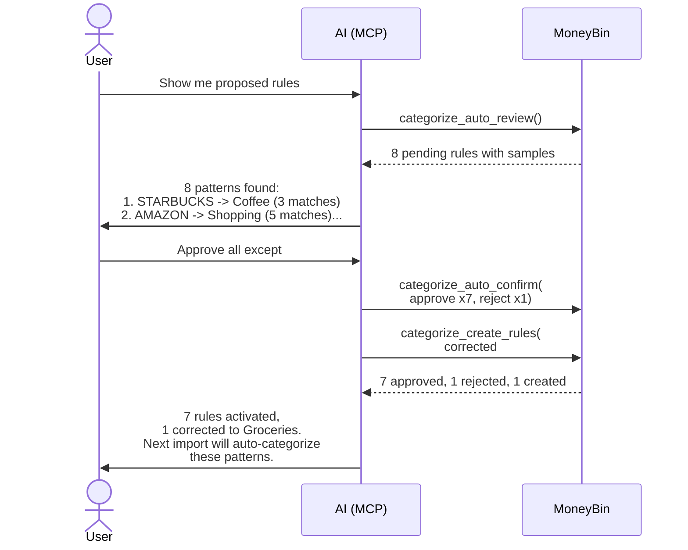

# Auto-Rule Generation

> Last updated: 2026-04-26
> Status: Implemented
> Parent: [`categorization-overview.md`](categorization-overview.md) (pillar E)
> Companions: [`archived/transaction-categorization.md`](archived/transaction-categorization.md) (existing rule engine this builds on), [`mcp-tool-surface.md`](mcp-tool-surface.md) (tool signatures), `CLAUDE.md` "Architecture: Data Layers"

## Goal

When a user categorizes a transaction, identify the pattern and propose a rule so future matching transactions are categorized automatically. Proposals are staged — never silently activated. The user reviews and approves them in batch. The system gets smarter with every import.

## Background

Today's categorization pipeline has user-defined rules and merchant mappings, but the user must create rules manually. If a user categorizes 50 Starbucks transactions as "Coffee Shops" over three months, there's no mechanism to learn that pattern and apply it to the 51st automatically.

This spec adds auto-rule generation — pillar E from the [categorization umbrella](categorization-overview.md). It hooks into the existing categorization code paths, proposes rules from observed patterns, and promotes approved proposals to active rules in `app.categorization_rules` with `created_by = 'auto_rule'`.

### Relevant prior art

- [categorization-overview.md](categorization-overview.md) — umbrella vision, priority hierarchy, pipeline, build order
- [archived/transaction-categorization.md](archived/transaction-categorization.md) — existing rule engine and merchant normalization
- [app_categorization_rules.sql](../../src/moneybin/sql/schema/app_categorization_rules.sql) — existing rule schema with `created_by` column
- [app_transaction_categories.sql](../../src/moneybin/sql/schema/app_transaction_categories.sql) — categorization output table
- [app_merchants.sql](../../src/moneybin/sql/schema/app_merchants.sql) — merchant normalization mappings

## Design Principles

1. **Capture user intent immediately.** A manual categorization is a signal. Propose a rule on the first occurrence (configurable). The review queue is the safety net, not a high threshold.
2. **Merchant-first pattern extraction.** When a merchant match exists, use the canonical merchant name. Fall back to cleaned description only when no merchant is matched. Don't re-derive what merchant normalization already knows.
3. **Proposals, not silent activation.** Nothing activates without user approval. The system proposes; the user decides.
4. **Fit into the existing pipeline.** Auto-rules use the same `app.categorization_rules` table and rule engine as user-created rules. No parallel categorization system.

## Requirements

### Proposal generation

1. After any categorization event (`categorize_bulk` MCP tool or `moneybin categorize` CLI), the system checks each categorized transaction for a potential auto-rule proposal.
2. A proposal is generated when no active rule or merchant mapping already covers the transaction's pattern AND no pending proposal for the same pattern exists (if a pending proposal exists, its `trigger_count` is incremented instead).
3. The proposal threshold is configurable (`categorization.auto_rule_proposal_threshold`, default 1). A value of 1 means propose on first categorization; a value of 3 means propose after three matching categorizations.
4. Pattern extraction uses the merchant-first strategy: canonical merchant name when a `merchant_id` exists, cleaned description otherwise.
5. Proposals are stored in `app.proposed_rules` with `status = 'pending'`.

### Proposal lifecycle

6. Proposals have four states: `pending`, `approved`, `rejected`, `superseded`.
7. Approved proposals are promoted to active rules in `app.categorization_rules` with `created_by = 'auto_rule'` and `priority = 200`.
8. On promotion, the new rule is immediately run against existing uncategorized transactions so approval has instant effect.
9. Rejected proposals are not re-proposed for the same pattern unless the user later categorizes a transaction with that pattern differently (which creates a new proposal).
10. When the same pattern is categorized differently, the existing proposal is marked `superseded` and a new proposal is created with the new category.

### Correction handling

11. A single user override of an auto-rule-categorized transaction does not affect the rule. `categorized_by = 'user'` outranks the rule per the priority hierarchy.
12. After `auto_rule_override_threshold` (default 2) user overrides of the same auto-rule, the system deactivates the rule, marks the proposal `superseded`, and creates a new proposal with the most common correction category.
13. Override counting is query-based: count transactions where `categorized_by = 'user'` AND the transaction matches the auto-rule's pattern and has a different category. No stored counter needed.

### Priority hierarchy integration

14. Auto-rules sit at priority level 3 in the categorization hierarchy (user > user-rules > auto-rules > ML > plaid > ai). They use `categorized_by = 'auto_rule'`.
15. Auto-rules are never evaluated for transactions already categorized by a higher-priority source.
16. Auto-rules at `priority = 200` are evaluated after user-created rules at default `priority = 100`. Two auto-rules are ordered by their own priority values (first-created wins at equal priority).

## Data Model

### `app.proposed_rules` (new)

```sql
/* Auto-rule proposals generated from user categorization patterns; staged for review before activation */
CREATE TABLE IF NOT EXISTS app.proposed_rules (
    proposed_rule_id VARCHAR PRIMARY KEY, -- UUID, unique identifier for this proposal
    merchant_pattern VARCHAR NOT NULL,    -- Pattern to match: canonical merchant name or cleaned description
    match_type VARCHAR DEFAULT 'contains', -- How the pattern is matched: contains, exact, or regex
    category VARCHAR NOT NULL,            -- Proposed category
    subcategory VARCHAR,                  -- Proposed subcategory; NULL if top-level only
    status VARCHAR DEFAULT 'pending',     -- Lifecycle: pending, approved, rejected, superseded
    trigger_count INTEGER DEFAULT 1,      -- Number of categorizations that triggered or reinforced this proposal
    source VARCHAR DEFAULT 'pattern_detection', -- How the proposal was generated: pattern_detection or ml
    sample_txn_ids VARCHAR[],             -- Up to 5 transaction_ids that triggered this proposal
    proposed_at TIMESTAMP DEFAULT CURRENT_TIMESTAMP, -- When the proposal was created
    decided_at TIMESTAMP,                 -- When the user approved or rejected; NULL if pending
    decided_by VARCHAR                    -- Who decided: 'user' or NULL if still pending
);
```

### `app.categorization_rules` (existing, no schema changes)

Auto-rules are inserted with:

- `created_by = 'auto_rule'` (existing column, new value)
- `priority = 200` (below user rules at default 100)
- `is_active = true` (set to `false` when correction threshold triggers deactivation)

No schema changes needed.

### `app.transaction_categories` (existing, no schema changes)

Auto-rule categorizations are written with:

- `categorized_by = 'auto_rule'` (new value alongside existing `'rule'`, `'ai'`, `'user'`)

No schema changes needed — `categorized_by` is VARCHAR.

## Pattern Extraction

### Merchant-first strategy

```
Transaction categorized
  |
  v
Has merchant_id in app.transaction_categories?
  |
  +-- YES --> Use app.merchants.canonical_name as pattern
  |           match_type = 'contains'
  |
  +-- NO  --> Clean raw description:
              1. Strip trailing transaction IDs (#1234, *AB1CD2)
              2. Strip location suffixes (SEATTLE WA, CA 94103)
              3. Strip payment processor prefixes (SQ *, TST *)
              4. Strip trailing whitespace
              Use cleaned string as pattern
              match_type = 'contains'
```

The cleaning regex list is a simple ordered set of strip rules — not a general NLP pipeline. Good enough for v1; real-world data informs whether it needs to be smarter.

### Deduplication

| Scenario | Behavior |
|---|---|
| Same `merchant_pattern` + same `category` | Increment `trigger_count`, append to `sample_txn_ids` (capped at 5). No duplicate proposal. |
| Same `merchant_pattern` + different `category` | Mark existing proposal `superseded`. Create new proposal with the new category. User sees both in review history. |
| Overlapping patterns (e.g., "STARBUCKS" and "STARBUCKS RESERVE") | Both proposals survive independently. User decides during review. |

## Integration Hook

The auto-rule engine hooks into the categorization service layer, which is shared by MCP and CLI:

| Hook point | Trigger |
|---|---|
| `CategorizationService.bulk_categorize()` | Batch categorization via `categorize_bulk` MCP tool or `moneybin categorize` CLI |

**CLI parity:** CLI commands use the same service layer as MCP tools. Same code path, not a separate implementation.

### Hook logic (synchronous)

After the categorization is written to `app.transaction_categories`:

1. Extract pattern from the transaction (merchant-first strategy)
2. Check `app.categorization_rules` — does an active rule already cover this pattern? -> skip
3. Check `app.merchants` — does a merchant mapping already produce this category for this pattern? -> skip
4. Check `app.proposed_rules` — does a pending proposal for this pattern + category exist? -> increment `trigger_count`
5. Otherwise -> create new proposal

The hook is lightweight: one SELECT each against rules, merchants, and proposals, then at most one INSERT/UPDATE. No perceptible latency on the categorization call.

## CLI Interface

| Command | Description |
|---|---|
| `moneybin categorize auto review` | Table of pending proposals with sample transactions, trigger counts, and pattern details |
| `moneybin categorize auto confirm --approve <id> [<id>...] --reject <id> [<id>...]` | Batch approve/reject proposals |
| `moneybin categorize auto confirm --approve-all` | Approve all pending proposals |
| `moneybin categorize auto confirm --reject-all` | Reject all pending proposals |
| `moneybin categorize auto stats` | Auto-rule health: active count, proposal count, override rate, top-performing rules |
| `moneybin categorize auto rules` | List active auto-rules (equivalent to `list-rules --created-by auto_rule`) |

### Import-time output

Proposals accumulate during categorization. The import summary includes:

```
Imported 120 transactions from chase_checking.csv
  85 auto-categorized:
    42 by rules
    10 by auto-rules
    25 by merchant mappings
     8 by ML (high confidence)
  35 uncategorized
  4 new rules proposed
  Run 'moneybin categorize auto review' to review proposed rules
```

### Non-interactive parity

| Interactive | Flag equivalent |
|---|---|
| Review table | `moneybin categorize auto review --output json` |
| Approve specific | `moneybin categorize auto confirm --approve ar_001 ar_002` |
| Reject specific | `moneybin categorize auto confirm --reject ar_003` |
| Approve all | `moneybin categorize auto confirm --approve-all` |
| Reject all | `moneybin categorize auto confirm --reject-all` |

## MCP Interface

### Tools

| Tool | Type | Description |
|---|---|---|
| `categorize_auto_review` | Read | List pending proposals with sample transactions, trigger counts, and pattern details |
| `categorize_auto_confirm` | Write | Batch approve/reject proposals by ID. Approved proposals are promoted to active rules. |
| `categorize_auto_stats` | Read | Auto-rule health: active count, proposal count, override rate, top-performing rules by match count |

### Prompt

| Prompt | Purpose |
|---|---|
| `review_auto_rules` | "Help me review proposed auto-categorization rules. Show pending proposals with sample transactions, explain the pattern, and let me approve or reject them." |

### MCP flow



## Configuration

```python
class CategorizationSettings(BaseModel):
    # Auto-rule proposal settings
    auto_rule_proposal_threshold: int = 1  # Propose after N matching categorizations
    auto_rule_override_threshold: int = 2  # Deactivate rule after N user overrides
    auto_rule_default_priority: int = 200  # Priority for promoted auto-rules
```

Env var overrides:

- `MONEYBIN_CATEGORIZATION__AUTO_RULE_PROPOSAL_THRESHOLD=3`
- `MONEYBIN_CATEGORIZATION__AUTO_RULE_OVERRIDE_THRESHOLD=5`

## Testing Strategy

### Unit tests

- **Pattern extraction (merchant path)**: given a transaction with `merchant_id`, verify pattern uses `canonical_name` from `app.merchants`
- **Pattern extraction (description fallback)**: given a transaction without merchant match, verify description cleaning strips IDs, locations, prefixes
- **Dedup — same pattern same category**: categorize same merchant twice same category -> one proposal with `trigger_count = 2`
- **Dedup — same pattern different category**: categorize same merchant two different categories -> first proposal `superseded`, second created
- **Promotion**: approve proposal -> verify rule in `app.categorization_rules` with `created_by = 'auto_rule'`, `priority = 200`
- **Correction threshold**: override auto-rule N times -> verify rule deactivated, proposal superseded, new proposal created
- **Priority ordering**: user rule at 100 and auto-rule at 200 on overlapping pattern -> user rule wins

### Integration tests

- **End-to-end**: import -> bulk categorize -> verify proposals created -> approve -> re-import -> verify new transactions auto-categorized by the promoted rule
- **Hook fires on all paths**: `categorize_bulk` MCP tool and CLI categorization both trigger proposal generation (same service layer)
- **Immediate effect**: approve a proposal, verify existing uncategorized transactions matching the pattern are categorized immediately
- **Priority hierarchy**: transaction categorized by user rule -> auto-rule hook does not propose (pattern already covered)
- **Hook idempotency**: categorize same transaction twice -> no duplicate proposal

### Synthetic data contract

- Datasets with repeated merchants across months (Starbucks 3x/week, Amazon 2x/month) to verify trigger counts accumulate correctly
- Merchants with description variation (STARBUCKS #1234 vs STARBUCKS #5678) to verify merchant-first extraction handles normalization
- Mixed categorization sources (user, AI, rule) to verify hooks fire for the correct source types
- Conflict scenarios: same merchant categorized differently by amount (Starbucks $5 = Coffee, Starbucks $25 = Food & Drink) to test conflict detection

## Dependencies

- Existing rule engine (`app.categorization_rules`, rule evaluation logic)
- Existing merchant normalization (`app.merchants`, canonical name resolution)
- Existing categorization service layer (`CategorizationService.bulk_categorize()`, backing `categorize_bulk` MCP tool)
- Database migration system (`database-migration.md`) for `app.proposed_rules` table creation

## Out of Scope

- **ML-powered categorization** — pillar D, separate spec (`categorization-ml.md`). Auto-rules are deterministic; ML is statistical. ML proposals will feed into the same `app.proposed_rules` table with `source = 'ml'`.
- **Amount/account-aware rule proposals** — v1 generates simple `merchant_pattern -> category` proposals. When the same merchant is categorized two ways depending on amount range, the conflict is surfaced in review and the user manually creates filtered rules. See Future Enhancements.
- **Overlapping pattern merging** — when proposals exist for both "STARBUCKS" and "STARBUCKS RESERVE", both survive. The user decides during review.
- **Auto-rule expiry** — rules don't expire in v1. Deactivation only happens via correction threshold or explicit user action.
- **Community-contributed rules** — deferred per categorization umbrella spec.

## Future Enhancements

### Amount/account-aware proposals

When the same merchant is consistently categorized differently depending on amount range (e.g., Starbucks $5 = Coffee, Starbucks $25 = Food & Drink), the proposal engine could detect this pattern and propose two filtered rules with `min_amount`/`max_amount` bounds. v1 surfaces the conflict; v2 resolves it intelligently.

### Overlapping pattern resolution

When proposals exist for both a broad pattern ("STARBUCKS") and a narrow pattern ("STARBUCKS RESERVE"), the system could suggest merging into the broader pattern or keeping both with different categories. Deferred to real-world experience with proposal volume.

### Auto-rule expiry

Rules that haven't matched any transaction in N months could be flagged for review or auto-deactivated. Useful for merchants the user no longer patronizes. Deferred until rule volume is high enough to warrant cleanup.

## Resolved Questions

Decisions made during spec review, preserved for context.

1. **Description cleaning regex list.** The description fallback path reuses the existing `normalize_description()` function in `categorization_service.py`, which already handles POS prefixes, trailing location info, trailing store IDs, and whitespace normalization. The regex approach is conservative (prefers false negatives over false positives) and is best-effort for the long tail — the merchant-first path handles the majority case, and the review queue catches what regex misses. The exact regex list is an implementation detail, extended based on real-world data. Note: merchant entity resolution (`merchant-entity-resolution.md`, planned) will improve the merchant-first path over time, reducing reliance on regex cleaning.
2. **Promotion timing.** Synchronous. Approved rules are immediately evaluated against existing uncategorized transactions. Instant feedback ("3 uncategorized transactions now categorized by your new rule") outweighs the marginal latency. The operation is fast at personal-finance scale.
3. **`sample_txn_ids` cap.** 5 is sufficient for v1. Provides enough context for the user to confirm the pattern during review without bloating the proposal table. Trivially adjustable during implementation if review experience suggests otherwise.
